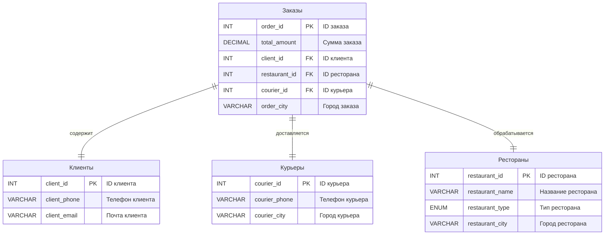
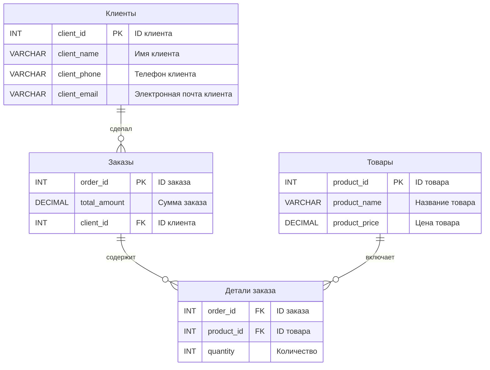
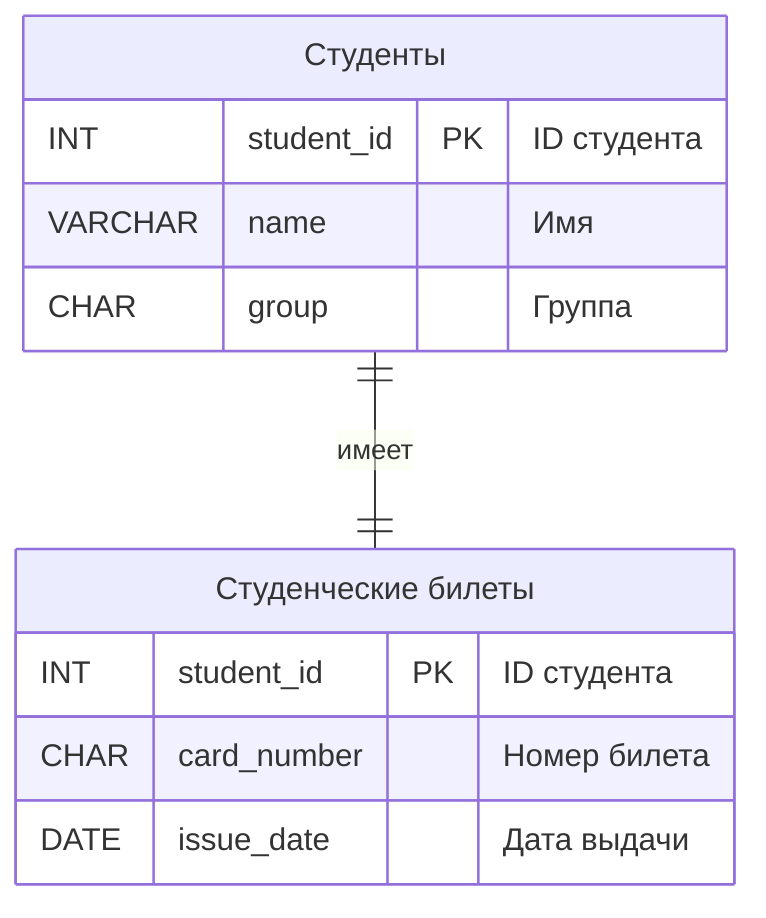
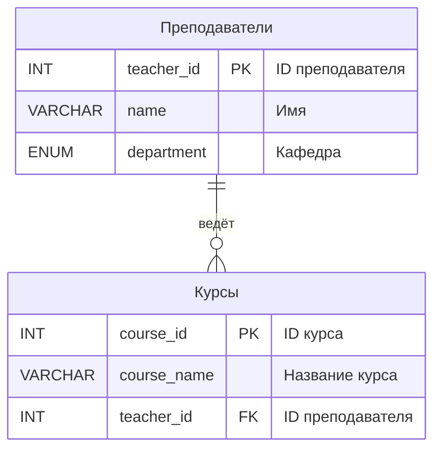
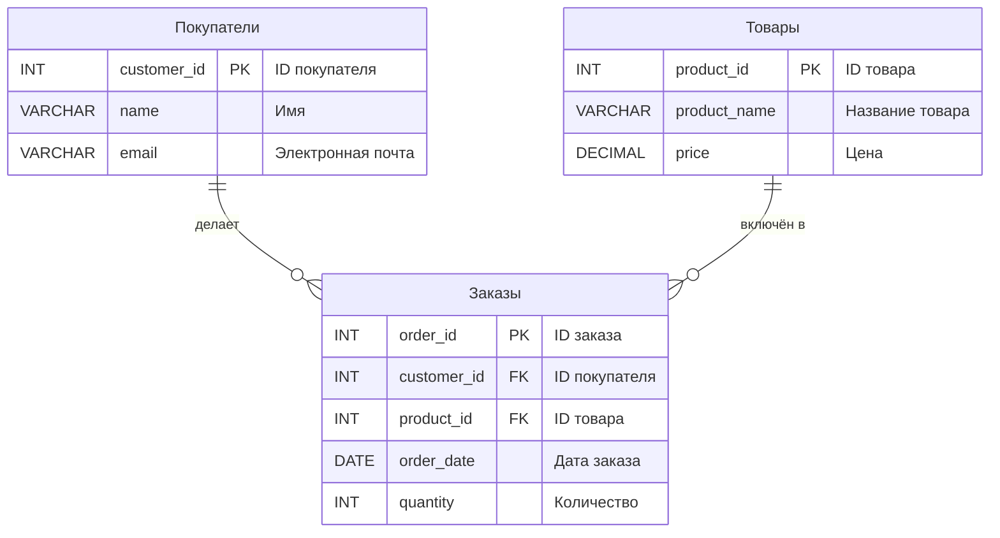

# ИТ.03 - 02 - Реляционные базы данных. Популярные СУБД. Понятие связи, типы связей

## Введение

Реляционные базы данных (РБД) — это основа современных систем хранения данных, используемых повсеместно: от интернет-магазинов до банковских систем. Понимание их структуры и принципов работы необходимо для разработки программного обеспечения, анализа данных и управления информацией. В этой лекции мы рассмотрим основы реляционных баз данных, популярные СУБД и типы связей между таблицами.

---

## Реляционные базы данных

Базы данных (БД) — это организованные структуры, предназначенные для хранения и управления информацией. Они позволяют быстро находить, добавлять и изменять данные, необходимые для решения конкретных задач.

Для работы с базами данных используются системы управления базами данных (СУБД) — специализированные программы, обеспечивающие создание, хранение, управление и анализ данных.

В рамках данного курса мы сосредоточимся на **реляционных базах данных (РБД)**, поскольку они являются наиболее распространённым типом.

> Реляционная база данных — это данные, организованные в виде взаимосвязанных таблиц, где каждая таблица хранит данные об определённой сущности.

### Как устроена реляционная база данных?

Реляционная база данных состоит из таблиц. Каждая таблица:

- **Имеет строки (записи):** Каждая строка представляет собой один объект или событие, например, конкретного студента.
- **Содержит столбцы (поля):** Каждый столбец хранит информацию о свойствах объекта, например, имя, дата рождения или группа.

#### Пример таблицы: "Студенты"

| ID | ФИО                     | Группа   | ID курса |
|----|-------------------------|----------|----------|
| 1  | Иванов Иван Иванович    | ИСиП-25  | 1        |
| 2  | Петров Петр Петрович    | МиУП-25  | 2        |
| 3  | Сергеев Сергей Сергеевич| ИСиП-27  | 1        |

Каждая строка в этой таблице представляет студента, а столбцы содержат его данные:

- **ID** — уникальный идентификатор студента.
- **ФИО** — имя студента.
- **Группа** — учебная группа.
- **ID курса** — идентификатор курса, который он изучает.

#### Пример таблицы: "Курсы"

| ID | Название курса           | Преподаватель      |
|----|--------------------------|--------------------|
| 1  | Основы программирования  | Васильев Василий   |
| 2  | Базы данных              | Смирнов Александр  |

Каждая строка в этой таблице представляет курс, а столбцы содержат информацию о курсе:

- **ID** — уникальный идентификатор курса.
- **Название курса** — название, например, "Основы программирования".
- **Преподаватель** — имя преподавателя, ведущего курс.

### Как таблицы связаны?

Таблица "Студенты" содержит ссылку на таблицу "Курсы" через поле **ID курса**. Это позволяет узнать, какой курс изучает каждый студент.

#### Пример связи

- Иванов Иван (группа ИСиП-25) изучает курс с ID 1, то есть "Основы программирования".
- Петров Петр (группа МиУП-25) изучает курс с ID 2, то есть "Базы данных".

### Преимущества такой организации данных

1. **Минимизация дублирования данных.** Например, название курса хранится только в одной таблице.
2. **Удобство поиска и анализа данных.** Можно быстро найти все записи, связанные с конкретным объектом.
3. **Гибкость и масштабируемость.** Легко добавлять новые данные или изменять структуру таблиц.

---

## Наиболее популярные реляционные СУБД

СУБД (Системы Управления Базами Данных) позволяют создавать, изменять и управлять базами данных. Существует огромное количество СУБД, платных и бесплатных, отличающихся между собой по функциональности.

---

### **MySQL**

- **Особенность:** Простота использования и популярность.
- **Почему выбрать:** Идеально подходит для создания сайтов и приложений. Часто используется вместе с популярными платформами для веб-разработки.
- **Пример использования:** Подходит для управления базами данных интернет-магазинов.

---

### **Oracle Database**

- **Особенность:** Подходит для крупных компаний.
- **Почему выбрать:** Обрабатывает большие объемы данных и обеспечивает высокий уровень безопасности.
- **Пример использования:** Используется в банках и финансовых системах.

---

### **PostgreSQL**

- **Особенность:** Гибкость и расширяемость.
- **Почему выбрать:** Подходит для сложных проектов с особыми требованиями к данным.
- **Пример использования:** Управление базами данных научных исследований.

---

### **SQLite**

- **Особенность:** Устанавливается как один файл, без сервера.
- **Почему выбрать:** Легкий и быстрый выбор для мобильных приложений и тестовых проектов.
- **Пример использования:** Используется в приложениях для хранения данных на локальной машине.

---

### **Microsoft SQL Server**

- **Особенность:** Интеграция с продуктами Microsoft.
- **Почему выбрать:** Подходит для Windows-среды и офисных приложений.
- **Пример использования:** Используется в компаниях для управления внутренними базами данных на основе решений Microsoft.

---

Эти СУБД подходят для различных задач, от небольших приложений до корпоративных систем. Выбор зависит от потребностей, масштаба проекта и бюджета.

---

## Структура реляционной БД

Основным элементом реляционной БД является таблица. Столбцы таблицы БД называются полями, а строки — записями. Первым этапом создания таблицы БД является задание ее структуры, т.е. определение количества и типа полей. Вторым этапом является ввод и редактирование записей в таблицу. БД считается созданной, даже если она пустая.

Поля таблицы просто определяют ее структуру и групповые свойства данных, записываемых в ячейках. Рассмотрим основные свойства полей БД:

- **Имя поля** — определяет как надо обращаться к данным поля (имена используются как заголовки таблиц).
- **Тип поля** — определяет тип данных, которые могут содержаться в данном поле (текстовые, числовые, дата, Memo, денежный, счетчик и др.).
- **Размер поля** — определяет предельную длину данных, которые могут размещаться в поле.
- **Формат поля** — способ форматирования данных в ячейках.

### Типы таблиц и ключей в реляционных базах данных

Для организации данных в реляционных базах данных используются различные типы таблиц и ключей. Эти элементы помогают определить связи между таблицами и обеспечить целостность данных.

#### **Типы таблиц**

1. **Базовая таблица**
   Базовая таблица — это основная таблица, которая хранит данные об объектах предметной области. Она содержит:
   - Столбцы (поля), описывающие свойства объектов.
   - Первичный ключ (Primary Key, PK), который однозначно идентифицирует каждую запись в таблице.
   Пример: таблица "Студенты", где каждый студент имеет уникальный ID.

2. **Промежуточная таблица**
   Промежуточная таблица используется для установления связей между базовыми таблицами. Она состоит только из внешних ключей (Foreign Keys, FK), которые ссылаются на первичные ключи других таблиц.
   Пример: таблица "Заказы" может связывать таблицы "Клиенты" и "Товары".

#### **Типы ключей**

1. **Первичный ключ (Primary Key, PK)**
   Первичный ключ — это поле (или группа полей), которое однозначно идентифицирует каждую запись в таблице. Значения первичного ключа всегда уникальны и не могут повторяться.
   - Если первичный ключ состоит из одного поля, он называется **простым первичным ключом**.
   - Если для однозначной идентификации записи требуется несколько полей, такой ключ называется **составным первичным ключом**.

   > **Составной ключ** — это подтип первичного ключа, который объединяет несколько столбцов таблицы для создания уникального идентификатора.

   **Пример:**
   В таблице "Заказы" первичным ключом может быть поле `ID заказа`.
   В таблице "Детали заказа" первичным ключом может быть комбинация полей `ID заказа` и `ID товара`, что делает его составным первичным ключом.

2. **Внешний ключ (Foreign Key, FK)**
   Внешний ключ — это поле, которое ссылается на первичный ключ другой таблицы. Он обеспечивает связь между таблицами и поддерживает целостность данных.
   **Пример:**
   В таблице "Заказы" поле `ID клиента` является внешним ключом, ссылающимся на таблицу "Клиенты".

Рассмотрим пример реляционной базы. Допустим, у нас есть сервис доставки еды. Тогда, если мы построим реляционную базу данных для этого сервиса, то она, скорее всего, будет содержать следующие таблицы:

- Таблица с заказами
- Таблица с клиентами
- Таблица с курьерами
- Таблица с ресторанами

Мы видим таблицы, из которых состоит база, и также видим, какие столбцы содержит каждая из таблиц. Важной характеристикой реляционных баз данных является то, что между таблицами существуют отношения. Реляционные базы данных характеризуются тем, что таблицы связаны между собой через **первичные ключи (PK)** и **внешние ключи (FK)**. Эти связи позволяют организовать данные таким образом, чтобы минимизировать дублирование и обеспечить целостность информации.

1. **Первичный ключ (Primary Key, PK):**
   - Первичный ключ — это поле (или группа полей), которое однозначно идентифицирует каждую запись в таблице.
   - Значения первичного ключа всегда уникальны и не могут повторяться.
   - Например, в таблице "Заказы" поле `order_id` является первичным ключом, так как каждый заказ имеет уникальный идентификатор.

2. **Внешний ключ (Foreign Key, FK):**
   - Внешний ключ — это поле, которое ссылается на первичный ключ другой таблицы.
   - Он обеспечивает связь между таблицами и гарантирует, что данные остаются согласованными.
   - Например, в таблице "Заказы" поле `client_id` является внешним ключом, ссылающимся на поле `client_id` в таблице "Клиенты". Это позволяет связать каждый заказ с конкретным клиентом.

3. **Целостность данных:**
   - Первичные и внешние ключи играют ключевую роль в поддержании целостности данных.
   - Если попытаться добавить в таблицу "Заказы" запись с несуществующим `client_id`, база данных выдаст ошибку, так как такой клиент отсутствует в таблице "Клиенты".
   - Это помогает избежать ошибок и обеспечивает корректность данных.

4. **Преимущества реляционной модели:**
   - **Структурированность:** Данные распределены по таблицам, что делает их удобными для анализа и поиска.
   - **Масштабируемость:** Легко добавлять новые таблицы или изменять существующие без нарушения целостности.
   - **Гибкость:** Связи между таблицами позволяют моделировать сложные реальные процессы, такие как взаимодействие клиентов, заказов и товаров.

### **Практическое применение**

Реляционные базы данных широко используются в различных областях:

- **Интернет-магазины:** Управление заказами, товарами и клиентами.
- **Банковские системы:** Хранение информации о клиентах, счетах и транзакциях.
- **Образовательные учреждения:** Учёт студентов, курсов и преподавателей.

Пример из диаграммы выше показывает, как можно организовать базу данных для сервиса доставки еды. Каждая таблица содержит только те данные, которые относятся к определённой сущности (например, клиенты, заказы, рестораны).

Связи между таблицами обеспечивают возможность быстро находить нужную информацию, например:

- Какие заказы сделал конкретный клиент?
- Какие рестораны обслуживают заказы в определённом городе?

---

## Виды связей в реляционных БД

В реляционных базах данных данные обычно распределяются по нескольким таблицам, которые связаны друг с другом. Это позволяет структурировать информацию, избегая её избыточности. Такие связи между таблицами помогают моделировать реальные объекты и процессы, делая базы данных удобными для хранения, поиска и анализа данных.

### Зачем нужны связи?

Связи между таблицами позволяют:

- **Избегать дублирования данных.** Например, вместо хранения информации о клиенте в каждом заказе, она хранится в отдельной таблице клиентов, а заказы просто ссылаются на нужного клиента.
- **Улучшить целостность данных.** Например, база не позволит добавить заказ с несуществующим клиентом, если между таблицами установлена связь.
- **Облегчить анализ данных.** Можно легко соединить данные из разных таблиц и получить, например, список всех заказов конкретного клиента.

### Пример

Представьте, что мы создаём базу данных для интернет-магазина. В ней есть таблицы с информацией о клиентах, заказах и товарах. Вот как могут выглядеть связи:

- Таблица **"Клиенты"** хранит информацию о каждом клиенте: его имя, телефон и электронную почту.
- Таблица **"Заказы"** содержит записи о заказах, в том числе ссылку на клиента, который сделал заказ.
- Таблица **"Товары"** описывает сами товары: их названия, цены и категории.
- Каждому заказу может соответствовать несколько товаров.

Связи между этими таблицами помогают понять, какой клиент сделал заказ, какие товары в нём были, и сколько он стоит.

Например, благодаря приведенному примеру можно сделать вывод что:

- **Клиенты** и **Заказы** имеют связь **"Один ко многим"**. Это означает, что один клиент может сделать несколько заказов, но каждый заказ принадлежит только одному клиенту. Например, клиент Иван может заказать книгу, затем телефон — оба заказа будут связаны с ним.
- **Заказы** и **Товары** связаны через промежуточную таблицу **Детали заказа**. Это сделано потому, что один заказ может содержать сразу несколько товаров (например, книгу и телефон), а один и тот же товар может быть в разных заказах. Такая связь называется **"Многие ко многим"**. Детали заказа хранят информацию о каждом конкретном товаре в заказе: его количество и к какому заказу он относится.

---

В реляционных базах данных выделяют три основные типа связей:

1. **Один к одному (One-to-One).**
2. **Один ко многим (One-to-Many).**
3. **Многие ко многим (Many-to-Many).**

Далее мы разберём каждый тип связи подробно.

### Связь «Один к одному»

Связь «Один к одному» означает, что одной записи в одной таблице соответствует ровно одна запись в другой таблице. Такой тип связи может быть полезен, если данные о каком-то объекте логически разделены на две части.

#### Пример

Представьте, что у нас есть база данных студентов. В таблице **Студенты** хранятся основные данные, такие как имя и группа, а в таблице **Студенческие билеты** — информация о студенческом билете, например номер и дата выдачи. У каждого студента есть только один студенческий билет, а у каждого билета — только один владелец.

#### Пояснение

1. Таблица **Студенты** хранит основную информацию о студентах: их имена и группы.
2. Таблица **Студенческие билеты** содержит данные о студенческих билетах, таких как номер билета и дата его выдачи.
3. Связь «Один к одному» здесь логична, потому что каждому студенту соответствует только один студенческий билет.

---

### Связь «Один ко многим»

Связь «Один ко многим» означает, что одной записи в одной таблице может соответствовать несколько записей в другой таблице. Такой тип связи часто встречается в базах данных и используется для описания отношений, где один объект связан с множеством других.

#### Пример

Представьте, что у нас есть база данных университета. В таблице **Преподаватели** хранится информация о преподавателях, а в таблице **Курсы** — информация о курсах, которые они ведут. Один преподаватель может вести несколько курсов, но каждый курс может быть закреплён только за одним преподавателем.

#### Пояснение

1. Таблица **Преподаватели** содержит информацию о каждом преподавателе: его имя и кафедру.
2. Таблица **Курсы** хранит данные о курсах, таких как название и преподаватель, который их ведёт.
3. Связь «Один ко многим» здесь логична, так как один преподаватель может вести несколько курсов, но каждый курс относится только к одному преподавателю.

---

### Связь «Многие ко многим»

Связь «Многие ко многим» означает, что одной записи в одной таблице может соответствовать несколько записей в другой таблице, и наоборот. Это типичная ситуация, когда нужно учитывать взаимодействие между двумя наборами объектов.

#### Пример

Представьте, что у нас есть база данных интернет-магазина. В таблице **Покупатели** хранится информация о клиентах, а в таблице **Товары** — информация о продуктах, доступных в магазине. Один покупатель может купить несколько товаров, и один товар может быть куплен несколькими покупателями. Для описания этой связи используется промежуточная таблица **Заказы**.

#### Пояснение

1. Таблица **Покупатели** содержит данные о клиентах, такие как их имена и электронные почты.
2. Таблица **Товары** хранит информацию о продуктах, включая их название и цену.
3. Таблица **Заказы** фиксирует, кто купил какой товар, в каком количестве и когда.
4. Связь «Многие ко многим» достигается через таблицу **Заказы**, которая связывает таблицы **Покупатели** и **Товары**.

---

## Практические задания

Опишите структуру базы данных для следующей задачи:

- В университете есть студенты и курсы.
- Каждый студент может записаться на несколько курсов.
- Каждый курс ведёт один преподаватель.

**Задание:**

- Перечислите таблицы, которые нужно создать.
- Для каждой таблицы укажите поля (столбцы) и определите, какие поля будут первичными ключами.
- Определите тип связи между таблицами ("Один к одному", "Один ко многим", "Многие ко многим").
- Объясните, почему вы выбрали именно этот тип связи.

---

## Полезные ссылки

- [Что такое реляционная база данных (РСУБД)?](https://www.oracle.com/cis/database/what-is-a-relational-database/)
- [Владимир Драч / Анализ популярных реляционных систем управления базами данных (2022 г.)](https://drach.pro/blog/hi-tech/item/196-popular-relational-dbms-2022)
