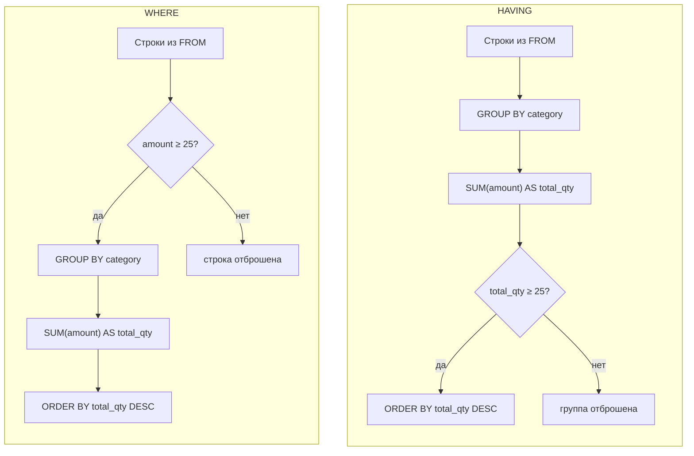

# ИТ.03 - 07 - Агрегатные функции, операторы GROUP BY и HAVING

## Введение

На предыдущих занятиях вы освоили выборку и фильтрацию данных (`SELECT`, `WHERE`, `LIKE`, сортировку, ограничение выборки), а также модификаторы `DISTINCT` и работу с составными условиями. Сегодня — первый шаг к **сводной аналитике по группам**: агрегатные функции, группировка `GROUP BY` и постфильтрация групп `HAVING`.

## Пример таблицы `orders`

<!-- @include: ./includes/table_orders_02.md -->

::: details Код создания таблицы на языке SQL в диалекте SQLite

  ::: play sandbox=sqlite editor=basic id=orders_02_sqlite.sql
  @[code sql](./includes/orders_02_sqlite.sql)
  :::

:::

## Агрегатные функции

> Агрегатная функция — это функция, которая выполняет вычисление на наборе значений и возвращает одиночное значение.

В разных СУБД существует довольно много разных агрегатных функций, но мы рассмотрим основные:

| Функция          | Описание                                    |
| :--------------- | :------------------------------------------ |
| `COUNT(столбец)` | Возвращает количество записей               |
| `SUM(столбец)`   | Возвращает сумму значений                   |
| `AVG(столбец)`   | Возвращает среднее значение                 |
| `MIN(столбец)`   | Возвращает минимальное значение             |
| `MAX(столбец)`   | Возвращает максимальное значение            |

::: tip

Функция `COUNT()` также подходит для подсчета уникальных значений в столбце, используя `COUNT(DISTINCT столбец)`.

:::

::: info

Агрегатные функции применяются для значений не равных `NULL`. Исключением является функция `COUNT(*)`, которая считает все строки в таблице, даже те которые содержат `NULL`.

:::

### Подсчёт количества значений

::: play sandbox=sqlite editor=basic depends-on=orders_02_sqlite.sql

```sql
SELECT
  COUNT(*) AS total_orders
FROM orders;
```

:::

**Результат:**
Сколько всего строк (заказов) в таблице.

### Подсчёт суммы значений

::: play sandbox=sqlite editor=basic depends-on=orders_02_sqlite.sql

```sql
SELECT
  SUM(amount) AS total_qty
FROM orders;
```

:::

**Результат:**
Сколько единиц товара продано суммарно.

### Подсчёт уникальных значений

::: play sandbox=sqlite editor=basic depends-on=orders_02_sqlite.sql

```sql
SELECT
  COUNT(DISTINCT category) AS unique_categories
FROM orders;
```

:::

**Результат:**
Сколько различных категорий товаров встречается в заказах.

## Группировка `GROUP BY`

Задача группировки — собрать строки с одинаковым значением ключа в логические группы и посчитать по каждой группе агрегаты (итоги).

Ключевые правила:

- В `SELECT` после группировки допустимы **только** поля из списка `GROUP BY` и **агрегатные** выражения.
- Условия по всем строкам исходной таблицы пишутся в блоке `WHERE` (до группировки), условия по каждой сформированной группе — в блоке `HAVING` (после группировки).
- Порядок выполнения: `SELECT` → `FROM` → `WHERE` → `GROUP BY` → `HAVING` → `ORDER BY` → `LIMIT`.

::: warning

В SQLite допускается выбирать в `SELECT` столбцы, которых нет в `GROUP BY`, но их значения **недетерминированы**; в MySQL с включённым по-умолчанию режимом `ONLY_FULL_GROUP_BY` это приведёт к ошибке.
Безопасная практика в том чтобы указывать в `SELECT` — только поля группировки и агрегаты.

:::

### Простейшая группировка по товару

::: play sandbox=sqlite editor=basic depends-on=orders_02_sqlite.sql

```sql
SELECT
  title,
  SUM(amount) AS total_qty
FROM orders
GROUP BY title
ORDER BY total_qty DESC;
```

:::

**Результат:**
Сколько единиц каждого товара продано суммарно.

### Группировка по покупателю

::: play sandbox=sqlite editor=basic depends-on=orders_02_sqlite.sql

```sql
SELECT
  customer,
  SUM(amount) AS total_qty
FROM orders
GROUP BY customer
ORDER BY total_qty DESC;
```

:::

**Результат:**
Сколько единиц заказал каждый покупатель.

### Группировка по категории

::: play sandbox=sqlite editor=basic depends-on=orders_02_sqlite.sql

```sql
SELECT
  category,
  SUM(amount) AS total_qty
FROM orders
GROUP BY category
ORDER BY total_qty DESC;
```

:::

**Результат:**
Суммарные продажи по категориям.

### Группировка по двум ключам (покупатель × категория)

Например, если нам необходимо построить «матрицу»: сколько каждый покупатель взял по каждой категории.

::: play sandbox=sqlite editor=basic depends-on=orders_02_sqlite.sql

```sql
SELECT
  customer,
  category,
  SUM(amount) AS total_qty
FROM orders
GROUP BY customer, category
ORDER BY customer ASC, total_qty DESC;
```

:::

**Результат:**
Сколько покупатель взял по каждой категории

::: info

`GROUP BY customer, category` формирует группы «покупатель × категория», `SUM(amount)` считает суммы внутри каждой группы, а `ORDER BY` упорядочивает вывод.

:::

### Заказы на каждый товар

::: play sandbox=sqlite editor=basic depends-on=orders_02_sqlite.sql

```sql
SELECT
  title,
  COUNT(*) AS orders_count
FROM orders
GROUP BY title
ORDER BY orders_count DESC;
```

:::

**Результат:**
Сколько заказов пришлось на каждый товар.

### Средний размер заказа

::: play sandbox=sqlite editor=basic depends-on=orders_02_sqlite.sql

```sql
SELECT
  category,
  AVG(amount) AS avg_per_category
FROM orders
GROUP BY category
ORDER BY avg_per_category DESC;
```

:::

**Результат:**
Средний размер заказа по каждой категории

### Группировка по выражению

::: tip

В SQLite существует функция `LOWER(col)`, которая приводит переданное ей значение к нижнему регистру. Однако, следует помнить что она не работает для кириллицы! Здесь мы используем `LOWER()` как учебный приём.

:::

Группировать можно по вычисляемому выражению, например по «нормализованному» названию:

::: play sandbox=sqlite editor=basic depends-on=orders_02_sqlite.sql

```sql
SELECT
  LOWER(title) AS norm_title,
  SUM(amount)  AS total_qty
FROM orders
GROUP BY LOWER(title)
ORDER BY total_qty DESC;
```

:::

**Результат:**
Объединены возможные варианты регистра в одно наименование (без учёта кириллицы).

## Оператор `HAVING`

Оператор `HAVING` используется в SQL для фильтрации результатов запроса, которые были сгруппированы с помощью оператора `GROUP BY`. Он позволяет указать условие, которое должно выполняться для группы, чтобы она была включена в результат.

### Выборка количества после группировки по клиентам

::: play sandbox=sqlite editor=basic depends-on=orders_02_sqlite.sql

```sql
SELECT
  customer,
  COUNT(id) AS orders_count
FROM orders
GROUP BY customer
HAVING orders_count >= 3;
```

:::

**Результат:**
Клиенты, у которых не менее 3 заказов.

### Выборка суммы после группировки по клиентам

::: play sandbox=sqlite editor=basic depends-on=orders_02_sqlite.sql

```sql
SELECT
  customer,
  SUM(amount) AS total_qty
FROM orders
GROUP BY customer
HAVING total_qty >= 40
ORDER BY total_qty DESC;
```

:::

**Результат:**
Покупатели с суммарными закупками не менее 40 единиц

### Выборка минимума после группировки по категориям

::: play sandbox=sqlite editor=basic depends-on=orders_02_sqlite.sql

```sql
SELECT
  category,
  MIN(amount) AS min_per_category
FROM orders
GROUP BY category
HAVING min_per_category >= 5;
```

:::

**Результат:**
Категории, в которых минимальный размер заказа не ниже 5.

### Выборка среднего после группировки по категориям

::: play sandbox=sqlite editor=basic depends-on=orders_02_sqlite.sql

```sql
SELECT
  category,
  AVG(amount) AS avg_per_category
FROM orders
GROUP BY category
HAVING avg_per_category BETWEEN 5 AND 8;
```

:::

**Результат:**
Средний размер заказа на категорию в пределах от 5 до 8 включительно.

### Выборка количества после группировки по категориям

::: play sandbox=sqlite editor=basic depends-on=orders_02_sqlite.sql

```sql
SELECT
  category,
  COUNT(id) AS rows_count
FROM orders
GROUP BY category
HAVING rows_count >= 3
ORDER BY rows_count DESC;
```

:::

**Результат:**
Категории, по которым сделано не менее 3 строк заказов

### `HAVING` без `GROUP BY`

Можно фильтровать агрегат по **всей таблице** одной строкой результата:

::: play sandbox=sqlite editor=basic depends-on=orders_02_sqlite.sql

```sql
SELECT SUM(amount) AS total_qty
FROM orders
HAVING total_qty > 60;
```

:::

**Результат:**
Показать суммарные продажи только если они превышают 60.

## Сравнение `WHERE` и `HAVING`

- `WHERE` фильтрует **строки до** группировки.
- `HAVING` фильтрует **группы после** вычисления агрегатов.

Механика (упрощённо):



### Пример 1. Отобрать «крупные» **строки** заказов

::: play sandbox=sqlite editor=basic depends-on=orders_02_sqlite.sql

```sql
SELECT
  category,
  SUM(amount) AS total_qty
FROM orders
WHERE amount >= 25
GROUP BY category
ORDER BY total_qty DESC;
```

:::

**Результат:**
Только те строки, где `amount >= 25` (до группировки).

**Почему так:**
`WHERE amount >= 25` сначала убирает все строки с меньшими значениями. В `GROUP BY category` попадают **только** оставшиеся строки; `SUM(amount)` суммирует уже урезанный набор.

**Интерпретация:**
останутся лишь те категории, где встретилась **хотя бы одна** «крупная» строка (`>= 25`), а сумма считается **по крупным строкам**.

### Пример 2. Отобрать «крупные» **товары по итогу**

::: play sandbox=sqlite editor=basic depends-on=orders_02_sqlite.sql

```sql
SELECT
  category,
  SUM(amount) AS total_qty
FROM orders
GROUP BY category
HAVING total_qty >= 25
ORDER BY total_qty DESC;
```

:::

**Результат:**
Все строки учитываются, но оставляем только те группы, где суммарные продажи по товару `total_qty >= 25`.

**Почему так:**
сначала группируем **все** строки и считаем итог `SUM(amount)` по каждой категории; затем `HAVING total_qty >= 25` отбрасывает категории с малой суммой.

**Интерпретация:**
категория пройдёт, даже если в ней **нет ни одной** отдельной строки `>= 25`, но суммарно набирается `>= 25` за счёт многих мелких заказов.

---

## Порядок и «скелет» запроса сводной аналитики

1) Сформулировать вопрос на обычном языке.
2) Выбрать ключ группировки.
3) Выбрать агрегаты.
4) Доп-фильтры по строкам (`WHERE`).
5) Фильтр по итогам групп (`HAVING`).
6) Сортировка результатов (`ORDER BY`) и порог (`LIMIT`).

Шаблон:

```sql
SELECT group_key, AGG(...) AS metric, ...
FROM table
[WHERE ...]
GROUP BY group_key
[HAVING ...]
[ORDER BY metric DESC]
[LIMIT N];
```

---

## Типичные ошибки и как их избежать

- **Выбор неагрегированных полей вне `GROUP BY`.** Работает не везде / даёт недетерминированные значения. Решение: добавьте поле в `GROUP BY` или заверните в агрегат/выражение.
- **Использование `HAVING` вместо `WHERE` для построчных условий.** Если критерий относится к строкам (напр. `amount >= 10`) — это `WHERE`. Если к агрегатам группы (`SUM(amount) >= 25`) — это `HAVING`.
- **Неуправляемый порядок строк.** Добавляйте явный `ORDER BY` по метрике/ключу.
- **Смешение регистров/вариантов написания ключа группировки.** Нормализуйте (`LOWER(...)`, `TRIM(...)`) в `GROUP BY`.

---

## Практические задания

### Задание 1

::: tabs

@tab Условие

Выведите **суммарное количество единиц** по всем заказам и **общее количество заказов** в таблице одним запросом.

  ::: play sandbox=sqlite editor=basic depends-on=orders_02_sqlite.sql

  ```sql
  -- Ваш код можете писать тут


  ```

  :::

@tab Решение

```sql
SELECT
  SUM(amount) AS total_qty,
  COUNT(*)    AS total_orders
FROM orders;
```

:::

### Задание 2

::: tabs

@tab Условие

В первом запросе выведите **уникальных покупателей**, а во втором запросе **посчитайте их количество**.

  ::: play sandbox=sqlite editor=basic depends-on=orders_02_sqlite.sql

  ```sql
  -- Ваш код можете писать тут


  ```

  :::

@tab Решение

```sql
SELECT
  DISTINCT customer AS unique_customers
FROM orders;
SELECT
  COUNT(DISTINCT customer) AS unique_customers_count
FROM orders;
```

:::

### Задание 3

::: tabs

@tab Условие

Покажите **топ-3 категории** с **наибольшими суммарными продажами**, отсортировав по количеству товаров **по убыванию**.

  ::: play sandbox=sqlite editor=basic depends-on=orders_02_sqlite.sql

  ```sql
  -- Ваш код можете писать тут


  ```

  :::

@tab Решение

```sql
SELECT
  category,
  SUM(amount) AS total_qty
FROM orders
GROUP BY category
ORDER BY total_qty DESC
LIMIT 3;
```

:::

### Задание 4

::: tabs

@tab Условие

Для каждого покупателя выведите **среднее количество товаров в заказе** и **число заказов**, отсортируйте по **среднему по убыванию**.

  ::: play sandbox=sqlite editor=basic depends-on=orders_02_sqlite.sql

  ```sql
  -- Ваш код можете писать тут


  ```

  :::

@tab Решение

```sql
SELECT
  customer,
  AVG(amount) AS avg_per_order,
  COUNT(id)   AS orders_count
FROM orders
GROUP BY customer
ORDER BY avg_per_order DESC;
```

:::

### Задание 5

::: tabs

@tab Условие

Оставьте только те **категории**, в которых суммарные продажи составили **не менее 50-ти** единиц товара.

  ::: play sandbox=sqlite editor=basic depends-on=orders_02_sqlite.sql

  ```sql
  -- Ваш код можете писать тут


  ```

  :::

@tab Решение

```sql
SELECT
  category,
  SUM(amount) AS total_qty
FROM orders
GROUP BY category
HAVING total_qty >= 50
ORDER BY total_qty DESC;
```

:::

### Задание 6

::: tabs

@tab Условие

Оставьте только тех **покупателей**, которые совершили **не более 5 заказов**, но при этом приобрели **не менее 30 единиц** товаров суммарно. Результат отсортируйте сначала по количеству заказов по убыванию, а затем по покупателю в алфавитном порядке.

  ::: play sandbox=sqlite editor=basic depends-on=orders_02_sqlite.sql

  ```sql
  -- Ваш код можете писать тут


  ```

  :::

@tab Решение

```sql
SELECT
  customer,
  COUNT(id)   AS orders_count,
  SUM(amount) AS total_qty
FROM orders
GROUP BY customer
HAVING orders_count <= 5 AND total_qty >= 30
ORDER BY orders_count DESC, customer ASC;
```

:::
