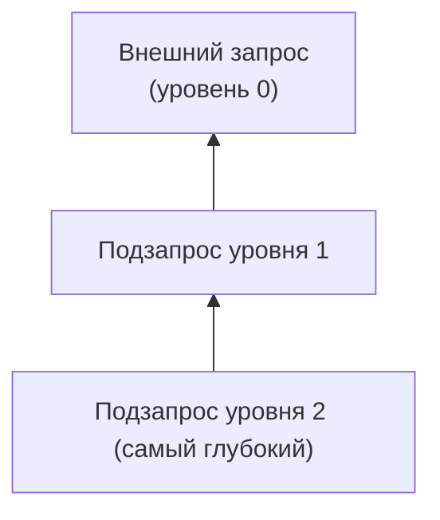

# ИТ.03 - 10 - Вложенные запросы: общее понимание

## Введение

В предыдущей теме мы научились описывать структуру таблиц. Теперь настало время комбинировать запросы между собой и научиться использовать результат одного `SELECT` внутри другого. Такие конструкции называют **вложенными запросами** или **подзапросами**.

В этой лекции рассмотрим:

- типы подзапросов и ситуации, где они применяются;
- правила использования подзапросов в `SELECT`, `WHERE`, `FROM`;
- приёмы с одной таблицей: вычисления по агрегатам, динамические списки значений и коррелированные проверки.

## Что такое вложенный запрос

**Подзапрос** — это оператор `SELECT`, заключённый в круглые скобки и встроенный в другой SQL-запрос. Он может появляться в блоках `SELECT`, `WHERE`, `HAVING`, `FROM`, а также в списке значений для `INSERT`.

```sql
-- Внешний запрос (уровень 0)
SELECT ...
FROM (
  -- Подзапрос уровня 1
  SELECT ...
  FROM (
    -- Подзапрос уровня 2 (самый глубокий)
    SELECT ...
    FROM источники_данных
    WHERE ...
  ) AS level_2
) AS level_1;
```

::: note
СУБД вычисляет вложенные запросы от глубины к поверхности: сначала выполняется самый глубокий уровень, затем его результат передаётся подзапросу уровня выше, и так до тех пор пока не сформируется внешний запрос. Такой порядок помогает понимать, какие данные доступны на каждой ступени.
:::



## Учебная база данных «Trainer Workouts»

::: tabs

@tab Таблицы

  ::: tabs

  @tab workouts
  <!-- @include: ./includes/trainer_workouts_db/workouts_table.md -->

  :::

@tab Описание

  Журнал персонального тренера, который ведёт разных спортсменов: для каждой сессии фиксируются атлет, формат, длительность, калории и дата — идеальная база для практики вложенных запросов.

  **Особенности:**

  - колонки позволяют сравнивать значения через скалярные и коррелированные подзапросы;
  - повторяющиеся занятия и даты удобно использовать в `IN`/`EXISTS`;
  - данные компактные, поэтому легко анализировать результаты подзапросов.

@tab Поля и ограничения

  **Поля**

  - **`workouts`**
    - `id` — целочисленный первичный ключ;
    - `athlete` — ФИО спортсмена;
    - `session_type` — текстовое описание занятия;
    - `duration` — длительность в минутах;
    - `calories` — приблизительные энергозатраты;
    - `effort` — субъективная оценка нагрузки (`low`, `medium`, `high`);
    - `training_date` — дата тренировки в формате `YYYY-MM-DD`.

  **Ограничения**

  - Все столбцы обязательны (`NOT NULL`);
  - `effort` ограничен `CHECK (effort IN ('low','medium','high'))`;
  - `training_date` хранится в ISO-формате `YYYY-MM-DD`.

@tab Структура

  @[code mermaid](./includes/trainer_workouts_db/trainer_workouts.mermaid)

@tab SQL-код

  Скачать в виде файла: [trainer_workouts_sqlite.sql](./includes/trainer_workouts_db/trainer_workouts_sqlite.sql)

  ::: play sandbox=sqlite editor=basic id=trainer_workouts_sqlite.sql
  @[code sql:collapsed-lines=10](./includes/trainer_workouts_db/trainer_workouts_sqlite.sql)
  :::

:::

Чтобы убедиться в исходных данных, выполните простой `SELECT`:

::: play sandbox=sqlite editor=basic depends-on=trainer_workouts_sqlite.sql id=workouts_source_select.sql

```sql
SELECT * FROM workouts;
```

:::

## Типы подзапросов по возвращаемому результату

- **Скалярный** — возвращает одну строку и один столбец. Подходит для сравнений вида `duration > (SELECT AVG(...))`.
- **Списковый** — возвращает одну колонку, но несколько строк. Используется с `IN`.
- **Табличный** — возвращает таблицу с несколькими столбцами. Подставляем во `FROM` и обязательно задаём псевдоним.
- **Коррелированный** — подзапрос, который ссылается на текущую строку внешнего запроса. Выполняется повторно для каждой строки.

::: warning

Подзапрос всегда возвращает набор строк. Если попытаться сравнить его оператором `=` с одним значением, а внутри окажется несколько строк, СУБД вернёт ошибку. Поэтому важно указывать подходящие операторы (`IN`, `EXISTS`) и следить за тем, сколько значений возвращает подзапрос.

:::

## Скалярные подзапросы

Скалярным подзапросом удобно вычислять агрегаты и сразу использовать результат.

### Пример: тренировки длиннее средней

::: play sandbox=sqlite editor=basic depends-on=trainer_workouts_sqlite.sql id=subquery_scalar_avg.sql

```sql
SELECT athlete, session_type, duration
FROM workouts
WHERE duration > (
  SELECT AVG(duration)
  FROM workouts
);
```

:::

Внутренний `SELECT` возвращает одно число — среднюю длительность. Внешний запрос получает готовый порог и сравнивает с ним каждую тренировку.

### Пример: максимальные калории

::: play sandbox=sqlite editor=basic depends-on=trainer_workouts_sqlite.sql id=subquery_scalar_max.sql

```sql
SELECT athlete, session_type, calories
FROM workouts
WHERE calories = (
  SELECT MAX(calories)
  FROM workouts
);
```

:::

Если несколько тренировок сожгли одинаковое максимальное количество калорий, условие вернёт их все без сортировки и `LIMIT`.

## Списковые подзапросы (`IN`)

Когда подзапрос возвращает одну колонку и несколько строк, мы получаем динамический список значений. Его можно использовать как фильтр.

::: note
SQLite допускает `DISTINCT`, `GROUP BY`, `HAVING`, `ORDER BY`, `LIMIT` внутри подзапроса-списка. Главное — чтобы результатом оставалась одна колонка.
:::

### Пример: повторяющиеся длительности

Найдём тренировки, у которых длительность встречается минимум два раза.

::: play sandbox=sqlite editor=basic depends-on=trainer_workouts_sqlite.sql id=subquery_list_duration.sql

```sql
SELECT athlete, session_type, duration
FROM workouts
WHERE duration IN (
  SELECT duration
  FROM workouts
  GROUP BY duration
  HAVING COUNT(*) > 1
)
ORDER BY duration, training_date;
```

:::

Сначала формируем список значений длительностей с повторами, затем подставляем его во внешний `WHERE`.

### Пример: активные форматы тренировок

Менеджер хочет знать, какие типы занятий в среднем сжигают более 500 калорий. Получим такой список и используем его для выборки всех подходящих тренировок.

::: play sandbox=sqlite editor=basic depends-on=trainer_workouts_sqlite.sql id=subquery_list_session_type.sql

```sql
SELECT athlete, session_type, calories
FROM workouts
WHERE session_type IN (
  SELECT session_type
  FROM workouts
  GROUP BY session_type
  HAVING AVG(calories) > 500
)
ORDER BY session_type, calories DESC;
```

:::

Внутренний `GROUP BY` сгруппировал строки по типу занятий и оставил только те форматы, где средние калории выше порога.

## Табличные подзапросы (`FROM`)

Иногда удобно сначала подготовить агрегированные данные, а затем обращаться к ним как к временной таблице.

### Пример: сводная статистика по длительности и калориям

Соберём средние значения по каждому уровню усилий, а затем сравним их с общей средней длительностью.

::: play sandbox=sqlite editor=basic depends-on=trainer_workouts_sqlite.sql id=subquery_from_stats.sql

```sql
SELECT
  effort,
  ROUND(avg_duration, 1) AS avg_duration,
  ROUND(avg_calories, 1) AS avg_calories,
  ROUND(
    avg_duration - (
      SELECT AVG(duration)
      FROM workouts
    ),
    1
  ) AS duration_delta
FROM (
  SELECT
    effort,
    AVG(duration) AS avg_duration,
    AVG(calories) AS avg_calories
  FROM workouts
  GROUP BY effort
) AS stats
ORDER BY duration_delta DESC;
```

:::

::: tip
`ROUND(значение, точность)` округляет число до указанного количества знаков после запятой. Если второй аргумент опустить, результат будет округлён до целого.
:::

Теперь подзапрос `stats` создаёт мини-таблицу со средними значениями по каждому уровню нагрузки. Внешний запрос обращается к этой таблице и для каждой строки вызывает скалярный подзапрос с общей средней длительностью, чтобы вычислить отклонение `duration_delta` и понять, какие тренировки заметно длиннее средней.

### Пример: расчёт интенсивности тренировки

Пусть тренер оценивает эффективность занятия показателем `intensity = calories / duration`, то есть сколько килокалорий сжигается за одну минуту. Сначала посчитаем интенсивность каждого занятия, а затем оставим только те, что выше средней.

::: play sandbox=sqlite editor=basic depends-on=trainer_workouts_sqlite.sql id=subquery_from_energy.sql

```sql
SELECT athlete, session_type, ROUND(intensity, 2) AS intensity
FROM (
  SELECT
    athlete,
    session_type,
    1.0 * calories / duration AS intensity
  FROM workouts
) AS energy
WHERE intensity > (
  SELECT AVG(1.0 * calories / duration)
  FROM workouts
)
ORDER BY intensity DESC;
```

:::

Обратите внимание: скалярный подзапрос в условии сравнивает каждую расчётную строку с общей средней интенсивностью. Так мы выделяем тренировки, которые сжигают больше калорий на единицу времени.

::: tip
Запись `1.0 * calories / duration` заставляет SQLite выполнить вещественное деление. Если убрать множитель `1.0`, произойдёт целочисленное деление и дробная часть интенсивности пропадёт, что исказит результирующие значения.
:::

## Коррелированные подзапросы (`EXISTS`)

Коррелированный подзапрос зависит от текущей строки внешнего запроса. Он полезен, когда нужно проверить наличие «пары» в той же таблице.

### Пример: форматы, популярные у нескольких спортсменов

::: info
`EXISTS` работает так, будто внутри запроса создаётся мини-таблица `inner_w`, доступная только для проверки условия. Как только в ней найдено хотя бы одно совпадение, условие становится истинным и строка из внешней таблицы `outer_w` попадает в результат.
:::

::: play sandbox=sqlite editor=basic depends-on=trainer_workouts_sqlite.sql id=subquery_exists_sessions.sql

```sql
SELECT DISTINCT
  outer_w.session_type,
  (
    SELECT COUNT(DISTINCT inner_w.athlete)
    FROM workouts AS inner_w
    WHERE inner_w.session_type = outer_w.session_type
  ) AS athlete_count
FROM workouts AS outer_w
WHERE EXISTS (
  SELECT 1
  FROM workouts AS inner_w
  WHERE inner_w.session_type = outer_w.session_type
    AND inner_w.athlete <> outer_w.athlete
)
ORDER BY athlete_count DESC, outer_w.session_type;
```

:::

Для каждой строки внешнего запроса выполняется внутренний поиск. Как только находится другой спортсмен с тем же типом занятия, условие `EXISTS` срабатывает. Дополнительно скалярный подзапрос в списке `SELECT` считает количество уникальных спортсменов для каждого типа тренировки, чтобы сразу увидеть масштаб популярности.

## Ограничения и рекомендации

- Не забывайте проверять тип результата подзапроса. Если нужен один столбец, но вы выбрали `SELECT *`, СУБД вернёт ошибку «подзапрос возвращает более одной колонки».
- Чем глубже вложенность, тем сложнее читаемость. Делите большую конструкцию на несколько подзапросов и давайте им осмысленные псевдонимы.
- Подзапросы позволяют выразить сложную логику, оставаясь в рамках одной таблицы.

## Подведем итоги

- Подзапрос — это обычный `SELECT`, который выполняется внутри другого запроса и передаёт ему результат.
- Тип подзапроса определяется количеством столбцов и строк, которые он возвращает.
- В следующих темах мы расширим этот подход на несколько таблиц.

## Самопроверка

::: quiz source=./includes/quiz-10.yaml
:::

## Практические задания

### Задание 1. Скалярный подзапрос по максимальной длительности

::: tabs

@tab Условие

Найдите дату тренировки с максимальной длительностью и выведите все тренировки, прошедшие в эту же дату (их может быть несколько).

  ::: play sandbox=sqlite editor=basic depends-on=trainer_workouts_sqlite.sql

  ```sql
  -- Ваш код можете писать тут


  ```

  :::

@tab Решение

```sql
SELECT athlete, session_type, training_date, duration
FROM workouts
WHERE training_date = (
  SELECT training_date
  FROM workouts
  ORDER BY duration DESC
  LIMIT 1
)
ORDER BY athlete;
```

:::

### Задание 2. Списковый подзапрос `IN` по средним значениям

::: tabs

@tab Условие

Сформируйте список типов тренировок, где среднее количество калорий превышает 500. Затем выведите тренировки только этих типов, отсортировав по убыванию калорий.

  ::: play sandbox=sqlite editor=basic depends-on=trainer_workouts_sqlite.sql

  ```sql
  -- Ваш код можете писать тут


  ```

  :::

@tab Решение

```sql
SELECT athlete, session_type, calories
FROM workouts
WHERE session_type IN (
  SELECT session_type
  FROM workouts
  GROUP BY session_type
  HAVING AVG(calories) > 500
)
ORDER BY calories DESC;
```

:::

### Задание 3. Табличный подзапрос и отбор по агрегату

::: tabs

@tab Условие

Создайте табличный подзапрос, который собирает по каждому дню сумму длительности (`total_duration`). Во внешнем запросе оставьте только те дни, где суммарное время превышает 60 минут.

  ::: play sandbox=sqlite editor=basic depends-on=trainer_workouts_sqlite.sql

  ```sql
  -- Ваш код можете писать тут


  ```

  :::

@tab Решение

```sql
SELECT training_date, total_duration
FROM (
  SELECT training_date, SUM(duration) AS total_duration
  FROM workouts
  GROUP BY training_date
) AS day_stats
WHERE total_duration > 60
ORDER BY training_date;
```

:::

### Задание 4. Коррелированный подзапрос для сравнения с максимумом

::: tabs

@tab Условие

Используя коррелированный подзапрос, найдите тренировки, у которых есть другая тренировка того же спортсмена с большей длительностью. Выведите имя спортсмена, тип занятия и длительность такой «не самой длинной» тренировки.

  ::: play sandbox=sqlite editor=basic depends-on=trainer_workouts_sqlite.sql

  ```sql
  -- Ваш код можете писать тут


  ```

  :::

@tab Решение

```sql
SELECT outer_w.athlete, outer_w.session_type, outer_w.duration
FROM workouts AS outer_w
WHERE EXISTS (
  SELECT 1
  FROM workouts AS inner_w
  WHERE inner_w.athlete = outer_w.athlete
    AND inner_w.duration > outer_w.duration
)
ORDER BY outer_w.athlete, outer_w.duration;
```

:::
