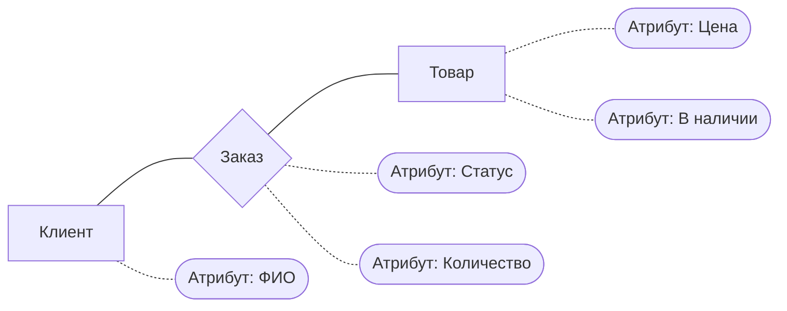
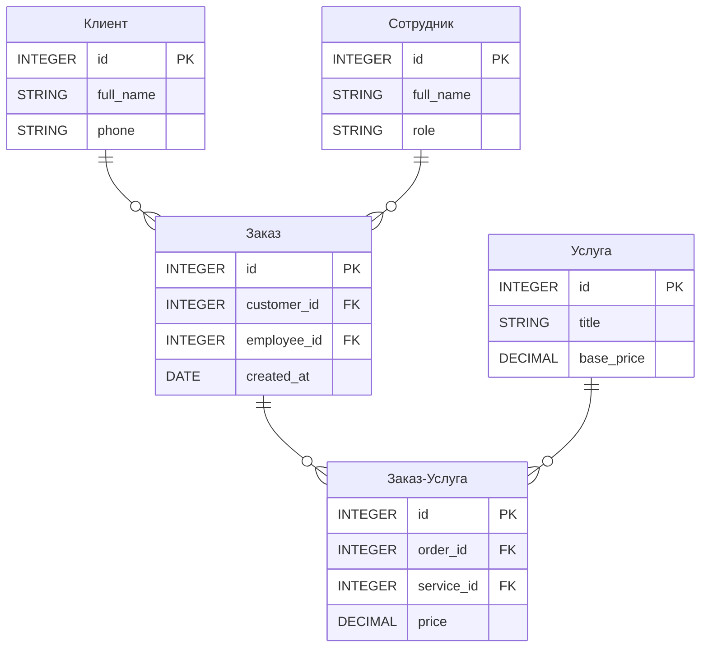
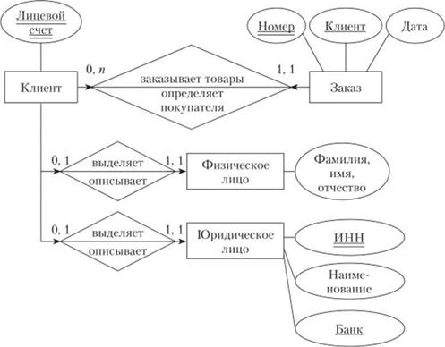
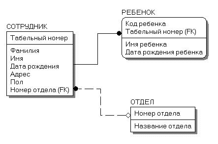
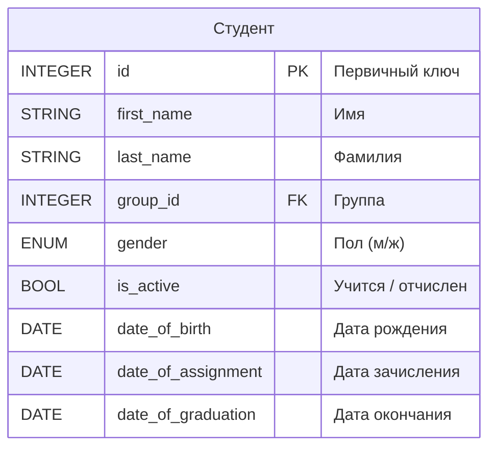
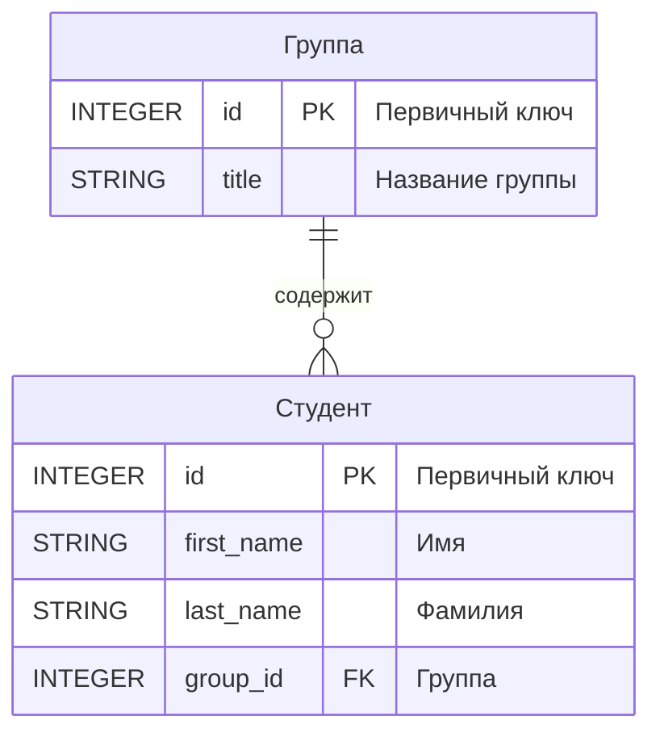
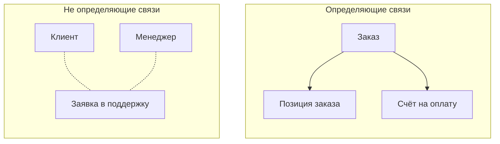
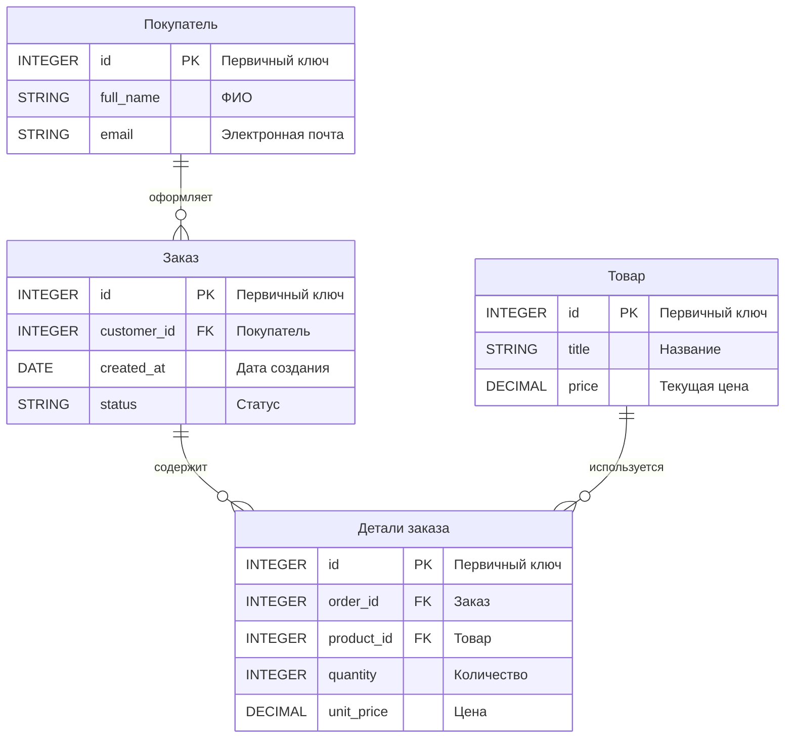
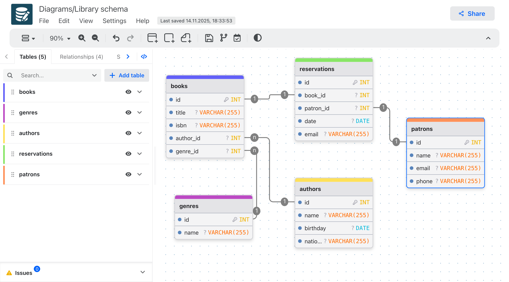

# ИТ.03 - 11 - Модели БД и способы их представления. ER-диаграммы

## Введение

На предыдущих занятиях мы работали только с одной таблицей, но в реальных системах данные всегда разбиваются на несколько связанных сущностей. Чтобы эти связи были продуманными, структуру базы данных сначала проектируют в виде модели.

В этой теме разберём:

- что такое модель данных и зачем она нужна;
- уровни моделей (концептуальный, логический, физический);
- элементы ER-модели: сущности, атрибуты, связи и их кратности;
- как построить простую ER-диаграмму в нотации Mermaid и как она помогает при создании связанных таблиц.

::: warning
ER-диаграмма не заменяет саму базу данных. Это проект, который позволяет обсудить структуру предметной области и проверить её перед реализацией в SQL.
:::

## Зачем нужны модели данных

Модель данных описывает, **какую информацию мы храним** и **как объекты связаны между собой**. Она:

- даёт всем участникам проекта единое понимание предметной области;
- служит основой для создания таблиц и ограничений в СУБД;
- помогает выявить лишние связи и дубли ещё до написания SQL-кода;
- показывает зоны, в которых придётся выполнять `JOIN`, `INSERT` в несколько таблиц и т.д.

::: info

Часто модель разрабатывают итеративно. Сначала фиксируют ключевые сущности и связи, потом уточняют атрибуты и ограничения. Не нужно пытаться описать всю систему за один подход — важно добиться согласованности базовой структуры.

:::

## Уровни моделей

| Уровень         | Цель                                                                 | Результат |
| --------------- | -------------------------------------------------------------------- | --------- |
| Концептуальный  | Выявить основные сущности и их связи на языке предметной области     | ER-диаграмма, текстовое описание |
| Логический      | Уточнить атрибуты, ключи, ограничения и возможные типы данных        | Таблицы с полями и ограничениями |
| Физический      | Подстроить модель под конкретную СУБД, синтаксис, схемы хранения      | SQL-скрипт, настройки сервера |

### Концептуальный уровень

На концептуальном уровне фиксируем ключевые сущности и связи между ними, без деталей по типам данных.

::: preview Посмотреть код диаграммы



:::

Сущности — прямоугольники, атрибуты — овалы, связи — линии.

### Логический уровень

Логическая модель уже описывает атрибуты, ключи, кратности и ограничения (но ещё не привязана к конкретной СУБД).

::: preview Посмотреть код диаграммы



:::

### Физический уровень

Когда структура согласована, переносим её в SQL: выбираем конкретные типы данных, добавляем индексацию, каскадные правила, комментарии.

```sql
CREATE TABLE customers (
  id INTEGER PRIMARY KEY,
  full_name TEXT NOT NULL,
  phone TEXT
);

CREATE TABLE orders (
  id INTEGER PRIMARY KEY,
  customer_id INTEGER NOT NULL REFERENCES customers(id),
  employee_id INTEGER NOT NULL REFERENCES employees(id),
  created_at TEXT NOT NULL DEFAULT (datetime('now'))
);

CREATE TABLE employees (
  id INTEGER PRIMARY KEY,
  full_name TEXT NOT NULL,
  role TEXT CHECK (role IN ('admin', 'manager'))
);
```

На физическом уровне мы учитываем особенности конкретной СУБД (типы данных, индексы и ограничения и т.п.).

## ER-диаграмма и нотации

**ER-диаграмма** (Entity-Relationship Diagram) — графическое описание модели. На ней показывают сущности, атрибуты и связи между ними. Чтобы диаграммы “читались” одинаково разными специалистами, используются **нотации** — наборы правил, которые описывают, как изображать сущности, атрибуты и кратности. Перечислим самые известные нотации и приведём примеры.

### Нотация Питера Чена

Сущности рисуют прямоугольниками, атрибуты — овалами, связи — ромбами. Это самая «классическая» форма ER-диаграмм, удобная для обсуждения предметной области без технических деталей.



::: note Историческая справка
Нотацию предложил Питер Чен (Peter Chen) в 1976 году в статье «The Entity-Relationship Model – Toward a Unified View of Data». Именно она ввела понятия «сущность», «связь», «атрибут», которые мы используем до сих пор.
:::

### Нотация Crow's Foot

Связи изображаются линиями с «вороньими лапками», показывающими кратности (`1 — 1`, `1 — N`, `M — N`). Сущности — прямоугольники с атрибутами. Это самый популярный вариант в современных инструментах.


### Нотации IDEF1X, UML и другие

Используются в корпоративных методологиях или CASE-средствах. Они добавляют собственные символы для первичных/внешних ключей, жизненных циклов сущности, наследования.




### Нотация Mermaid

Мы будем использовать нотацию Mermaid (подвид Crow's Foot на языке Mermaid). Диаграммы легко создать на сайте [mermaid.live](https://mermaid.live/), где можно вводить текстовую запись, а система автоматически построит граф. Преимущества такой записи:

- диаграмма хранится как текст, её легко версионировать;
- не нужно привязываться к конкретной СУБД;
- одну и ту же диаграмму можно встроить в документацию, репозиторий или показать в браузере.

::: info

Существуют графические редакторы ([drawDB](https://www.drawdb.app/), [dbdiagram](https://dbdiagram.io/), [drawIO](https://drawio-app.com/erd/), [chartDB](https://app.chartdb.io/), [quickDBD](https://www.quickdatabasediagrams.com/), [drawSQL](https://drawsql.app/) и множество других), которые позволяют рисовать ERD мышкой и экспортировать их в SQL. Когда перейдём к MySQL, познакомимся с MySQL Workbench: этот инструмент умеет строить ERD, синхронизировать их с готовой схемой БД и генерировать SQL-код.

:::

## Сущности и атрибуты

- **Сущность (Entity)** — объект предметной области, о котором нужно хранить данные (например, `Студент`, `Курс`, `Заказ`).
- **Атрибут (Attribute)** — характеристика сущности (ФИО студента, номер курса, цена заказа).

Пример описания сущности:

::: preview Посмотреть код диаграммы



:::

::: note

На диаграмме мы указываем только логические типы полей. Позже при переводе в SQL выберем конкретные типы, поддерживаемые нашей СУБД.

:::

## Связи и кратности

**Связь (Relationship)** показывает, как сущности взаимодействуют. Для каждой связи важно задать **кратности** (cardinality) — сколько экземпляров сущности участвует.

| Обозначение | Описание                    | Пример                                |
| ----------- | --------------------------- | ------------------------------------- |
| `1 — 1`     | один к одному               | Паспорт ↔ человек                     |
| `1 — N`     | один ко многим              | Группа ↔ студенты                     |
| `M — N`     | многие ко многим            | Студенты ↔ курсы                      |

В нотации Mermaid кратности обозначаются символами:

| Слева | Справа | Значение           |
|:-----:|:------:|:-------------------|
| `\|o`  | `o\|`   | Ноль или один      |
| `\|\|`  | `\|\|`   | Строго один        |
| `}o`  | `o{`   | Ноль или несколько |
 |`}\|`  | `\|{`   | Один или несколько |

::: preview Посмотреть код диаграммы



:::

::: tip

Проверяйте связи вопросами: «Сколько студентов может быть в группе?» и «Сколько групп может быть у студента?». Ответы определяют кратность по каждой стороне.

:::

## Определяющие и не определяющие связи

В ER-моделях выделяют два типа связей:

- **Определяющая (identifying)** — дочерняя сущность не существует без родительской. Обычно её первичный ключ включает ключ родителя. На диаграмме связь рисуют сплошной линией.
- **Не определяющая (non-identifying)** — сущность существует сама по себе, а внешний ключ добавляется только для связи. На диаграмме это пунктирная линия.

При разработке важно понимать характер отношения: определяющие связи подсказывают, что значение родители должно входить в состав уникального ограничения у дочерней сущности.



В левом блоке «Заявка» имеет собственный ключ, а ссылки на клиента и менеджера нужны лишь для связи. В правом блоке дочерние сущности «Позиция заказа» и «Счёт» живут только в контексте конкретного заказа — их ключи зависят от родительского «Заказа».

## ER-диаграмма для простого интернет-магазина

Возьмём ограниченную предметную область: покупатель оформляет заказы, заказ состоит из строк с товарами.

::: preview Посмотреть код диаграммы



:::

- `Покупатель` связан с `Заказом` как `1 — N`: один человек может оформить много заказов, но каждый заказ принадлежит только ему.
- `Заказ` и `Товар` взаимодействуют через сущность `Детали заказа`. Это типичная реализация связи `M — N`, превращённая в две связи `1 — N`.
- На этапе реализации каждую сущность превратим в таблицу, а поля `id` станут первичными ключами. В таблице деталей заказа появятся внешние ключи `order_id`, `product_id`.

## Как перейти от ER-диаграммы к таблицам

1. **Таблица = сущность.** Для каждого прямоугольника на диаграмме создаём таблицу. Колонки берём из атрибутов.
2. **Первичные ключи.** Поле, помеченное как `PK`, становится первичным ключом (`PRIMARY KEY`). Если ключ не указан, его нужно выбрать (обычно автоинкрементное `id`).
3. **Внешние ключи.** Для каждого ребра `1 — N` добавляем в таблицу «многие» колонку со ссылкой на «один»: например, `orders.customer_id REFERENCES customers(id)`.
4. **Связи `M — N`.** Разрываем на две связи `1 — N` через промежуточную таблицу (как `order_items`). В неё переносим дополнительные атрибуты (количество, цены).
5. **Типы данных и ограничения.** Для каждого поля выбираем подходящий тип SQLite/MySQL, добавляем `NOT NULL`, `UNIQUE`, значения по умолчанию и т.д.
6. **Дополнительные параметры.** На физическом уровне можно задать действия при удалении/обновлении (`ON DELETE/UPDATE`) и заранее продумать, какие поля потребуется ускорять каждым типом запросов (к этому вернёмся позже).

::: info

Всегда сверяйте атрибуты и связи на диаграмме с планом реализации: так проще убедиться, что в SQL-скрипте не потерян внешний ключ или не перепутана кратность.

:::

## Инструменты для построения ERD

### Mermaid.live


**[mermaid.live](https://mermaid.live/)** — текстовый редактор диаграмм. Пишем код на языке Mermaid (как в примерах лекции) и сразу видим визуализацию. Плюсы: диаграммы легко хранить в текстовом виде, есть подсветка синтаксиса, можно экспортировать в PNG/SVG.

### drawDB



**[drawDB](https://www.drawdb.app/)** — графический конструктор, в котором сущности и связи рисуются мышкой. Работает в браузере и офлайн (есть версии для сборки при помощи Docker), поддерживает выгрузку диаграммы сразу в SQL (SQLite, MySQL и др.), а также импорт/экспорт проектов.

Для упражнений ниже можно выбрать любой инструмент: если нравится писать текстом — используйте Mermaid; если удобнее графически — drawDB.

## Практические задания

### Задание 1

::: tabs

@tab Условие

Есть предметная область «онлайн-курсы». Сущности: «Преподаватель», «Курс», «Студент». Учитель ведёт несколько курсов, студент может записаться на несколько курсов. Нарисуйте ER-диаграмму (используйте mermaid.live или drawDB) с указанием кратностей связей.

@tab Решение

  ::: preview Посмотреть код диаграммы

  ```mermaid
  erDiagram
    teacher["Преподаватель"] {
      INTEGER id PK                 "Первичный ключ"
      STRING full_name          "ФИО"
      STRING email              "Контакт"
    }

    course["Курс"] {
      INTEGER id PK                 "Первичный ключ"
      STRING title              "Название"
      INTEGER teacher_id FK         "Ведущий преподаватель"
    }

    student["Студент"] {
      INTEGER id PK                 "Первичный ключ"
      STRING full_name          "ФИО"
      STRING group_code         "Группа"
    }

    enrollment["Запись на курс"] {
      INTEGER id PK                 "Первичный ключ"
      INTEGER student_id FK         "Студент"
      INTEGER course_id FK          "Курс"
      DATE enrolled_at          "Дата записи"
    }

    teacher ||--o{ course : "ведёт"
    course ||--o{ enrollment : "имеет записи"
    student ||--o{ enrollment : "посещает"
  ```

  :::

Преподаватель связан с курсами как `1 — N`. Связь студент ↔ курс реализуется через таблицу «Запись на курс», что позволяет хранить дату регистрации и исключает дубли.

:::
