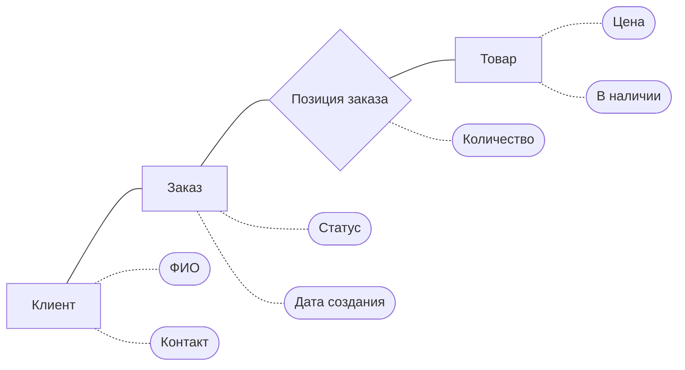

# ИТ.03 - 11 - Модели БД и способы их представления. ER-диаграммы

## Введение

На предыдущих занятиях мы работали только с одной таблицей, но в реальных системах данные всегда разбиваются на несколько связанных сущностей. Чтобы эти связи были продуманными, структуру базы данных сначала проектируют в виде модели.

В этой теме разберём:

- что такое модель данных и зачем она нужна;
- уровни моделей (концептуальный, логический, физический);
- элементы ER-модели: сущности, атрибуты, связи и их кратности;
- как построить простую ER-диаграмму в нотации Mermaid и как она помогает при создании связанных таблиц.

::: warning
ER-диаграмма не заменяет саму базу данных. Это проект, который позволяет обсудить структуру предметной области и проверить её перед реализацией в SQL.
:::

## Зачем нужны модели данных

Модель данных описывает, **какую информацию мы храним** и **как объекты связаны между собой**. Она:

- даёт всем участникам проекта единое понимание предметной области;
- служит основой для создания таблиц и ограничений в СУБД;
- помогает выявить лишние связи и дубли ещё до написания SQL-кода;
- показывает зоны, в которых придётся выполнять `JOIN`, `INSERT` в несколько таблиц и т.д.

::: info

Часто модель разрабатывают итеративно. Сначала фиксируют ключевые сущности и связи, потом уточняют атрибуты и ограничения. Не нужно пытаться описать всю систему за один подход — важно добиться согласованности базовой структуры.

:::

## Уровни моделей

| Уровень         | Цель                                                                 | Результат |
| --------------- | -------------------------------------------------------------------- | --------- |
| Концептуальный  | Выявить основные сущности и их связи на языке предметной области     | ER-диаграмма, текстовое описание |
| Логический      | Уточнить атрибуты, ключи, ограничения и возможные типы данных        | Таблицы с полями и ограничениями |
| Физический      | Подстроить модель под конкретную СУБД, синтаксис, схемы хранения      | SQL-скрипт, настройки сервера |

### Концептуальный уровень

На концептуальном уровне фиксируем ключевые сущности и связи между ними, без деталей по типам данных.

::: preview Посмотреть код диаграммы



:::

На концептуальной диаграмме фигурируют только ключевые объекты предметной области: покупатель оформляет заказ, заказ состоит из позиций, каждая позиция указывает на конкретный товар. Прямоугольники обозначают сущности (`Клиент`, `Заказ`, `Товар`), овалы — важные характеристики. Сущности соединяем сплошными линиями, а сущности и их атрибуты — пунктирными, чтобы легко отличать связи объектов от перечисления свойств. Сущность `Позиция заказа` рисуем ромбом, чтобы подчеркнуть её связующую роль между заказом и товаром: она помогает явно зафиксировать, какие товары входят в конкретный заказ.

Здесь мы сознательно ограничились участниками процесса «кто покупает и что именно», поэтому роль сотрудника пока не добавляем — она появится позже, если аналитика покажет необходимость.

Важно помнить, что концептуальный уровень не требует полной детализации. Мы фиксируем только те элементы, которые понятны всем участникам проекта и помогают обсудить предметную область. Технические особенности (статусы, роли пользователей, дополнительные справочники) появляются на следующих этапах, когда структура базовых сущностей согласована.

### Логический уровень

Логическая модель уже описывает атрибуты, ключи, кратности и ограничения (но ещё не привязана к конкретной СУБД). На этом шаге мы уточнили требования и выяснили, что заказы оформляют сотрудники, а каждая позиция хранит цену и количество товара на момент покупки — поэтому в схему добавляется сущность `Сотрудник` и расширяются атрибуты других таблиц.

::: preview Посмотреть код диаграммы


:::

Здесь уже фиксируем, какие атрибуты обязательны, где нужны первичные и внешние ключи, а также кратности связей. Например, `orders.employee_id` указывает, кто оформил заказ, `order_items` хранит цену и количество на момент покупки, а `products.is_active` помогает отключать позиции из каталога. Диаграмма логического уровня служит прямой подсказкой для структуры таблиц, но пока не привязана к конкретной СУБД или типам данных.

### Физический уровень

Когда структура согласована, переносим её в SQL: выбираем конкретные типы данных, добавляем индексацию, каскадные правила, комментарии.

```sql
CREATE TABLE customers (
  id INTEGER PRIMARY KEY,
  full_name TEXT NOT NULL,
  phone TEXT,
  email TEXT
);

CREATE TABLE orders (
  id INTEGER PRIMARY KEY,
  customer_id INTEGER NOT NULL REFERENCES customers(id),
  employee_id INTEGER NOT NULL REFERENCES employees(id),
  status TEXT NOT NULL DEFAULT 'new' CHECK (status IN ('new', 'confirmed', 'shipped', 'completed', 'cancelled')),
  created_at TEXT NOT NULL DEFAULT (datetime('now'))
);

CREATE TABLE employees (
  id INTEGER PRIMARY KEY,
  full_name TEXT NOT NULL,
  role TEXT CHECK (role IN ('admin', 'manager'))
);

CREATE TABLE products (
  id INTEGER PRIMARY KEY,
  title TEXT NOT NULL,
  price REAL NOT NULL,
  is_active INTEGER NOT NULL DEFAULT 1
);

CREATE TABLE order_items (
  id INTEGER PRIMARY KEY,
  order_id INTEGER NOT NULL REFERENCES orders(id),
  product_id INTEGER NOT NULL REFERENCES products(id),
  quantity INTEGER NOT NULL CHECK (quantity > 0),
  unit_price REAL NOT NULL
);
```

На физическом уровне мы учитываем особенности конкретной СУБД: выбираем типы (`TEXT`, `REAL`, `INTEGER`), добавляем ограничения (`NOT NULL`, `CHECK`, `REFERENCES`) и значения по умолчанию. Например, у заказов статус ограничен перечнем допустимых значений — это позволяет валидацией на уровне базы отсечь опечатки и гарантировать корректный бизнес-процесс. Дополнительно можно добавить индексы и указать действия `ON DELETE` / `ON UPDATE` для внешних ключей: они определяют, что происходит с дочерними строками при изменении или удалении родительской записи. В следующей лекции разберём эти режимы подробнее и покажем, как выбирать подходящий вариант для конкретной модели.

## ER-диаграмма и нотации

**ER-диаграмма** (Entity-Relationship Diagram) — графическое описание модели. На ней показывают сущности, атрибуты и связи между ними. Чтобы диаграммы «читались» одинаково разными специалистами, используются **нотации** — наборы правил, которые описывают, как изображать сущности, атрибуты и кратности.

Различные нотации используются в корпоративных методологиях или CASE-средствах, часто добавляют собственные символы для первичных/внешних ключей, жизненных циклов сущности, наследования и других аспектов работы с данными.

Перечислим самые известные нотации и приведём примеры.

### Нотация Питера Чена

Классический вариант ER-диаграмм: сущности отображаются прямоугольниками, атрибуты — овалами, связи — ромбами. Хороша для обсуждения предметной области без технических деталей, когда нужно визуально показать, какие объекты существуют и как они взаимодействуют.


::: note
Нотацию предложил Питер Чен (Peter Chen) в 1976 году в статье «The Entity-Relationship Model — Toward a Unified View of Data». Именно она ввела понятия «сущность», «связь», «атрибут», которые мы используем до сих пор.
:::

### Нотация Crow's Foot

Самая популярная нотация в современных инструментах: сущности рисуются прямоугольниками с атрибутами, а связи показываются линиями с «вороньими лапками», которые наглядно отображают кратности (`1 — 1`, `1 — N`, `M — N`). Подходит, когда важно быстро считывать тип связи.

::: note
В англоязычной литературе можно встретить названия Information Engineering notation или IE notation — это наследие методологии, которую активно продвигали в 80-х годах.
:::


### Нотация IDEF1X

Стандарт Министерства обороны США: сущности оформляются прямоугольниками с явной пометкой `PK` и `FK`, связи делятся на определяющие (сплошные) и не определяющие (пунктирные). Используется для строгой документации корпоративных схем, где важно явно фиксировать ключи и зависимости.

::: note
IDEF1X входит в семейство стандартов IDEF (Integrated DEFinition), выросших из методологии SADT. Его применяют в оборонных и промышленных проектах, где требуется формальное описание данных.
:::


### Нотация UML

Часть универсального языка моделирования UML: ER-схема представляется диаграммой классов, где перечисляются атрибуты с типами, методы (по необходимости) и ассоциации с указанием множественности. Удобна, если команда уже описывает систему на UML и хочет использовать единый визуальный язык.

::: note
Текущая спецификация поддерживается консорциумом OMG, поэтому UML хорошо ложится в процессы, где диаграммы классов, состояний и компонентов уже стандартизированы.
:::


### Нотация Баркера (Barker's Notation)

Разработана Ричардом Баркером и используется в Oracle Designer и других CASE-инструментах. Сущности делятся на обязательные и необязательные атрибуты, связи похожи на «вороньи лапки», но снабжены символами (`O`, `P`), которые показывают обязательность участия. Позволяет зафиксировать бизнес-правила прямо на диаграмме.

::: note
Описание нотации подробно разобрано в книге Ричарда Баркера «Entity Relationship Modeling» (1990), а Oracle Designer сделал её де-факто стандартом во многих компаниях.
:::


### Нотация Бахмана (Bachman)

Предложена Чарльзом Бахманом и до сих пор встречается в крупных корпоративных системах. Связи изображаются линиями со стрелками, которые задают направление навигации между сущностями, а прямоугольные блоки могут объединять связанные объекты. Несмотря на «винтажный» стиль, помогает документировать наследие старых систем.

::: note
Чарльз Бахман получил премию Тьюринга за вклад в развитие сетевых СУБД — именно оттуда пришла идея показывать направление обхода графа данных стрелками.
:::


### Нотация Mermaid

Мы будем использовать нотацию Mermaid (подвид Crow's Foot на языке Mermaid). Диаграммы легко создать на сайте [mermaid.live](https://mermaid.live/), где можно вводить текстовую запись, а система автоматически построит граф. Преимущества такой записи:

- диаграмма хранится как текст, её легко версионировать;
- не нужно привязываться к конкретной СУБД;
- одну и ту же диаграмму можно встроить в документацию, репозиторий или показать в браузере.

::: info

Существуют графические редакторы ([drawDB](https://www.drawdb.app/), [dbdiagram](https://dbdiagram.io/), [drawIO](https://drawio-app.com/erd/), [chartDB](https://app.chartdb.io/), [quickDBD](https://www.quickdatabasediagrams.com/), [drawSQL](https://drawsql.app/) и множество других), которые позволяют рисовать ERD мышкой и экспортировать их в SQL. Когда перейдём к MySQL, познакомимся с MySQL Workbench: этот инструмент умеет строить ERD, синхронизировать их с готовой схемой БД и генерировать SQL-код.

:::

## Сущности и атрибуты

- **Сущность (Entity)** — объект предметной области, о котором нужно хранить данные (например, `Студент`, `Курс`, `Заказ`).
- **Атрибут (Attribute)** — характеристика сущности (ФИО студента, номер курса, цена заказа).

Пример описания сущности:

::: preview Посмотреть код диаграммы


:::

На диаграмме мы указываем только логические типы полей — они описывают назначение атрибута без привязки к конкретной СУБД. Чтобы было понятно, что означают подписи в примере, собрали самые часто встречающиеся обозначения в краткую памятку.

| Тип      | Что обозначает                              | Пример использования         |
| -------- | ------------------------------------------- | ---------------------------- |
| `INTEGER`| Целое число, часто используется для ключей  | `id`, `group_id`, `quantity` |
| `STRING` | Текст фиксированной или произвольной длины  | `first_name`, `email`        |
| `DECIMAL`| Число с дробной частью                      | `price`, `unit_price`        |
| `BOOL`   | Логическое значение (`true/false`)          | `is_active`, `in_stock`      |
| `ENUM`   | Перечисление ограниченного набора значений  | `gender`, `status`           |
| `DATE`   | Дата или дата-время                         | `date_of_birth`, `created_at`|

::: note
При переходе к физической модели эти типы трансформируем в конкретные `TEXT`, `INTEGER`, `REAL` и т.п., поддерживаемые выбранной СУБД.
:::

## Связи и кратности

**Связь (Relationship)** показывает, как сущности взаимодействуют. Для каждой связи важно задать **кратности** (cardinality) — сколько экземпляров сущности участвует.

| Обозначение | Описание                    | Пример                                |
| ----------- | --------------------------- | ------------------------------------- |
| `1 — 1`     | один к одному               | Паспорт ↔ человек                     |
| `1 — N`     | один ко многим              | Группа ↔ студенты                     |
| `M — N`     | многие ко многим            | Студенты ↔ курсы                      |

В нотации Mermaid кратности обозначаются символами:

| Слева | Справа | Значение           |
|:-----:|:------:|:-------------------|
| `\|o`  | `o\|`   | Ноль или один      |
| `\|\|`  | `\|\|`   | Строго один        |
| `}o`  | `o{`   | Ноль или несколько |
 |`}\|`  | `\|{`   | Один или несколько |

::: preview Посмотреть код диаграммы


:::

::: tip

Проверяйте связи вопросами: «Сколько студентов может быть в группе?» и «Сколько групп может быть у студента?». Ответы определяют кратность по каждой стороне.

:::

## Определяющие и не определяющие связи

В ER-моделях выделяют два типа связей:

- **Определяющая (identifying)** — дочерняя сущность не существует без родительской. Обычно её первичный ключ включает ключ родителя. На диаграмме связь рисуют сплошной линией.
- **Не определяющая (non-identifying)** — сущность существует сама по себе, а внешний ключ добавляется только для связи. На диаграмме это пунктирная линия.

При разработке важно понимать характер отношения: определяющие связи подсказывают, что значение родители должно входить в состав уникального ограничения у дочерней сущности.


В левом блоке «Заявка» имеет собственный ключ, а ссылки на клиента и менеджера нужны лишь для связи. В правом блоке дочерние сущности «Позиция заказа» и «Счёт» живут только в контексте конкретного заказа — их ключи зависят от родительского «Заказа».

## Пример: разбираем ER-диаграмму интернет-магазина

Чтобы закрепить теорию про сущности, связи и кратности, рассмотрим знакомый кейс. Возьмём упрощённый интернет-магазин: покупатель оформляет заказы, заказ состоит из строк с товарами. Ниже — фрагмент логической диаграммы в нотации Mermaid.

::: preview Посмотреть код диаграммы


:::

- `Покупатель` связан с `Заказом` как `1 — N`: один человек может оформить много заказов, у каждого заказа фиксируется владелец через внешний ключ `customer_id`.
- `Товар` участвует в заказе через сущность `Детали заказа`. Так мы реализуем связь `M — N` и можем хранить количество и цену позиции, не дублируя данные товара целиком.
- Атрибуты внутри сущностей подсказывают, какие данные обязательно собирать на бизнес-уровне (email покупателя, статус заказа, цена позиции и т.д.) и какие ключи понадобятся.

Такой разбор помогает проверить, не потеряны ли ключевые связи и атрибуты перед переходом к SQL. Следующий раздел показывает, как по этой диаграмме получить структуру таблиц.

## Как перейти от ER-диаграммы к таблицам

1. **Таблица = сущность.** Для каждого прямоугольника на диаграмме создаём таблицу. Колонки берём из атрибутов.
2. **Первичные ключи.** Поле, помеченное как `PK`, становится первичным ключом (`PRIMARY KEY`). Если ключ не указан, его нужно выбрать (обычно автоинкрементное `id`).
3. **Внешние ключи.** Для каждого ребра `1 — N` добавляем в таблицу «многие» колонку со ссылкой на «один»: например, `orders.customer_id REFERENCES customers(id)`.
4. **Связи `M — N`.** Разрываем на две связи `1 — N` через промежуточную таблицу (как `order_items`). В неё переносим дополнительные атрибуты (количество, цены).
5. **Типы данных и ограничения.** Для каждого поля выбираем подходящий тип SQLite/MySQL, добавляем `NOT NULL`, `UNIQUE`, значения по умолчанию и т.д.
6. **Дополнительные параметры.** На физическом уровне можно задать действия при удалении/обновлении (`ON DELETE/UPDATE`) и заранее продумать, какие поля потребуется ускорять каждым типом запросов (к этому вернёмся позже).

::: info

Всегда сверяйте атрибуты и связи на диаграмме с планом реализации: так проще убедиться, что в SQL-скрипте не потерян внешний ключ или не перепутана кратность.

:::

## Как называть таблицы: единственное или множественное число

В реальных проектах часто спорят, как именовать таблицы: `user` или `users`, `order` или `orders`. Универсального стандарта нет, но полезно понимать аргументы сторон и придерживаться единого подхода внутри проекта.

- **Единственное число (`user`, `order`)**. Такой стиль пришёл из ООП: таблицу воспринимают как «класс», а строки — как экземпляры. Плюсы — красиво сочетается с ORM, где модели называются в единственном числе. Минус — при чтении SQL иногда сложно сразу увидеть, что речь о наборе сущностей.
- **Множественное число (`users`, `orders`)**. Более распространённый вариант в современной разработке: таблица хранит множество записей, а каждая строка описывает один объект. Плюсы — легче читать запросы (`SELECT * FROM orders` звучит естественно), а названия уже отражают множественность данных.

Какой бы стиль ни выбрали, главное — следовать ему последовательно. Смешение `user` и `orders` в одной схеме приводит к недопониманию, особенно если команды меняются или проект развивается годами. Перед стартом проекта обычно обговаривают схему именования и закрепляют её в гайдлайнах.

## Инструменты для построения ERD

### Mermaid.live


**[mermaid.live](https://mermaid.live/)** — текстовый редактор диаграмм. Пишем код на языке Mermaid (как в примерах лекции) и сразу видим визуализацию. Плюсы: диаграммы легко хранить в текстовом виде, есть подсветка синтаксиса, можно экспортировать в PNG/SVG.

### drawDB


**[drawDB](https://www.drawdb.app/)** — графический конструктор, в котором сущности и связи рисуются мышкой. Работает в браузере и офлайн (есть версии для сборки при помощи Docker), поддерживает выгрузку диаграммы сразу в SQL (SQLite, MySQL и др.), а также импорт/экспорт проектов.

Для упражнений ниже можно выбрать любой инструмент: если нравится писать текстом — используйте Mermaid; если удобнее графически — drawDB.

## Самопроверка

::: quiz source=./includes/quiz-11.yaml
:::

## Практические задания

### Задание 1. Концептуальная диаграмма

::: tabs

@tab Условие

Опишите на концептуальном уровне предметную область «онлайн-курсы». Сущности: «Преподаватель», «Курс», «Студент», «Запись на курс». Постройте простую схему (Mermaid flowchart, рисунок от руки или диаграмма в drawDB) без указания атрибутов и ключей.

@tab Решение

  ::: preview Посмотреть код диаграммы

  ```mermaid
  flowchart LR
    teacher[Преподаватель]
    course[Курс]
    enrollment[Запись на курс]
    student[Студент]

    teacher --- course
    course --- enrollment
    student --- enrollment
  ```

  :::

На концептуальном уровне фиксируем только сущности и связи между ними: преподаватель создаёт курсы, курс имеет записи, а студент участвует через сущность «Запись на курс». Атрибуты и ключи пока не нужны.

:::

### Задание 2. Логическая диаграмма

::: tabs

@tab Условие

Продолжите работу с предметной областью «онлайн-курсы». В учебной платформе один преподаватель ведёт несколько курсов, а каждый студент может записаться на разные курсы. Постройте логическую ER-диаграмму (mermaid.live или drawDB), где:

- у `Преподавателя` (`teacher`) есть атрибуты `id`, ФИО, контакт;
- у `Курса` (`course`) хранится название и внешний ключ `teacher_id`;
- факт записи фиксируется в отдельной сущности `Запись на курс` (`enrollment`) с внешними ключами `student_id` и `course_id`;
- в `Студенте` (`student`) достаточно ФИО и группового кода.

То есть нужно показать классическую схему «преподаватель ↔ курс ↔ (таблица связки) ↔ студент» с явными PK и FK.

@tab Решение

  ::: preview Посмотреть код диаграммы

  ```mermaid
  erDiagram
    teacher["Преподаватель"] {
      INTEGER id PK             "Первичный ключ"
      STRING full_name          "ФИО"
      STRING email              "Контакт"
    }

    course["Курс"] {
      INTEGER id PK             "Первичный ключ"
      STRING title              "Название"
      INTEGER teacher_id FK     "Ведущий преподаватель"
    }

    student["Студент"] {
      INTEGER id PK             "Первичный ключ"
      STRING full_name          "ФИО"
      STRING group_code         "Группа"
    }

    enrollment["Запись на курс"] {
      INTEGER id PK             "Первичный ключ"
      INTEGER student_id FK     "Студент"
      INTEGER course_id FK      "Курс"
      DATE enrolled_at          "Дата записи"
    }

    teacher ||--o{ course : "ведёт"
    course ||--o{ enrollment : "имеет записи"
    student ||--o{ enrollment : "посещает"
  ```

  :::

Преподаватель связан с курсами как `1 — N`. Связь студент ↔ курс реализуется через таблицу «Запись на курс», что позволяет хранить дату регистрации и другие атрибуты без дублирования данных.

:::

### Задание 3. Физическая реализация и проверка

::: tabs

@tab Условие

По диаграмме из задания 2 напишите SQL-скрипт (SQLite), который создаёт таблицы `teachers`, `courses`, `students`, `enrollments`, настраивает ключи и проверяет структуру через `PRAGMA foreign_key_list`.

Последовательное выполнение запросов ```PRAGMA foreign_key_list('courses');``` и ```PRAGMA foreign_key_list('enrollments');``` должно вернуть результат:

```txt :no-line-numbers
┌────┬─────┬──────────┬────────────┬────┬───────────┬───────────┬───────┐
│ id │ seq │  table   │    from    │ to │ on_update │ on_delete │ match │
├────┼─────┼──────────┼────────────┼────┼───────────┼───────────┼───────┤
│ 0  │ 0   │ teachers │ teacher_id │ id │ NO ACTION │ NO ACTION │ NONE  │
└────┴─────┴──────────┴────────────┴────┴───────────┴───────────┴───────┘
┌────┬─────┬──────────┬────────────┬────┬───────────┬───────────┬───────┐
│ id │ seq │  table   │    from    │ to │ on_update │ on_delete │ match │
├────┼─────┼──────────┼────────────┼────┼───────────┼───────────┼───────┤
│ 0  │ 0   │ courses  │ course_id  │ id │ NO ACTION │ NO ACTION │ NONE  │
│ 1  │ 0   │ students │ student_id │ id │ NO ACTION │ NO ACTION │ NONE  │
└────┴─────┴──────────┴────────────┴────┴───────────┴───────────┴───────┘
```

  ::: play sandbox=sqlite editor=basic

  ```sql
  -- Ваш код можете писать тут


  ```

  :::

@tab Решение

```sql
CREATE TABLE teachers (
  id INTEGER PRIMARY KEY,
  full_name TEXT NOT NULL,
  email TEXT
);

CREATE TABLE courses (
  id INTEGER PRIMARY KEY,
  title TEXT NOT NULL,
  teacher_id INTEGER NOT NULL REFERENCES teachers(id)
);

CREATE TABLE students (
  id INTEGER PRIMARY KEY,
  full_name TEXT NOT NULL,
  group_code TEXT
);

CREATE TABLE enrollments (
  id INTEGER PRIMARY KEY,
  student_id INTEGER NOT NULL REFERENCES students(id),
  course_id INTEGER NOT NULL REFERENCES courses(id),
  enrolled_at TEXT DEFAULT (date('now'))
);

PRAGMA foreign_key_list('courses');
PRAGMA foreign_key_list('enrollments');
```

В первых четырёх запросах создаём таблицы по диаграмме: `courses.teacher_id` ссылается на `teachers(id)`, а в `enrollments` фиксируем связь студента и курса. Команды `PRAGMA foreign_key_list` помогают убедиться, что ограничения действительно подключены: для `courses` увидим ссылку на `teachers`, а для `enrollments` — сразу два внешних ключа (`students`, `courses`). Если вывод соответствует ожидаемой структуре, физическая модель реализована корректно.

:::
