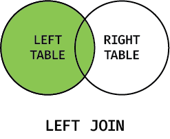

# ИТ.03 - 12 - Создание связанных таблиц. Операции `JOIN` и `UNION`

## Введение

В предыдущей теме мы научились описывать модель данных на уровне ER-диаграмм. Теперь переходим к её реализации в SQL: создадим несколько таблиц, настроим связи и посмотрим, как извлекать данные сразу из нескольких таблиц с помощью `JOIN`.

В этой лекции:

- разбираем синтаксис `CREATE TABLE` с внешними ключами;
- включаем поддержку ограничений целостности в SQLite;
- изучаем базовые варианты `JOIN` и операции `UNION`, показывая как объединять выборки.

::: warning
В SQLite внешние ключи работают только если явно включена проверка (`PRAGMA foreign_keys = ON;`). Подробности — в разделе «Включаем контроль внешних ключей».
:::

## Базовый синтаксис `CREATE TABLE ... FOREIGN KEY`

```sql
CREATE TABLE дочерняя_таблица (
  поле1 ТИП NOT NULL,
  ...
  внешний_ключ ТИП REFERENCES родительская_таблица(id)
    ON DELETE CASCADE
    ON UPDATE CASCADE
);
```

Ключевые моменты:

1. **Совпадение типов.** Поле, на которое ссылается внешний ключ, и сам внешний ключ должны быть одного типа (например, `INTEGER`).
2. **Именование.** Часто используют шаблон `<таблица>_id`, чтобы по названию поля было понятно, на что идёт ссылка.
3. **ON DELETE / ON UPDATE.** Эти предложения описывают, что случится с дочерними записями, если удалить или изменить родительскую. Для учебных баз удобно использовать `CASCADE`, чтобы записи автоматически удалялись вместе с родителем.
4. **UNIQUE/PRIMARY KEY.** Внешний ключ всегда ссылается на уникальное поле родительской таблицы (обычно на `PRIMARY KEY`).

::: info
Есть альтернативный синтаксис, когда внешние и первичные ключи задаются **после** описания всех столбцов, в секции ограничений таблицы:

```sql
CREATE TABLE дочерняя_таблица (
  id INTEGER,
  parent_id INTEGER,
  ...
  PRIMARY KEY (id),
  FOREIGN KEY (parent_id) REFERENCES родительская_таблица(id)
);
```

Такой подход удобен, когда нужно объявить составные ключи или дать имя ограничению (`CONSTRAINT fk_parent ...`). В этой лекции мы используем оба варианта, чтобы вы привыкли читать оба вида схем.
:::

## Включаем контроль внешних ключей в SQLite

По историческим причинам SQLite не проверяет внешние ключи, пока вы явно не включите этот режим:

```sql
PRAGMA foreign_keys = ON;
```

- команда действует только в пределах текущего подключения: в интерактивной сессии `sqlite3` её нужно выполнять один раз после запуска клиента;
- в скрипте команду ставят перед `CREATE TABLE` / `INSERT`, чтобы гарантировать проверку ограничений;
- если забыть включить режим, SQLite молча пропустит нарушение (`CASCADE`, `SET NULL` и т.п. работать не будут).

Наши интерактивные блоки автоматически выполняют `PRAGMA foreign_keys = ON` (см. шаблон `#show_null_and_enable_foreign_keys`), но в собственных проектах обязательно добавляйте команду в каждый новый скрипт и при открытии консоли.

## Учебная база данных «Learning Portal»

::: tabs

@tab Таблицы

  ::: tabs

  @tab teachers
  <!-- @include: ./includes/learning_portal_db/teachers_table.md -->

  @tab courses
  <!-- @include: ./includes/learning_portal_db/courses_table.md -->

  @tab students
  <!-- @include: ./includes/learning_portal_db/students_table.md -->

  @tab enrollments
  <!-- @include: ./includes/learning_portal_db/enrollments_table.md -->

  :::

@tab Описание

  Учебный портал, связывающий преподавателей, курсы и студентов: показывает, как работают внешние ключи и таблицы-связки.

  **Особенности:**

  - демонстрирует каскадные связи «преподаватель → курс → запись»;
  - часть данных содержит `NULL` (отсутствующий e-mail, группа, записи);
  - есть курс без студентов и студент без записей для примеров `LEFT JOIN`.

@tab Поля и ограничения

  **Поля**

  - **`teachers`**
    - `id` — первичный ключ;
    - `full_name` — ФИО преподавателя;
    - `email` — адрес (может отсутствовать).

  - **`courses`**
    - `id` — первичный ключ;
    - `title` — название курса;
    - `hours` — длительность в академических часах;
    - `teacher_id` — ссылка на `teachers(id)`.

  - **`students`**
    - `id` — первичный ключ;
    - `full_name` — ФИО студента;
    - `group_code` — учебная группа (может отсутствовать).

  - **`enrollments`**
    - `id` — первичный ключ;
    - `student_id` — ссылка на `students(id)`;
    - `course_id` — ссылка на `courses(id)`;
    - `enrolled_at` — дата записи (по умолчанию `date('now')`).

  **Ограничения**

  - `teachers.email` допускает `NULL`, остальные столбцы обязательны;
  - `courses.teacher_id` и `enrollments` ссылаются на родительские таблицы, для `enrollments` включено `ON DELETE CASCADE`;
  - таблица `enrollments` запрещает повторные записи одной пары студент+курс через `UNIQUE(student_id, course_id)`;
  - `students.group_code` может быть пустым, что демонстрирует работу c `NULL`.

@tab Структура

  @[code mermaid](./includes/learning_portal_db/learning_portal.mermaid)

@tab SQL-код

  Скачать в виде файла: [learning_portal_sqlite.sql](./includes/learning_portal_db/learning_portal_sqlite.sql)

  ::: play sandbox=sqlite editor=basic id=learning_portal_sqlite.sql
  @[code sql:collapsed-lines=10](./includes/learning_portal_db/learning_portal_sqlite.sql)
  :::

:::

::: warning

В SQLite `NULL` отображается как пустая ячейка, а внешние ключи не проверяются, пока вы сами не включите соответствующий режим. В интерактивных примерах мы используем шаблон `#show_null_and_enable_foreign_keys`, который делает сразу два действия:

```sql {#show_null_and_enable_foreign_keys}
-- выводить NULL как строку 'NULL'
.nullvalue 'NULL'

-- включить контроль целостности
PRAGMA foreign_keys = ON;

-- дальше может идти ваш код:
##CODE##
```

Теперь `NULL` явно виден в результатах, а `REFERENCES` / `ON DELETE` / `ON UPDATE` начинают работать так, как описано в схеме. В собственных скриптах не забудьте добавить эти команды вручную.

**В наших интерактивных блоках лекций эти настройки уже включена.**

:::

### Проверяем структуру

Выводим информацию о таблицах:

::: play sandbox=sqlite editor=basic template="#show_null_and_enable_foreign_keys" depends-on=learning_portal_sqlite.sql

```sql
PRAGMA table_info('teachers');
PRAGMA table_info('courses');
PRAGMA table_info('students');
PRAGMA table_info('enrollments');
```

:::

Выводим информацию о внешних ключах:

::: play sandbox=sqlite editor=basic template="#show_null_and_enable_foreign_keys" depends-on=learning_portal_sqlite.sql

```sql
PRAGMA foreign_key_list('teachers');
PRAGMA foreign_key_list('courses');
PRAGMA foreign_key_list('students');
PRAGMA foreign_key_list('enrollments');
```

:::

`PRAGMA table_info` показывает столбцы и их ограничения, а `foreign_key_list` — таблицы, на которые ссылается выбранная таблица. Обратите внимание, что `PRAGMA foreign_key_list` показывает только таблицы, на которые ссылается выбранная таблица. Если выбранная таблица не ссылается на другие таблицы, то `foreign_key_list` ничего не показывает.

Ну и наконец выведем данные из таблиц:

::: play sandbox=sqlite editor=basic template="#show_null_and_enable_foreign_keys" depends-on=learning_portal_sqlite.sql

```sql
SELECT * FROM teachers;
SELECT * FROM courses;
SELECT * FROM students;
SELECT * FROM enrollments;
```

:::

## Создание таблиц со связями по шагам

1. **Создаём родительскую таблицу.** Например, `teachers` с `id` как первичным ключом.
2. **Создаём дочернюю таблицу и добавляем внешний ключ.** `courses` получает поле `teacher_id INTEGER REFERENCES teachers(id)`.
3. **Настраиваем таблицу-связку для `M — N`.** Таблица `enrollments` содержит два внешних ключа (`student_id`, `course_id`) и хранит дополнительные атрибуты (`enrolled_at`).
4. **Включаем `PRAGMA foreign_keys`.** Без этого SQLite проигнорирует ограничения.
5. **Заранее продумываем поведение при удалении/обновлении.** В учебном примере использованы `ON DELETE CASCADE`, чтобы не оставались «висящие» записи.

::: info
Даже если в модели нет связи `M — N`, полезно выносить дополнительные атрибуты (например, оценки, статусы) в отдельную таблицу, а не дублировать их напрямую в `students`.
:::

## Когда важно `ON DELETE` / `ON UPDATE`

Каждый внешний ключ может задавать поведение при обновлении или удалении родительской строки. Директивы `ON DELETE` и `ON UPDATE` отвечают на вопросы:

- что делать с дочерними записями, если родитель удалён;
- нужно ли автоматически менять внешние ключи, если родительский ключ обновился.

По умолчанию SQLite просто запрещает операцию, но иногда полезно «цеплять» каскад или очищать ссылку.

Основные варианты:

| Опция        | Поведение                                                                 |
| ------------ | ------------------------------------------------------------------------- |
| `NO ACTION`  | (значение по умолчанию) Проверка выполняется после операции; при нарушении внешнего ключа выдаётся ошибка. |
| `RESTRICT`   | Похоже на `NO ACTION`, но проверка выполняется сразу; операция блокируется, если есть дочерние записи. |
| `CASCADE`    | Автоматически удаляет/обновляет дочерние записи вслед за родительской.    |
| `SET NULL`   | Устанавливает `NULL` в дочернем поле. Работает только если поле допускает `NULL`. |
| `SET DEFAULT`| Подставляет значение по умолчанию из определения столбца.                 |

SQLite поддерживает все перечисленные варианты. Выбор зависит от бизнес-логики: где-то важно сохранить историю (`RESTRICT`), где-то безопаснее «очищать» ссылку (`SET NULL`), а в демонстрационных базах часто используют `CASCADE`.

## Виды `JOIN` на практике

`JOIN` объединяет строки двух и более таблиц согласно условию `ON`. Конкретный тип соединения задаёт, какие строки остаются в результате, если парных записей не найдено.

Во всех примерах ниже используем учебную базу «Learning Portal»: у нас есть курсы (некоторые без слушателей), студенты (есть те, кто никуда не записан) и таблица `enrollments`, связывающая их. Поэтому в результатах легко заметить строки с `NULL`, где нет соответствий.

### Обзор


### `INNER JOIN`


Возвращает строки, для которых условие связи выполняется в обеих таблицах. Если ключевое слово `JOIN` указано без уточнения типа, подразумевается именно `INNER JOIN`.

::: play sandbox=sqlite editor=basic template="#show_null_and_enable_foreign_keys" depends-on=learning_portal_sqlite.sql

```sql
SELECT
  students.full_name AS student,
  courses.title AS course,
  teachers.full_name AS teacher
FROM enrollments
INNER JOIN students ON students.id = enrollments.student_id
INNER JOIN courses ON courses.id = enrollments.course_id
INNER JOIN teachers ON teachers.id = courses.teacher_id
ORDER BY student;
```

:::

Результат включает только тех студентов, у кого есть записи в `enrollments`, а также названия курсов и имена преподавателей, ведущих эти курсы. Студенты без записей (например, Мария Жукова) не попадут в выборку.

### `LEFT JOIN`



Возвращает все строки из левой таблицы и совпадающие строки из правой. Если совпадений нет, значения правой таблицы будут `NULL`.

::: play sandbox=sqlite editor=basic template="#show_null_and_enable_foreign_keys" depends-on=learning_portal_sqlite.sql

```sql
SELECT
  courses.title,
  students.full_name AS student
FROM courses
LEFT JOIN enrollments ON enrollments.course_id = courses.id
LEFT JOIN students ON students.id = enrollments.student_id
ORDER BY courses.title, student;
```

:::

В выборке будут все курсы. Там, где нет слушателей, столбец `student` заполнится `NULL`. Например, `Data Visualization` сразу видно как свободный курс.

### `RIGHT JOIN`


Возвращает все строки из правой таблицы и совпадающие строки из левой. Если совпадений нет, значения левой таблицы будут `NULL`.

SQLite не поддерживает `RIGHT JOIN`, но его легко получить, «повернув» запрос с `LEFT JOIN`. Если нам нужны **все курсы** даже без студентов (аналог `students RIGHT JOIN courses`), просто ставим `courses` слева:

::: play sandbox=sqlite editor=basic template="#show_null_and_enable_foreign_keys" depends-on=learning_portal_sqlite.sql

```sql
SELECT
  courses.title AS course,
  students.full_name AS student
FROM courses
LEFT JOIN enrollments ON enrollments.course_id = courses.id
LEFT JOIN students ON students.id = enrollments.student_id
ORDER BY course, student;
```

:::

Этот запрос эквивалентен `RIGHT JOIN` по направлению «студенты → курсы»: столбец `course` не содержит `NULL`, а `student` станет `NULL`, если на курс никто не записан.

### `FULL OUTER JOIN`


Возвращает все строки из обеих таблиц, совпадающие и несовпадающие. Если совпадений нет, значения одной из таблиц будут `NULL`.

SQLite не поддерживает `FULL OUTER JOIN` напрямую, поэтому мы не пишем отдельного примера. Ниже, в разделе про `UNION`, покажем, как собрать аналогичный результат из двух запросов.

### `CROSS JOIN`


Формирует **декартово произведение**.

::: info

Декартово произведение перечисляет каждую возможную комбинацию строк из двух таблиц. Если в первой таблице три записи, а во второй пять, `CROSS JOIN` сформирует 3 x 5 = 15 строк. Такой подход используют, когда нужно построить сетку всех возможных комбинаций. Например, потенциальное расписание или подбор «каждый с каждым».

:::

В SQLite используется ключевое слово `CROSS JOIN` или просто перечисление таблиц через запятую (но лучше явно).

::: play sandbox=sqlite editor=basic template="#show_null_and_enable_foreign_keys" depends-on=learning_portal_sqlite.sql

```sql
SELECT teachers.full_name, courses.title
FROM teachers
CROSS JOIN courses
WHERE teachers.id = 1;
```

:::

Результат содержит все комбинации «преподаватель × курс», даже если они не связаны в схеме. В примере мы оставляем пары только для учителя с `id = 1`, но сама операция формирует декартово произведение и полезна, когда нужно сгенерировать сетку всех возможных сочетаний.

## Объединение выборок: `UNION` и `UNION ALL`

`UNION` объединяет несколько запросов `SELECT` в одну выборку. Это удобно, когда два разных запроса возвращают схожие по структуре данные, но вы хотите показать их подряд (например, курсы с учениками и курсы без них). Требования:

- одинаковое количество столбцов в каждом запросе;
- совместимые типы данных по позициям;
- итоговые имена столбцов берутся из первого `SELECT`.

`UNION` по умолчанию убирает дубликаты. Если дубликаты нужны, используйте `UNION ALL`.

### Пример: курсы со слушателями и без них

::: play sandbox=sqlite editor=basic template="#show_null_and_enable_foreign_keys" depends-on=learning_portal_sqlite.sql

```sql
SELECT
  courses.title AS course,
  'Есть слушатели' AS status
FROM courses
JOIN enrollments ON enrollments.course_id = courses.id
UNION
SELECT
  courses.title,
  'Свободно' AS status
FROM courses
LEFT JOIN enrollments ON enrollments.course_id = courses.id
WHERE enrollments.id IS NULL
ORDER BY course, status;
```

:::

В первой части берём только те курсы, где есть записи (`JOIN enrollments`). Во второй — курсы без слушателей (`WHERE enrollments.id IS NULL`). Благодаря `UNION` каждая комбинация «курс + статус» появляется один раз. Такой шаблон полезен для формирования сводных списков состояний.

### Когда нужен `UNION ALL`

Если разные запросы могут возвращать одни и те же строки и вы хотите сохранить повторы (например, ради подсчётов), используйте `UNION ALL`. Ниже показано, как собрать выборку «студент ↔ курс» и дополнительно добавить курсы без студентов — аналог поведения `FULL OUTER JOIN`.

::: play sandbox=sqlite editor=basic template="#show_null_and_enable_foreign_keys" depends-on=learning_portal_sqlite.sql

```sql
SELECT
  students.full_name AS student,
  courses.title AS course
FROM students
LEFT JOIN enrollments ON enrollments.student_id = students.id
LEFT JOIN courses ON courses.id = enrollments.course_id
UNION ALL
SELECT
  students.full_name,
  courses.title
FROM courses
LEFT JOIN enrollments ON enrollments.course_id = courses.id
LEFT JOIN students ON students.id = enrollments.student_id
WHERE students.id IS NULL;
```

:::

Первая часть запроса выводит студентов и их курсы (если они есть). Вторая часть добавляет курсы без студентов. `UNION ALL` нужен, чтобы не потерять совпадения: если бы мы использовали `UNION`, а в обеих частях встречалась одна и та же пара «студент + курс», она слилась бы в одну строку.

## Практические задания

### Задание 1. Создание таблиц с внешним ключом и проверкой `PRAGMA`

::: tabs

@tab Условие

Создайте таблицы `departments` и `employees`, где сотрудники относятся к отделам через внешний ключ `department_id`. После создания схемы убедитесь, что связь действительно настроена, выполнив `PRAGMA foreign_key_list('employees');`.

  ::: play sandbox=sqlite editor=basic template="#show_null_and_enable_foreign_keys"

  ```sql
  -- Ваш код для создания таблиц и проверки PRAGMA пишите здесь


  ```

  :::

@tab Решение

```sql
CREATE TABLE departments (
  id INTEGER PRIMARY KEY,
  title TEXT NOT NULL
);

CREATE TABLE employees (
  id INTEGER PRIMARY KEY,
  full_name TEXT NOT NULL,
  department_id INTEGER NOT NULL REFERENCES departments(id)
);

PRAGMA foreign_key_list('employees');
```

:::

### Задание 2. Проверяем `ON UPDATE` / `ON DELETE`

::: tabs

@tab Условие

Покажите работу `ON UPDATE CASCADE` и `ON DELETE SET NULL` на отдельных таблицах. Создайте таблицы `teams` и `projects`, где `projects.team_id` реагирует на изменение и удаление родительской строки. Добавьте пару записей, затем:

1. Измените `id` одной команды и убедитесь, что в `projects` значение тоже поменялось.
2. Удалите команду и проверьте, что `team_id` стал `NULL`.

  ::: play sandbox=sqlite editor=basic template="#show_null_and_enable_foreign_keys"

  ```sql
  -- Создайте таблицы, вставьте данные и продемонстрируйте ON UPDATE / ON DELETE


  ```

  :::

@tab Решение

```sql
CREATE TABLE teams (
  id INTEGER PRIMARY KEY,
  title TEXT NOT NULL
);

CREATE TABLE projects (
  id INTEGER PRIMARY KEY,
  title TEXT NOT NULL,
  team_id INTEGER REFERENCES teams(id)
    ON UPDATE CASCADE
    ON DELETE SET NULL
);

INSERT INTO teams VALUES
  (1, 'Аналитика'),
  (2, 'Разработка');

INSERT INTO projects VALUES
  (1, 'Продажи на платформе', 1),
  (2, 'Интернет-магазин', 2);

UPDATE teams SET id = 10 WHERE id = 1;
SELECT * FROM projects;

DELETE FROM teams WHERE id = 2;
SELECT * FROM projects;
```

:::

### Задание 3. `INNER JOIN` по учебной базе

::: tabs

@tab Условие

Используя базу «Learning Portal», выведите студентов, названия курсов и преподавателей. Используйте `INNER JOIN`, чтобы в выборку попадали только реальные записи из `enrollments`.

  ::: play sandbox=sqlite editor=basic template="#show_null_and_enable_foreign_keys" depends-on=learning_portal_sqlite.sql

  ```sql
  -- Напишите запрос с INNER JOIN


  ```

  :::

@tab Решение

```sql
SELECT
  students.full_name AS student,
  courses.title AS course,
  teachers.full_name AS teacher
FROM enrollments
INNER JOIN students ON students.id = enrollments.student_id
INNER JOIN courses ON courses.id = enrollments.course_id
INNER JOIN teachers ON teachers.id = courses.teacher_id
ORDER BY student;
```

:::

### Задание 4. `LEFT JOIN` — курсы со статусом записи

::: tabs

@tab Условие

Получите список всех курсов и имена слушателей (если записей нет — `NULL`). Используйте `LEFT JOIN`, чтобы курсы без студентов тоже попали в выборку.

  ::: play sandbox=sqlite editor=basic template="#show_null_and_enable_foreign_keys" depends-on=learning_portal_sqlite.sql

  ```sql
  -- Напишите запрос с LEFT JOIN, показывающий курсы и студентов


  ```

  :::

@tab Решение

```sql
SELECT
  courses.title AS course,
  students.full_name AS student
FROM courses
LEFT JOIN enrollments ON enrollments.course_id = courses.id
LEFT JOIN students ON students.id = enrollments.student_id
ORDER BY course, student;
```

:::

### Задание 5. `CROSS JOIN` — комбинации преподаватель × курс

::: tabs

@tab Условие

Сформируйте все возможные пары «преподаватель — курс» с помощью `CROSS JOIN`. Для сокращения вывода можно отфильтровать только преподавателей с `id IN (1, 2)`.

  ::: play sandbox=sqlite editor=basic template="#show_null_and_enable_foreign_keys" depends-on=learning_portal_sqlite.sql

  ```sql
  -- Постройте CROSS JOIN и при необходимости добавьте фильтр


  ```

  :::

@tab Решение

```sql
SELECT
  teachers.full_name AS teacher,
  courses.title AS course
FROM teachers
CROSS JOIN courses
WHERE teachers.id IN (1, 2)
ORDER BY teacher, course;
```

:::

### Задание 6. `UNION` — курсы со статусом занятости

::: tabs

@tab Условие

Сформируйте общий список курсов, где у каждого курса указан статус: «Есть слушатели» (если запись найдена) или «Свободно» (если записей нет). Используйте `UNION`, чтобы объединить два запроса.

  ::: play sandbox=sqlite editor=basic template="#show_null_and_enable_foreign_keys" depends-on=learning_portal_sqlite.sql

  ```sql
  -- Объедините два SELECT'а через UNION


  ```

  :::

@tab Решение

```sql
SELECT
  courses.title AS course,
  'Есть слушатели' AS status
FROM courses
JOIN enrollments ON enrollments.course_id = courses.id
UNION
SELECT
  courses.title,
  'Свободно' AS status
FROM courses
LEFT JOIN enrollments ON enrollments.course_id = courses.id
WHERE enrollments.id IS NULL
ORDER BY course, status;
```

:::
