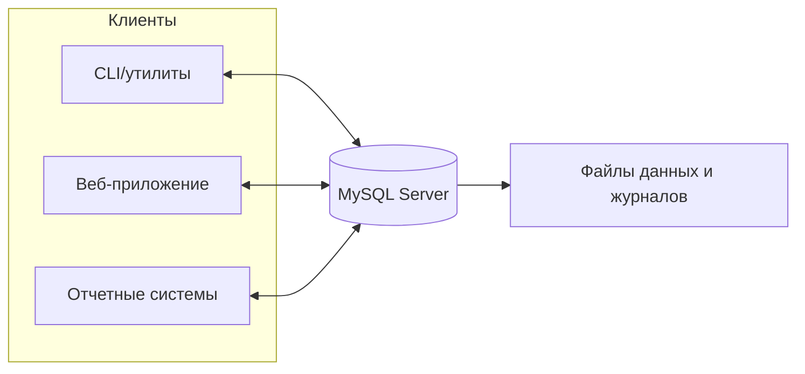
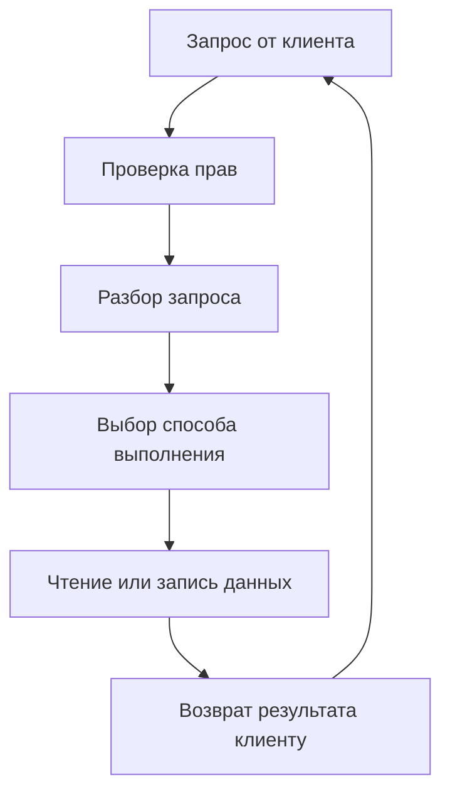

# ИТ.03 - 16 - Введение в MySQL: назначение, редакции, архитектура, особенности, отличие от SQLite

## Введение

Во втором семестре курс переходит от базовых концепций и SQLite к работе с полнофункциональной серверной СУБД. Эта тема дает общее представление о MySQL: что это за система, как она устроена, почему ее выбирают в реальных проектах и чем она отличается от SQLite.

## Что такое MySQL


MySQL — это реляционная СУБД с клиент-серверной архитектурой. В отличие от SQLite, которая работает как встроенная библиотека в одном процессе, MySQL — отдельный сервер, к которому подключаются клиенты. Это обеспечивает многопользовательский доступ, централизованное управление, безопасность и масштабирование.

## Архитектура MySQL

MySQL работает как отдельный серверный процесс. Клиенты подключаются к нему по сети или на том же компьютере, отправляют SQL-запросы и получают результаты. Сервер в ответ управляет доступом, выполняет запросы и отвечает за целостность данных.

Практические эффекты такой архитектуры мы разберем ниже в разделе про возможности и области применения.

Ниже упрощенная схема взаимодействия: несколько клиентов подключаются к серверу, который управляет данными.



## Что делает сервер MySQL

Сервер MySQL — это центр управления базой данных. Он принимает запросы, проверяет права доступа, выбирает способ выполнения, читает или записывает данные и возвращает результат клиенту.

Ниже показана упрощенная цепочка действий сервера:



Именно сервер отвечает за то, чтобы разные пользователи не мешали друг другу, а данные оставались корректными даже при сбоях.

На практике сервер также держит часть информации в памяти, чтобы ускорять работу и меньше обращаться к диску.

## Основные компоненты MySQL

- **Сервер MySQL** — основной процесс, принимающий подключения и выполняющий запросы.
- **SQL-уровень** — обработка запросов SQL (языка запросов к базе), оптимизация и выбор плана выполнения.
- **Хранилище данных** — подсистема, которая хранит таблицы на диске и выполняет операции чтения/записи.
- **Метаданные** — описание структуры базы: схем, таблиц и пользователей.
- **Журналы** — файлы записей о работе сервера и изменениях в базах данных.
- **Клиенты** — консольный клиент и админ-инструменты для работы с сервером.
- **Драйверы** — библиотеки для подключения к MySQL из разных языков программирования.

## Движки хранения

Движок хранения — это «механизм» хранения таблиц внутри MySQL. Разные движки решают разные задачи: где-то важнее надежность и целостность данных, где-то — скорость чтения или компактность.

В одной базе можно использовать разные движки для разных таблиц. Это полезно, когда у таблиц разные требования: например, для критичных данных нужен более надежный механизм, а для вспомогательных или временных — более быстрый или простой. Поэтому важно понимать, что «движок» — это настройка конкретной таблицы, а не всей базы целиком.

- **InnoDB** — базовый движок. Он обеспечивает надежность данных, поддерживает связи между таблицами и корректное восстановление после сбоев. В большинстве задач это правильный выбор.
- **MyISAM** — старый движок без надежного восстановления после сбоев и без связей между таблицами. В современных проектах используется редко.
- **Другие движки** — существуют специализированные варианты вроде Memory (данные в памяти), Archive (сжатое хранение), NDB (для распределенной работы). В учебной практике обычно не нужны, но важно знать, что выбор не ограничивается двумя вариантами.

::: note
InnoDB — это движок, который изначально рассчитан на надежную работу с данными. Он хранит данные небольшими блоками и ведет журнал изменений, поэтому после сбоя может восстановить корректное состояние без потери целостности.

Еще одна важная идея — блокировка на уровне строк. Пока изменяется одна строка, другие строки той же таблицы остаются доступными для чтения и изменений. Это помогает системе не «застывать» при одновременной работе.

Поэтому InnoDB хорошо подходит для реальных проектов: сбои меньше влияют на данные, а одновременная работа пользователей идет стабильнее.
:::

::: tip
В учебных заданиях мы ориентируемся на InnoDB, потому что он соответствует современным требованиям к надежности и целостности данных.
:::

## Возможности MySQL и области применения

MySQL выбирают, когда нужна серверная база данных, которая стабильно работает под нагрузкой и легко обслуживается. Это дает несколько практических преимуществ:

- **Многопользовательская работа**. Пользователи и приложения подключаются одновременно, а доступ регулируется учетными записями и правами.
- **Надежность данных**. Связи между таблицами и контроль целостности помогают избежать «сломанных» данных, а после сбоя система умеет восстановиться.
- **Производительность**. Индексы (структуры для ускорения поиска) и оптимизация запросов позволяют работать быстрее на больших объемах.
- **Масштабируемость**. Данные можно дублировать на других серверах, чтобы система выдерживала больше пользователей и оставалась доступной при сбоях. Такой процесс называется репликацией.
- **Управляемость**. Логи и мониторинг помогают администрировать систему и находить проблемы.
- **Экосистема**. Есть много инструментов, библиотек и готовых решений, что облегчает разработку.

## Безопасность и права доступа

MySQL рассчитана на многопользовательскую работу, поэтому в ней есть мощные механизмы безопасности. Пример простой модели доступа:

- **администратор** — создает пользователей, управляет правами и резервным копированием
- **разработчик** — читает и изменяет данные своих баз данных, без доступа к системным настройкам
- **аналитик** — имеет только чтение нужных таблиц и отчетов

Роль — это набор прав, который назначается пользователю для его задач.

## Логирование и наблюдаемость

Логирование — это процесс фиксации важных событий работы сервера и изменений в базе. Логи помогают понять, что происходило в системе, отследить ошибки и восстановить цепочку действий при сбоях.

Зачем это нужно на практике:

- **поиск ошибок** — когда приложение ведет себя неправильно и нужно найти причину
- **анализ медленных запросов** — чтобы увидеть узкие места и ускорить работу
- **восстановление после сбоев** — чтобы понять, что произошло, и вернуть данные

MySQL ведет несколько типов логов для разных задач:

- **лог ошибок** — хранит сообщения о сбоях и проблемах запуска
- **общий лог запросов** — фиксирует все запросы (обычно используют для диагностики)
- **лог медленных запросов** — помогает выявить тяжёлые запросы
- **журнал изменений** — используется для восстановления и копирования данных между серверами

## История и версии MySQL

MySQL появилась в середине 1990-х годов как компактная и быстрая реляционная СУБД. Проект развивала компания MySQL AB. В 2008 году MySQL AB была куплена Sun Microsystems, а в 2010 году Sun перешла под контроль Oracle. С этого момента Oracle поддерживает MySQL как коммерческий продукт с открытой Community-редакцией.

Основные вехи развития можно представить так:

| Период | Версии | Ключевые особенности |
| --- | --- | --- |
| 1995-2004 | ранние версии (до 5.x) | базовая реляционная функциональность, акцент на скорости, первые возможности для веб-сценариев и базовая репликация |
| 2005-2017 | 5.x | самая массовая и устойчивая ветка: процедуры, триггеры, представления, полноценная репликация, широкое промышленное применение |
| 2018-2023 | 8.0 | современный SQL, усиление безопасности, более строгая работа с метаданными |
| 2024-… | 8.4 LTS | долгосрочная поддержка, стабильность и минимальные изменения поведения |
| 2024-… | 9.x Innovation | быстрые релизы с новыми возможностями и более частыми изменениями |

Номера 6 и 7 официально не выпускались: это были внутренние ветки разработки, поэтому переход сразу к 8.0 — нормальная практика в истории MySQL.

Сейчас MySQL использует две линии релизов:

- **LTS (Long Term Support)** — Долгосрочная поддержка, обеспечивает стабильность и безопасность, а также предсказуемое поведение в реальных бизнес-задачах.
- **Innovation** — частые обновления — предлагает новые возможности и улучшения.

## Редакции и варианты поставки

На практике важно различать не только версии, но и редакции MySQL.

- **MySQL Community Edition** — бесплатная версия с открытым исходным кодом. Этой редакции хватает для учебы и для большинства небольших и средних проектов.
- **MySQL Enterprise Edition** — коммерческая редакция с расширенными инструментами администрирования, мониторинга и поддержки. Стоимость обычно исчисляется тысячами долларов в год на сервер, поэтому ее выбирают крупные компании.
- **MySQL Cluster (NDB)** — вариант для распределенного хранения и высокой доступности.
- **Облачные сервисы** — управляемые экземпляры MySQL у провайдеров, где часть администрирования берет на себя платформа.

Многие проекты годами работают на бесплатной Community-редакции. Переход к Enterprise обычно нужен, когда появляются строгие требования к поддержке, аудитам и специализированным инструментам.

::: info

Для учебных задач мы используем **MySQL Community Edition 8.4 LTS** — это бесплатная редакция с долгосрочной поддержкой, которой достаточно для большинства задач.

:::

## Сравнение MySQL и SQLite

| Характеристика | MySQL | SQLite |
| --- | --- | --- |
| Архитектура | клиент-сервер | встраиваемая БД в виде библиотеки |
| Хранение данных | набор файлов внутри каталога сервера | один файл базы данных |
| Многопользовательский доступ | рассчитан на множество одновременных подключений | одновременная запись ограничена: остальные ждут |
| Типизация | строгая, с широким набором типов | гибкая типизация без жесткой проверки |
| Функциональность | серверные сценарии, автоматические действия, репликация | нет серверных сценариев и репликации |
| Масштабирование | поддержка репликации и распределения нагрузки | ориентирован на локальные приложения |
| Администрирование | учетные записи, роли, права | управление файлами и подключениями |

## Сравнение синтаксиса MySQL и SQLite

Ниже показаны несколько типовых задач и то, как они записываются в MySQL и SQLite. Это помогает быстрее привыкнуть к небольшим различиям синтаксиса.

| Задача | MySQL | SQLite |
| --- | --- | --- |
| Получить текущую дату и время | `NOW()` | `CURRENT_TIMESTAMP` |
| Вывести случайные записи | `ORDER BY RAND()` | `ORDER BY RANDOM()` |
| Ограничить выдачу с пропуском | `LIMIT 20, 10` | `LIMIT 10 OFFSET 20` |

Ниже те же задачи, чтобы быстро сравнить синтаксис.

**Задача:** получить текущую дату и время.

::: code-tabs#example

@tab MySQL

```sql
SELECT NOW();
```

@tab SQLite

```sql
SELECT CURRENT_TIMESTAMP;
```

:::

**Задача:** вывести случайные 3 записи.

::: code-tabs#example

@tab MySQL

```sql
SELECT * FROM items ORDER BY RAND() LIMIT 3;
```

@tab SQLite

```sql
SELECT * FROM items ORDER BY RANDOM() LIMIT 3;
```

:::

**Задача:** ограничить выдачу с пропуском.

::: code-tabs#example

@tab MySQL

```sql
SELECT * FROM items LIMIT 20, 10;
```

@tab SQLite

```sql
SELECT * FROM items LIMIT 10 OFFSET 20;
```

:::

Различия в синтаксисе будут встречаться и дальше, но в большинстве случаев универсальный SQL-код без специфичных функций работает одинаково в разных СУБД. В рамках этого курса мы постараемся, чтобы примеры выполнялись и в MySQL, и в SQLite (кроме тем, где изучаются уникальные возможности конкретной системы).

### Примеры выбора СУБД

- **Локальное приложение**. Если база живет внутри программы и работает на одном компьютере, чаще всего достаточно SQLite — ее легко встроить и не нужно отдельное администрирование.
- **Веб-сервис с несколькими пользователями**. Когда к данным обращаются многие пользователи и сервисы, удобнее MySQL: есть сервер, права доступа и возможность масштабировать нагрузку.
- **Учебная или лабораторная среда**. SQLite проще для быстрого старта, а MySQL полезна, чтобы отработать навыки серверной работы и администрирования.

## Когда выбирать MySQL в реальных задачах

MySQL подходит для серверных приложений, где нужны многопользовательский доступ, контроль прав, устойчивость к нагрузке и возможность масштабирования. SQLite удобна в локальных или встраиваемых проектах, где важна простота развертывания и минимальные требования к инфраструктуре.

## Где MySQL может быть избыточной

MySQL не всегда нужен. Если приложение работает на одном устройстве, не требует совместной работы и должно быть максимально простым в установке, то встроенная SQLite будет удобнее.

Также MySQL редко выбирают для маленьких автономных систем, где нет постоянного сервера и администрирования. В таких сценариях серверная СУБД добавляет сложность без заметной пользы.

Типичные примеры таких случаев:

- локальные приложения для личного учета или учебных проектов
- автономные устройства и терминалы, где важны простота и независимая работа

## Заключение

MySQL — это зрелая серверная СУБД с развитой экосистемой, системой безопасности и возможностями масштабирования. Понимание ее архитектуры, роли движков хранения и релизной модели дает базу для дальнейшей практики и работы с инструментами администрирования.

## Самопроверка

::: quiz source=./includes/quiz-16.yaml
:::

---

## Полезные ссылки

- [MySQL Documentation](https://dev.mysql.com/doc/)
- [MySQL 8.4 Reference Manual](https://dev.mysql.com/doc/refman/8.4/en/)
- [The InnoDB Storage Engine](https://dev.mysql.com/doc/refman/8.4/en/innodb-storage-engine.html)
