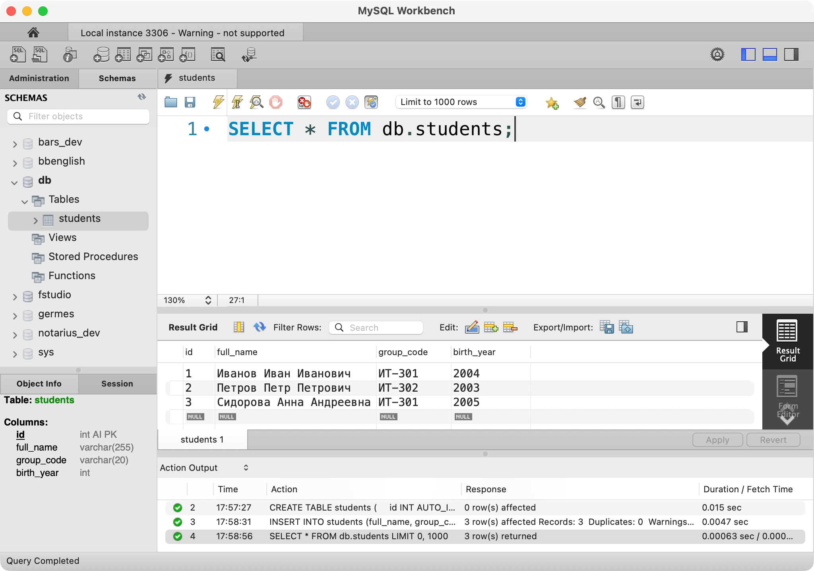

# ИТ.03 - 17 - MySQL Workbench: интерфейс, подключение, базовые типы и создание БД

## Введение

Эта лекция знакомит с MySQL Workbench и базовыми действиями в интерфейсе: как подключаться к серверу, где выполнять запросы и как создавать/удалять базы данных и таблицы. Также мы сразу затронем базовые типы данных `INT` и `VARCHAR` и автоинкремент первичного ключа.

Все примеры выполняются вручную в MySQL Workbench.

## Что такое MySQL Workbench

MySQL Workbench — это графический инструмент для работы с MySQL. Он появился как официальный GUI‑клиент и со временем стал стандартным приложением для администрирования и проектирования баз данных MySQL.

Workbench используют для подключения к серверу, выполнения запросов, просмотра структуры баз, проектирования моделей и управления объектами. По сути это «прокладка» между пользователем и сервером: все действия, выполненные через интерфейс, преобразуются в SQL‑команды и отправляются на сервер, а ответы показываются в виде таблиц и сообщений.

Важно помнить: всё, что можно сделать в Workbench, можно выполнить и через командную строку (CLI). Workbench просто делает эти действия более наглядными и удобными. Чтобы не путаться в терминах, ниже — короткая справка.

::: info
**CLI (Command Line Interface)** — командная строка, например консольный клиент `mysql`.
**GUI (Graphical User Interface)** — графический интерфейс, например MySQL Workbench.
:::

## Кратко об интерфейсе MySQL Workbench

### Главный экран (Home)


На стартовом экране есть три важных раздела:

- **Connections** — список подключений к серверам MySQL.
- **Models** — раздел для работы с моделями БД (в том числе ERD и связанными объектами). В рамках курса мы ещё вернемся к этому аспекту.
- **Migration** — инструменты переноса схемы и данных из других СУБД. Мы не будем использовать этот раздел напрямую, но полезно знать, что он существует.

### Окно SQL Editor


SQL Editor — это рабочее окно, где вы пишете запросы, запускаете их и сразу видите результат. В нем есть четыре основные зоны:

- **Основное меню** (красным) — основные команды и панели инструментов.
- **Navigator** (фиолетовым) — дерево объектов сервера: базы данных (Schemas), таблицы, представления и т.д.
- **SQL Editor** (синим) — область, где пишутся запросы.
- **Results / Output** (зеленым) — результаты выполнения запросов и сообщения об ошибках.



## Подключение к серверу

В учебной аудитории подключение к локальному серверу чаще всего уже настроено. Обычно достаточно открыть готовое соединение на главном экране и перейти в **SQL Editor**.

Добавлять новое соединение нужно в двух случаях: если локального подключения нет или если требуется доступ к внешнему серверу (например, к боевой базе).

Чтобы добавить новое подключение:

1. На экране **Home** нажмите `+` и создайте соединение.
2. Укажите host, порт, пользователя и пароль.
3. Сохраните подключение и откройте его двойным кликом.

Если подключение успешно — появится окно **SQL Editor**.

::: info
Для локального сервера обычно используются `localhost`, порт `3306`, пользователь `root` и пароль либо пустой, либо учебный (например, `12345678`). На реальных серверах для `root` задают сложные пароли, а доступ ограничивают.
:::

### Пользователь root

В MySQL корневой пользователь `root` — это учетная запись с максимальными правами. Её используют для административных задач: создание баз, управление пользователями и настройками сервера.

Важно помнить два правила:

- `root` есть всегда, потому что без него невозможно администрировать сервер.
- обычным пользователям такие права не дают: им назначают только те действия, которые нужны для работы.

На учебных машинах `root` часто используется в примерах, но в реальных проектах обычно создают отдельные учетные записи для разработчиков и приложений, а `root` используют только для обслуживания.

## Кодировки и сравнения (charset и collation)

**Charset** (кодировка) — это доступный набор символов, то есть какие символы вообще можно хранить в тексте.
**Collation** (сравнение, ещё называют сопоставление или коллация) — это правила сравнения и сортировки текста (например, учитывать ли регистр, или как сравнивать буквы разных языков).

В учебных проектах чаще всего используется UTF‑8. В MySQL актуальный вариант этой кодировки — `utf8mb4` (он поддерживает полный набор символов Unicode, включая эмодзи).

Начиная с MySQL 8.0, **utf8mb4** является рекомендуемым набором символов по умолчанию.

При создании базы через интерфейс Workbench эти параметры задаются сразу — это тот же выбор, что и в SQL‑запросе.


::: tip
Чаще всего по умолчанию используется `utf8mb4_general_ci`. В рамках этого курса мы будем считать, что используется именно она. Это означает, что сравнение строк не чувствительно к регистру, а сортировка символов разных алфавитов следует порядку Unicode.
:::

### Пример. Разница в сравнении строк

В зависимости от выбранной коллации, строка `Иван` может считаться равной `иван` (без учета регистра) или отличаться (с учетом регистра).

```sql
SELECT 'Иван' = 'иван';
```

Если collation не чувствителен к регистру (например, `utf8mb4_general_ci`), результат будет `1`.

Если collation чувствителен к регистру (например, `utf8mb4_bin`), результат будет `0`.

Это полезно, когда нужно управлять поиском: например, искать логины без учета регистра или, наоборот, строго различать `Admin` и `admin`.

### Пример. Явная установка кодировки при создании БД

```sql
CREATE DATABASE academy_db
  CHARACTER SET utf8mb4
  COLLATE utf8mb4_general_ci;
```

Впрочем, при создании таблицы не обязательно указывать кодировку и коллацию. Они будут установлены по умолчанию.

## Создание базы данных

Создадим учебную БД `academy_db`:

```sql
CREATE DATABASE academy_db;
```

::: tip
В MySQL базы данных часто называют **схемами**. Команды `CREATE DATABASE` и `CREATE SCHEMA` — синонимы. В интерфейсе Workbench вы будете регулярно видеть слово *schema*, так что эти понятия стоит запомнить.
:::

В отличие от SQLite, где обычно работает только одна база за раз, сервер MySQL может обслуживать сотни баз данных параллельно. Поэтому есть два варианта обращения к таблицам:

- указывать полное имя, например `SELECT * FROM academy_db.students;` (формат: `имя_бд.имя_таблицы`)
- или выполнить `USE academy_db;` и дальше писать запросы без префикса базы, работая в контексте выбранной БД

Здесь и дальше мы будем предпочитать второй вариант.

Поэтому, чтобы начать работу внутри базы, выполняем:

```sql
USE academy_db;
```

Проверить текущую выбранную БД можно командой:

```sql
SELECT DATABASE();
```

## Создание таблицы

Создадим простую таблицу `students`:

- `VARCHAR(255)` означает строку длиной до 255 символов.
- `INT` — это сокращение от `INTEGER`, уже знакомый нам целочисленный тип.

```sql
CREATE TABLE students (
  id INT AUTO_INCREMENT PRIMARY KEY,
  full_name VARCHAR(255) NOT NULL,
  group_code VARCHAR(20) NOT NULL,
  birth_year INT
);
```

::: note
Автоинкрементация — это механизм, который автоматически увеличивает значение первичного ключа при добавлении новой строки. То есть каждой записи присваивается следующий номер без ручного ввода.
:::

::: info
В SQLite первичный ключ часто автоинкрементируется автоматически (если задан как `INTEGER PRIMARY KEY`). В MySQL это нужно указывать явно через `AUTO_INCREMENT`.
:::

Добавим несколько строк:

```sql
INSERT INTO students (full_name, group_code, birth_year)
VALUES
  ('Иванов Иван Иванович', 'ИТ-301', 2004),
  ('Петров Петр Петрович', 'ИТ-302', 2003),
  ('Сидорова Анна Андреевна', 'ИТ-301', 2005);
```

Проверим результат:

```sql
SELECT * FROM students;
```

Теперь добавим таблицу курсов `courses` и таблицу связей `enrollments`:

```sql
CREATE TABLE courses (
  id INT AUTO_INCREMENT PRIMARY KEY,
  title VARCHAR(255) NOT NULL
);
```

Добавим несколько курсов:

```sql
INSERT INTO courses (title)
VALUES
  ('Базы данных'),
  ('Веб-разработка'),
  ('Алгоритмы и структуры данных');
```

```sql
CREATE TABLE enrollments (
  id INT AUTO_INCREMENT PRIMARY KEY,
  student_id INT NOT NULL,
  course_id INT NOT NULL,
  FOREIGN KEY (student_id) REFERENCES students(id),
  FOREIGN KEY (course_id) REFERENCES courses(id)
);
```

Обратите внимание: связи добавляются через `FOREIGN KEY`.

Добавим несколько записей о зачислениях:

```sql
INSERT INTO enrollments (student_id, course_id)
VALUES
  (1, 1),
  (1, 2),
  (2, 1),
  (3, 3);
```

Проверим результат:

```sql
SELECT * FROM courses;
```

и, оставшейся таблицы:

```sql
SELECT * FROM enrollments;
```

## Удаление таблиц и базы данных

Удаление таблицы:

```sql
DROP TABLE enrollments;
```

Удаление базы данных:

```sql
DROP DATABASE academy_db;
```

::: warning
Команды `DROP TABLE` и `DROP DATABASE` удаляют данные без возможности восстановления. Перед выполнением убедитесь, что удаляете нужный объект.
:::

::: note
Все действия можно выполнять как через запросы, так и через графический интерфейс Workbench. При работе через GUI Workbench всё равно отправляет SQL-запросы на сервер — просто делает это «под капотом».
:::

## Самопроверка

::: quiz source=./includes/quiz-17.yaml
:::

## Практические задания

### Задание 1. Создание базы и таблицы

::: tabs

@tab Условие

Создайте базу данных `library_db` и таблицу `books` с полями:

- `id` (INT, автоинкремент, PK)
- `title` (VARCHAR)
- `author` (VARCHAR)
- `year` (INT)

@tab Решение

```sql
CREATE DATABASE library_db;
USE library_db;

CREATE TABLE books (
  id INT AUTO_INCREMENT PRIMARY KEY,
  title VARCHAR(255) NOT NULL,
  author VARCHAR(255) NOT NULL,
  year INT
);
```

:::

### Задание 2. Добавление данных

::: tabs

@tab Условие

Добавьте 3 записи в таблицу `books` и выведите их через `SELECT *`.

@tab Решение

```sql
INSERT INTO books (title, author, year)
VALUES
  ('Мастер и Маргарита', 'М. Булгаков', 1967),
  ('Преступление и наказание', 'Ф. Достоевский', 1866),
  ('Война и мир', 'Л. Толстой', 1869);

SELECT * FROM books;
```

:::

### Задание 3. Удаление объектов

::: tabs

@tab Условие

Удалите таблицу `books`, а затем удалите базу `library_db`.

@tab Решение

```sql
DROP TABLE books;
DROP DATABASE library_db;
```

:::

---

## Полезные ссылки

- [MySQL Workbench Manual](https://dev.mysql.com/doc/workbench/en/)
- [MySQL 8.4 Reference Manual](https://dev.mysql.com/doc/refman/8.4/en/)
- [MySQL: Character Sets and Collations](https://dev.mysql.com/doc/refman/8.4/en/charset.html)
- [MySQL: CREATE DATABASE Syntax](https://dev.mysql.com/doc/refman/8.4/en/create-database.html)
- [MySQL: CREATE TABLE Syntax](https://dev.mysql.com/doc/refman/8.4/en/create-table.html)
