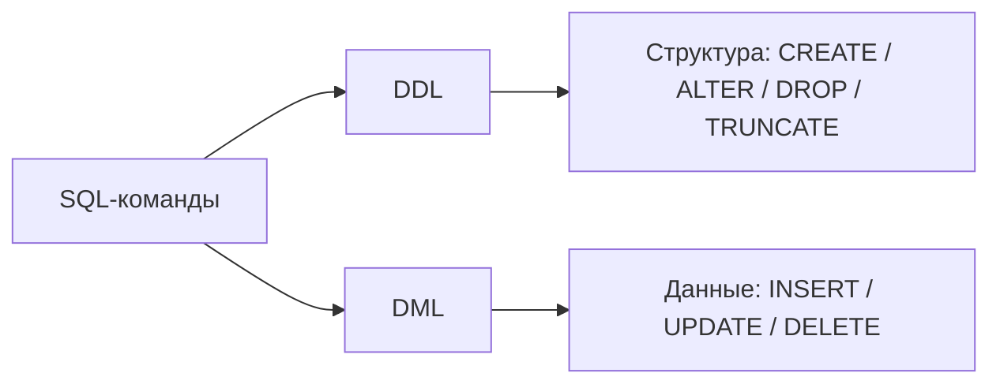

# ИТ.03 - 21 - Запросы в MySQL: DDL и DML

## Введение

На прошлых занятиях мы разобрали ограничения и индексы в MySQL. Теперь соберем базовую рабочую практику: как в MySQL менять структуру таблиц и как безопасно менять сами данные.

В лекциях 08 и 13 эти темы уже были в контексте SQLite. Здесь фокус на MySQL и на отличиях, которые важны в реальной работе.

В этой лекции разберем:

- что относится к `DDL`, а что к `DML`;
- базовые операции `CREATE`, `ALTER`, `DROP`, `TRUNCATE`;
- базовые операции `INSERT`, `UPDATE`, `DELETE`;
- как в MySQL делать upsert через `ON DUPLICATE KEY UPDATE`;
- ключевые отличия от SQLite.

---

## DDL и DML: коротко

- `DDL` (Data Definition Language) - команды, которые меняют структуру объектов БД.
- `DML` (Data Manipulation Language) - команды, которые меняют строки в таблицах.



Тот же SQL может выглядеть похоже, но цель разная: либо меняем схему, либо меняем содержимое.

---

## Что уже знакомо и что новое

Из SQLite-части курса вы уже умеете:

- добавлять и изменять строки (`INSERT`, `UPDATE`, `DELETE`);
- менять структуру таблиц (`ALTER TABLE`);
- работать с базовыми проверками результата через `SELECT`.

Новый акцент MySQL:

- больше возможностей в `ALTER TABLE`;
- режим безопасных обновлений в Workbench (`SQL_SAFE_UPDATES`);
- отдельная команда `TRUNCATE TABLE`;
- upsert через `INSERT ... ON DUPLICATE KEY UPDATE`.

---

## Учебная база для примеров

```sql :collapsed-lines=12
CREATE DATABASE IF NOT EXISTS ddl_dml_demo;
USE ddl_dml_demo;

DROP TABLE IF EXISTS students;

CREATE TABLE students (
  id INT AUTO_INCREMENT PRIMARY KEY,
  email VARCHAR(255) NOT NULL UNIQUE,
  full_name VARCHAR(120) NOT NULL,
  city VARCHAR(80) NOT NULL,
  score TINYINT UNSIGNED NOT NULL DEFAULT 0,
  created_at TIMESTAMP NOT NULL DEFAULT CURRENT_TIMESTAMP
) ENGINE=InnoDB;

INSERT INTO students (email, full_name, city, score)
SELECT
  CONCAT('student', LPAD(n, 3, '0'), '@example.com') AS email,
  CONCAT(
    ELT(1 + ((n - 1) % 10), 'Иванов', 'Петров', 'Сидоров', 'Кузнецов', 'Смирнов', 'Орлов', 'Волков', 'Федоров', 'Попов', 'Лебедев'),
    ' ',
    ELT(1 + ((n - 1) % 10), 'Иван', 'Петр', 'Анна', 'Мария', 'Олег', 'Денис', 'Нина', 'Елена', 'Дмитрий', 'Алексей')
  ) AS full_name,
  ELT(1 + ((n - 1) % 10), 'Москва', 'Казань', 'Томск', 'Пермь', 'Самара', 'Уфа', 'Тула', 'Омск', 'Сочи', 'Тверь') AS city,
  60 + ((n * 7) % 41) AS score
FROM (
  SELECT ones.n + tens.n * 10 + 1 AS n
  FROM (
    SELECT 0 AS n UNION ALL SELECT 1 UNION ALL SELECT 2 UNION ALL SELECT 3 UNION ALL SELECT 4
    UNION ALL SELECT 5 UNION ALL SELECT 6 UNION ALL SELECT 7 UNION ALL SELECT 8 UNION ALL SELECT 9
  ) AS ones
  CROSS JOIN (
    SELECT 0 AS n UNION ALL SELECT 1 UNION ALL SELECT 2
  ) AS tens
) AS seq
WHERE n <= 30;

SELECT * FROM students;
```

---

## DDL в MySQL

### CREATE TABLE

Создание таблицы задает структуру: столбцы, типы, ограничения, значения по умолчанию.

```sql
CREATE TABLE IF NOT EXISTS groups_tbl (
  id INT AUTO_INCREMENT PRIMARY KEY,
  code VARCHAR(20) NOT NULL UNIQUE
) ENGINE=InnoDB;
```

### ALTER TABLE

В MySQL `ALTER TABLE` используется чаще всего для эволюции схемы.

```sql
ALTER TABLE students
ADD COLUMN group_code VARCHAR(20) NULL AFTER full_name;

ALTER TABLE students
MODIFY COLUMN group_code VARCHAR(20) NOT NULL DEFAULT 'ИТ-301';
```

::: info
В SQLite часть таких изменений часто требует пересоздания таблицы. В MySQL 8 типовые операции `ALTER TABLE` обычно выполняются прямее.
:::

### DROP TABLE и TRUNCATE TABLE

```sql
DROP TABLE IF EXISTS tmp_students;

TRUNCATE TABLE students;
```

Разница по смыслу:

- `DROP TABLE` удаляет и данные, и сам объект таблицы;
- `TRUNCATE TABLE` очищает строки, но оставляет структуру таблицы.

::: tip
После `TRUNCATE` в MySQL счетчик `AUTO_INCREMENT` обычно сбрасывается.
:::

---

## DML в MySQL

### INSERT

```sql
INSERT INTO students (email, full_name, city, score)
VALUES ('student004@example.com', 'Смирнов Олег', 'Пермь', 81);
```

Вставка нескольких строк:

```sql
INSERT INTO students (email, full_name, city, score)
VALUES
  ('student005@example.com', 'Орлова Мария', 'Самара', 88),
  ('student006@example.com', 'Кузнецов Денис', 'Уфа', 74);
```

### Upsert в MySQL

Если по `UNIQUE`/`PRIMARY KEY` возникает конфликт, можно обновить существующую строку:

```sql
INSERT INTO students (email, full_name, city, score)
VALUES ('student002@example.com', 'Петров Петр', 'Сочи', 90)
ON DUPLICATE KEY UPDATE
  city = 'Сочи',
  score = 90;
```

### UPDATE

```sql
UPDATE students
SET score = score + 5
WHERE id = 1;
```

::: warning
`UPDATE` без `WHERE` изменит все строки. В Workbench часто включен safe update mode, который блокирует небезопасные запросы.
:::

### DELETE

```sql
DELETE FROM students
WHERE id = 6;
```

Для аккуратного пакетного удаления иногда используют `LIMIT`:

```sql
DELETE FROM students
WHERE score < 60
LIMIT 10;
```

### INSERT ... SELECT

В MySQL часто встречается перенос данных из одной таблицы в другую без выгрузки в приложение.

```sql
CREATE TABLE IF NOT EXISTS students_archive LIKE students;

INSERT INTO students_archive (email, full_name, city, score, created_at)
SELECT email, full_name, city, score, created_at
FROM students
WHERE score >= 90;
```

Этот шаблон полезен для архивации, подготовки витрин и миграций данных.

### UPDATE ... JOIN

В MySQL можно обновлять таблицу через соединение с другой таблицей.

```sql
CREATE TABLE IF NOT EXISTS score_updates (
  email VARCHAR(255) PRIMARY KEY,
  new_score TINYINT UNSIGNED NOT NULL
);

INSERT INTO score_updates (email, new_score)
VALUES
  ('student001@example.com', 83),
  ('student002@example.com', 91);

UPDATE students s
JOIN score_updates u ON u.email = s.email
SET s.score = u.new_score;
```

Такой подход удобен, когда обновления приходят пакетами (из CSV, staging-таблиц, внешних систем).

### Режим безопасных изменений в Workbench

`SQL_SAFE_UPDATES` - это защитный режим для `UPDATE` и `DELETE`.

Зачем он нужен:

- защищает от случайного массового изменения данных;
- помогает поймать ошибку в запросе до того, как вы испортите всю таблицу.

Если режим включен, Workbench обычно блокирует небезопасные запросы (например, без `WHERE` или без достаточного ограничения по ключу).

Проверить текущий режим:

```sql
SELECT @@SQL_SAFE_UPDATES;
```

Пример небезопасного запроса (типичный блокируется в safe mode):

```sql
UPDATE students
SET score = score + 10;
```

Безопасный вариант:

```sql
UPDATE students
SET score = score + 10
WHERE id = 1;
```

Или пакетно, но всё равно с явным ограничением:

```sql
UPDATE students
SET score = score + 3
WHERE score < 80;
```

Изменить режим только для текущей сессии (если это действительно нужно):

```sql
SET SQL_SAFE_UPDATES = 0; -- временно выключить
SET SQL_SAFE_UPDATES = 1; -- вернуть обратно
```

::: warning
Отключать safe mode стоит только осознанно и на короткое время, когда вы заранее проверили тот же фильтр через `SELECT` и понимаете, сколько строк затронет запрос.
:::

---

## Отличия от SQLite в этой теме

| Вопрос | MySQL | SQLite |
| --- | --- | --- |
| Upsert | `INSERT ... ON DUPLICATE KEY UPDATE` | `INSERT ... ON CONFLICT ... DO UPDATE` / `INSERT OR IGNORE` |
| Безопасные `UPDATE/DELETE` в GUI | В Workbench часто включен safe mode | Обычно такого режима нет |
| `TRUNCATE TABLE` | Есть отдельная команда | Нет отдельной команды `TRUNCATE` |
| Изменение структуры | `ALTER TABLE` богаче для типовых операций | Часть операций ограничена или требует обходных шагов |

Практический вывод:

- синтаксис DDL/DML в целом похож, но детали поведения отличаются;
- после переноса запросов между SQLite и MySQL проверяйте результат на тестовых данных.

---

## Мини-кейс: безопасная пакетная загрузка оценок

Типовой рабочий сценарий:

1. Загружаем изменения в staging-таблицу (`score_updates`).
2. Проверяем, какие записи реально совпали по ключу (`email`).
3. Выполняем `UPDATE ... JOIN`.
4. Делаем контрольный `SELECT`.

```sql
SELECT s.email, s.score AS old_score, u.new_score
FROM students s
JOIN score_updates u ON u.email = s.email;
```

```sql
UPDATE students s
JOIN score_updates u ON u.email = s.email
SET s.score = u.new_score;
```

```sql
SELECT email, score
FROM students
ORDER BY id;
```

Этот шаблон лучше, чем ручные `UPDATE` по одной строке: меньше ошибок, проще повторять и проверять.

---

## Частые ошибки

- Выполнять `UPDATE`/`DELETE` без точного `WHERE`.
- Проверять только отсутствие ошибки и не делать контрольный `SELECT`.
- Путать `DROP TABLE` и `TRUNCATE TABLE`.
- Пытаться использовать SQLite-синтаксис upsert в MySQL без адаптации.

---

## Практические рекомендации

- Перед массовым изменением данных сначала прогоняйте `SELECT` с тем же `WHERE`.
- Для upsert заранее задавайте `UNIQUE`/`PRIMARY KEY`, иначе конфликт не отловится.
- DDL-изменения делайте по шагам: изменение -> проверка `SHOW CREATE TABLE` -> следующий шаг.
- Для учебных и рабочих сценариев всегда отделяйте миграции структуры (DDL) от изменений данных (DML).

---

## Самопроверка

::: quiz source=./includes/quiz-21.yaml
:::

## Практические задания

::: note
Каждое задание выполняйте как отдельный мини-сценарий на актуальной схеме таблицы.
:::

### Задание 1. DDL: изменение структуры

::: tabs

@tab Условие

В базе `ddl_dml_demo`:

1. Добавьте в `students` столбец `phone` (`VARCHAR(20)`, `NULL`).
2. Измените тип `city` на `VARCHAR(120)`.
3. Покажите итоговую структуру таблицы.

@tab Решение

```sql
ALTER TABLE students
ADD COLUMN phone VARCHAR(20) NULL;

ALTER TABLE students
MODIFY COLUMN city VARCHAR(120) NOT NULL;

SHOW CREATE TABLE students;
```

:::

### Задание 2. DML: upsert

::: tabs

@tab Условие

Сделайте upsert по студенту с `email = 'student003@example.com'`: обновите город на `Тверь` и итоговый балл на `95`.

@tab Решение

```sql
INSERT INTO students (email, full_name, city, score)
VALUES ('student003@example.com', 'Сидорова Анна', 'Тверь', 95)
ON DUPLICATE KEY UPDATE
  city = 'Тверь',
  score = 95;

SELECT * FROM students WHERE email = 'student003@example.com';
```

:::

### Задание 3. Безопасное изменение данных

::: tabs

@tab Условие

1. Выведите студентов с `score < 80`.
2. Поднимите им балл на `3`.
3. Удалите только одного студента с `score < 70`.

@tab Решение

```sql
SELECT *
FROM students
WHERE score < 80;

UPDATE students
SET score = score + 3
WHERE score < 80;

DELETE FROM students
WHERE score < 70
LIMIT 1;

SELECT * FROM students;
```

:::

### Задание 4. INSERT ... SELECT (архивация отличников)

::: tabs

@tab Условие

1. Создайте таблицу `students_archive` по структуре `students`.
2. Перенесите в неё студентов с `score >= 90`.
3. Проверьте содержимое архива.

@tab Решение

```sql
CREATE TABLE IF NOT EXISTS students_archive LIKE students;

INSERT INTO students_archive (email, full_name, city, score, created_at)
SELECT email, full_name, city, score, created_at
FROM students
WHERE score >= 90;

SELECT * FROM students_archive;
```

:::

### Задание 5. Пакетное обновление через JOIN

::: tabs

@tab Условие

1. Создайте таблицу `score_updates` (`email`, `new_score`).
2. Добавьте туда минимум 2 записи.
3. Обновите `students.score` через `UPDATE ... JOIN`.
4. Проверьте результат.

@tab Решение

```sql
CREATE TABLE IF NOT EXISTS score_updates (
  email VARCHAR(255) PRIMARY KEY,
  new_score TINYINT UNSIGNED NOT NULL
);

INSERT INTO score_updates (email, new_score)
VALUES
  ('student001@example.com', 80),
  ('student003@example.com', 97);

UPDATE students s
JOIN score_updates u ON u.email = s.email
SET s.score = u.new_score;

SELECT email, score
FROM students
ORDER BY id;
```

:::

## Полезные ссылки

- [MySQL 8.4 Reference Manual - SQL Statements](https://dev.mysql.com/doc/refman/8.4/en/sql-statements.html)
- [MySQL 8.4 Reference Manual - ALTER TABLE Statement](https://dev.mysql.com/doc/refman/8.4/en/alter-table.html)
- [MySQL 8.4 Reference Manual - INSERT ... ON DUPLICATE KEY UPDATE](https://dev.mysql.com/doc/refman/8.4/en/insert-on-duplicate.html)
- [MySQL 8.4 Reference Manual - UPDATE Statement](https://dev.mysql.com/doc/refman/8.4/en/update.html)
- [MySQL 8.4 Reference Manual - TRUNCATE TABLE Statement](https://dev.mysql.com/doc/refman/8.4/en/truncate-table.html)
