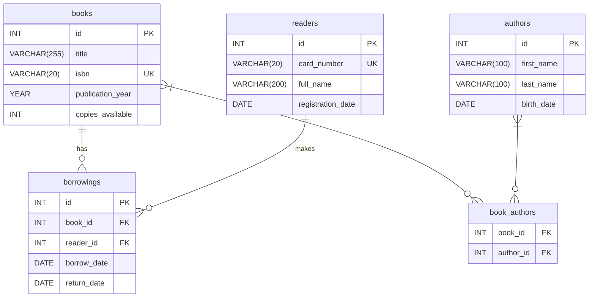

# ИТ.03 - 24 - Проектирование схем БД в MySQL Workbench (ERD).

## Введение
Проектирование базы данных — важный этап разработки программного обеспечения, который определяет структуру данных, их взаимосвязи и целостность. Визуальное представление схемы в виде диаграммы «сущность‑связь» (ERD) помогает разработчикам и аналитикам лучше понимать предметную область и избегать ошибок на ранних стадиях.

MySQL Workbench — официальная среда для работы с MySQL, предоставляющая мощный инструмент для создания, редактирования и реверс‑инжиниринга ER‑диаграмм. С его помощью можно не только нарисовать схему, но и автоматически сгенерировать SQL‑скрипт для создания таблиц, а также синхронизировать изменения с существующей базой данных.

**В этой лекции**:
- что такое ER‑диаграмма и зачем она нужна;
- основные элементы ERD: сущности, атрибуты, связи;
- интерфейс MySQL Workbench для работы с диаграммами;
- пошаговое создание схемы БД «Библиотека»;
- генерация SQL‑кода из ERD;
- практические советы по проектированию.


## Что такое ER‑диаграмма (ERD)?
ERD (Entity‑Relationship Diagram) — графическая модель, которая описывает сущности предметной области, их атрибуты и связи между ними. Такую диаграмму используют на этапе концептуального проектирования базы данных, чтобы согласовать требования заказчика с разработчиками и убедиться, что все необходимые данные учтены.

Основные цели ERD:
- **Визуализация** — наглядное представление структуры данных.
- **Документирование** — создание формального описания схемы БД.
- **Обнаружение проблем** — выявление избыточности, противоречий, отсутствующих связей до написания кода.
- **Коммуникация** — общее понимание между аналитиками, разработчиками и заказчиком.

## Основные элементы ERD
### Сущность (Entity)
Сущность — это объект реального мира, информация о котором хранится в базе данных. На диаграмме изображается прямоугольником. Примеры: «Книга», «Читатель», «Автор».

### Атрибут (Attribute)
Атрибут — характеристика сущности. Изображается внутри прямоугольника сущности или рядом с ним. Атрибуты могут быть:
- **Простыми** (неделимыми) — например, `id`, `title`.
- **Составными** — состоят из нескольких частей (адрес: улица, дом, город).
- **Производными** — вычисляются на основе других атрибутов (возраст по дате рождения).
- **Ключевыми** — уникально идентифицируют экземпляр сущности (первичный ключ).

### Связь (Relationship)
Связь — ассоциация между двумя или более сущностями. Изображается ромбом или линией с указанием мощности (кардинальности). Основные типы связей:
- **Один‑к‑одному (1:1)** — каждому экземпляру сущности A соответствует не более одного экземпляра сущности B и наоборот.
- **Один‑ко‑многим (1:N)** — экземпляру сущности A может соответствовать несколько экземпляров сущности B, но каждому B — только один A.
- **Многие‑ко‑многим (M:N)** — экземпляры сущностей A и B могут быть связаны с несколькими экземплярами другой сущности. Такая связь на физическом уровне реализуется через промежуточную таблицу.

## Интерфейс MySQL Workbench для работы с ERD
MySQL Workbench предоставляет модуль **Modeling** (Моделирование), в котором можно создавать и редактировать ER‑диаграммы.

::: tabs

@tab Панель инструментов
- **Add Diagram** — создать новую диаграмму.
- **Place a New Table** — добавить таблицу (сущность).
- **Place a New View** — добавить представление.
- **Place a New Routine** — добавить хранимую процедуру.
- **Place a New Relationship** — установить связь между таблицами.

@tab Область диаграммы
Центральная область, где рисуются таблицы и связи. Можно перемещать объекты, изменять их размер, настраивать свойства через контекстное меню.

@tab Панель свойств
Правая панель, где задаются детали выбранного объекта: имя таблицы, столбцы, типы данных, индексы, внешние ключи.

:::

## Пошаговое создание схемы БД «Библиотека»
Рассмотрим практический пример — проектирование базы данных для библиотеки. Требования:
- Хранить информацию о книгах, авторах, читателях и выданных экземплярах.
- Одна книга может иметь несколько авторов, автор может написать несколько книг (связь M:N).
- Читатель может брать несколько книг, каждая книга может быть выдана разным читателям в разное время (связь M:N через таблицу выдачи).

### Шаг 1. Добавление сущностей (таблиц)
Создадим четыре таблицы:
1. **books** — книги.
2. **authors** — авторы.
3. **readers** — читатели.
4. **borrowings** — записи о выдаче книг.

### Шаг 2. Определение атрибутов (столбцов)
Для каждой таблицы зададим столбцы с типами данных и ограничениями.

::: tabs

@tab books
| Столбец | Тип | Описание |
|---------|-----|----------|
| `id` | INT PRIMARY KEY AUTO_INCREMENT | Уникальный идентификатор |
| `title` | VARCHAR(255) NOT NULL | Название книги |
| `isbn` | VARCHAR(20) UNIQUE | ISBN |
| `publication_year` | YEAR | Год издания |
| `copies_available` | INT DEFAULT 1 | Количество доступных экземпляров |

@tab authors
| Столбец | Тип | Описание |
|---------|-----|----------|
| `id` | INT PRIMARY KEY AUTO_INCREMENT | Идентификатор автора |
| `first_name` | VARCHAR(100) NOT NULL | Имя |
| `last_name` | VARCHAR(100) NOT NULL | Фамилия |
| `birth_date` | DATE | Дата рождения |

@tab readers
| Столбец | Тип | Описание |
|---------|-----|----------|
| `id` | INT PRIMARY KEY AUTO_INCREMENT | Идентификатор читателя |
| `card_number` | VARCHAR(20) UNIQUE NOT NULL | Номер читательского билета |
| `full_name` | VARCHAR(200) NOT NULL | Полное имя |
| `registration_date` | DATE DEFAULT (CURDATE()) | Дата регистрации |

@tab borrowings
| Столбец | Тип | Описание |
|---------|-----|----------|
| `id` | INT PRIMARY KEY AUTO_INCREMENT | Идентификатор выдачи |
| `book_id` | INT NOT NULL | Ссылка на книгу |
| `reader_id` | INT NOT NULL | Ссылка на читателя |
| `borrow_date` | DATE NOT NULL | Дата выдачи |
| `return_date` | DATE | Дата возврата (NULL, если книга ещё не возвращена) |

:::

### Шаг 3. Установка связей
1. **books ↔ authors** — связь «многие‑ко‑многим». Создадим промежуточную таблицу `book_authors` с внешними ключами `book_id` и `author_id`.
2. **books ↔ borrowings** — одна книга может фигурировать в нескольких записях выдачи (1:N). В `borrowings` добавляем внешний ключ `book_id`, ссылающийся на `books.id`.
3. **readers ↔ borrowings** — один читатель может иметь несколько выдач (1:N). В `borrowings` добавляем внешний ключ `reader_id`, ссылающийся на `readers.id`.

### Шаг 4. Настройка внешних ключей
В MySQL Workbench для каждой связи можно задать правила обновления и удаления (CASCADE, SET NULL, RESTRICT). Например, при удалении книги можно автоматически удалить все связанные записи в `book_authors` и установить `book_id` в `borrowings` в NULL, если это допустимо.

## Генерация SQL‑кода из ERD
### Визуализация схемы (Mermaid)
Ниже представлена ER‑диаграмма спроектированной базы данных «Библиотека» в нотации Crow’s Foot, которую можно нарисовать в MySQL Workbench.



После того как диаграмма готова, можно экспортировать её в SQL‑скрипт, который создаст все таблицы со всеми ограничениями.

1. В меню выбираем **File → Export → Forward Engineer SQL CREATE Script**.
2. Указываем путь сохранения файла.
3. Настраиваем параметры (кодировку, добавление DROP TABLE и т.д.).
4. Получаем готовый SQL‑файл, который можно выполнить в MySQL Server.

Пример сгенерированного кода для таблицы `books`:

```sql
CREATE TABLE `books` (
  `id` int NOT NULL AUTO_INCREMENT,
  `title` varchar(255) NOT NULL,
  `isbn` varchar(20) DEFAULT NULL,
  `publication_year` year DEFAULT NULL,
  `copies_available` int DEFAULT '1',
  PRIMARY KEY (`id`),
  UNIQUE KEY `isbn` (`isbn`)
) ENGINE=InnoDB DEFAULT CHARSET=utf8mb4 COLLATE=utf8mb4_0900_ai_ci;
```

::: quiz source=./includes/quiz-24.yaml
:::

### Задание 1.

::: tabs

@tab Условие
Спроектируйте ER‑диаграмму для базы данных «Интернет‑магазин электроники». Требования:
- Товары принадлежат категориям (один товар — одна категория, одна категория — много товаров).
- Заказы содержат несколько товаров (связь многие‑ко‑многим через таблицу `order_items`).
- У каждого заказа есть один клиент, у клиента может быть много заказов.
- У товара есть цена, название, артикул (уникальный).
- У клиента есть email, телефон, имя.

Нарисуйте схему в MySQL Workbench или на листе бумаги, определите таблицы, столбцы, типы данных, первичные и внешние ключи.

@tab Решение (пример)
```sql
CREATE TABLE categories (
    id INT PRIMARY KEY AUTO_INCREMENT,
    name VARCHAR(100) NOT NULL
);

CREATE TABLE products (
    id INT PRIMARY KEY AUTO_INCREMENT,
    sku VARCHAR(50) UNIQUE NOT NULL,
    name VARCHAR(200) NOT NULL,
    price DECIMAL(10,2) NOT NULL,
    category_id INT,
    FOREIGN KEY (category_id) REFERENCES categories(id) ON DELETE SET NULL
);

CREATE TABLE customers (
    id INT PRIMARY KEY AUTO_INCREMENT,
    email VARCHAR(255) UNIQUE NOT NULL,
    phone VARCHAR(20),
    full_name VARCHAR(150) NOT NULL
);

CREATE TABLE orders (
    id INT PRIMARY KEY AUTO_INCREMENT,
    customer_id INT NOT NULL,
    order_date DATETIME DEFAULT CURRENT_TIMESTAMP,
    total_amount DECIMAL(10,2),
    FOREIGN KEY (customer_id) REFERENCES customers(id) ON DELETE CASCADE
);

CREATE TABLE order_items (
    order_id INT NOT NULL,
    product_id INT NOT NULL,
    quantity INT NOT NULL DEFAULT 1,
    unit_price DECIMAL(10,2) NOT NULL,
    PRIMARY KEY (order_id, product_id),
    FOREIGN KEY (order_id) REFERENCES orders(id) ON DELETE CASCADE,
    FOREIGN KEY (product_id) REFERENCES products(id) ON DELETE RESTRICT
);
```

:::

## Практические советы по проектированию
1. **Начинайте с концептуальной модели** — рисуйте ERD на бумаге или в простом редакторе, обсуждайте с заказчиком, прежде чем переносить в MySQL Workbench.
2. **Используйте осмысленные имена** — таблицы и столбцы должны иметь понятные названия на английском или транслите.
3. **Следите за нормализацией** — избегайте избыточности данных, разделяйте информацию на логические сущности.
4. **Не забывайте об индексах** — для часто используемых в WHERE и JOIN столбцов создавайте индексы, но не переусердствуйте — каждый индекс замедляет вставку и обновление.
5. **Документируйте диаграмму** — добавляйте комментарии к таблицам и столбцам прямо в MySQL Workbench (поле **Comment**).
6. **Проверяйте целостность** — тестируйте связи на реальных данных, убедитесь, что внешние ключи работают как ожидается.
