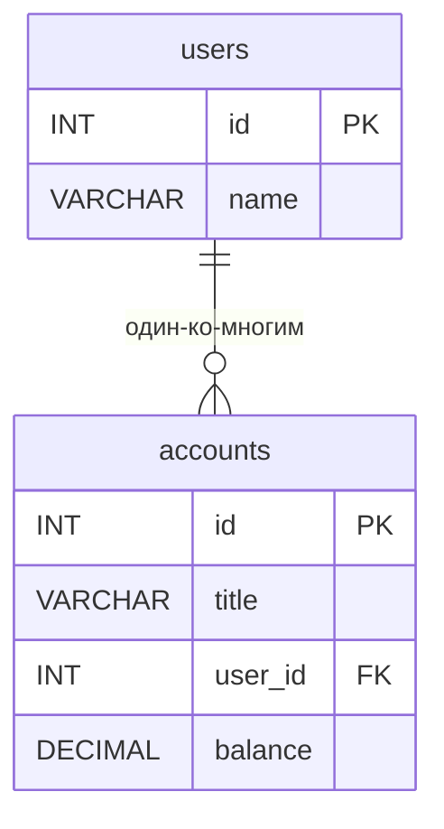

# ИТ.03 - 28 - Переменные в MySQL

## Введение

В предыдущих лекциях мы изучали основы SQL, работу с таблицами, запросами SELECT, JOIN, а также транзакции. Вы уже умеете выполнять сложные запросы к базе данных, но часто возникает необходимость сохранить промежуточный результат, передать значение между операциями или динамически формировать условия запроса. Для этих целей в MySQL существуют **переменные**.

Переменные в MySQL — это именованные объекты, которые хранят значения определённого типа данных и могут использоваться в SQL-запросах, хранимых процедурах, функциях и триггерах. Они позволяют:
- Временно сохранять результаты вычислений или выборок.
- Упрощать сложные запросы, разбивая их на логические части.
- Реализовывать бизнес-логику внутри хранимых процедур.
- Динамически настраивать поведение сервера через системные переменные.

В этой лекции мы рассмотрим три основных типа переменных в MySQL:
1. **Пользовательские переменные** (с префиксом `@`) — сессионные переменные, доступные в рамках одного соединения.
2. **Локальные переменные** (объявляемые через `DECLARE`) — переменные внутри хранимых процедур, функций и триггеров.
3. **Системные переменные** (с префиксом `@@`) — глобальные и сессионные настройки сервера MySQL.

Мы изучим синтаксис объявления, присваивания и использования переменных, а также рассмотрим практические примеры их применения.

Примеры данной темы используют учебную БД:

::: tabs

@tab Структура БД



@tab Дамп

```sql
-- Создание таблицы departments
CREATE TABLE departments (
    id INT PRIMARY KEY AUTO_INCREMENT,
    name VARCHAR(100) NOT NULL
);

-- Создание таблицы employees
CREATE TABLE employees (
    id INT PRIMARY KEY AUTO_INCREMENT,
    name VARCHAR(100) NOT NULL,
    salary DECIMAL(10,2) DEFAULT 0.00,
    department_id INT,
    FOREIGN KEY (department_id) REFERENCES departments(id)
);

-- Вставка тестовых данных
INSERT INTO departments (name) VALUES
('IT'),
('Sales'),
('HR'),
('Finance');

INSERT INTO employees (name, salary, department_id) VALUES
('Иван Петров', 75000.00, 1),
('Мария Сидорова', 82000.50, 1),
('Алексей Иванов', 45000.00, 2),
('Ольга Кузнецова', 67000.00, 3),
('Дмитрий Смирнов', 92000.00, 4),
('Екатерина Волкова', 53000.00, 2);
```

@tab Таблицы

  ::: tabs

  @tab **departments**

  | id | name    |
  |----|---------|
  | 1  | IT      |
  | 2  | Sales   |
  | 3  | HR      |
  | 4  | Finance |

  @tab **employees**

  | id | name              | salary   | department_id |
  |----|-------------------|----------|---------------|
  | 1  | Иван Петров       | 75000.00 | 1             |
  | 2  | Мария Сидорова    | 82000.50 | 1             |
  | 3  | Алексей Иванов    | 45000.00 | 2             |
  | 4  | Ольга Кузнецова   | 67000.00 | 3             |
  | 5  | Дмитрий Смирнов   | 92000.00 | 4             |
  | 6  | Екатерина Волкова | 53000.00 | 2             |

  :::

:::

---

## Пользовательские переменные (`@var`)

Пользовательские переменные — это переменные, которые создаются и используются в рамках текущего сеанса (соединения) с сервером MySQL. Они обозначаются префиксом `@` перед именем.

### Создание и присваивание

Пользовательскую переменную можно создать и присвоить ей значение с помощью оператора `SET` или прямо в запросе `SELECT`:

```sql
-- Способ 1: оператор SET
SET @user_name = 'Иван Петров';
SET @max_salary = 100000;
SET @start_date = '2024-01-01';

-- Способ 2: присваивание в SELECT
SELECT @total := COUNT(*) FROM employees;
SELECT @avg_salary := AVG(salary) FROM employees WHERE department_id = 5;
```

::: warning
При использовании `SELECT ... INTO` для присваивания переменной необходимо использовать оператор `:=`, а не `=`. Оператор `=` в контексте `SELECT` работает как сравнение, а не присваивание.
:::

### Использование в запросах

После присваивания переменную можно использовать в любых последующих запросах в той же сессии:

```sql
-- Сохраняем значение
SET @dept_id = 3;

-- Используем в WHERE
SELECT * FROM employees WHERE department_id = @dept_id;

-- Используем в вычислениях
SET @bonus_rate = 0.15;
SELECT id, name, salary, salary * @bonus_rate AS bonus FROM employees;
```

### Особенности пользовательских переменных

1. **Типизация динамическая** — тип переменной определяется присвоенным значением.
2. **Область видимости — сессия** — переменная доступна до закрытия соединения.
3. **Имена регистронезависимы** — `@var` и `@VAR` ссылаются на одну переменную.
4. **Могут хранить NULL** — если не присвоено значение, переменная равна `NULL`.

Пример сессии с несколькими переменными:

```sql
-- Устанавливаем переменные
SET @min_salary = 30000;
SET @max_salary = 90000;

-- Используем в сложном запросе
SELECT 
    department_id,
    COUNT(*) AS emp_count,
    AVG(salary) AS avg_salary
FROM employees
WHERE salary BETWEEN @min_salary AND @max_salary
GROUP BY department_id
HAVING avg_salary > @min_salary;
```

---

## Локальные переменные в хранимых процедурах

Локальные переменные объявляются внутри хранимых процедур, функций или триггеров с помощью ключевого слова `DECLARE`. Они имеют строгую типизацию и существуют только в рамках выполнения данного блока кода.

### Объявление локальных переменных

Синтаксис:
```sql
DECLARE variable_name data_type [DEFAULT default_value];
```

Примеры:
```sql
DECLARE employee_count INT;
DECLARE total_salary DECIMAL(10,2) DEFAULT 0.0;
DECLARE user_name VARCHAR(100);
DECLARE is_active BOOLEAN DEFAULT TRUE;
```

::: warning
Локальные переменные должны быть объявлены в начале блока `BEGIN ... END`, до любых исполняемых операторов. Порядок: сначала `DECLARE`, затем `SET` или другие операции.
:::

### Присваивание значений

Для присваивания значений локальным переменным используется оператор `SET` или `SELECT ... INTO`:

```sql
-- Через SET
SET employee_count = 10;
SET total_salary = total_salary + 5000.50;

-- Через SELECT INTO
SELECT COUNT(*) INTO employee_count FROM employees;
SELECT AVG(salary) INTO total_salary FROM employees WHERE department_id = 3;
```

### Пример хранимой процедуры с локальными переменными

```sql
DELIMITER $$

CREATE PROCEDURE CalculateDepartmentStats(
    IN dept_id INT,
    OUT avg_salary DECIMAL(10,2),
    OUT max_salary DECIMAL(10,2)
)
BEGIN
    DECLARE emp_count INT;
    DECLARE total DECIMAL(10,2);
    
    -- Получаем количество сотрудников
    SELECT COUNT(*) INTO emp_count 
    FROM employees 
    WHERE department_id = dept_id;
    
    -- Вычисляем общую зарплату
    SELECT SUM(salary) INTO total 
    FROM employees 
    WHERE department_id = dept_id;
    
    -- Рассчитываем среднюю зарплату
    IF emp_count > 0 THEN
        SET avg_salary = total / emp_count;
    ELSE
        SET avg_salary = 0;
    END IF;
    
    -- Находим максимальную зарплату
    SELECT MAX(salary) INTO max_salary 
    FROM employees 
    WHERE department_id = dept_id;
    
    -- Выводим результаты (опционально)
    SELECT emp_count AS 'Количество сотрудников',
           avg_salary AS 'Средняя зарплата',
           max_salary AS 'Максимальная зарплата';
END $$

DELIMITER ;
```

### Область видимости локальных переменных

Локальные переменные видны только внутри того блока `BEGIN ... END`, где они объявлены. Если переменная объявлена внутри вложенного блока (например, внутри `IF` или `LOOP`), она не будет доступна во внешнем блоке.

```sql
BEGIN
    DECLARE x INT DEFAULT 5;  -- Видна во всём внешнем блоке
    
    IF x > 0 THEN
        DECLARE y INT DEFAULT 10;  -- Видна только внутри IF
        SET x = x + y;
    END IF;
    
    -- SELECT y;  -- ОШИБКА: y здесь не определена
END;
```

---

## Системные переменные (`@@`)

Системные переменные хранят настройки сервера MySQL. Они делятся на:
- **Глобальные** (`@@GLOBAL.var_name`) — влияют на работу всего сервера.
- **Сессионные** (`@@SESSION.var_name` или просто `@@var_name`) — действуют в рамках текущего соединения.

### Просмотр системных переменных

```sql
-- Показать все переменные (очень длинный список)
SHOW VARIABLES;

-- Поиск по шаблону
SHOW VARIABLES LIKE 'max_connections';
SHOW VARIABLES LIKE 'timeout%';

-- Получить конкретную переменную
SELECT @@max_connections;
SELECT @@GLOBAL.max_connections;
SELECT @@SESSION.sql_mode;
```

### Изменение системных переменных

Некоторые переменные можно изменять динамически (без перезагрузки сервера), другие требуют перезапуска.

```sql
-- Изменить сессионную переменную
SET SESSION sql_mode = 'STRICT_TRANS_TABLES,NO_ENGINE_SUBSTITUTION';
SET @@SESSION.wait_timeout = 600;

-- Изменить глобальную переменную (требует привилегий SUPER)
SET GLOBAL max_connections = 200;
SET @@GLOBAL.long_query_time = 2;
```

::: warning
Изменение глобальных переменных влияет на все новые сессии, но не на уже существующие. Для постоянного изменения нужно также обновить конфигурационный файл `my.cnf` или `my.ini`.
:::

### Примеры полезных системных переменных

| Переменная | Описание | По умолчанию |
|------------|----------|--------------|
| `@@autocommit` | Автоматическое подтверждение транзакций | 1 (включено) |
| `@@time_zone` | Часовой пояс сервера | SYSTEM |
| `@@character_set_client` | Кодировка клиента | utf8mb4 |
| `@@foreign_key_checks` | Проверка внешних ключей | 1 (включено) |
| `@@sql_mode` | Режим SQL (строгость проверок) | зависит от версии |

```sql
-- Временное отключение проверки внешних ключей (например, для импорта данных)
SET FOREIGN_KEY_CHECKS = 0;
-- ... операции с данными ...
SET FOREIGN_KEY_CHECKS = 1;
```

---

## Сравнение типов переменных

| Характеристика | Пользовательские (`@var`) | Локальные (`DECLARE`) | Системные (`@@var`) |
|----------------|---------------------------|-----------------------|---------------------|
| **Префикс** | `@` | нет | `@@` |
| **Область видимости** | Сессия | Блок `BEGIN ... END` | Глобальная или сессия |
| **Типизация** | Динамическая | Строгая (объявляется) | Определена сервером |
| **Время жизни** | До закрытия соединения | До конца блока | Постоянно |
| **Где используется** | Любые запросы сессии | Хранимые процедуры, функции, триггеры | Настройки сервера |
| **Инициализация** | `SET @var = value` или `SELECT @var := value` | `DECLARE var TYPE [DEFAULT value]` | Устанавливается сервером |

---

## Практические примеры использования переменных

### Пример 1: Пагинация с переменными

```sql
-- Устанавливаем параметры пагинации
SET @page_size = 10;
SET @page_number = 3;
SET @offset = (@page_number - 1) * @page_size;

-- Запрос с пагинацией
SELECT * FROM products
ORDER BY created_at DESC
LIMIT @page_size OFFSET @offset;
```

### Пример 2: Расчет нарастающего итога

```sql
-- Создаём временную таблицу или используем переменные
SET @running_total = 0;

SELECT 
    order_date,
    amount,
    (@running_total := @running_total + amount) AS cumulative_total
FROM sales
ORDER BY order_date;
```

### Пример 3: Хранимая процедура с условиями

```sql
DELIMITER $$

CREATE PROCEDURE UpdateSalaryWithBonus(
    IN emp_id INT,
    IN bonus_percent DECIMAL(5,2)
)
BEGIN
    DECLARE current_salary DECIMAL(10,2);
    DECLARE new_salary DECIMAL(10,2);
    DECLARE max_allowed DECIMAL(10,2) DEFAULT 200000;
    
    -- Получаем текущую зарплату
    SELECT salary INTO current_salary 
    FROM employees 
    WHERE id = emp_id;
    
    -- Рассчитываем новую зарплату
    SET new_salary = current_salary * (1 + bonus_percent / 100);
    
    -- Проверяем лимит
    IF new_salary > max_allowed THEN
        SET new_salary = max_allowed;
    END IF;
    
    -- Обновляем запись
    UPDATE employees 
    SET salary = new_salary 
    WHERE id = emp_id;
    
    SELECT 'Зарплата обновлена' AS result,
           current_salary AS old_salary,
           new_salary AS new_salary;
END $$

DELIMITER ;
```

### Пример 4: Динамический SQL с переменными

```sql
-- Подготовка динамического запроса
SET @table_name = 'employees';
SET @column_name = 'salary';
SET @threshold = 50000;

SET @sql_query = CONCAT(
    'SELECT COUNT(*) FROM ', @table_name,
    ' WHERE ', @column_name, ' > ', @threshold
);

-- Выполнение динамического SQL
PREPARE stmt FROM @sql_query;
EXECUTE stmt;
DEALLOCATE PREPARE stmt;
```

---

## Задания для самопроверки

1. **Пользовательские переменные**  
   Напишите запрос, который использует две пользовательские переменные `@min_price` и `@max_price` для выборки товаров из таблицы `products` в заданном ценовом диапазоне. Выведите также общее количество найденных товаров в отдельной переменной `@total_count`.

2. **Локальные переменные в процедуре**  
   Создайте хранимую процедуру `GetEmployeeStatus`, которая принимает `employee_id` и возвращает статус сотрудника на основе его зарплаты:
   - Если зарплата меньше 30000 — статус `'Junior'`.
   - Если от 30000 до 70000 — статус `'Middle'`.
   - Если больше 70000 — статус `'Senior'`.
   Используйте локальные переменные для хранения зарплаты и статуса.

3. **Системные переменные**  
   Изучите текущие настройки вашего сеанса MySQL:
   - Определите значение переменной `@@autocommit`.
   - Узнайте текущий часовой пояс (`@@time_zone`).
   - Проверьте, включена ли проверка внешних ключей (`@@foreign_key_checks`).
   Напишите команды для временного отключения автоподтверждения транзакций и включения строгого режима SQL.

4. **Комбинированное задание**  
   Создайте хранимую процедуру, которая рассчитывает премию для сотрудников отдела. Процедура должна принимать `department_id` и `bonus_percent`. Используйте локальные переменные для:
   - Количества сотрудников в отделе.
   - Общего фонда зарплат отдела.
   - Рассчитанной суммы премии (общий фонд × процент / 100).
   - Средней премии на сотрудника.
   Процедура должна обновлять зарплаты всех сотрудников отдела, увеличивая их на рассчитанную среднюю премию, но не более чем на 20% от исходной зарплаты каждого.

---

::: quiz source=./includes/quiz-28.yaml
:::