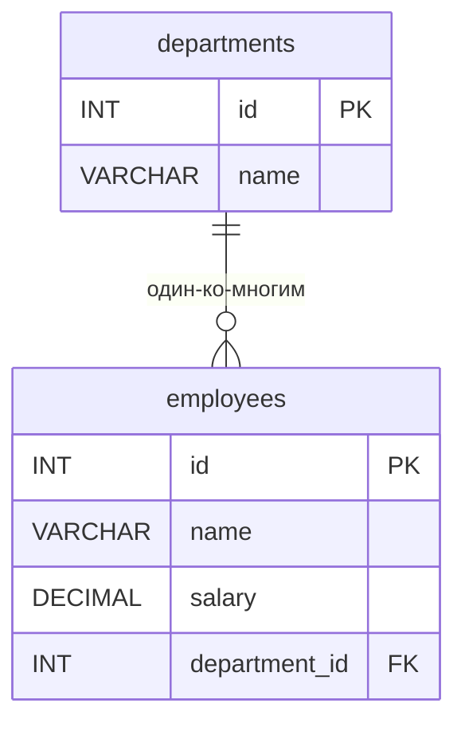

# ИТ.03 - 30 - Условия и переменные в хранимых процедурах MySQL

## Введение

В предыдущей лекции мы познакомились с основами хранимых процедур в MySQL: научились создавать процедуры, передавать параметры и использовать простые SQL-операторы внутри них. Однако настоящая мощь хранимых процедур раскрывается, когда мы начинаем использовать **переменные** для хранения промежуточных результатов и **условные конструкции** для реализации сложной бизнес-логики.

Переменные внутри процедур позволяют временно сохранять значения, полученные из запросов или вычисленные в процессе работы. Условные операторы (`IF`, `CASE`) дают возможность выполнять различные действия в зависимости от условий, что критически важно для реализации таких сценариев, как проверка достаточности средств, расчёт скидок, валидация данных и многое другое.

В этой лекции мы углубимся в работу с локальными переменными и управляющими конструкциями внутри хранимых процедур. Мы рассмотрим синтаксис объявления переменных, способы присваивания значений, а также подробно изучим операторы `IF` и `CASE`. Все примеры будут построены на практических задачах, которые часто встречаются в реальных проектах.

Примеры данной темы используют учебную БД:

::: tabs

@tab Структура БД



@tab Дамп

```sql
-- Создание таблицы departments
CREATE TABLE departments (
    id INT PRIMARY KEY AUTO_INCREMENT,
    name VARCHAR(100) NOT NULL
);

-- Создание таблицы employees
CREATE TABLE employees (
    id INT PRIMARY KEY AUTO_INCREMENT,
    name VARCHAR(100) NOT NULL,
    salary DECIMAL(10,2) DEFAULT 0.00,
    department_id INT,
    FOREIGN KEY (department_id) REFERENCES departments(id)
);

-- Вставка тестовых данных
INSERT INTO departments (name) VALUES
('IT'),
('Sales'),
('HR'),
('Finance');

INSERT INTO employees (name, salary, department_id) VALUES
('Иван Петров', 75000.00, 1),
('Мария Сидорова', 82000.50, 1),
('Алексей Иванов', 45000.00, 2),
('Ольга Кузнецова', 67000.00, 3),
('Дмитрий Смирнов', 92000.00, 4),
('Екатерина Волкова', 53000.00, 2);
```

@tab Таблицы

  ::: tabs

  @tab **departments**

  | id | name    |
  |----|---------|
  | 1  | IT      |
  | 2  | Sales   |
  | 3  | HR      |
  | 4  | Finance |

  @tab **employees**

  | id | name              | salary   | department_id |
  |----|-------------------|----------|---------------|
  | 1  | Иван Петров       | 75000.00 | 1             |
  | 2  | Мария Сидорова    | 82000.50 | 1             |
  | 3  | Алексей Иванов    | 45000.00 | 2             |
  | 4  | Ольга Кузнецова   | 67000.00 | 3             |
  | 5  | Дмитрий Смирнов   | 92000.00 | 4             |
  | 6  | Екатерина Волкова | 53000.00 | 2             |

  :::

:::

---

## Локальные переменные в хранимых процедурах

Локальные переменные — это переменные, объявляемые внутри тела хранимой процедуры с помощью оператора `DECLARE`. Они существуют только во время выполнения процедуры и не видны за её пределами. Переменные позволяют сохранять промежуточные результаты, упрощать сложные вычисления и делать код более читаемым.

### Объявление переменных

Синтаксис объявления переменной:

```sql
DECLARE имя_переменной тип_данных [DEFAULT значение_по_умолчанию];
```

Тип данных может быть любым допустимым в MySQL: `INT`, `DECIMAL`, `VARCHAR`, `DATE` и т.д. Если значение по умолчанию не указано, переменная инициализируется значением `NULL`.

**Пример 1: Объявление переменных**

```sql
DELIMITER $$

CREATE PROCEDURE ExampleVariables()
BEGIN
    DECLARE counter INT DEFAULT 0;
    DECLARE employee_name VARCHAR(100);
    DECLARE total_salary DECIMAL(10,2);
    
    -- Использование переменных
    SET counter = 10;
    SELECT name INTO employee_name FROM employees WHERE id = 1;
    SELECT SUM(salary) INTO total_salary FROM employees;
    
    SELECT counter, employee_name, total_salary;
END $$

DELIMITER ;
```

### Присваивание значений

Значения переменным можно присваивать двумя способами:

1. **Оператор `SET`** — для прямого присваивания констант или выражений.
2. **Инструкция `SELECT ... INTO`** — для сохранения результата запроса.

**Пример 2: SET и SELECT INTO**

```sql
DELIMITER $$

CREATE PROCEDURE CalculateBonus(IN emp_id INT)
BEGIN
    DECLARE base_salary DECIMAL(10,2);
    DECLARE bonus DECIMAL(10,2);
    DECLARE total DECIMAL(10,2);
    
    -- Получаем зарплату сотрудника
    SELECT salary INTO base_salary FROM employees WHERE id = emp_id;
    
    -- Рассчитываем бонус (10% от зарплаты)
    SET bonus = base_salary * 0.10;
    
    -- Итоговая сумма
    SET total = base_salary + bonus;
    
    SELECT base_salary AS 'Оклад', bonus AS 'Бонус', total AS 'Итого';
END $$

DELIMITER ;
```

::: warning

Локальные переменные должны быть объявлены в самом начале блока `BEGIN ... END`, перед любыми другими операторами. Если объявить переменную после выполнения SQL-запроса, возникнет ошибка синтаксиса.

:::

### Практический пример: Анализ отдела

Создадим процедуру, которая анализирует сотрудников отдела: вычисляет среднюю зарплату, количество сотрудников и определяет, является ли отдел «высокооплачиваемым» (средняя зарплата > 60000).

```sql
DELIMITER $$

CREATE PROCEDURE AnalyzeDepartment(IN dept_id INT)
BEGIN
    DECLARE avg_salary DECIMAL(10,2);
    DECLARE emp_count INT;
    DECLARE department_status VARCHAR(50);
    
    -- Средняя зарплата в отделе
    SELECT AVG(salary) INTO avg_salary 
    FROM employees 
    WHERE department_id = dept_id;
    
    -- Количество сотрудников
    SELECT COUNT(*) INTO emp_count 
    FROM employees 
    WHERE department_id = dept_id;
    
    -- Определение статуса отдела
    IF avg_salary > 60000 THEN
        SET department_status = 'Высокооплачиваемый';
    ELSE
        SET department_status = 'Стандартный';
    END IF;
    
    -- Вывод результатов
    SELECT 
        dept_id AS 'ID отдела',
        emp_count AS 'Кол-во сотрудников',
        avg_salary AS 'Средняя зарплата',
        department_status AS 'Статус';
END $$

DELIMITER ;
```

Вызов процедуры для отдела IT (id = 1):

```sql
CALL AnalyzeDepartment(1);
```

Результат:
| ID отдела | Кол-во сотрудников | Средняя зарплата | Статус             |
|-----------|-------------------|------------------|--------------------|
| 1         | 2                 | 78500.25         | Высокооплачиваемый |

---

## Условные конструкции

Условные конструкции позволяют выполнять различные блоки кода в зависимости от выполнения определённых условий. В MySQL хранимые процедуры поддерживают два основных оператора: `IF` и `CASE`.

### Оператор IF

Синтаксис оператора `IF`:

```sql
IF условие THEN
    операторы;
[ELSEIF другое_условие THEN
    операторы;]
[ELSE
    операторы;]
END IF;
```

**Пример 3: Классификация сотрудников по зарплате**

```sql
DELIMITER $$

CREATE PROCEDURE ClassifyEmployee(IN emp_id INT)
BEGIN
    DECLARE emp_salary DECIMAL(10,2);
    DECLARE category VARCHAR(30);
    
    SELECT salary INTO emp_salary FROM employees WHERE id = emp_id;
    
    IF emp_salary >= 80000 THEN
        SET category = 'Высокий уровень';
    ELSEIF emp_salary >= 50000 THEN
        SET category = 'Средний уровень';
    ELSE
        SET category = 'Начальный уровень';
    END IF;
    
    SELECT emp_salary AS 'Зарплата', category AS 'Категория';
END $$

DELIMITER ;
```

### Оператор CASE

Оператор `CASE` предоставляет более компактный способ проверки нескольких условий. Он бывает двух форм: простая (сравнение с конкретными значениями) и поисковая (проверка логических условий).

**Простая форма:**

```sql
CASE переменная
    WHEN значение1 THEN операторы;
    WHEN значение2 THEN операторы;
    ELSE операторы;
END CASE;
```

**Поисковая форма (используется чаще):**

```sql
CASE
    WHEN условие1 THEN операторы;
    WHEN условие2 THEN операторы;
    ELSE операторы;
END CASE;
```

**Пример 4: Определение уровня премии с помощью CASE**

```sql
DELIMITER $$

CREATE PROCEDURE DetermineBonusLevel(IN emp_id INT)
BEGIN
    DECLARE emp_salary DECIMAL(10,2);
    DECLARE bonus_percent DECIMAL(5,2);
    
    SELECT salary INTO emp_salary FROM employees WHERE id = emp_id;
    
    CASE
        WHEN emp_salary > 90000 THEN SET bonus_percent = 0.15;
        WHEN emp_salary > 70000 THEN SET bonus_percent = 0.10;
        WHEN emp_salary > 50000 THEN SET bonus_percent = 0.05;
        ELSE SET bonus_percent = 0.02;
    END CASE;
    
    SELECT 
        emp_salary AS 'Зарплата',
        bonus_percent * 100 AS 'Процент бонуса (%)',
        emp_salary * bonus_percent AS 'Сумма бонуса';
END $$

DELIMITER ;
```

### Комбинирование переменных и условий

Рассмотрим более сложный пример, где переменные и условия используются вместе для реализации бизнес-логики перевода средств между счетами (в упрощённом виде).

**Пример 5: Перевод зарплаты с проверкой достаточности средств**

Предположим, у нас есть таблица `company_account` с балансом компании. Мы хотим создать процедуру, которая переводит зарплату сотруднику, но только если на счету компании достаточно средств.

```sql
-- Дополнительная таблица для примера
CREATE TABLE company_account (
    id INT PRIMARY KEY AUTO_INCREMENT,
    balance DECIMAL(15,2) DEFAULT 100000.00
);

INSERT INTO company_account (balance) VALUES (100000.00);

-- Процедура перевода зарплаты
DELIMITER $$

CREATE PROCEDURE PaySalary(IN emp_id INT, IN amount DECIMAL(10,2))
BEGIN
    DECLARE company_balance DECIMAL(15,2);
    DECLARE emp_name VARCHAR(100);
    
    -- Получаем текущий баланс компании
    SELECT balance INTO company_balance FROM company_account WHERE id = 1;
    
    -- Получаем имя сотрудника
    SELECT name INTO emp_name FROM employees WHERE id = emp_id;
    
    -- Проверяем достаточность средств
    IF company_balance >= amount THEN
        -- Списание со счёта компании
        UPDATE company_account SET balance = balance - amount WHERE id = 1;
        
        -- Запись о выплате (в реальном проекте здесь была бы вставка в таблицу платежей)
        SELECT CONCAT('Зарплата ', amount, ' выплачена сотруднику ', emp_name) AS 'Результат';
    ELSE
        SELECT 'Недостаточно средств на счету компании' AS 'Ошибка';
    END IF;
END $$

DELIMITER ;
```

Вызов процедуры:

```sql
CALL PaySalary(1, 75000.00);
```

---
# Тест для самопроверки

::: quiz source=./includes/quiz-30.yaml
:::
---

## Задания для самопроверки

1. **Модификация процедуры анализа отдела**  
   Дополните процедуру `AnalyzeDepartment` так, чтобы она также определяла, является ли отдел «малочисленным» (менее 3 сотрудников) или «крупным» (3 и более). Выводите соответствующий статус вместе с остальными результатами.

2. **Процедура повышения зарплаты**  
   Напишите хранимую процедуру `IncreaseSalary`, которая принимает идентификатор сотрудника и процент повышения. Процедура должна:
   - Получить текущую зарплату сотрудника.
   - Вычислить новую зарплату с учётом процента.
   - Обновить запись в таблице `employees`.
   - Вывести сообщение об успешном повышении или об ошибке, если сотрудник не найден.

3. **Система скидок на основе стажа**  
   Предположим, в таблице `employees` добавлено поле `hire_date` (дата приёма на работу). Создайте процедуру `CalculateDiscount`, которая для заданного сотрудника вычисляет размер скидки на услуги компании по следующему правилу:
   - Если стаж менее 1 года — скидка 0%.
   - От 1 до 3 лет — скидка 5%.
   - От 3 до 5 лет — скидка 10%.
   - Более 5 лет — скидка 15%.
   Процедура должна возвращать размер скидки в процентах и в денежном выражении (например, 10% от 1000 = 100).

4. **Комплексная проверка бюджета отдела**  
   Создайте процедуру `CheckDepartmentBudget`, которая для заданного отдела вычисляет общий фонд оплаты труда (сумма зарплат всех сотрудников) и сравнивает его с заданным бюджетным лимитом (передаётся параметром). Если фонд превышает лимит, процедура должна вывести предупреждение и список сотрудников с зарплатой выше средней по отделу.
