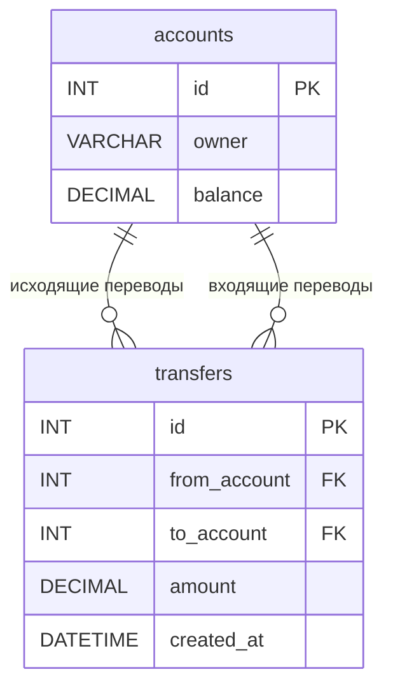

# ИТ.03 - 31 - Обработка ошибок и транзакции в процедурах

## Введение

В предыдущей лекции мы изучили, как использовать переменные и условные конструкции в хранимых процедурах MySQL. Эти инструменты позволяют реализовывать сложную бизнес-логику, но для создания надёжных и отказоустойчивых приложений необходимо также уметь управлять **транзакциями** и корректно **обрабатывать ошибки**.

Транзакции гарантируют целостность данных, позволяя выполнять группу операций как единое целое: либо все изменения применяются (фиксируются), либо ни одно из них не вступает в силу (откатывается). Обработка ошибок даёт возможность перехватывать исключительные ситуации, генерировать пользовательские сообщения об ошибках и контролировать поток выполнения процедуры.

В этой лекции мы рассмотрим:
- механизм транзакций в хранимых процедурах (`START TRANSACTION`, `COMMIT`, `ROLLBACK`);
- способы объявления обработчиков ошибок (`DECLARE HANDLER`);
- генерацию пользовательских ошибок и предупреждений (`SIGNAL`, `RESIGNAL`);
- практические примеры совмещения транзакций и обработки ошибок в реальных сценариях.

Примеры данной темы используют учебную БД:

::: tabs

@tab Структура БД



@tab Дамп

```sql
-- Создание таблицы accounts
CREATE TABLE accounts (
    id INT PRIMARY KEY AUTO_INCREMENT,
    owner VARCHAR(100) NOT NULL,
    balance DECIMAL(10,2) DEFAULT 0.00
);

-- Создание таблицы transfers
CREATE TABLE transfers (
    id INT PRIMARY KEY AUTO_INCREMENT,
    from_account INT NOT NULL,
    to_account INT NOT NULL,
    amount DECIMAL(10,2) NOT NULL,
    created_at DATETIME DEFAULT CURRENT_TIMESTAMP,
    FOREIGN KEY (from_account) REFERENCES accounts(id),
    FOREIGN KEY (to_account) REFERENCES accounts(id)
);

-- Вставка тестовых данных
INSERT INTO accounts (owner, balance) VALUES
('Иван Петров', 10000.00),
('Мария Сидорова', 5000.00),
('Алексей Иванов', 7500.00);

INSERT INTO transfers (from_account, to_account, amount) VALUES
(1, 2, 1000.00),
(2, 3, 500.00);
```

@tab Таблицы

  ::: tabs

  @tab **accounts**

  | id | owner           | balance   |
  |----|-----------------|-----------|
  | 1  | Иван Петров     | 10000.00  |
  | 2  | Мария Сидорова  | 5000.00   |
  | 3  | Алексей Иванов  | 7500.00   |

  @tab **transfers**

  | id | from_account | to_account | amount | created_at          |
  |----|--------------|------------|--------|---------------------|
  | 1  | 1            | 2          | 1000.00| 2025-01-15 10:30:00 |
  | 2  | 2            | 3          | 500.00 | 2025-01-16 14:45:00 |

  :::

:::

---

## Транзакции в хранимых процедурах

Транзакция — это последовательность SQL-операций, которая выполняется как единое целое. Если все операции успешны, транзакция фиксируется (`COMMIT`), и изменения становятся постоянными. Если возникает ошибка, транзакция откатывается (`ROLLBACK`), и все изменения, сделанные в её рамках, аннулируются.

В хранимых процедурах транзакции особенно полезны, когда необходимо выполнить несколько взаимосвязанных изменений данных, например, перевод денег между счетами, регистрацию заказа с одновременным уменьшением остатка товара и т.д.

### Базовые операторы транзакций

- `START TRANSACTION` — начинает новую транзакцию.
- `COMMIT` — фиксирует все изменения, сделанные с момента начала транзакции.
- `ROLLBACK` — откатывает все изменения, сделанные с момента начала транзакции.

**Пример 1: Простая транзакция с проверкой баланса**

```sql
DELIMITER $$

CREATE PROCEDURE SimpleTransfer(
    IN from_acc INT,
    IN to_acc INT,
    IN amount DECIMAL(10,2)
)
BEGIN
    DECLARE from_balance DECIMAL(10,2);

    -- Получаем текущий баланс счёта-отправителя
    SELECT balance INTO from_balance
    FROM accounts WHERE id = from_acc;

    -- Начинаем транзакцию
    START TRANSACTION;

    -- Списание со счёта-отправителя
    UPDATE accounts
    SET balance = balance - amount
    WHERE id = from_acc;

    -- Зачисление на счёт-получатель
    UPDATE accounts
    SET balance = balance + amount
    WHERE id = to_acc;

    -- Проверяем, не ушёл ли баланс в отрицательное значение
    IF from_balance >= amount THEN
        -- Всё в порядке, фиксируем изменения
        COMMIT;
        SELECT 'Перевод успешно выполнен' AS result;
    ELSE
        -- Недостаточно средств, откатываем транзакцию
        ROLLBACK;
        SELECT 'Ошибка: недостаточно средств' AS result;
    END IF;
END $$

DELIMITER ;
```

Вызов процедуры:

```sql
CALL SimpleTransfer(1, 2, 1500.00);
```

В этом примере транзакция начинается после получения баланса, затем выполняются два обновления. Если баланс достаточен, изменения фиксируются; если нет — откатываются, и балансы обоих счетов возвращаются к исходным значениям.

### Автоматическая фиксация и режимы транзакций

По умолчанию в MySQL работает режим автоматической фиксации (`autocommit = 1`), при котором каждый отдельный SQL-запрос выполняется как транзакция и сразу фиксируется. В хранимых процедурах мы явно управляем транзакциями с помощью `START TRANSACTION`, что позволяет объединять несколько операций в одну атомарную единицу.

---

## Обработка ошибок в хранимых процедурах

Ошибки в хранимых процедурах могут возникать по разным причинам: нарушение ограничений целостности, деление на ноль, неверные типы данных и т.д. Чтобы gracefully обрабатывать такие ситуации, MySQL предоставляет механизм **обработчиков ошибок** (`HANDLER`).

### Объявление обработчиков

Обработчик объявляется с помощью конструкции `DECLARE ... HANDLER FOR`. Он определяет, какие действия выполнить при возникновении ошибки определённого класса.

```sql
DECLARE действие HANDLER FOR условие
    BEGIN
        -- код обработки
    END;
```

**Действие** может быть:
- `CONTINUE` — после выполнения обработчика процедура продолжает работу с следующего оператора.
- `EXIT` — после выполнения обработчика процедура завершается.

**Условие** может быть:
- `SQLEXCEPTION` — все ошибки (исключения).
- `SQLWARNING` — предупреждения.
- `NOT FOUND` — ситуация, когда запрос не вернул ни одной строки (часто используется с курсорами).
- Конкретный код ошибки (`SQLSTATE 'xxxxx'`) или условие `condition_name`.

**Пример 2: Обработчик для перехвата любых ошибок**

```sql
DELIMITER $$

CREATE PROCEDURE ErrorHandlerDemo()
BEGIN
    DECLARE EXIT HANDLER FOR SQLEXCEPTION
    BEGIN
        SELECT 'Произошла ошибка, транзакция откатана' AS error_message;
        ROLLBACK;
    END;

    START TRANSACTION;

    -- Попытка вставить дубликат первичного ключа (вызовет ошибку)
    INSERT INTO accounts (id, owner, balance) VALUES (1, 'Тест', 100);

    -- Этот код не выполнится, потому что обработчик EXIT завершит процедуру
    COMMIT;
END $$

DELIMITER ;
```

Вызов процедуры:

```sql
CALL ErrorHandlerDemo();
```

Здесь при попытке вставить запись с уже существующим `id = 1` возникает ошибка `SQLEXCEPTION`. Обработчик перехватывает её, выводит сообщение и выполняет `ROLLBACK`. Поскольку обработчик объявлен как `EXIT`, процедура завершается после блока обработчика, и оператор `COMMIT` не выполняется.

### Получение информации об ошибке

Чтобы получить детали ошибки (код SQLSTATE, текст сообщения, номер ошибки), можно использовать встроенные функции `GET DIAGNOSTICS` или переменные `RESIGNAL`.

**Пример 3: Обработчик с диагностикой**

```sql
DELIMITER $$

CREATE PROCEDURE GetErrorDetails()
BEGIN
    DECLARE error_state VARCHAR(5);
    DECLARE error_message TEXT;

    DECLARE EXIT HANDLER FOR SQLEXCEPTION
    BEGIN
        GET DIAGNOSTICS CONDITION 1
            error_state = RETURNED_SQLSTATE,
            error_message = MESSAGE_TEXT;

        SELECT CONCAT('SQLSTATE: ', error_state, '; Сообщение: ', error_message) AS error_details;
        ROLLBACK;
    END;

    START TRANSACTION;

    -- Генерируем ошибку деления на ноль
    SET @dummy = 1 / 0;

    COMMIT;
END $$

DELIMITER ;
```

### Генерация пользовательских ошибок

Иногда необходимо явно сообщить о проблеме в бизнес-логике (например, «недостаточно средств», «пользователь не найден»). Для этого используется оператор `SIGNAL`.

Синтаксис:

```sql
SIGNAL SQLSTATE 'код_состояния'
    SET MESSAGE_TEXT = 'текст сообщения',
        MYSQL_ERRNO = номер_ошибки;
```

Коды SQLSTATE, начинающиеся с `'45'` (например, `'45000'`), зарезервированы для пользовательских ошибок. Коды, начинающиеся с `'01'` (например, `'01000'`), используются для предупреждений.

**Пример 4: Генерация пользовательской ошибки**

```sql
DELIMITER $$

CREATE PROCEDURE WithdrawMoney(
    IN account_id INT,
    IN amount DECIMAL(10,2)
)
BEGIN
    DECLARE current_balance DECIMAL(10,2);

    SELECT balance INTO current_balance
    FROM accounts WHERE id = account_id;

    IF current_balance IS NULL THEN
        SIGNAL SQLSTATE '45000'
            SET MESSAGE_TEXT = 'Счёт не найден';
    ELSEIF current_balance < amount THEN
        SIGNAL SQLSTATE '45001'
            SET MESSAGE_TEXT = 'Недостаточно средств на счёте';
    ELSE
        UPDATE accounts
        SET balance = balance - amount
        WHERE id = account_id;
        SELECT 'Списание успешно' AS result;
    END IF;
END $$

DELIMITER ;
```

Вызов процедуры:

```sql
CALL WithdrawMoney(999, 1000);  -- несуществующий счёт
CALL WithdrawMoney(1, 20000);   -- недостаточно средств
CALL WithdrawMoney(1, 1000);    -- успешное списание
```

---

## Комбинированный пример: перевод с транзакцией и обработкой ошибок

Объединим все изученные техники в одной процедуре, которая:
1. Проверяет существование обоих счетов.
2. Проверяет достаточность баланса.
3. Выполняет перевод в рамках транзакции.
4. В случае любой ошибки откатывает транзакцию и возвращает понятное сообщение.
5. При успехе фиксирует транзакцию и регистрирует перевод в таблице `transfers`.

```sql
DELIMITER $$

CREATE PROCEDURE SafeTransfer(
    IN from_acc INT,
    IN to_acc INT,
    IN amount DECIMAL(10,2)
)
BEGIN
    DECLARE from_balance DECIMAL(10,2);
    DECLARE from_exists INT DEFAULT 0;
    DECLARE to_exists INT DEFAULT 0;

    -- Объявляем обработчик для любых ошибок
    DECLARE EXIT HANDLER FOR SQLEXCEPTION
    BEGIN
        ROLLBACK;
        RESIGNAL;
    END;

    -- Проверяем существование счетов
    SELECT COUNT(*) INTO from_exists FROM accounts WHERE id = from_acc;
    SELECT COUNT(*) INTO to_exists FROM accounts WHERE id = to_acc;

    IF from_exists = 0 THEN
        SIGNAL SQLSTATE '45002'
            SET MESSAGE_TEXT = 'Счёт-отправитель не найден';
    END IF;

    IF to_exists = 0 THEN
        SIGNAL SQLSTATE '45003'
            SET MESSAGE_TEXT = 'Счёт-получатель не найден';
    END IF;

    -- Получаем баланс счёта-отправителя
    SELECT balance INTO from_balance FROM accounts WHERE id = from_acc;

    IF from_balance < amount THEN
        SIGNAL SQLSTATE '45001'
            SET MESSAGE_TEXT = 'Недостаточно средств на счёте-отправителе';
    END IF;

    -- Начинаем транзакцию
    START TRANSACTION;

    -- Списание
    UPDATE accounts
    SET balance = balance - amount
    WHERE id = from_acc;

    -- Зачисление
    UPDATE accounts
    SET balance = balance + amount
    WHERE id = to_acc;

    -- Регистрация перевода
    INSERT INTO transfers (from_account, to_account, amount)
    VALUES (from_acc, to_acc, amount);

    -- Всё успешно, фиксируем
    COMMIT;

    SELECT 'Перевод выполнен успешно' AS result;
END $$

DELIMITER ;
```

Вызов процедуры:

```sql
CALL SafeTransfer(1, 2, 500.00);
```

Эта процедура демонстрирует профессиональный подход к написанию хранимых процедур: валидация входных данных, использование транзакций для атомарности, обработка ошибок с ясными сообщениями.

---

## Тест для самопроверки

::: quiz source=./includes/quiz-31.yaml
:::

---

## Задания для самопроверки

1. **Улучшенная процедура перевода**  
   Модифицируйте процедуру `SafeTransfer` так, чтобы она также проверяла, не пытается ли пользователь перевести деньги самому себе (т.е. `from_acc = to_acc`). В таком случае процедура должна генерировать пользовательскую ошибку с кодом SQLSTATE `'45004'` и сообщением «Нельзя переводить средства на тот же счёт».

2. **Процедура отката при таймауте**  
   Напишите процедуру `TimedTransfer`, которая имитирует длительную операцию (например, с помощью `SLEEP(2)`). Добавьте обработчик, который откатывает транзакцию, если время выполнения превышает 3 секунды (используйте `GET_LOCK` и `RELEASE_LOCK` для симуляции). Процедура должна возвращать сообщение «Операция отменена по таймауту».

3. **Журналирование ошибок**  
   Создайте таблицу `error_log` с полями `id`, `error_time`, `procedure_name`, `sqlstate`, `message`. Модифицируйте любую из ранее написанных процедур так, чтобы при возникновении ошибки (через обработчик `SQLEXCEPTION`) детали ошибки записывались в эту таблицу, после чего транзакция откатывалась. При этом пользователь должен получить общее сообщение «Внутренняя ошибка, обратитесь к администратору».

4. **Комплексная транзакция с несколькими таблицами**  
   Используя БД из предыдущих лекций (таблицы `departments` и `employees`), напишите процедуру `MergeDepartments`, которая:
   - Принимает два ID отделов (`dept_from` и `dept_to`).
   - В рамках одной транзакции переводит всех сотрудников из `dept_from` в `dept_to`.
   - Удаляет отдел `dept_from` (если в нём не осталось сотрудников).
   - Если отдел `dept_to` не существует, генерирует ошибку.
   - Если в отделе `dept_from` остаются сотрудники после перевода (из-за ошибки), транзакция откатывается.

5. **Использование SAVEPOINT**  
   Изучите работу оператора `SAVEPOINT` и напишите процедуру `PartialRollbackDemo`, которая внутри одной транзакции выполняет несколько шагов, создавая точки сохранения. При возникновении ошибки на определённом шаге откатывайтесь не на начало транзакции, а до последней успешной точки сохранения, после чего продолжайте выполнение.
