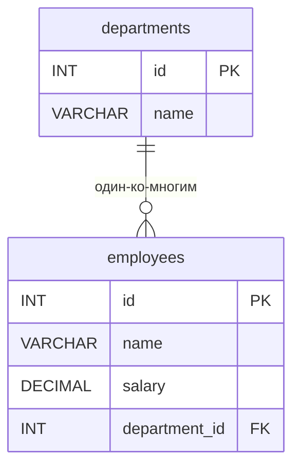

# ИТ.03 - 32 - Пользовательские функции в MySQL

## Введение

В предыдущих лекциях мы изучили основы SQL, работу с данными, а также хранимые процедуры. Однако часто возникает необходимость в создании собственных функций, которые могут выполнять вычисления, преобразования данных или реализовывать сложную бизнес-логику прямо на уровне базы данных.

Пользовательские функции в MySQL позволяют инкапсулировать часто используемую логику, упрощают запросы и повышают производительность за счёт выполнения вычислений на стороне сервера. В отличие от хранимых процедур, функции всегда возвращают значение и могут использоваться в любом месте SQL-запроса: в `SELECT`, `WHERE`, `HAVING`, `ORDER BY` и даже в других функциях.

В этой лекции мы рассмотрим синтаксис создания пользовательских функций, изучим их особенности, а также сравним с хранимыми процедурами. Все примеры будут построены на практических задачах, которые часто встречаются в реальных проектах.

Примеры данной темы используют учебную БД:

::: tabs

@tab Структура БД



@tab Дамп

```sql
-- Создание таблицы departments
CREATE TABLE departments (
    id INT PRIMARY KEY AUTO_INCREMENT,
    name VARCHAR(100) NOT NULL
);

-- Создание таблицы employees
CREATE TABLE employees (
    id INT PRIMARY KEY AUTO_INCREMENT,
    name VARCHAR(100) NOT NULL,
    salary DECIMAL(10,2) DEFAULT 0.00,
    department_id INT,
    FOREIGN KEY (department_id) REFERENCES departments(id)
);

-- Вставка тестовых данных
INSERT INTO departments (name) VALUES
('Разработка'),
('Маркетинг'),
('Финансы');

INSERT INTO employees (name, salary, department_id) VALUES
('Иван Петров', 85000.00, 1),
('Мария Сидорова', 92000.00, 1),
('Алексей Иванов', 78000.00, 2),
('Ольга Кузнецова', 95000.00, 3),
('Дмитрий Смирнов', 88000.00, 1);
```

:::

## Что такое пользовательская функция?

Пользовательская функция (User-Defined Function, UDF) — это именованный блок кода, который принимает параметры, выполняет определённые действия и возвращает одно значение. Функции создаются с помощью оператора `CREATE FUNCTION` и могут быть вызваны в SQL-запросах так же, как и встроенные функции (`SUM()`, `CONCAT()`, `NOW()` и т.д.).

::: info

В MySQL существуют как встроенные функции (со многими из которых вы уже знакомы, например с агрегирующими `SUM()` или `COUNT()`), так и пользовательские (которые может создать пользователь для конкретной БД). Здесь и далее, говоря про пользовательские функции в MySQL обычно говорят просто "функции", уточняя в том случае где в контексте нужно отличить их от встроенных.

:::

## Синтаксис создания функции

Базовый синтаксис создания функции выглядит следующим образом:

```sql
DELIMITER $$
CREATE FUNCTION имя_функции(параметр1 тип, параметр2 тип, ...)
RETURNS тип_возвращаемого_значения
[DETERMINISTIC | NO SQL | READS SQL DATA]
BEGIN
    -- тело функции
    DECLARE переменная тип;
    -- логика
    RETURN значение;
END $$
DELIMITER ;
```

Разберём каждый элемент:

- **DELIMITER $$** — временно изменяет разделитель команд с `;` на `$$`, чтобы MySQL корректно обработал многострочное тело функции.
- **CREATE FUNCTION** — ключевые слова для создания функции.
- **имя_функции** — уникальное имя функции в пределах базы данных.
- **параметры** — входные аргументы функции (могут отсутствовать).
- **RETURNS** — указывает тип данных, который возвращает функция.
- **DETERMINISTIC / NO SQL / READS SQL DATA** — необязательные характеристики функции, о которых мы поговорим ниже.
- **BEGIN ... END** — блок, содержащий логику функции.
- **DECLARE** — объявление локальных переменных.
- **RETURN** — оператор возврата значения.

## Простой пример: расчёт НДС

Создадим функцию, которая рассчитывает налог НДС (20%) от переданной суммы:

```sql
DELIMITER $$
CREATE FUNCTION calculate_vat(amount DECIMAL(10,2))
RETURNS DECIMAL(10,2)
DETERMINISTIC
BEGIN
    DECLARE vat DECIMAL(10,2);
    SET vat = amount * 0.2; -- 20% ставка НДС
    RETURN vat;
END $$
DELIMITER ;
```

Теперь мы можем использовать эту функцию в запросах:

```sql
SELECT calculate_vat(100); -- вернёт 20.00
SELECT name, salary, calculate_vat(salary) AS vat FROM employees;
```

::: warning

Если в процессе выполнения запроса возникла ошибка `Error Code: 1418. This function has none of DETERMINISTIC, NO SQL, or READS SQL DATA in its declaration and binary logging is enabled`, это связано с тем, что в вашей функции отсутствует одно из трёх ключевых слов: `DETERMINISTIC`, `NO SQL` или `READS SQL DATA`, которые определяют тип функции. В MySQL 8, если бинарное журналирование включено, функции должны быть помечены одним из этих ключевых слов для обеспечения безопасности и целостности данных.

Для учебных целей вы можете временно разрешить создание функций без указания характеристик, выполнив команду:

```sql
SET GLOBAL log_bin_trust_function_creators = 1;
```

Однако в реальных проектах так не делают, так как это может повлиять на безопасность и целостность данных. Правильный подход — всегда указывать подходящую характеристику функции.

:::

## Характеристики функций (DETERMINISTIC, NO SQL, READS SQL DATA)

MySQL требует, чтобы каждая функция была помечена одной из следующих характеристик:

1. **DETERMINISTIC** — функция всегда возвращает одинаковый результат для одних и тех же входных данных. Не зависит от внешних факторов (времени, случайных чисел, состояния БД). Пример: математические вычисления.

2. **NO SQL** — функция не выполняет операций с базой данных (не содержит SQL-запросов). Пример: строковые или числовые преобразования.

3. **READS SQL DATA** — функция может читать данные из таблиц (использует `SELECT`), но не изменяет их.

4. **MODIFIES SQL DATA** — функция может изменять данные (использует `INSERT`, `UPDATE`, `DELETE`). **Внимание:** пользовательские функции в MySQL не могут модифицировать данные! Эта характеристика доступна только для хранимых процедур.

Для нашей функции `calculate_vat` мы указали `DETERMINISTIC`, потому что при одинаковой сумме налог всегда будет одинаковым.

## Функции с условиями

Функции могут содержать условные конструкции (`IF`, `CASE`). Например, создадим функцию, которая возвращает категорию зарплаты:

```sql
DELIMITER $$
CREATE FUNCTION get_salary_category(salary DECIMAL(10,2))
RETURNS VARCHAR(20)
DETERMINISTIC
BEGIN
    DECLARE category VARCHAR(20);
    
    IF salary < 50000 THEN
        SET category = 'Низкая';
    ELSEIF salary BETWEEN 50000 AND 100000 THEN
        SET category = 'Средняя';
    ELSE
        SET category = 'Высокая';
    END IF;
    
    RETURN category;
END $$
DELIMITER ;
```

Использование:

```sql
SELECT name, salary, get_salary_category(salary) AS category FROM employees;
```

## Функции, читающие данные из таблиц

Если функция должна обращаться к данным в БД, используем характеристику `READS SQL DATA`. Например, функция, которая возвращает среднюю зарплату по отделу:

```sql
DELIMITER $$
CREATE FUNCTION avg_salary_by_dept(dept_id INT)
RETURNS DECIMAL(10,2)
READS SQL DATA
BEGIN
    DECLARE avg_sal DECIMAL(10,2);
    
    SELECT AVG(salary) INTO avg_sal
    FROM employees
    WHERE department_id = dept_id;
    
    RETURN avg_sal;
END $$
DELIMITER ;
```

Вызов:

```sql
SELECT name, avg_salary_by_dept(1) AS avg_in_dev FROM employees WHERE department_id = 1;
```

## Удаление и изменение функций

Чтобы удалить функцию, используйте команду:

```sql
DROP FUNCTION IF EXISTS calculate_vat;
```

Для изменения существующей функции необходимо сначала удалить её, а затем создать заново (MySQL не поддерживает `ALTER FUNCTION` для изменения тела функции).

## Различия функций и хранимых процедур

| Характеристика | Пользовательские функции | Хранимые процедуры |
|----------------|--------------------------|---------------------|
| **Возвращаемое значение** | Всегда одно значение | Может возвращать несколько значений через `OUT`-параметры или результат выборки |
| **Использование в SQL** | Можно использовать в `SELECT`, `WHERE`, `HAVING` и т.д. | Вызываются отдельно с помощью `CALL` |
| **Изменение данных** | Не могут изменять данные (только чтение) | Могут выполнять `INSERT`, `UPDATE`, `DELETE` |
| **Транзакции** | Не поддерживают управление транзакциями | Поддерживают `COMMIT`, `ROLLBACK` |
| **Характеристики** | Обязательно указывать `DETERMINISTIC`, `NO SQL` или `READS SQL DATA` | Не требуют указания характеристик |

**Когда использовать функции?**
- Когда нужно вычислить и вернуть одно значение на основе входных параметров.
- Когда логика будет использоваться в выражениях SQL (например, в `SELECT` или `WHERE`).
- Когда не требуется изменение данных.

**Когда использовать хранимые процедуры?**
- Когда нужно выполнить сложную последовательность SQL-операций, включая изменение данных.
- Когда требуется возвращать несколько значений или наборы строк.
- Когда нужны транзакции и обработка ошибок.

## Практические примеры

### Пример 1: Форматирование даты

Функция, которая преобразует дату в читаемый формат "день.месяц.год":

```sql
DELIMITER $$
CREATE FUNCTION format_date_russian(d DATE)
RETURNS VARCHAR(10)
DETERMINISTIC
BEGIN
    RETURN DATE_FORMAT(d, '%d.%m.%Y');
END $$
DELIMITER ;
```

### Пример 2: Расчёт премии

Функция, которая рассчитывает премию сотрудника как 15% от зарплаты, но не более 20000:

```sql
DELIMITER $$
CREATE FUNCTION calculate_bonus(salary DECIMAL(10,2))
RETURNS DECIMAL(10,2)
DETERMINISTIC
BEGIN
    DECLARE bonus DECIMAL(10,2);
    SET bonus = salary * 0.15;
    IF bonus > 20000 THEN
        SET bonus = 20000;
    END IF;
    RETURN bonus;
END $$
DELIMITER ;
```

### Пример 3: Проверка корректности email (упрощённая)

```sql
DELIMITER $$
CREATE FUNCTION is_valid_email(email VARCHAR(255))
RETURNS BOOLEAN
DETERMINISTIC
BEGIN
    -- Простая проверка на наличие @ и точки после неё
    IF email LIKE '%@%._%' THEN
        RETURN TRUE;
    ELSE
        RETURN FALSE;
    END IF;
END $$
DELIMITER ;
```

::: quiz source=./includes/quiz-32.yaml
:::

## Задание для самопроверки

1. Создайте функцию `get_employee_count_by_dept(dept_id INT)`, которая возвращает количество сотрудников в указанном отделе. Убедитесь, что функция использует правильную характеристику (`READS SQL DATA`).

2. Напишите функцию `calculate_tax(salary DECIMAL(10,2), tax_rate DECIMAL(5,2))`, которая вычисляет сумму налога по заданной ставке. Функция должна быть детерминированной.

3. Создайте функцию `get_department_name(emp_id INT)`, которая по идентификатору сотрудника возвращает название его отдела. Используйте `JOIN` внутри функции.

4. **Повышенная сложность:** Разработайте функцию `get_salary_stats(dept_id INT)`, которая возвращает JSON-объект с минимальной, максимальной и средней зарплатой в отделе. Пример возвращаемого значения: `{"min": 50000, "max": 120000, "avg": 85000}`. Подсказка: используйте функции `JSON_OBJECT()`.

5. Протестируйте все созданные функции на учебной базе данных, убедитесь, что они возвращают корректные результаты.

---

Успехов в освоении пользовательских функций! Помните, что грамотное использование функций позволяет сделать код более модульным, читаемым и эффективным.