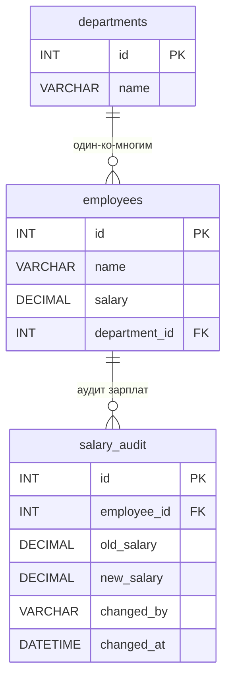

# ИТ.03 - 33 - Триггеры в MySQL

## Введение

В предыдущих лекциях мы изучили хранимые процедуры, пользовательские функции, а также механизмы обработки ошибок и транзакций. Все эти инструменты позволяют инкапсулировать бизнес-логику на уровне базы данных и выполняются **явно** — по команде пользователя или приложения. Однако часто возникает необходимость в автоматическом выполнении определённых действий при изменении данных в таблицах.

Именно для этих целей в MySQL существуют **триггеры** (triggers) — специальные объекты базы данных, которые автоматически вызываются при наступлении определённых событий: вставке (`INSERT`), обновлении (`UPDATE`) или удалении (`DELETE`) записей в таблице. Триггеры позволяют реагировать на изменения данных в реальном времени, обеспечивая целостность, аудит и автоматическое обновление связанных данных без участия приложения.

В этой лекции мы рассмотрим:
- что такое триггеры и для чего они используются;
- синтаксис создания и удаления триггеров;
- использование ключевых слов `OLD` и `NEW` для доступа к изменяемым данным;
- практические примеры: аудит изменений, каскадные обновления, валидация данных;
- управление триггерами и их ограничения.

Примеры данной темы используют учебную БД:

::: tabs

@tab Структура БД



@tab Дамп

```sql
-- Создание таблицы departments
CREATE TABLE departments (
    id INT PRIMARY KEY AUTO_INCREMENT,
    name VARCHAR(100) NOT NULL
);

-- Создание таблицы employees
CREATE TABLE employees (
    id INT PRIMARY KEY AUTO_INCREMENT,
    name VARCHAR(100) NOT NULL,
    salary DECIMAL(10,2) DEFAULT 0.00,
    department_id INT,
    FOREIGN KEY (department_id) REFERENCES departments(id)
);

-- Создание таблицы для аудита изменений зарплат
CREATE TABLE salary_audit (
    id INT PRIMARY KEY AUTO_INCREMENT,
    employee_id INT NOT NULL,
    old_salary DECIMAL(10,2),
    new_salary DECIMAL(10,2),
    changed_by VARCHAR(100),
    changed_at DATETIME DEFAULT CURRENT_TIMESTAMP,
    FOREIGN KEY (employee_id) REFERENCES employees(id)
);

-- Вставка тестовых данных
INSERT INTO departments (name) VALUES
('Разработка'),
('Маркетинг'),
('Финансы');

INSERT INTO employees (name, salary, department_id) VALUES
('Иван Петров', 85000.00, 1),
('Мария Сидорова', 92000.00, 1),
('Алексей Иванов', 78000.00, 2),
('Ольга Кузнецова', 95000.00, 3),
('Дмитрий Смирнов', 88000.00, 1);
```

@tab Таблицы

  ::: tabs

  @tab **departments**

  | id | name       |
  |----|------------|
  | 1  | Разработка |
  | 2  | Маркетинг  |
  | 3  | Финансы    |

  @tab **employees**

  | id | name              | salary   | department_id |
  |----|-------------------|----------|---------------|
  | 1  | Иван Петров       | 85000.00 | 1             |
  | 2  | Мария Сидорова    | 92000.00 | 1             |
  | 3  | Алексей Иванов    | 78000.00 | 2             |
  | 4  | Ольга Кузнецова   | 95000.00 | 3             |
  | 5  | Дмитрий Смирнов   | 88000.00 | 1             |

  @tab **salary_audit**

  | id | employee_id | old_salary | new_salary | changed_by | changed_at |
  |----|-------------|------------|------------|------------|------------|
  |    |             |            |            |            |            |

  ::: 

:::

---

## Что такое триггер?

**Триггер** (trigger) — это именованный набор SQL-инструкций, который автоматически выполняется (срабатывает) при наступлении определённого события для конкретной таблицы. Триггер неразрывно связан с таблицей: при удалении таблицы все её триггеры также удаляются.

Поддержка триггеров в MySQL началась с версии 5.0.2. В MySQL 8 триггеры стали ещё более функциональными и надёжными.

### Когда применяются триггеры?

Триггеры используются для решения широкого круга задач:

1. **Аудит изменений** — автоматическая запись информации о том, кто, когда и какие изменения внёс в данные.
2. **Обеспечение ссылочной целостности** — автоматическое обновление или удаление связанных записей.
3. **Валидация данных** — проверка корректности вводимых значений на уровне базы данных.
4. **Автоматическое вычисление производных значений** — например, обновление баланса счёта при каждой транзакции.
5. **Синхронизация данных** — копирование изменений в другие таблицы или схемы.

### Преимущества триггеров

- **Автоматизация** — триггеры срабатывают автоматически, без участия приложения.
- **Централизация логики** — правила, определённые в триггерах, действуют для всех способов изменения данных (хоть из приложения, хоть из SQL-клиента).
- **Производительность** — выполнение на стороне сервера, без дополнительных сетевых запросов.
- **Безопасность** — можно гарантировать выполнение критических проверок независимо от клиента.

---

## Синтаксис создания триггера

Базовый синтаксис создания триггера выглядит следующим образом:

```sql
DELIMITER $$

CREATE TRIGGER имя_триггера
{ BEFORE | AFTER } { INSERT | UPDATE | DELETE }
ON имя_таблицы
FOR EACH ROW
BEGIN
    -- тело триггера
END $$

DELIMITER ;
```

Разберём каждый элемент:

- **`имя_триггера`** — уникальное имя триггера в пределах базы данных.
- **`BEFORE` / `AFTER`** — определяет момент срабатывания: до или после выполнения операции.
- **`INSERT` / `UPDATE` / `DELETE`** — событие, при котором срабатывает триггер.
- **`ON имя_таблицы`** — таблица, с которой связан триггер.
- **`FOR EACH ROW`** — указывает, что триггер выполняется для каждой строки, затронутой операцией.
- **`BEGIN ... END`** — блок, содержащий тело триггера. Если тело состоит из одного оператора, `BEGIN ... END` можно опустить.

::: warning

Операции `CREATE`, `DROP`, `TRUNCATE` и `ALTER` **не вызывают** триггеры. Триггеры срабатывают только для операций манипуляции данными (DML): `INSERT`, `UPDATE`, `DELETE`.

:::

### Ключевые слова OLD и NEW

В теле триггера для доступа к значениям столбцов используются ключевые слова `OLD` и `NEW`:

| Событие      | OLD                         | NEW                         |
|--------------|-----------------------------|-----------------------------|
| `INSERT`     | Недоступно                  | Содержит новые вставляемые значения |
| `UPDATE`     | Содержит старые значения до обновления | Содержит новые значения после обновления |
| `DELETE`     | Содержит удаляемые значения | Недоступно                  |

::: info

В триггерах `BEFORE` вы можете изменять значения `NEW` (например, для форматирования или валидации данных). В триггерах `AFTER` изменение `NEW` уже не имеет смысла, так как операция уже выполнена.

:::

---

## Примеры триггеров

### Пример 1: Триггер для аудита изменений зарплаты

Создадим триггер, который автоматически записывает в таблицу `salary_audit` информацию об изменении зарплаты сотрудника:

```sql
DELIMITER $$

CREATE TRIGGER audit_salary_change
AFTER UPDATE
ON employees
FOR EACH ROW
BEGIN
    -- Проверяем, действительно ли зарплата изменилась
    IF OLD.salary != NEW.salary THEN
        INSERT INTO salary_audit (employee_id, old_salary, new_salary, changed_by, changed_at)
        VALUES (NEW.id, OLD.salary, NEW.salary, USER(), NOW());
    END IF;
END $$

DELIMITER ;
```

**Как проверить:**

```sql
-- Обновляем зарплату сотрудника
UPDATE employees SET salary = 95000.00 WHERE id = 1;

-- Проверяем, что запись аудита появилась
SELECT * FROM salary_audit;
```

Результат:

| id | employee_id | old_salary | new_salary | changed_by        | changed_at           |
|----|-------------|------------|------------|-------------------|----------------------|
| 1  | 1           | 85000.00   | 95000.00   | root@localhost    | 2026-06-03 10:30:00  |

::: info

Функция `USER()` возвращает имя текущего пользователя MySQL. Это полезно для аудита — вы всегда будете знать, кто именно внёс изменения.

:::

### Пример 2: Триггер для проверки минимальной зарплаты

Создадим триггер `BEFORE INSERT`, который не позволяет установить зарплату ниже минимального порога (например, 30000):

```sql
DELIMITER $$

CREATE TRIGGER check_min_salary
BEFORE INSERT
ON employees
FOR EACH ROW
BEGIN
    IF NEW.salary < 30000 THEN
        SIGNAL SQLSTATE '45000'
            SET MESSAGE_TEXT = 'Зарплата не может быть ниже минимального порога (30000)';
    END IF;
END $$

DELIMITER ;
```

**Как проверить:**

```sql
-- Попытка вставить сотрудника с зарплатой ниже минимальной
INSERT INTO employees (name, salary, department_id)
VALUES ('Тестовый Сотрудник', 15000.00, 1);
```

Результат — ошибка:

```
Error Code: 1644. Зарплата не может быть ниже минимального порога (30000)
```

### Пример 3: Триггер для автоматического обновления даты изменения

Добавим в таблицу `employees` поле `updated_at` и создадим триггер, который автоматически обновляет его при любом изменении записи:

```sql
-- Добавляем поле для хранения даты последнего изменения
ALTER TABLE employees ADD COLUMN updated_at DATETIME DEFAULT CURRENT_TIMESTAMP ON UPDATE CURRENT_TIMESTAMP;
```

Однако, если мы хотим более гибкого контроля, можно использовать триггер:

```sql
DELIMITER $$

CREATE TRIGGER update_employee_timestamp
BEFORE UPDATE
ON employees
FOR EACH ROW
BEGIN
    SET NEW.updated_at = NOW();
END $$

DELIMITER ;
```

**Как проверить:**

```sql
-- Обновляем запись
UPDATE employees SET name = 'Иван Петров (обновлено)' WHERE id = 1;

-- Проверяем, что updated_at изменился
SELECT id, name, updated_at FROM employees WHERE id = 1;
```

### Пример 4: Триггер для каскадного удаления

При удалении сотрудника автоматически удаляем все связанные записи аудита:

```sql
DELIMITER $$

CREATE TRIGGER cascade_delete_audit
BEFORE DELETE
ON employees
FOR EACH ROW
BEGIN
    DELETE FROM salary_audit WHERE employee_id = OLD.id;
END $$

DELIMITER ;
```

**Как проверить:**

```sql
-- Удаляем сотрудника
DELETE FROM employees WHERE id = 5;

-- Проверяем, что записи аудита для него тоже удалены
SELECT * FROM salary_audit WHERE employee_id = 5;
```

### Пример 5: Триггер для логирования всех операций

Создадим универсальную таблицу логов и триггеры для отслеживания всех изменений в таблице `employees`:

```sql
-- Таблица для логирования всех операций
CREATE TABLE employees_log (
    id INT PRIMARY KEY AUTO_INCREMENT,
    employee_id INT,
    operation_type VARCHAR(10),
    old_data JSON,
    new_data JSON,
    changed_by VARCHAR(100),
    changed_at DATETIME DEFAULT CURRENT_TIMESTAMP
);

-- Триггер для логирования вставок
DELIMITER $$

CREATE TRIGGER log_employee_insert
AFTER INSERT
ON employees
FOR EACH ROW
BEGIN
    INSERT INTO employees_log (employee_id, operation_type, old_data, new_data, changed_by)
    VALUES (NEW.id, 'INSERT', NULL,
            JSON_OBJECT('id', NEW.id, 'name', NEW.name, 'salary', NEW.salary, 'department_id', NEW.department_id),
            USER());
END $$

-- Триггер для логирования обновлений
CREATE TRIGGER log_employee_update
AFTER UPDATE
ON employees
FOR EACH ROW
BEGIN
    INSERT INTO employees_log (employee_id, operation_type, old_data, new_data, changed_by)
    VALUES (NEW.id, 'UPDATE',
            JSON_OBJECT('id', OLD.id, 'name', OLD.name, 'salary', OLD.salary, 'department_id', OLD.department_id),
            JSON_OBJECT('id', NEW.id, 'name', NEW.name, 'salary', NEW.salary, 'department_id', NEW.department_id),
            USER());
END $$

-- Триггер для логирования удалений
CREATE TRIGGER log_employee_delete
AFTER DELETE
ON employees
FOR EACH ROW
BEGIN
    INSERT INTO employees_log (employee_id, operation_type, old_data, new_data, changed_by)
    VALUES (OLD.id, 'DELETE',
            JSON_OBJECT('id', OLD.id, 'name', OLD.name, 'salary', OLD.salary, 'department_id', OLD.department_id),
            NULL,
            USER());
END $$

DELIMITER ;
```

**Как проверить:**

```sql
-- Выполняем разные операции
INSERT INTO employees (name, salary, department_id) VALUES ('Новый Сотрудник', 60000.00, 2);
UPDATE employees SET salary = 65000.00 WHERE id = 6;
DELETE FROM employees WHERE id = 6;

-- Смотрим лог
SELECT * FROM employees_log;
```

::: info

Функция `JSON_OBJECT()` позволяет формировать JSON-документ из пар «ключ — значение». Это удобно для хранения сложных структур данных в одной колонке. Подробнее о JSON-функциях MySQL вы можете узнать в документации.

:::

---

## Управление триггерами

### Просмотр триггеров

Чтобы увидеть список всех триггеров в базе данных, выполните:

```sql
SHOW TRIGGERS;
```

Для просмотра кода конкретного триггера:

```sql
SHOW CREATE TRIGGER имя_триггера;
```

### Удаление триггера

Триггер удаляется командой `DROP TRIGGER`:

```sql
DROP TRIGGER IF EXISTS имя_триггера;
```

### Изменение триггера

MySQL не поддерживает `ALTER TRIGGER` для изменения тела триггера. Чтобы изменить логику триггера, необходимо удалить его и создать заново:

```sql
DROP TRIGGER IF EXISTS audit_salary_change;

DELIMITER $$

CREATE TRIGGER audit_salary_change
AFTER UPDATE
ON employees
FOR EACH ROW
BEGIN
    -- Новая версия триггера
    IF OLD.salary != NEW.salary THEN
        INSERT INTO salary_audit (employee_id, old_salary, new_salary, changed_by, changed_at)
        VALUES (NEW.id, OLD.salary, NEW.salary, USER(), NOW());
    END IF;
END $$

DELIMITER ;
```

---

## Транзакции и обработка ошибок в триггерах

Триггеры выполняются в контексте той транзакции, в рамках которой происходит вызвавшая их операция. Если триггер генерирует ошибку (например, через `SIGNAL`), то вся операция откатывается.

### Использование транзакций в триггерах

В триггерах можно использовать операторы управления транзакциями, но с осторожностью. Рассмотрим пример триггера, который выполняет несколько операций в рамках транзакции с обработкой ошибок:

```sql
DELIMITER $$

CREATE TRIGGER transfer_salary_update
AFTER UPDATE
ON employees
FOR EACH ROW
BEGIN
    DECLARE EXIT HANDLER FOR SQLEXCEPTION
    BEGIN
        ROLLBACK;
        RESIGNAL;
    END;

    -- Если зарплата изменилась, логируем это в рамках транзакции
    IF OLD.salary != NEW.salary THEN
        START TRANSACTION;

        INSERT INTO salary_audit (employee_id, old_salary, new_salary, changed_by)
        VALUES (NEW.id, OLD.salary, NEW.salary, USER());

        -- Здесь могут быть другие связанные операции

        COMMIT;
    END IF;
END $$

DELIMITER ;
```

::: warning

Будьте осторожны с транзакциями внутри триггеров. Поскольку триггер уже выполняется в контексте транзакции вызвавшей его операции, явное управление транзакциями может привести к неожиданным результатам. В большинстве случаев достаточно позволить триггеру работать в транзакции родительской операции.

:::

### Обработка ошибок в триггерах

Для генерации пользовательских ошибок в триггерах используется оператор `SIGNAL`, как и в хранимых процедурах:

```sql
DELIMITER $$

CREATE TRIGGER validate_employee_data
BEFORE INSERT
ON employees
FOR EACH ROW
BEGIN
    -- Проверка, что имя не пустое
    IF NEW.name IS NULL OR NEW.name = '' THEN
        SIGNAL SQLSTATE '45000'
            SET MESSAGE_TEXT = 'Имя сотрудника не может быть пустым';
    END IF;

    -- Проверка, что зарплата положительная
    IF NEW.salary <= 0 THEN
        SIGNAL SQLSTATE '45000'
            SET MESSAGE_TEXT = 'Зарплата должна быть положительным числом';
    END IF;

    -- Проверка, что отдел существует
    IF NOT EXISTS (SELECT 1 FROM departments WHERE id = NEW.department_id) THEN
        SIGNAL SQLSTATE '45000'
            SET MESSAGE_TEXT = 'Указанный отдел не существует';
    END IF;
END $$

DELIMITER ;
```

---

## Ограничения триггеров

При использовании триггеров в MySQL следует учитывать ряд ограничений:

1. **Один тип триггера на таблицу** — для каждой комбинации `BEFORE`/`AFTER` и `INSERT`/`UPDATE`/`DELETE` можно создать только один триггер. То есть на одной таблице может быть максимум 6 триггеров (3 события × 2 момента времени).

2. **Рекурсия** — триггер не должен вызывать сам себя (например, триггер `AFTER UPDATE` на таблице `A` не должен обновлять таблицу `A`, иначе возникнет бесконечная рекурсия). MySQL имеет ограничение на глубину рекурсии (`max_sp_recursion_depth`).

3. **Производительность** — поскольку триггер выполняется для каждой затронутой строки, массовые операции (`INSERT ... SELECT`, `LOAD DATA`) могут выполняться значительно медленнее.

4. **Отладка** — триггеры сложнее отлаживать, чем код приложения, так как они выполняются на стороне сервера.

5. **Прозрачность** — разработчики могут не знать о существовании триггеров, что приводит к неожиданному поведению приложения.

---

## Сравнение: триггеры vs. хранимые процедуры

| Характеристика | Триггеры | Хранимые процедуры |
|----------------|----------|---------------------|
| **Способ вызова** | Автоматически при событии DML | Явно через `CALL` |
| **Параметры** | Не принимают параметры | Могут принимать `IN`, `OUT`, `INOUT` |
| **Возвращаемое значение** | Не возвращают | Могут возвращать через `OUT`-параметры |
| **Связь с таблицей** | Жёстко привязаны к таблице | Независимы от таблиц |
| **Количество на таблицу** | Максимум 6 | Не ограничено |
| **Использование** | Для автоматических реакций на изменения | Для инкапсуляции бизнес-логики |

---

::: quiz source=./includes/quiz-33.yaml
:::