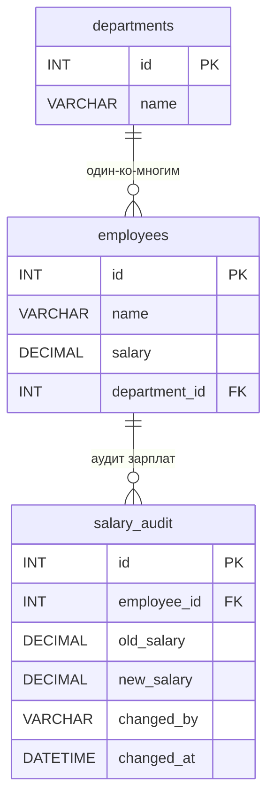

# ИТ.03 - 35 - Импорт/экспорт и дампы в MySQL

## Введение

В предыдущих лекциях мы изучили широкий спектр возможностей MySQL: от создания таблиц и написания сложных запросов до хранимых процедур, триггеров и обработки ошибок. Все эти знания применяются в контексте работающей базы данных, но в реальной жизни постоянно возникает необходимость переносить данные между серверами, создавать резервные копии, восстанавливать базы после сбоев или мигрировать схемы между средами разработки, тестирования и производства.

Именно для этих целей в MySQL существуют механизмы **импорта** и **экспорта** данных, а также создания **дампов** (dumps) — файлов, содержащих полную или выборочную копию структуры и/или данных базы данных. Утилита `mysqldump` является стандартным инструментом для решения этих задач, однако существуют и альтернативные подходы: экспорт в CSV, использование `SELECT ... INTO OUTFILE`, а также специализированные инструменты для работы с большими объёмами данных.

В этой лекции мы рассмотрим:
- что такое дамп базы данных и для чего он используется;
- утилиту `mysqldump`: синтаксис, ключевые опции, практические примеры;
- импорт дампов через `mysql` и `SOURCE`;
- экспорт и импорт данных в формате CSV;
- использование `SELECT ... INTO OUTFILE` и `LOAD DATA INFILE`;
- создание резервных копий и автоматизация бэкапов;
- практические сценарии миграции данных между серверами.

Примеры данной темы используют учебную БД:

::: tabs

@tab Структура БД



@tab Дамп

```sql
-- Создание таблицы departments
CREATE TABLE departments (
    id INT PRIMARY KEY AUTO_INCREMENT,
    name VARCHAR(100) NOT NULL
);

-- Создание таблицы employees
CREATE TABLE employees (
    id INT PRIMARY KEY AUTO_INCREMENT,
    name VARCHAR(100) NOT NULL,
    salary DECIMAL(10,2) DEFAULT 0.00,
    department_id INT,
    FOREIGN KEY (department_id) REFERENCES departments(id)
);

-- Создание таблицы для аудита изменений зарплат
CREATE TABLE salary_audit (
    id INT PRIMARY KEY AUTO_INCREMENT,
    employee_id INT NOT NULL,
    old_salary DECIMAL(10,2),
    new_salary DECIMAL(10,2),
    changed_by VARCHAR(100),
    changed_at DATETIME DEFAULT CURRENT_TIMESTAMP,
    FOREIGN KEY (employee_id) REFERENCES employees(id)
);

-- Вставка тестовых данных
INSERT INTO departments (name) VALUES
('Разработка'),
('Маркетинг'),
('Финансы');

INSERT INTO employees (name, salary, department_id) VALUES
('Иван Петров', 85000.00, 1),
('Мария Сидорова', 92000.00, 1),
('Алексей Иванов', 78000.00, 2),
('Ольга Кузнецова', 95000.00, 3),
('Дмитрий Смирнов', 88000.00, 1);
```

@tab Таблицы

  ::: tabs

  @tab **departments**

  | id | name       |
  |----|------------|
  | 1  | Разработка |
  | 2  | Маркетинг  |
  | 3  | Финансы    |

  @tab **employees**

  | id | name              | salary   | department_id |
  |----|-------------------|----------|---------------|
  | 1  | Иван Петров       | 85000.00 | 1             |
  | 2  | Мария Сидорова    | 92000.00 | 1             |
  | 3  | Алексей Иванов    | 78000.00 | 2             |
  | 4  | Ольга Кузнецова   | 95000.00 | 3             |
  | 5  | Дмитрий Смирнов   | 88000.00 | 1             |

  @tab **salary_audit**

  | id | employee_id | old_salary | new_salary | changed_by | changed_at |
  |----|-------------|------------|------------|------------|------------|
  |    |             |            |            |            |            |

  :::

:::

---

## Что такое дамп базы данных?

**Дамп** (dump) — это файл, содержащий набор SQL-инструкций, которые полностью описывают структуру и/или данные базы данных. Дамп представляет собой текстовый файл (обычно с расширением `.sql`), который можно выполнить на любом сервере MySQL для восстановления базы данных в точности до состояния на момент создания дампа.

Дамп может включать:
- **Структуру** — операторы `CREATE TABLE`, `CREATE INDEX`, `CREATE PROCEDURE`, `CREATE TRIGGER` и т.д.
- **Данные** — операторы `INSERT`, которые вставляют все записи из таблиц.
- **События, триггеры, хранимые процедуры** — полное описание всех программных объектов базы данных.
- **Настройки** — информацию о кодировках, collation и других параметрах.

### Для чего используются дампы?

1. **Резервное копирование** — создание копии базы данных для восстановления в случае сбоя.
2. **Миграция данных** — перенос базы данных с одного сервера на другой (например, с разработки на продакшн).
3. **Клонирование среды** — создание точной копии базы для тестирования или обучения.
4. **Версионирование схемы** — хранение структуры базы данных в системе контроля версий.
5. **Передача данных** — отправка коллеге или заказчику выборочных данных.

---

## Утилита mysqldump

`mysqldump` — это клиентская утилита командной строки, которая поставляется вместе с MySQL и предназначена для создания дампов баз данных. Она работает путём выполнения запросов `SHOW CREATE TABLE` и `SELECT` для каждой таблицы, формируя на выходе текстовый SQL-файл.

### Базовый синтаксис

```bash
mysqldump -u пользователь -p имя_базы > файл_дампа.sql
```

После выполнения команды утилита запросит пароль. Результат будет записан в указанный файл.

**Пример 1: Дамп одной базы данных**

```bash
mysqldump -u root -p it03 > it03_backup.sql
```

**Пример 2: Дамп нескольких баз данных**

```bash
mysqldump -u root -p --databases it03 op08 > multiple_dbs.sql
```

**Пример 3: Дамп всех баз данных на сервере**

```bash
mysqldump -u root -p --all-databases > full_backup.sql
```

### Ключевые опции mysqldump

| Опция | Описание |
|-------|----------|
| `--add-drop-table` | Добавляет `DROP TABLE IF EXISTS` перед каждым `CREATE TABLE` (полезно при восстановлении) |
| `--no-data` | Экспортирует только структуру таблиц, без данных |
| `--no-create-info` | Экспортирует только данные, без структуры таблиц |
| `--where="условие"` | Экспортирует только строки, удовлетворяющие условию |
| `--routines` | Включает в дамп хранимые процедуры и функции |
| `--triggers` | Включает в дамп триггеры |
| `--events` | Включает в дамп события |
| `--single-transaction` | Создаёт дамп в рамках одной транзакции (для InnoDB) — гарантирует консистентность данных |
| `--result-file=файл` | Записывает результат в указанный файл (альтернатива перенаправлению `>`) |
| `--compact` | Создаёт более компактный дамп (без комментариев) |
| `--verbose` | Подробный вывод информации о процессе |
| `--default-character-set=utf8mb4` | Указывает кодировку дампа |

::: info

Опция `--single-transaction` особенно важна для баз данных, использующих движок InnoDB. Она запускает транзакцию `READ TRANSACTION` перед началом дампа, что гарантирует консистентность данных без блокировки таблиц. Для MyISAM эта опция не работает — в этом случае таблицы блокируются на чтение.

:::

### Практические примеры

**Пример 4: Дамп только структуры базы данных**

```bash
mysqldump -u root -p --no-data it03 > it03_schema.sql
```

Такой дамп полезен для версионирования схемы базы данных в Git или для быстрого развёртывания пустой базы с нужной структурой.

**Пример 5: Дамп только данных**

```bash
mysqldump -u root -p --no-create-info it03 > it03_data.sql
```

**Пример 6: Дамп с процедурами, триггерами и событиями**

```bash
mysqldump -u root -p --routines --triggers --events it03 > it03_full.sql
```

**Пример 7: Дамп отдельных таблиц**

```bash
mysqldump -u root -p it03 employees departments > employees_depts.sql
```

**Пример 8: Дамп с условием WHERE**

```bash
mysqldump -u root -p it03 employees --where="salary > 80000" > high_salary_employees.sql
```

**Пример 9: Дамп с добавлением DROP TABLE**

```bash
mysqldump -u root -p --add-drop-table it03 > it03_with_drop.sql
```

Содержимое такого дампа будет начинаться с `DROP TABLE IF EXISTS` для каждой таблицы, что позволяет безопасно восстанавливать дамп поверх существующей базы.

### Что содержится внутри дампа?

Рассмотрим фрагмент дампа, созданного командой:

```bash
mysqldump -u root -p --add-drop-table --routines it03
```

```sql
-- MySQL dump 10.13  Distrib 8.0.36, for Win64 (x86_64)
--
-- Host: localhost    Database: it03
-- ------------------------------------------------------
-- Server version	8.0.36

/*!40101 SET @OLD_CHARACTER_SET_CLIENT=@@CHARACTER_SET_CLIENT */;
/*!40101 SET @OLD_CHARACTER_SET_RESULTS=@@CHARACTER_SET_RESULTS */;
/*!40101 SET @OLD_COLLATION_CONNECTION=@@COLLATION_CONNECTION */;
/*!40101 SET NAMES utf8mb4 */;
/*!40103 SET @OLD_TIME_ZONE=@@TIME_ZONE */;
/*!40103 SET TIME_ZONE='+00:00' */;
/*!40014 SET @OLD_UNIQUE_CHECKS=@@UNIQUE_CHECKS, UNIQUE_CHECKS=0 */;
/*!40014 SET @OLD_FOREIGN_KEY_CHECKS=@@FOREIGN_KEY_CHECKS, FOREIGN_KEY_CHECKS=0 */;
/*!40101 SET @OLD_SQL_MODE=@@SQL_MODE, SQL_MODE='NO_AUTO_VALUE_ON_ZERO' */;
/*!40111 SET @OLD_SQL_NOTES=@@SQL_NOTES, SQL_NOTES=0 */;

--
-- Table structure for table `departments`
--

DROP TABLE IF EXISTS `departments`;
/*!40101 SET @saved_cs_client     = @@character_set_client */;
/*!40101 SET character_set_client = utf8mb4 */;
CREATE TABLE `departments` (
  `id` int NOT NULL AUTO_INCREMENT,
  `name` varchar(100) NOT NULL,
  PRIMARY KEY (`id`)
) ENGINE=InnoDB AUTO_INCREMENT=4 DEFAULT CHARSET=utf8mb4 COLLATE=utf8mb4_0900_ai_ci;
/*!40101 SET character_set_client = @saved_cs_client */;

--
-- Dumping data for table `departments`
--

LOCK TABLES `departments` WRITE;
/*!40000 ALTER TABLE `departments` DISABLE KEYS */;
INSERT INTO `departments` VALUES (1,'Разработка'),(2,'Маркетинг'),(3,'Финансы');
/*!40000 ALTER TABLE `departments` ENABLE KEYS */;
UNLOCK TABLES;

-- ... остальные таблицы ...

/*!40103 SET TIME_ZONE=@OLD_TIME_ZONE */;
/*!40101 SET SQL_MODE=@OLD_SQL_MODE */;
/*!40014 SET FOREIGN_KEY_CHECKS=@OLD_FOREIGN_KEY_CHECKS */;
/*!40014 SET UNIQUE_CHECKS=@OLD_UNIQUE_CHECKS */;
/*!40101 SET CHARACTER_SET_CLIENT=@OLD_CHARACTER_SET_CLIENT */;
/*!40101 SET CHARACTER_SET_RESULTS=@OLD_CHARACTER_SET_RESULTS */;
/*!40101 SET COLLATION_CONNECTION=@OLD_COLLATION_CONNECTION */;
/*!40111 SET SQL_NOTES=@OLD_SQL_NOTES */;

-- Dump completed on 2026-06-10 10:00:00
```

::: info

Обратите внимание на условные комментарии вида `/*!40101 SET ... */`. Они выполняются только если версия MySQL равна или выше указанной (в данном случае 4.01.01). Это позволяет дампам быть совместимыми с разными версиями MySQL.

:::

---

## Импорт дампов

Импорт дампа — это процесс выполнения SQL-инструкций из файла дампа на целевом сервере MySQL. Существует несколько способов импорта.

### Способ 1: Перенаправление ввода через mysql

```bash
mysql -u пользователь -p имя_базы < файл_дампа.sql
```

**Пример 10: Импорт дампа в новую базу**

```bash
-- Сначала создаём пустую базу данных
mysql -u root -p -e "CREATE DATABASE it03_restored;"

-- Затем импортируем дамп
mysql -u root -p it03_restored < it03_backup.sql
```

### Способ 2: Команда SOURCE внутри mysql

```sql
-- Подключаемся к MySQL
mysql -u root -p

-- Выбираем базу данных
USE it03;

-- Выполняем дамп
SOURCE C:/backups/it03_backup.sql;
```

### Способ 3: Импорт сжатых дампов

Для экономии места дампы часто хранят в сжатом виде. Импорт можно выполнить без распаковки:

```bash
-- Windows (через PowerShell)
Get-Content it03_backup.sql.gz | gunzip | mysql -u root -p it03

-- Linux / macOS
gunzip -c it03_backup.sql.gz | mysql -u root -p it03
```

::: warning

При импорте дампа убедитесь, что целевая база данных существует. Если дамп был создан с опцией `--databases` или `--all-databases`, он содержит операторы `CREATE DATABASE` и `USE`, поэтому предварительное создание базы не требуется. Если дамп создан без этих опций, базу нужно создать вручную.

:::

### Импорт с игнорированием ошибок

При импорте большого дампа некоторые операции могут завершаться ошибками (например, дублирование записей). Чтобы продолжить импорт несмотря на ошибки, используйте опцию `--force`:

```bash
mysql -u root -p --force it03 < it03_backup.sql
```

---

## Экспорт и импорт в формате CSV

Формат CSV (Comma-Separated Values) — это универсальный формат обмена данными, который поддерживается практически всеми СУБД, электронными таблицами и языками программирования. MySQL предоставляет два основных способа работы с CSV.

### Экспорт в CSV через SELECT ... INTO OUTFILE

Оператор `SELECT ... INTO OUTFILE` позволяет записать результат запроса непосредственно в файл на сервере в заданном формате.

```sql
SELECT * FROM employees
INTO OUTFILE 'C:/temp/employees.csv'
FIELDS TERMINATED BY ','
ENCLOSED BY '"'
LINES TERMINATED BY '\r\n';
```

Разберём параметры:

| Параметр | Описание |
|----------|----------|
| `FIELDS TERMINATED BY ','` | Разделитель полей — запятая |
| `ENCLOSED BY '"'` | Значения оборачиваются в двойные кавычки |
| `LINES TERMINATED BY '\r\n'` | Разделитель строк (для Windows) |

**Пример 11: Экспорт выборочных данных в CSV**

```sql
SELECT id, name, salary
FROM employees
WHERE department_id = 1
INTO OUTFILE 'C:/temp/it_employees.csv'
FIELDS TERMINATED BY ';'
ENCLOSED BY '"'
LINES TERMINATED BY '\r\n';
```

::: warning

Оператор `SELECT ... INTO OUTFILE` имеет важное ограничение: файл создаётся на **сервере** MySQL, а не на клиенте. Пользователь MySQL должен иметь привилегию `FILE`, а путь к файлу должен быть доступен для записи серверу. Кроме того, файл не должен существовать — MySQL не перезаписывает существующие файлы.

:::

### Импорт из CSV через LOAD DATA INFILE

Оператор `LOAD DATA INFILE` выполняет обратную операцию — загружает данные из CSV-файла в таблицу.

```sql
LOAD DATA INFILE 'C:/temp/employees.csv'
INTO TABLE employees
FIELDS TERMINATED BY ','
ENCLOSED BY '"'
LINES TERMINATED BY '\r\n'
IGNORE 1 LINES;  -- пропустить заголовок CSV
```

**Пример 12: Импорт с маппингом колонок**

Если порядок колонок в CSV-файле не соответствует порядку в таблице, можно явно указать соответствие:

```sql
LOAD DATA INFILE 'C:/temp/employees_import.csv'
INTO TABLE employees
FIELDS TERMINATED BY ','
ENCLOSED BY '"'
LINES TERMINATED BY '\r\n'
IGNORE 1 LINES
(id, name, salary, @dept_id)
SET department_id = @dept_id;
```

Здесь мы загружаем данные, где четвёртая колонка CSV содержит ID отдела, и присваиваем её полю `department_id` через пользовательскую переменную.

**Пример 13: Импорт с преобразованием данных**

```sql
LOAD DATA INFILE 'C:/temp/employees_transform.csv'
INTO TABLE employees
FIELDS TERMINATED BY ','
ENCLOSED BY '"'
LINES TERMINATED BY '\r\n'
IGNORE 1 LINES
(id, name, @salary_raw)
SET salary = CAST(@salary_raw AS DECIMAL(10,2));
```

### Экспорт в CSV через mysql (клиентский инструмент)

Если у вас нет доступа к файловой системе сервера, можно экспортировать данные на стороне клиента с помощью утилиты `mysql`:

```bash
mysql -u root -p -e "SELECT id, name, salary FROM employees" it03 > employees_export.csv
```

Однако такой экспорт не добавляет кавычки и может содержать форматирование таблицы. Для чистого CSV используйте опции:

```bash
mysql -u root -p -e "SELECT id, name, salary FROM employees" --batch --silent it03 > employees_clean.csv
```

::: info

Опция `--batch` отключает форматирование таблицы (вывод в виде табулированного текста), а `--silent` убирает заголовки колонок. Для полноценного CSV с кавычками и разделителями удобнее использовать `SELECT ... INTO OUTFILE` или специализированные инструменты.

:::

---

## Резервное копирование и автоматизация

### Стратегии резервного копирования

При планировании резервного копирования MySQL важно учитывать несколько факторов:

1. **Полный дамп** — создаётся копия всей базы данных. Простой и надёжный метод, но требует времени и места для хранения.
2. **Инкрементальный бэкап** — копируются только изменения с момента последнего бэкапа. Экономит место, но сложнее в реализации.
3. **Логический бэкап** — дамп в виде SQL (mysqldump). Гибкий, переносимый, но медленный для больших баз.
4. **Физический бэкап** — копирование файлов данных MySQL (например, через `mysqlbackup` или `XtraBackup`). Быстрый, но менее переносимый.

### Автоматизация с помощью cron / планировщика

**Пример 14: Скрипт для автоматического бэкапа (Windows PowerShell)**

```powershell
# backup_mysql.ps1
$date = Get-Date -Format "yyyy-MM-dd_HH-mm"
$backupDir = "C:\backups\mysql"
$dbName = "it03"
$user = "root"
$password = "your_password"

# Создаём директорию, если её нет
if (-not (Test-Path $backupDir)) {
    New-Item -ItemType Directory -Path $backupDir
}

# Выполняем дамп
$dumpFile = "$backupDir\$dbName`_$date.sql"
mysqldump -u $user -p$password --routines --triggers --single-transaction $dbName > $dumpFile

# Сжимаем дамп
Compress-Archive -Path $dumpFile -DestinationPath "$dumpFile.zip"

# Удаляем несжатый файл
Remove-Item $dumpFile

# Удаляем архивы старше 30 дней
Get-ChildItem $backupDir -Filter *.zip | Where-Object {
    $_.LastWriteTime -lt (Get-Date).AddDays(-30)
} | Remove-Item

Write-Host "Backup completed: $dumpFile.zip"
```

**Пример 15: Скрипт для автоматического бэкапа (Linux bash)**

```bash
#!/bin/bash
# backup_mysql.sh
BACKUP_DIR="/var/backups/mysql"
DB_NAME="it03"
USER="root"
PASSWORD="your_password"
DATE=$(date +%Y-%m-%d_%H-%M)
DUMP_FILE="$BACKUP_DIR/${DB_NAME}_${DATE}.sql"

# Создаём директорию
mkdir -p "$BACKUP_DIR"

# Выполняем дамп
mysqldump -u "$USER" -p"$PASSWORD" \
    --routines --triggers --single-transaction \
    "$DB_NAME" > "$DUMP_FILE"

# Сжимаем
gzip "$DUMP_FILE"

# Удаляем архивы старше 30 дней
find "$BACKUP_DIR" -name "*.sql.gz" -mtime +30 -delete

echo "Backup completed: ${DUMP_FILE}.gz"
```

### Восстановление из бэкапа

Процесс восстановления должен быть задокументирован и протестирован. Минимальный план восстановления:

```bash
-- 1. Создаём базу данных (если дамп без CREATE DATABASE)
mysql -u root -p -e "CREATE DATABASE it03_restored;"

-- 2. Импортируем дамп
mysql -u root -p it03_restored < it03_backup.sql

-- 3. Проверяем целостность
mysqlcheck -u root -p --check it03_restored
```

::: warning

Всегда тестируйте процесс восстановления! Дамп, который никогда не восстанавливался, нельзя считать надёжной резервной копией. Регулярно выполняйте тестовое восстановление на отдельном сервере или в изолированной среде.

:::

---

## Миграция данных между серверами

### Сценарий 1: Перенос базы на другой сервер

```bash
-- Экспорт на исходном сервере
mysqldump -u root -p --routines --triggers --single-transaction it03 > it03_migrate.sql

-- Копирование файла на целевой сервер (SCP, FTP, общая папка)

-- Импорт на целевом сервере
mysql -u root -p -e "CREATE DATABASE it03;"
mysql -u root -p it03 < it03_migrate.sql
```

### Сценарий 2: Прямая миграция через pipe

Без создания промежуточного файла:

```bash
mysqldump -u root -p --routines --single-transaction it03 | mysql -h target-server -u root -p it03
```

::: info

Прямая миграция через pipe удобна для небольших баз данных. Для больших баз (сотни гигабайт) рекомендуется использовать физические методы бэкапа или специализированные инструменты вроде `MySQL Shell` с утилитами клонирования.

:::

### Сценарий 3: Миграция с изменением имени базы

```bash
mysqldump -u root -p --databases it03 | sed 's/`it03`/`it03_v2`/g' | mysql -u root -p
```

::: warning

Замена через `sed` — это простое текстовое преобразование. Оно может некорректно обработать случаи, когда имя базы данных встречается внутри строковых литералов или имён таблиц. Для надёжной миграции с переименованием используйте опцию `--databases` и редактируйте дамп вручную или через специализированные скрипты.

:::

---

## Сравнение методов экспорта/импорта

| Метод | Назначение | Преимущества | Недостатки |
|-------|-----------|--------------|------------|
| **mysqldump** | Полный дамп БД | Гибкость, много опций, включает структуру + данные | Медленный для больших БД |
| **SELECT ... INTO OUTFILE** | Экспорт в CSV | Быстрый, гибкий формат | Требует привилегии FILE, файл на сервере |
| **LOAD DATA INFILE** | Импорт из CSV | Очень быстрый, гибкий маппинг | Требует привилегии FILE |
| **mysql < file.sql** | Импорт SQL | Простой, универсальный | Нет контроля над процессом |
| **mysql -e + >** | Экспорт в текст | Не требует FILE, на клиенте | Ограниченный контроль формата |

---

## Практические рекомендации

1. **Всегда используйте `--single-transaction`** для InnoDB — это гарантирует консистентность данных без блокировки таблиц.

2. **Включайте `--routines`, `--triggers` и `--events`** при создании полного дампа, иначе программные объекты БД будут потеряны.

3. **Сжимайте дампы** — текстовые SQL-файлы отлично сжимаются (часто в 5–10 раз).

4. **Храните несколько копий** — как минимум одну на том же сервере (для быстрого восстановления) и одну в удалённом хранилище (на случай отказа оборудования).

5. **Тестируйте восстановление** — регулярно проверяйте, что ваши дампы действительно можно восстановить.

6. **Документируйте процедуры** — запишите команды для создания и восстановления дампов, чтобы в стрессовой ситуации не тратить время на вспоминание.

7. **Используйте версионирование для схемы** — храните дамп только структуры (`--no-data`) в Git вместе с кодом приложения.

8. **Для больших баз данных** (сотни ГБ и более) рассмотрите использование физических бэкапов (Percona XtraBackup, MySQL Enterprise Backup) вместо mysqldump.

::: quiz source=./includes/quiz-35.yaml
:::