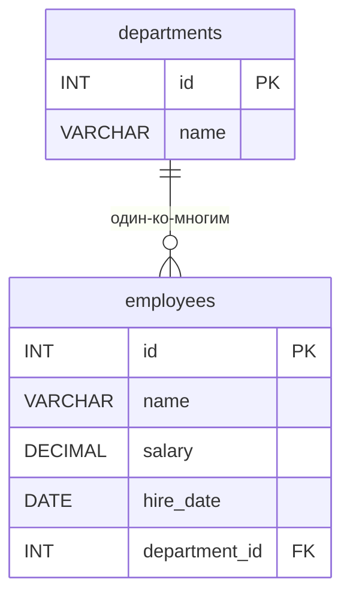

# ИТ.03 - 39 - Введение в оконные функции

## Введение

Ещё в лекции про агрегатные функции мы научились получать сводную информацию по группам: `SUM`, `AVG`, `MAX`, `MIN` и `COUNT` в связке с `GROUP BY` прекрасно отвечают на вопрос «сколько / какова сумма / каков максимум по отделу». Однако у такого подхода есть принципиальное ограничение: **группировка схлопывает строки** — на выходе остаётся одна строка на группу, и рядом с детальными записями результат агрегата не увидеть.

Представьте отчёт, в котором нужно показать каждого сотрудника, его зарплату **и** среднюю зарплату по его отделу в одной таблице, или рейтинг сотрудников внутри отдела по зарплате, или накопительную сумму фонда оплаты труда по мере найма людей. Классические конструкции SQL решают эти задачи лишь через самосоединения и вложенные запросы — громоздко, медленно и трудночитаемо.

Именно для таких задач в стандарте SQL:2003 появились **оконные функции** (window functions). В MySQL они доступны начиная с версии **8.0**. Оконная функция вычисляет значение не по всей таблице и не по сгруппированной выборке, а по **окну** — набору строк, связанному с текущей строкой. При этом количество строк в результате не меняется: к каждой исходной строке просто добавляется вычисленное значение.

В этой лекции мы рассмотрим:
- почему `GROUP BY` недостаточно для аналитических отчётов;
- что такое окно и оконные функции;
- синтаксис конструкции `OVER()`;
- секции `PARTITION BY` и `ORDER BY` внутри окна;
- ранжирующие функции: `ROW_NUMBER()`, `RANK()`, `DENSE_RANK()`, `NTILE()`;
- агрегатные функции в роли оконных: бегущие суммы и средние;
- функции смещения: `LAG()`, `LEAD()`, `FIRST_VALUE()`;
- именованные окна `WINDOW ... AS`;
- ограничения и особенности оконных функций в MySQL 8.

Примеры данной темы используют учебную БД:

::: tabs

@tab Структура БД



@tab Дамп

```sql
-- Создание таблицы departments
CREATE TABLE departments (
    id INT PRIMARY KEY AUTO_INCREMENT,
    name VARCHAR(100) NOT NULL
);

-- Создание таблицы employees
-- В отличие от предыдущих лекций добавлено поле hire_date (дата приёма на работу)
CREATE TABLE employees (
    id INT PRIMARY KEY AUTO_INCREMENT,
    name VARCHAR(100) NOT NULL,
    salary DECIMAL(10,2) DEFAULT 0.00,
    hire_date DATE,
    department_id INT,
    FOREIGN KEY (department_id) REFERENCES departments(id)
);

-- Вставка тестовых данных
INSERT INTO departments (name) VALUES
('Разработка'),
('Маркетинг'),
('Финансы');

INSERT INTO employees (name, salary, hire_date, department_id) VALUES
('Иван Петров',     85000.00, '2019-03-15', 1),
('Мария Сидорова',  92000.00, '2018-11-01', 1),
('Алексей Иванов',  78000.00, '2020-06-20', 2),
('Ольга Кузнецова', 95000.00, '2017-02-10', 3),
('Дмитрий Смирнов', 88000.00, '2021-09-05', 1),
('Елена Волкова',   76000.00, '2022-01-17', 2),
('Сергей Козлов',   92000.00, '2019-08-30', 3),
('Анна Морозова',   85000.00, '2023-04-12', 1),
('Павел Лебедев',   99000.00, '2016-05-23', 3),
('Наталья Орлова',  81000.00, '2021-12-01', 2);
```

@tab Таблицы

  ::: tabs

  @tab **departments**

  | id | name       |
  |----|------------|
  | 1  | Разработка |
  | 2  | Маркетинг  |
  | 3  | Финансы    |

  @tab **employees**

  | id | name              | salary   | hire_date  | department_id |
  |----|-------------------|----------|------------|---------------|
  | 1  | Иван Петров       | 85000.00 | 2019-03-15 | 1             |
  | 2  | Мария Сидорова    | 92000.00 | 2018-11-01 | 1             |
  | 3  | Алексей Иванов    | 78000.00 | 2020-06-20 | 2             |
  | 4  | Ольга Кузнецова   | 95000.00 | 2017-02-10 | 3             |
  | 5  | Дмитрий Смирнов   | 88000.00 | 2021-09-05 | 1             |
  | 6  | Елена Волкова     | 76000.00 | 2022-01-17 | 2             |
  | 7  | Сергей Козлов     | 92000.00 | 2019-08-30 | 3             |
  | 8  | Анна Морозова     | 85000.00 | 2023-04-12 | 1             |
  | 9  | Павел Лебедев     | 99000.00 | 2016-05-23 | 3             |
  | 10 | Наталья Орлова    | 81000.00 | 2021-12-01 | 2             |

  :::

:::

---

## Проблема: агрегаты теряют детализацию

Вспомним классический подход. Пусть требуется найти максимальную зарплату по каждому отделу:

**Пример 1: Максимальная зарплата по отделам через GROUP BY**

```sql
SELECT
    department_id,
    MAX(salary) AS max_salary
FROM employees
GROUP BY department_id
ORDER BY department_id;
```

Результат:

| department_id | max_salary |
|---------------|------------|
| 1             | 92000.00   |
| 2             | 81000.00   |
| 3             | 99000.00   |

Мы узнали максимумы, но потеряли **все детальные строки**: из результата исчезли имена сотрудников, их зарплаты и даты приёма. Если же нужен отчёт вида «сотрудник — зарплата — максимум по его отделу», без оконных функций придётся соединять таблицу с подзапросом:

**Пример 2: Тот же отчёт без оконных функций — самосоединение с подзапросом**

```sql
SELECT
    e.name,
    e.salary,
    e.department_id,
    d.max_salary
FROM employees e
JOIN (
    SELECT department_id, MAX(salary) AS max_salary
    FROM employees
    GROUP BY department_id
) d ON d.department_id = e.department_id
ORDER BY e.department_id, e.salary DESC;
```

Результат верный, но запрос получился длинным: подзапрос, соединение, дублирование логики. Чем больше таких показателей (максимум, среднее, доля, ранг), тем сложнее и медленнее становится конструкция. Оконные функции решают эту задачу одной строкой и без единого соединения.

---

## Что такое оконные функции?

**Оконная функция** (window function) — это функция, которая вычисляет значение по набору строк, «привязанных» к текущей строке запроса. Этот набор строк называется **окном** (window). В отличие от агрегатных функций с `GROUP BY`, оконные функции **не объединяют строки**: каждая строка исходного результата сохраняется, а вычисленное значение добавляется к ней отдельным столбцом.

Общий синтаксис выглядит так:

```sql
имя_функции(аргументы) OVER (
    [PARTITION BY столбец, ...]
    [ORDER BY столбец [ASC | DESC], ...]
    [ROWS | RANGE ...]
)
```

Обязательная часть — конструкция `OVER(...)`, именно она и превращает обычную функцию в оконную. Разберём простейший случай: окно, охватывающее **всю выборку**.

**Пример 3: Средняя зарплата по всей компании рядом с каждой строкой**

```sql
SELECT
    name,
    salary,
    department_id,
    AVG(salary) OVER () AS company_avg_salary
FROM employees
ORDER BY department_id, salary DESC;
```

Результат:

| name              | salary   | department_id | company_avg_salary |
|-------------------|----------|---------------|--------------------|
| Мария Сидорова    | 92000.00 | 1             | 87100.00           |
| Дмитрий Смирнов   | 88000.00 | 1             | 87100.00           |
| Иван Петров       | 85000.00 | 1             | 87100.00           |
| Анна Морозова     | 85000.00 | 1             | 87100.00           |
| Наталья Орлова    | 81000.00 | 2             | 87100.00           |
| Алексей Иванов    | 78000.00 | 2             | 87100.00           |
| Елена Волкова     | 76000.00 | 2             | 87100.00           |
| Павел Лебедев     | 99000.00 | 3             | 87100.00           |
| Ольга Кузнецова   | 95000.00 | 3             | 87100.00           |
| Сергей Козлов     | 92000.00 | 3             | 87100.00           |

Пустые скобки `OVER ()` означают «окно — вся выборка». Количество строк не изменилось: все 10 сотрудников на месте, а рядом появилось одно и то же значение средней зарплаты (суммарный фонд 871000.00 ÷ 10 человек).

::: info

Оконная функция вычисляется **после** выполнения `WHERE`, `GROUP BY` и `HAVING`, но **до** финального `ORDER BY`. Поэтому в `WHERE` сослаться на результат оконной функции нельзя — об этом подробнее в разделе про ограничения.

:::

---

## Синтаксис OVER(): PARTITION BY и ORDER BY

Две главные секции внутри `OVER(...)` позволяют управлять окном.

### PARTITION BY — деление на группы

Секция `PARTITION BY` разбивает строки на непересекающиеся группы (партиции). Функция вычисляется **отдельно внутри каждой партиции**, как будто для каждой из них выполняется свой независимый запрос. Это оконный аналог `GROUP BY`, но без схлопывания строк.

**Пример 4: Максимальная зарплата по каждому отделу**

```sql
SELECT
    name,
    salary,
    department_id,
    MAX(salary) OVER (PARTITION BY department_id) AS dept_max_salary
FROM employees
ORDER BY department_id, salary DESC;
```

Результат:

| name              | salary   | department_id | dept_max_salary |
|-------------------|----------|---------------|-----------------|
| Мария Сидорова    | 92000.00 | 1             | 92000.00        |
| Дмитрий Смирнов   | 88000.00 | 1             | 92000.00        |
| Иван Петров       | 85000.00 | 1             | 92000.00        |
| Анна Морозова     | 85000.00 | 1             | 92000.00        |
| Наталья Орлова    | 81000.00 | 2             | 81000.00        |
| Алексей Иванов    | 78000.00 | 2             | 81000.00        |
| Елена Волкова     | 76000.00 | 2             | 81000.00        |
| Павел Лебедев     | 99000.00 | 3             | 99000.00        |
| Ольга Кузнецова   | 95000.00 | 3             | 99000.00        |
| Сергей Козлов     | 92000.00 | 3             | 99000.00        |

Все 10 строк сохранены, и у каждой указан максимум именно её отдела. Сравните с Примером 1 — та же информация, но с полной детализацией и без подзапросов.

### ORDER BY — порядок внутри окна

Секция `ORDER BY` задаёт порядок строк **внутри окна**. Для ранжирующих функций (см. следующий раздел) она обязательна, а для агрегатных — меняет смысл вычисления: сумма или среднее начинают считаться **накопительно** от начала окна до текущей строки (подробнее в разделе про бегущие суммы).

::: warning

`ORDER BY` внутри `OVER()` не влияет на порядок вывода строк в результате! За конечную сортировку результата по-прежнему отвечает только внешний `ORDER BY` запроса.

:::

---

## Ранжирующие функции

Самая популярная группа оконных функций — ранжирующие. Они присваивают строкам номера или места внутри окна.

### ROW_NUMBER() — порядковый номер строки

`ROW_NUMBER()` присваивает каждой строке окна уникальный последовательный номер, начиная с 1. Даже если значения в сортируемых столбцах совпадают, номера всё равно будут разными (порядок среди «одинаковых» строк в этом случае произволен).

**Пример 5: Нумерация сотрудников по убыванию зарплаты внутри отдела**

```sql
SELECT
    name,
    salary,
    department_id,
    ROW_NUMBER() OVER (PARTITION BY department_id ORDER BY salary DESC) AS row_num
FROM employees
ORDER BY department_id, row_num;
```

Результат:

| name              | salary   | department_id | row_num |
|-------------------|----------|---------------|---------|
| Мария Сидорова    | 92000.00 | 1             | 1       |
| Дмитрий Смирнов   | 88000.00 | 1             | 2       |
| Иван Петров       | 85000.00 | 1             | 3       |
| Анна Морозова     | 85000.00 | 1             | 4       |
| Наталья Орлова    | 81000.00 | 2             | 1       |
| Алексей Иванов    | 78000.00 | 2             | 2       |
| Елена Волкова     | 76000.00 | 2             | 3       |
| Павел Лебедев     | 99000.00 | 3             | 1       |
| Ольга Кузнецова   | 95000.00 | 3             | 2       |
| Сергей Козлов     | 92000.00 | 3             | 3       |

### RANK() и DENSE_RANK() — ранги

`RANK()` и `DENSE_RANK()` тоже присваивают места, но при совпадении значений сортировки «одинаковые» строки получают **одинаковый ранг**. Разница между ними проявляется после группы одинаковых значений:

- `RANK()` **пропускает** следующие номера (схема 1, 2, 3, 3, **5**);
- `DENSE_RANK()` **не пропускает** (схема 1, 2, 3, 3, **4**).

**Пример 6: Сравнение ROW_NUMBER(), RANK() и DENSE_RANK()**

```sql
SELECT
    name,
    salary,
    ROW_NUMBER() OVER (ORDER BY salary DESC) AS row_num,
    RANK()       OVER (ORDER BY salary DESC) AS rnk,
    DENSE_RANK() OVER (ORDER BY salary DESC) AS dense_rnk
FROM employees
ORDER BY salary DESC;
```

Результат:

| name              | salary   | row_num | rnk | dense_rnk |
|-------------------|----------|---------|-----|-----------|
| Павел Лебедев     | 99000.00 | 1       | 1   | 1         |
| Ольга Кузнецова   | 95000.00 | 2       | 2   | 2         |
| Мария Сидорова    | 92000.00 | 3       | 3   | 3         |
| Сергей Козлов     | 92000.00 | 4       | 3   | 3         |
| Дмитрий Смирнов   | 88000.00 | 5       | 5   | 4         |
| Иван Петров       | 85000.00 | 6       | 6   | 5         |
| Анна Морозова     | 85000.00 | 7       | 6   | 5         |
| Наталья Орлова    | 81000.00 | 8       | 8   | 6         |
| Алексей Иванов    | 78000.00 | 9       | 9   | 7         |
| Елена Волкова     | 76000.00 | 10      | 10  | 8         |

Мария и Сергей имеют одинаковую зарплату 92000.00 — обеим присвоен ранг 3. Дальше видна ключевая разница: `RANK()` пропускает номер 4 и переходит к 5, а `DENSE_RANK()` продолжает с 4.

Сводное сравнение трёх функций:

| Функция        | Уникальные номера | Равные значения | Пропуски после дублей |
|----------------|-------------------|-----------------|------------------------|
| `ROW_NUMBER()` | Всегда            | Разные номера   | Нет                    |
| `RANK()`       | Нет               | Одинаковый ранг | Да (3, 3, 5)           |
| `DENSE_RANK()` | Нет               | Одинаковый ранг | Нет (3, 3, 4)          |

### NTILE() — разбиение на корзины

`NTILE(n)` делит строки окна на `n` примерно равных групп (корзин) и возвращает номер корзины для каждой строки. Полезно для квартилей, децилей и других статистических срезов.

**Пример 7: Разбиение сотрудников на 4 квартиля по зарплате**

```sql
SELECT
    name,
    salary,
    NTILE(4) OVER (ORDER BY salary DESC) AS quartile
FROM employees
ORDER BY salary DESC;
```

Результат:

| name              | salary   | quartile |
|-------------------|----------|----------|
| Павел Лебедев     | 99000.00 | 1        |
| Ольга Кузнецова   | 95000.00 | 1        |
| Мария Сидорова    | 92000.00 | 1        |
| Сергей Козлов     | 92000.00 | 2        |
| Дмитрий Смирнов   | 88000.00 | 2        |
| Иван Петров       | 85000.00 | 2        |
| Анна Морозова     | 85000.00 | 3        |
| Наталья Орлова    | 81000.00 | 3        |
| Алексей Иванов    | 78000.00 | 4        |
| Елена Волкова     | 76000.00 | 4        |

Десять строк разделены на четыре корзины: первые две содержат по 3 сотрудника, оставшиеся две — по 2.

---

## Агрегатные функции как оконные

Все знакомые агрегатные функции — `SUM()`, `AVG()`, `COUNT()`, `MAX()`, `MIN()` — могут использоваться как оконные. Для этого достаточно добавить `OVER(...)`. Главный практический приём здесь — **бегущие (накопительные) итоги**.

### Бегущая сумма

Если в окне задан `ORDER BY`, агрегатная функция по умолчанию вычисляется не по всей партиции, а по диапазону «от начала партиции до текущей строки». Поэтому `SUM(salary) OVER (ORDER BY hire_date)` даёт накопительный итог фонда оплаты труда по мере найма сотрудников.

**Пример 8: Накопительный фонд оплаты труда по датам приёма**

```sql
SELECT
    name,
    salary,
    hire_date,
    SUM(salary) OVER (ORDER BY hire_date) AS running_total
FROM employees
ORDER BY hire_date;
```

Результат:

| name              | salary   | hire_date  | running_total |
|-------------------|----------|------------|---------------|
| Павел Лебедев     | 99000.00 | 2016-05-23 | 99000.00      |
| Ольга Кузнецова   | 95000.00 | 2017-02-10 | 194000.00     |
| Мария Сидорова    | 92000.00 | 2018-11-01 | 286000.00     |
| Иван Петров       | 85000.00 | 2019-03-15 | 371000.00     |
| Сергей Козлов     | 92000.00 | 2019-08-30 | 463000.00     |
| Алексей Иванов    | 78000.00 | 2020-06-20 | 541000.00     |
| Дмитрий Смирнов   | 88000.00 | 2021-09-05 | 629000.00     |
| Наталья Орлова    | 81000.00 | 2021-12-01 | 710000.00     |
| Елена Волкова     | 76000.00 | 2022-01-17 | 786000.00     |
| Анна Морозова     | 85000.00 | 2023-04-12 | 871000.00     |

Последняя строка накопительного итога равна полной сумме всех зарплат — 871000.00.

::: info

Поведение «от начала до текущей строки» задаётся **рамкой окна** (frame), которая по умолчанию равна `RANGE BETWEEN UNBOUNDED PRECEDING AND CURRENT ROW`. Именно поэтому `ORDER BY` в окне превращает агрегат в кумулятивный. Управлять рамкой можно явно с помощью `ROWS BETWEEN ... AND ...` — например, `ROWS BETWEEN 2 PRECEDING AND CURRENT ROW` ограничит вычисление тремя строками (скользящее окно).

:::

### Средняя по партиции и отклонение от неё

Комбинируя партиции и агрегаты, легко посчитать, насколько зарплата каждого сотрудника отличается от средней по его отделу:

**Пример 9: Отклонение зарплаты от средней по отделу**

```sql
SELECT
    name,
    salary,
    department_id,
    ROUND(AVG(salary) OVER (PARTITION BY department_id), 2) AS dept_avg,
    ROUND(salary - AVG(salary) OVER (PARTITION BY department_id), 2) AS diff
FROM employees
ORDER BY department_id, salary DESC;
```

Результат:

| name              | salary   | department_id | dept_avg | diff     |
|-------------------|----------|---------------|----------|----------|
| Мария Сидорова    | 92000.00 | 1             | 87500.00 | 4500.00  |
| Дмитрий Смирнов   | 88000.00 | 1             | 87500.00 | 500.00   |
| Иван Петров       | 85000.00 | 1             | 87500.00 | -2500.00 |
| Анна Морозова     | 85000.00 | 1             | 87500.00 | -2500.00 |
| Наталья Орлова    | 81000.00 | 2             | 78333.33 | 2666.67  |
| Алексей Иванов    | 78000.00 | 2             | 78333.33 | -333.33  |
| Елена Волкова     | 76000.00 | 2             | 78333.33 | -2333.33 |
| Павел Лебедев     | 99000.00 | 3             | 95333.33 | 3666.67  |
| Ольга Кузнецова   | 95000.00 | 3             | 95333.33 | -333.33  |
| Сергей Козлов     | 92000.00 | 3             | 95333.33 | -3333.33 |

### Доля от общего итога

Ещё один типовой аналитический запрос — доля каждой строки в общей сумме:

**Пример 10: Доля зарплаты сотрудника в общем фонде оплаты труда**

```sql
SELECT
    name,
    salary,
    ROUND(salary / SUM(salary) OVER () * 100, 2) AS percent_of_total
FROM employees
ORDER BY percent_of_total DESC;
```

Результат:

| name              | salary   | percent_of_total |
|-------------------|----------|------------------|
| Павел Лебедев     | 99000.00 | 11.37            |
| Ольга Кузнецова   | 95000.00 | 10.91            |
| Мария Сидорова    | 92000.00 | 10.56            |
| Сергей Козлов     | 92000.00 | 10.56            |
| Дмитрий Смирнов   | 88000.00 | 10.10            |
| Иван Петров       | 85000.00 | 9.76             |
| Анна Морозова     | 85000.00 | 9.76             |
| Наталья Орлова    | 81000.00 | 9.30             |
| Алексей Иванов    | 78000.00 | 8.96             |
| Елена Волкова     | 76000.00 | 8.73             |

---

## Функции смещения: LAG, LEAD, FIRST_VALUE

Функции смещения позволяют обращаться к **соседним строкам** окна — предыдущим или последующим относительно текущей.

### LAG() и LEAD()

- `LAG(столбец [, сдвиг] [, значение_по_умолчанию])` — возвращает значение из строки, расположенной **выше** (раньше) текущей;
- `LEAD(столбец [, сдвиг] [, значение_по_умолчанию])` — возвращает значение из строки, расположенной **ниже** (позже) текущей.

По умолчанию сдвиг равен 1. Если строка с заданным сдвигом отсутствует (например, первая строка для `LAG`), возвращается `NULL` либо указанное значение по умолчанию.

**Пример 11: Сравнение зарплаты сотрудника с предыдущим принятым на работу**

```sql
SELECT
    name,
    salary,
    hire_date,
    LAG(salary) OVER (ORDER BY hire_date) AS prev_salary,
    salary - LAG(salary) OVER (ORDER BY hire_date) AS diff
FROM employees
ORDER BY hire_date;
```

Результат:

| name              | salary   | hire_date  | prev_salary | diff      |
|-------------------|----------|------------|-------------|-----------|
| Павел Лебедев     | 99000.00 | 2016-05-23 | NULL        | NULL      |
| Ольга Кузнецова   | 95000.00 | 2017-02-10 | 99000.00    | -4000.00  |
| Мария Сидорова    | 92000.00 | 2018-11-01 | 95000.00    | -3000.00  |
| Иван Петров       | 85000.00 | 2019-03-15 | 92000.00    | -7000.00  |
| Сергей Козлов     | 92000.00 | 2019-08-30 | 85000.00    | 7000.00   |
| Алексей Иванов    | 78000.00 | 2020-06-20 | 92000.00    | -14000.00 |
| Дмитрий Смирнов   | 88000.00 | 2021-09-05 | 78000.00    | 10000.00  |
| Наталья Орлова    | 81000.00 | 2021-12-01 | 88000.00    | -7000.00  |
| Елена Волкова     | 76000.00 | 2022-01-17 | 81000.00    | -5000.00  |
| Анна Морозова     | 85000.00 | 2023-04-12 | 76000.00    | 9000.00   |

У первой строки предыдущей строки нет — `prev_salary` и `diff` равны `NULL`. Это нормальное поведение, и его следует учитывать (например, при помощи `IFNULL` или `COALESCE`).

### FIRST_VALUE() и LAST_VALUE()

`FIRST_VALUE(столбец)` возвращает значение из **первой строки** окна, `LAST_VALUE(столбец)` — из последней. Первая функция используется часто, вторая требует аккуратности из-за рамки по умолчанию (см. примечание ниже).

**Пример 12: Зарплата самого «старого» сотрудника каждого отдела**

```sql
SELECT
    name,
    salary,
    department_id,
    FIRST_VALUE(salary) OVER (PARTITION BY department_id ORDER BY hire_date) AS first_dept_salary
FROM employees
ORDER BY department_id, hire_date;
```

Результат:

| name              | salary   | department_id | first_dept_salary |
|-------------------|----------|---------------|-------------------|
| Мария Сидорова    | 92000.00 | 1             | 92000.00          |
| Иван Петров       | 85000.00 | 1             | 92000.00          |
| Дмитрий Смирнов   | 88000.00 | 1             | 92000.00          |
| Анна Морозова     | 85000.00 | 1             | 92000.00          |
| Алексей Иванов    | 78000.00 | 2             | 78000.00          |
| Наталья Орлова    | 81000.00 | 2             | 78000.00          |
| Елена Волкова     | 76000.00 | 2             | 78000.00          |
| Павел Лебедев     | 99000.00 | 3             | 99000.00          |
| Ольга Кузнецова   | 95000.00 | 3             | 99000.00          |
| Сергей Козлов     | 92000.00 | 3             | 99000.00          |

::: warning

`LAST_VALUE()` по умолчанию учитывает рамку `RANGE BETWEEN UNBOUNDED PRECEDING AND CURRENT ROW`, поэтому для «настоящего» последнего значения окна требуется явная рамка, например `ROWS BETWEEN UNBOUNDED PRECEDING AND UNBOUNDED FOLLOWING`. Без неё результат `LAST_VALUE()` совпадёт со значением текущей строки.

:::

---

## Именованные окна: WINDOW

Если одно и то же окно используется несколькими функциями в одном запросе, дублировать `OVER(...)` не обязательно. Можно определить окно один раз в секции `WINDOW` и переиспользовать его по имени.

**Пример 13: Рейтинг сотрудников и накопительная сумма по отделу**

```sql
SELECT
    name,
    salary,
    department_id,
    RANK()      OVER w AS rnk,
    SUM(salary) OVER w AS dept_running_total
FROM employees
WINDOW w AS (PARTITION BY department_id ORDER BY salary DESC)
ORDER BY department_id, rnk;
```

Результат:

| name              | salary   | department_id | rnk | dept_running_total |
|-------------------|----------|---------------|-----|--------------------|
| Мария Сидорова    | 92000.00 | 1             | 1   | 92000.00           |
| Дмитрий Смирнов   | 88000.00 | 1             | 2   | 180000.00          |
| Иван Петров       | 85000.00 | 1             | 3   | 265000.00          |
| Анна Морозова     | 85000.00 | 1             | 3   | 350000.00          |
| Наталья Орлова    | 81000.00 | 2             | 1   | 81000.00           |
| Алексей Иванов    | 78000.00 | 2             | 2   | 159000.00          |
| Елена Волкова     | 76000.00 | 2             | 3   | 235000.00          |
| Павел Лебедев     | 99000.00 | 3             | 1   | 99000.00           |
| Ольга Кузнецова   | 95000.00 | 3             | 2   | 194000.00          |
| Сергей Козлов     | 92000.00 | 3             | 3   | 286000.00          |

Обратите внимание: поскольку в окне задан `ORDER BY salary DESC`, сумма в столбце `dept_running_total` является **накопительной** (бегущей) в порядке убывания зарплаты. Если нужна полная сумма по отделу без накопительного эффекта, рамку следует задать явно:

```sql
SUM(salary) OVER w AS dept_total
...
WINDOW w AS (PARTITION BY department_id
             ORDER BY salary DESC
             ROWS BETWEEN UNBOUNDED PRECEDING AND UNBOUNDED FOLLOWING)
```

::: tip

Секция `WINDOW` улучшает читаемость и уменьшает количество повторений, когда в запросе несколько оконных функций с одинаковым `PARTITION BY`/`ORDER BY`.

:::

---

## Ограничения и особенности MySQL

1. **Версия сервера.** Оконные функции доступны только в **MySQL 8.0** и новее (в MariaDB — с версии 10.2). В более старых версиях такие запросы завершатся синтаксической ошибкой, и раньше аналогичные задачи решали эмуляцией через пользовательские переменные.

2. **Где можно использовать.** Оконные функции допустимы только в списке `SELECT` и в `ORDER BY`. Использовать их в `WHERE`, `GROUP BY` или `HAVING` нельзя — на момент вычисления этих секций результаты оконных функций ещё не известны.

3. **Фильтрация результатов.** Если нужно отфильтровать строки по значению оконной функции (например, оставить только топ-3 по каждому отделу), потребуется обернуть запрос в подзапрос или **CTE**:

```sql
WITH ranked AS (
    SELECT
        name,
        salary,
        department_id,
        ROW_NUMBER() OVER (PARTITION BY department_id ORDER BY salary DESC) AS rn
    FROM employees
)
SELECT name, salary, department_id
FROM ranked
WHERE rn <= 3;
```

4. **Рамка по умолчанию.** Для агрегатных функций с `ORDER BY` в окне рамка равна `RANGE BETWEEN UNBOUNDED PRECEDING AND CURRENT ROW`, что даёт накопительный результат. Если нужна полная партиция — задайте рамку явно или уберите `ORDER BY` из окна.

5. **`DISTINCT` в оконных функциях.** В отличие от обычных агрегатов, `SUM(DISTINCT ...) OVER (...)` в MySQL не поддерживается.

6. **Порядок вывода.** `ORDER BY` внутри окна не сортирует итоговый результат — для этого всегда нужен внешний `ORDER BY`.

7. **Производительность.** Оконные функции требуют сортировки и временного хранения данных (буфер `sort_buffer_size`). При работе с большими таблицами стоит ограничивать выборку до необходимых строк до вычисления оконных функций, а также продумывать составные индексы под секции `PARTITION BY` и `ORDER BY`.

---

## Практические рекомендации

1. **Используйте оконные функции вместо самосоединений и подзапросов**, когда нужно показать агрегат рядом с детальными строками — запрос становится короче, понятнее и быстрее.

2. **Задавайте `ORDER BY` внутри окна для ранжирующих функций всегда.** Без него порядок строк в окне не определён, и ранги могут оказаться произвольными.

3. **Помните про рамку по умолчанию.** Если в окне есть `ORDER BY`, агрегат становится кумулятивным. Для полной суммы/среднего по партиции либо уберите `ORDER BY`, либо укажите рамку `ROWS BETWEEN UNBOUNDED PRECEDING AND UNBOUNDED FOLLOWING`.

4. **Фильтруйте результаты оконных функций через подзапрос или CTE** — в `WHERE` сослаться на них нельзя.

5. **Комбинируйте с `WINDOW`**, чтобы не дублировать одинаковые определения окон в одном запросе.

6. **Учитывайте `NULL` в функциях смещения.** Для первой строки `LAG()` вернёт `NULL` — при необходимости заменяйте его через `COALESCE()`.

7. **Проверяйте порядок вывода:** только внешний `ORDER BY` определяет, в каком порядке строки попадут в результат.

8. **Думайте о производительности** на больших таблицах: фильтруйте данные до оконных вычислений и используйте индексы под `PARTITION BY` и `ORDER BY`.

::: quiz source=./includes/quiz-39.yaml
:::