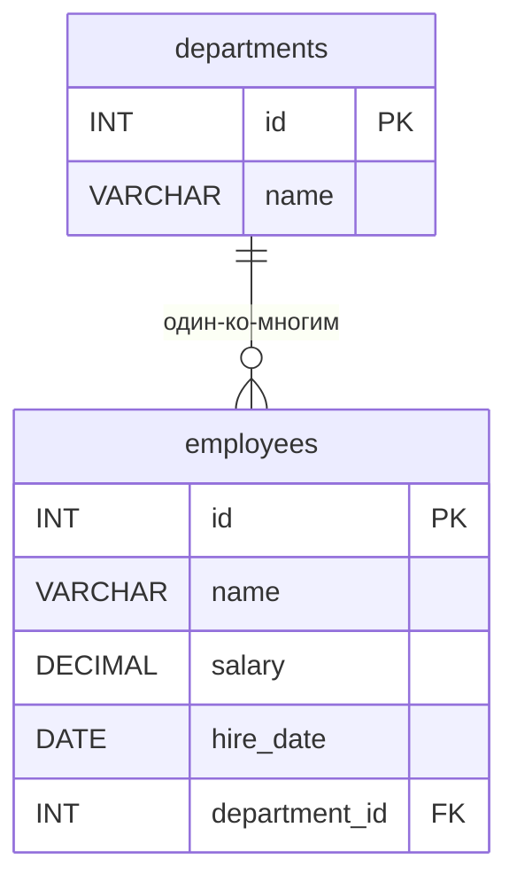

# ИТ.03 - 40 - Оконные функции в MySQL: продвинутый уровень

## Введение

В лекции 39 мы познакомились с оконными функциями: разобрали синтаксис `OVER()`, секции `PARTITION BY` и `ORDER BY`, ранжирующие функции (`ROW_NUMBER()`, `RANK()`, `DENSE_RANK()`, `NTILE()`), агрегатные функции в роли оконных, функции смещения `LAG()`, `LEAD()`, `FIRST_VALUE()` и именованные окна `WINDOW`. Тогда мы вскользь упомянули **рамку окна** (frame) — механизм, который управляет тем, какие именно строки попадают в вычисление для текущей строки.

Именно рамки, а также продвинутые статистические функции и типовые аналитические задачи — тема этой лекции. Без понимания рамок легко получить «неожиданные» результаты: например, `LAST_VALUE()` возвращает значение текущей строки, а бегущая сумма внезапно становится накопительной.

В этой лекции мы рассмотрим:
- рамку окна: границы `ROWS` и `RANGE`, рамку по умолчанию;
- скользящие (rolling) вычисления: суммы и средние по нескольким строкам;
- функции распределения: `CUME_DIST()`, `PERCENT_RANK()`, `NTH_VALUE()`;
- практические задачи: топ-N по группам, дедупликация строк, медиана, динамика показателей;
- сочетание оконных функций с `JOIN`, `CASE` и CTE;
- логический порядок выполнения запроса с оконными функциями;
- вопросы производительности и использования индексов.

Все примеры используют ту же учебную базу данных, что и лекция 39:

::: tabs

@tab Структура БД



@tab Данные

| id | name              | salary   | hire_date  | department_id |
|----|-------------------|----------|------------|---------------|
| 1  | Иван Петров       | 85000.00 | 2019-03-15 | 1             |
| 2  | Мария Сидорова    | 92000.00 | 2018-11-01 | 1             |
| 3  | Алексей Иванов    | 78000.00 | 2020-06-20 | 2             |
| 4  | Ольга Кузнецова   | 95000.00 | 2017-02-10 | 3             |
| 5  | Дмитрий Смирнов   | 88000.00 | 2021-09-05 | 1             |
| 6  | Елена Волкова     | 76000.00 | 2022-01-17 | 2             |
| 7  | Сергей Козлов     | 92000.00 | 2019-08-30 | 3             |
| 8  | Анна Морозова     | 85000.00 | 2023-04-12 | 1             |
| 9  | Павел Лебедев     | 99000.00 | 2016-05-23 | 3             |
| 10 | Наталья Орлова    | 81000.00 | 2021-12-01 | 2             |

:::

SQL-дамп таблиц и тестовых данных можно взять из лекции 39.

---

## Рамка окна: управляем набором строк

**Рамка окна** (window frame) — это подмножество строк партиции, относительно которого вычисляется оконная функция для каждой текущей строки. Пока рамка не задана явно, действует её значение по умолчанию, и именно оно объясняет «странное» поведение агрегатов с `ORDER BY`.

### Рамка по умолчанию

Если в окне есть `ORDER BY`, то по умолчанию используется рамка

```
RANGE BETWEEN UNBOUNDED PRECEDING AND CURRENT ROW
```

то есть «от начала партиции до текущей строки включительно». Именно поэтому `SUM(salary) OVER (ORDER BY hire_date)` даёт **накопительную** сумму, а не итог по всей партиции. Если же `ORDER BY` в окне нет, рамкой по умолчанию является вся партиция.

::: info

Рамка имеет смысл только тогда, когда окно содержит `ORDER BY`. Если сортировки нет, границы рамки просто не на что «натянуть» — вычисление идёт по всей партиции.

:::

### ROWS BETWEEN ... AND ...

Секция `ROWS BETWEEN ... AND ...` задаёт рамку **по количеству строк**: границы отсчитываются физически — столько-то строк до и после текущей. Типичная задача — **скользящее (rolling) окно** фиксированной ширины.

**Пример 1: Скользящая сумма и среднее за три строки**

Вычислим для каждого сотрудника сумму и среднюю зарплату по трём строкам: двум предыдущим (по дате приёма) и текущей.

```sql
SELECT
    name,
    salary,
    hire_date,
    SUM(salary) OVER (ORDER BY hire_date
                      ROWS BETWEEN 2 PRECEDING AND CURRENT ROW) AS rolling_sum_3,
    ROUND(AVG(salary) OVER (ORDER BY hire_date
                            ROWS BETWEEN 2 PRECEDING AND CURRENT ROW), 2) AS rolling_avg_3
FROM employees
ORDER BY hire_date;
```

Результат:

| name              | salary   | hire_date  | rolling_sum_3 | rolling_avg_3 |
|-------------------|----------|------------|---------------|---------------|
| Павел Лебедев     | 99000.00 | 2016-05-23 | 99000.00      | 99000.00      |
| Ольга Кузнецова   | 95000.00 | 2017-02-10 | 194000.00     | 97000.00      |
| Мария Сидорова    | 92000.00 | 2018-11-01 | 286000.00     | 95333.33      |
| Иван Петров       | 85000.00 | 2019-03-15 | 272000.00     | 90666.67      |
| Сергей Козлов     | 92000.00 | 2019-08-30 | 269000.00     | 89666.67      |
| Алексей Иванов    | 78000.00 | 2020-06-20 | 255000.00     | 85000.00      |
| Дмитрий Смирнов   | 88000.00 | 2021-09-05 | 258000.00     | 86000.00      |
| Наталья Орлова    | 81000.00 | 2021-12-01 | 247000.00     | 82333.33      |
| Елена Волкова     | 76000.00 | 2022-01-17 | 245000.00     | 81666.67      |
| Анна Морозова     | 85000.00 | 2023-04-12 | 242000.00     | 80666.67      |

Обратите внимание на первые две строки: рамка «упирается» в начало партиции, поэтому у Павла в окне всего одна строка (сумма 99000.00, среднее 99000.00), у Ольги — две (194000.00 и 97000.00). Начиная с третьей строки окно полностью заполнено тремя строками. Это нормальное поведение скользящих окон, и его нужно учитывать при интерпретации результатов.

Скользящие средние — стандартный инструмент сглаживания временных рядов: продажи по месяцам, нагрузка на серверы, посещаемость сайта. Вместо скачков «месяц к месяцу» они показывают устойчивый тренд.

### RANGE BETWEEN ... AND ...

Секция `RANGE` задаёт рамку **по значениям** ключа сортировки. Границы отсчитываются не по номерам строк, а по значениям столбца из `ORDER BY`: в рамку попадают **все** строки, значение которых укладывается в диапазон. Главное следствие — при одинаковых значениях ключа сортировки рамка `RANGE` захватывает сразу все такие строки, даже если их больше, чем позволяет «ширина» окна.

**Пример 2: Сравнение ROWS и RANGE при одинаковых зарплатах**

В нашей таблице есть пары сотрудников с одинаковой зарплатой (92000.00 и 85000.00). Сравним бегущую сумму при сортировке по убыванию зарплаты.

```sql
SELECT
    name,
    salary,
    SUM(salary) OVER (ORDER BY salary DESC
                      ROWS BETWEEN UNBOUNDED PRECEDING AND CURRENT ROW) AS rows_running,
    SUM(salary) OVER (ORDER BY salary DESC
                      RANGE BETWEEN UNBOUNDED PRECEDING AND CURRENT ROW) AS range_running
FROM employees
ORDER BY salary DESC;
```

Результат:

| name              | salary   | rows_running | range_running |
|-------------------|----------|--------------|---------------|
| Павел Лебедев     | 99000.00 | 99000.00     | 99000.00      |
| Ольга Кузнецова   | 95000.00 | 194000.00    | 194000.00     |
| Мария Сидорова    | 92000.00 | 286000.00    | 378000.00     |
| Сергей Козлов     | 92000.00 | 378000.00    | 378000.00     |
| Дмитрий Смирнов   | 88000.00 | 466000.00    | 466000.00     |
| Иван Петров       | 85000.00 | 551000.00    | 636000.00     |
| Анна Морозова     | 85000.00 | 636000.00    | 636000.00     |
| Наталья Орлова    | 81000.00 | 717000.00    | 717000.00     |
| Алексей Иванов    | 78000.00 | 795000.00    | 795000.00     |
| Елена Волкова     | 76000.00 | 871000.00    | 871000.00     |

Разница видна на строках с одинаковыми зарплатами:

- **Мария Сидорова** (первая из двух с зарплатой 92000.00): `ROWS` учитывает только одну строку с 92000.00 → 286000.00, а `RANGE` включает **обе** строки с этим значением → 378000.00.
- **Сергей Козлов** (вторая 92000.00): в `ROWS` к предыдущей сумме добавляется ещё одна 92000.00 → 378000.00, а `RANGE` даёт тот же результат, что и у Марии, — 378000.00.
- Аналогично ведут себя строки с зарплатой 85000.00: у Ивана Петрова `rows_running` = 551000.00, а `range_running` сразу включает обе строки → 636000.00.

То есть `RANGE` гарантирует, что строки с одинаковым значением ключа сортировки всегда получают **одинаковое** значение оконной функции.

::: warning

Правило «одинаковые значения — одинаковый результат» работает только для `RANGE`. Секция `ROWS` обрабатывает такие строки по отдельности, в порядке их появления, поэтому соседние «дубли» могут получить разные значения.

:::

### Сводка границ рамки

Полный перечень границ, которые можно указывать внутри `ROWS BETWEEN ... AND ...` / `RANGE BETWEEN ... AND ...`:

| Граница                 | ROWS                            | RANGE                                          |
|-------------------------|---------------------------------|------------------------------------------------|
| `UNBOUNDED PRECEDING`   | От начала партиции              | От начала партиции                             |
| `N PRECEDING`           | N строк до текущей              | Значения, отстоящие от текущего не более чем на N |
| `CURRENT ROW`           | Текущая строка                  | Все строки с тем же значением ключа сортировки |
| `N FOLLOWING`           | N строк после текущей           | Значения, отстоящие от текущего не более чем на N |
| `UNBOUNDED FOLLOWING`   | До конца партиции               | До конца партиции                              |

Также допустимы сокращённые формы: `ROWS UNBOUNDED PRECEDING` (эквивалентно `ROWS BETWEEN UNBOUNDED PRECEDING AND CURRENT ROW`) и `ROWS N PRECEDING`.

::: tip

Приём из лекции 39: чтобы агрегатная функция считалась по **всей партиции**, несмотря на `ORDER BY`, задайте рамку явно:

```sql
SUM(salary) OVER (ORDER BY salary DESC
                  ROWS BETWEEN UNBOUNDED PRECEDING AND UNBOUNDED FOLLOWING)
```

:::

---

## Функции распределения

Помимо ранжирующих функций в MySQL 8 доступны функции, возвращающие **относительную позицию** строки в окне.

### CUME_DIST() — кумулятивное распределение

`CUME_DIST()` возвращает долю строк, значение которых **меньше или равно** значению текущей строки (в порядке сортировки окна):

```
CUME_DIST() = (число строк со значением <= текущего) / (всего строк в партиции)
```

Значение всегда находится в диапазоне от `0` до `1` включительно. Для строки с максимальным значением `CUME_DIST()` равна `1`.

**Пример 3: Кумулятивное распределение зарплат**

```sql
SELECT
    name,
    salary,
    ROUND(CUME_DIST() OVER (ORDER BY salary), 3) AS cume_dist
FROM employees
ORDER BY salary;
```

Результат:

| name              | salary   | cume_dist |
|-------------------|----------|-----------|
| Елена Волкова     | 76000.00 | 0.100     |
| Алексей Иванов    | 78000.00 | 0.200     |
| Наталья Орлова    | 81000.00 | 0.300     |
| Иван Петров       | 85000.00 | 0.500     |
| Анна Морозова     | 85000.00 | 0.500     |
| Дмитрий Смирнов   | 88000.00 | 0.600     |
| Мария Сидорова    | 92000.00 | 0.800     |
| Сергей Козлов     | 92000.00 | 0.800     |
| Ольга Кузнецова   | 95000.00 | 0.900     |
| Павел Лебедев     | 99000.00 | 1.000     |

У двух сотрудников с зарплатой 85000.00 доля одинаковая — 0.500, потому что 5 строк из 10 имеют зарплату не выше 85000.00. Максимальной зарплате соответствует `cume_dist = 1.000`.

### PERCENT_RANK() — процентный ранг

`PERCENT_RANK()` показывает относительную позицию строки между первой и последней строкой окна:

```
PERCENT_RANK() = (RANK() - 1) / (всего строк - 1)
```

Первая строка всегда получает `0`, последняя — `1`. В отличие от `CUME_DIST()`, этот показатель не учитывает «хвост» одинаковых значений.

**Пример 4: Сравнение CUME_DIST() и PERCENT_RANK()**

```sql
SELECT
    name,
    salary,
    ROUND(CUME_DIST() OVER (ORDER BY salary), 3) AS cume_dist,
    ROUND(PERCENT_RANK() OVER (ORDER BY salary), 3) AS percent_rank
FROM employees
ORDER BY salary;
```

Результат:

| name              | salary   | cume_dist | percent_rank |
|-------------------|----------|-----------|--------------|
| Елена Волкова     | 76000.00 | 0.100     | 0.000        |
| Алексей Иванов    | 78000.00 | 0.200     | 0.111        |
| Наталья Орлова    | 81000.00 | 0.300     | 0.222        |
| Иван Петров       | 85000.00 | 0.500     | 0.333        |
| Анна Морозова     | 85000.00 | 0.500     | 0.333        |
| Дмитрий Смирнов   | 88000.00 | 0.600     | 0.556        |
| Мария Сидорова    | 92000.00 | 0.800     | 0.667        |
| Сергей Козлов     | 92000.00 | 0.800     | 0.667        |
| Ольга Кузнецова   | 95000.00 | 0.900     | 0.889        |
| Павел Лебедев     | 99000.00 | 1.000     | 1.000        |

Разница между функциями видна на примере зарплаты 88000.00: `cume_dist = 0.600` («60% сотрудников получают не больше»), а `percent_rank = 0.556` («строка прошла 55.6% пути от минимальной зарплаты до максимальной»).

::: tip

`CUME_DIST()` и `PERCENT_RANK()` удобны для построения произвольных процентилей и децилей: например, «топ-20% самых дорогих товаров» — это строки с `cume_dist >= 0.8`.

:::

### NTH_VALUE() — значение n-й строки окна

`NTH_VALUE(столбец, n)` возвращает значение столбца из **n-й строки** рамки. Здесь рамка играет решающую роль: по умолчанию она заканчивается на текущей строке, поэтому для «настоящего» n-го значения всей партиции нужно расширять рамку до `UNBOUNDED FOLLOWING`.

**Пример 5: Вторая по величине зарплата в каждом отделе**

```sql
SELECT
    name,
    salary,
    department_id,
    NTH_VALUE(salary, 2) OVER w AS second_highest_dept
FROM employees
WINDOW w AS (PARTITION BY department_id ORDER BY salary DESC
             ROWS BETWEEN UNBOUNDED PRECEDING AND UNBOUNDED FOLLOWING)
ORDER BY department_id, salary DESC;
```

Результат:

| name              | salary   | department_id | second_highest_dept |
|-------------------|----------|---------------|---------------------|
| Мария Сидорова    | 92000.00 | 1             | 88000.00            |
| Дмитрий Смирнов   | 88000.00 | 1             | 88000.00            |
| Иван Петров       | 85000.00 | 1             | 88000.00            |
| Анна Морозова     | 85000.00 | 1             | 88000.00            |
| Наталья Орлова    | 81000.00 | 2             | 78000.00            |
| Алексей Иванов    | 78000.00 | 2             | 78000.00            |
| Елена Волкова     | 76000.00 | 2             | 78000.00            |
| Павел Лебедев     | 99000.00 | 3             | 95000.00            |
| Ольга Кузнецова   | 95000.00 | 3             | 95000.00            |
| Сергей Козлов     | 92000.00 | 3             | 95000.00            |

Для каждой строки вернулась вторая по величине зарплата **её отдела** (для отдела 2 — 78000.00, для отдела 3 — 95000.00), причём одинаково для всех строк партиции благодаря полной рамке `UNBOUNDED PRECEDING ... UNBOUNDED FOLLOWING`.

::: warning

Без явной рамки `NTH_VALUE(salary, 2)` вернёт `NULL` для первой строки (в рамке «до текущей» ещё нет второй строки), а для последующих строк будет показывать вторую строку среди уже пройденных. При планировании запроса всегда уточняйте рамку.

:::

---

## Практические аналитические задачи

Объединим изученные приёмы для решения задач, которые регулярно встречаются в реальных отчётах.

### Топ-N сотрудников в каждом отделе

Классическая задача «выдать трёх лучших по каждой группе». Решение опирается на правило из лекции 39: оконную функцию нельзя использовать в `WHERE`, поэтому сначала нумеруем строки в CTE, а затем фильтруем по номеру.

**Пример 6: Два самых высокооплачиваемых сотрудника каждого отдела**

```sql
WITH ranked AS (
    SELECT
        name,
        salary,
        department_id,
        ROW_NUMBER() OVER (PARTITION BY department_id ORDER BY salary DESC) AS rn
    FROM employees
)
SELECT name, salary, department_id
FROM ranked
WHERE rn <= 2
ORDER BY department_id, salary DESC;
```

Результат:

| name              | salary   | department_id |
|-------------------|----------|---------------|
| Мария Сидорова    | 92000.00 | 1             |
| Дмитрий Смирнов   | 88000.00 | 1             |
| Наталья Орлова    | 81000.00 | 2             |
| Алексей Иванов    | 78000.00 | 2             |
| Павел Лебедев     | 99000.00 | 3             |
| Ольга Кузнецова   | 95000.00 | 3             |

Если вместо «ровно двух» нужны «все, кто входит в двойку лидеров» (с учётом одинаковых зарплат), замените `ROW_NUMBER()` на `RANK()` или `DENSE_RANK()` — тогда при равенстве значений в топ попадут все связанные строки.

### Дедупликация строк

`ROW_NUMBER()` идеально подходит для поиска дубликатов: пронумеруем строки внутри групп, определяемых ключом уникальности, и оставим только первую.

**Пример 7: Поиск дубликатов по имени и отделу**

```sql
WITH numbered AS (
    SELECT
        id,
        name,
        department_id,
        ROW_NUMBER() OVER (PARTITION BY name, department_id ORDER BY id) AS rn
    FROM employees
)
SELECT id, name, department_id, rn
FROM numbered
WHERE rn > 1;
```

В нашей базе дубликатов нет, поэтому запрос вернёт пустой результат. Однако тот же паттерн легко превращается в удаление лишних строк (MySQL 8.0 поддерживает `DELETE` с CTE):

```sql
WITH numbered AS (
    SELECT
        id,
        ROW_NUMBER() OVER (PARTITION BY name, department_id ORDER BY id) AS rn
    FROM employees
)
DELETE e
FROM employees e
JOIN numbered n ON n.id = e.id
WHERE n.rn > 1;
```

::: info

Такой способ дедупликации часто применяется после импорта данных из внешних источников: сначала данные попадают во временную таблицу без ограничений, затем дубликаты помечаются и удаляются одним запросом.

:::

### Медианная зарплата

Медиана — значение, которое делит упорядоченную выборку пополам. В отличие от среднего арифметического, она устойчива к выбросам. Алгоритм на оконных функциях:

1. нумеруем строки по возрастанию зарплаты (`ROW_NUMBER()`);
2. узнаём общее количество строк (`COUNT(*) OVER ()`);
3. берём строки, номера которых приходятся на середину: `FLOOR((n + 1) / 2)` и `CEIL((n + 1) / 2)`;
4. усредняем их значения.

Для чётного количества строк (у нас 10) медиана — среднее пятой и шестой строк.

**Пример 8: Медианная зарплата сотрудников**

```sql
WITH ranked AS (
    SELECT
        salary,
        ROW_NUMBER() OVER (ORDER BY salary) AS rn,
        COUNT(*) OVER () AS total
    FROM employees
)
SELECT ROUND(AVG(salary), 2) AS median_salary
FROM ranked
WHERE rn IN (FLOOR((total + 1) / 2), CEIL((total + 1) / 2));
```

Результат:

| median_salary |
|---------------|
| 86500.00      |

Проверим вручную: упорядоченный ряд зарплат — 76000, 78000, 81000, 85000, **85000, 88000**, 92000, 92000, 95000, 99000. Пятая строка — 85000.00, шестая — 88000.00, их среднее равно 86500.00. Среднее арифметическое всех зарплат (87100.00) отличается — медиана менее чувствительна к «дорогому» Павлу Лебедеву с зарплатой 99000.00.

### Динамика: прирост относительно предыдущей строки

`LAG()` позволяет сравнивать строку не только с предыдущей по значению, но и выражать разницу в процентах — стандартный приём для отчётов о росте продаж, зарплат, посещаемости.

**Пример 9: Процент изменения зарплаты относительно предыдущего принятого сотрудника**

```sql
SELECT
    name,
    salary,
    hire_date,
    LAG(salary) OVER (ORDER BY hire_date) AS prev_salary,
    ROUND(
        (salary - LAG(salary) OVER (ORDER BY hire_date))
        / LAG(salary) OVER (ORDER BY hire_date) * 100, 2
    ) AS growth_pct
FROM employees
ORDER BY hire_date;
```

Результат:

| name              | salary   | hire_date  | prev_salary | growth_pct |
|-------------------|----------|------------|-------------|------------|
| Павел Лебедев     | 99000.00 | 2016-05-23 | NULL        | NULL       |
| Ольга Кузнецова   | 95000.00 | 2017-02-10 | 99000.00    | -4.04      |
| Мария Сидорова    | 92000.00 | 2018-11-01 | 95000.00    | -3.16      |
| Иван Петров       | 85000.00 | 2019-03-15 | 92000.00    | -7.61      |
| Сергей Козлов     | 92000.00 | 2019-08-30 | 85000.00    | 8.24       |
| Алексей Иванов    | 78000.00 | 2020-06-20 | 92000.00    | -15.22     |
| Дмитрий Смирнов   | 88000.00 | 2021-09-05 | 78000.00    | 12.82      |
| Наталья Орлова    | 81000.00 | 2021-12-01 | 88000.00    | -7.95      |
| Елена Волкова     | 76000.00 | 2022-01-17 | 81000.00    | -6.17      |
| Анна Морозова     | 85000.00 | 2023-04-12 | 76000.00    | 11.84      |

Для первой строки предыдущей зарплаты нет — `growth_pct` равен `NULL`. Чтобы не портить отчёт, замените `NULL` через `COALESCE()` или отфильтруйте такие строки в CTE.

---

## Комбинируем с другими конструкциями

### Оконные функции и JOIN

Оконные функции отлично сочетаются с соединениями: сначала строится результат `JOIN`, затем над ним выполняются оконные вычисления. Удобно использовать алиасы таблиц, чтобы не было неоднозначности столбцов.

**Пример 10: Рейтинг сотрудников по зарплате с названием отдела**

```sql
SELECT
    d.name AS department,
    e.name,
    e.salary,
    RANK() OVER (PARTITION BY d.id ORDER BY e.salary DESC) AS dept_rank
FROM employees e
JOIN departments d ON d.id = e.department_id
ORDER BY d.id, dept_rank;
```

Результат:

| department | name              | salary   | dept_rank |
|------------|-------------------|----------|-----------|
| Разработка | Мария Сидорова    | 92000.00 | 1         |
| Разработка | Дмитрий Смирнов   | 88000.00 | 2         |
| Разработка | Иван Петров       | 85000.00 | 3         |
| Разработка | Анна Морозова     | 85000.00 | 3         |
| Маркетинг  | Наталья Орлова    | 81000.00 | 1         |
| Маркетинг  | Алексей Иванов    | 78000.00 | 2         |
| Маркетинг  | Елена Волкова     | 76000.00 | 3         |
| Финансы    | Павел Лебедев     | 99000.00 | 1         |
| Финансы    | Ольга Кузнецова   | 95000.00 | 2         |
| Финансы    | Сергей Козлов     | 92000.00 | 3         |

### CASE и условная логика

Оконные функции можно использовать внутри `CASE`, чтобы классифицировать строки относительно агрегатов.

**Пример 11: Сравнение зарплаты сотрудника со средней по отделу**

```sql
SELECT
    name,
    salary,
    department_id,
    CASE
        WHEN salary > AVG(salary) OVER (PARTITION BY department_id) THEN 'выше среднего'
        WHEN salary < AVG(salary) OVER (PARTITION BY department_id) THEN 'ниже среднего'
        ELSE 'равна средней'
    END AS vs_dept_avg
FROM employees
ORDER BY department_id, salary DESC;
```

Результат:

| name              | salary   | department_id | vs_dept_avg    |
|-------------------|----------|---------------|----------------|
| Мария Сидорова    | 92000.00 | 1             | выше среднего  |
| Дмитрий Смирнов   | 88000.00 | 1             | выше среднего  |
| Иван Петров       | 85000.00 | 1             | ниже среднего  |
| Анна Морозова     | 85000.00 | 1             | ниже среднего  |
| Наталья Орлова    | 81000.00 | 2             | выше среднего  |
| Алексей Иванов    | 78000.00 | 2             | ниже среднего  |
| Елена Волкова     | 76000.00 | 2             | ниже среднего  |
| Павел Лебедев     | 99000.00 | 3             | выше среднего  |
| Ольга Кузнецова   | 95000.00 | 3             | ниже среднего  |
| Сергей Козлов     | 92000.00 | 3             | ниже среднего  |

Ольга Кузнецова получает 95000.00 при средней по финансовому отделу 95333.33 — формально это чуть ниже среднего, что и отражает классификация.

### CTE как мост к фильтрации

Как мы уже видели в примерах 6–8, CTE — основной способ «отфильтровать» по значению оконной функции: внутри CTE оконные функции вычисляются, а во внешнем запросе к их результатам можно обращаться в `WHERE` наравне с обычными столбцами. Это работает и для агрегирования по результатам оконных функций:

```sql
WITH avg_by_dept AS (
    SELECT
        department_id,
        AVG(salary) OVER (PARTITION BY department_id) AS dept_avg
    FROM employees
)
SELECT department_id, MAX(dept_avg) AS max_avg
FROM avg_by_dept
GROUP BY department_id;
```

---

## Порядок выполнения запроса с оконными функциями

Логический порядок обработки запроса (не путать с физическим планом!) выглядит так:

| Шаг | Секция                  | Что происходит                                                       |
|-----|-------------------------|----------------------------------------------------------------------|
| 1   | `FROM` / `JOIN`         | Формируется исходный набор строк                                     |
| 2   | `WHERE`                 | Отсеиваются строки, не удовлетворяющие условиям                      |
| 3   | `GROUP BY`              | Строки группируются (если задана группировка)                        |
| 4   | `HAVING`                | Отсеиваются группы                                                    |
| 5   | **Оконные функции**     | Вычисляются значения `OVER(...)` над строками/группами этого этапа    |
| 6   | `SELECT`                | Формируются выходные столбцы                                         |
| 7   | `DISTINCT`              | Удаляются дублирующиеся строки результата                            |
| 8   | `ORDER BY`              | Сортируется итоговый результат                                        |
| 9   | `LIMIT` / `OFFSET`      | Ограничивается количество возвращаемых строк                         |

Из этой таблицы следуют два важных вывода:

1. Оконные функции вычисляются **после** `WHERE`, `GROUP BY` и `HAVING` — поэтому ссылаться на их результат в этих секциях нельзя.
2. Оконные функции вычисляются **до** `ORDER BY`, но сам `ORDER BY` может использовать их результат — в конце концов, столбец уже вычислен.

::: warning

Порядок `FROM → WHERE → GROUP BY → HAVING → оконные функции` означает, что оконные функции «видят» уже отфильтрованные и сгруппированные данные. Например, `COUNT(*) OVER ()` после `WHERE salary > 80000` посчитает количество строк только после фильтрации, а не во всей таблице.

:::

---

## Производительность и индексы

Оконные функции требуют от сервера сортировки и временного хранения данных, поэтому на больших таблицах стоит помнить о следующих правилах:

1. **Индексы под секции окна.** Столбцы из `PARTITION BY` и `ORDER BY` желательно покрывать индексом. Например, для `OVER (PARTITION BY department_id ORDER BY salary DESC)` полезен составной индекс `(department_id, salary)` — сервер сможет читать строки уже отсортированными по партициям и зарплате.

2. **Фильтруйте как можно раньше.** Оконные функции считаются по всем строкам, прошедшим `WHERE`. Если отчёт требует данные только за один год — добавьте условие в `WHERE` до оконных вычислений, а не обрезайте результат после.

3. **Минимизируйте объём промежуточных данных.** Тяжёлый `JOIN` увеличивает количество строк, по которым считается окно. Если возможно, агрегируйте или фильтруйте стороны соединения заранее.

4. **Избегайте лишних оконных функций.** Каждая функция с собственным окном — это отдельная сортировка/временная структура. Если несколько функций используют одинаковое окно — применяйте `WINDOW`, как в лекции 39.

5. **Следите за сортировкой.** Если внешний `ORDER BY` совпадает с порядком окна, сервер может переиспользовать уже отсортированные данные и не выполнять лишнюю сортировку.

---

## Практические рекомендации

1. **Всегда задавайте рамку явно**, когда результат зависит от того, какие строки попадают в вычисление: полная партиция (`ROWS BETWEEN UNBOUNDED PRECEDING AND UNBOUNDED FOLLOWING`), скользящее окно (`ROWS BETWEEN N PRECEDING AND CURRENT ROW`) или накопительный итог (рамка по умолчанию).

2. **Выбирайте `ROWS` или `RANGE` осознанно.** `ROWS` — точное количество строк, `RANGE` — все строки с равным значением ключа сортировки. Для финансовых расчётов и статистики чаще нужен предсказуемый `ROWS`.

3. **Помните про «дубли».** При одинаковых значениях сортировки `RANGE` даёт одинаковый результат для всех таких строк, а `ROWS` — разные.

4. **Топ-N и дедупликацию стройте через CTE.** Номер строки внутри CTE, фильтр `WHERE rn <= N` снаружи — универсальный и читаемый шаблон.

5. **Проверяйте крайние случаи.** Первая строка окна для `LAG()`, вторая строка для `NTH_VALUE(expr, 2)` с рамкой по умолчанию, пустые рамки в начале скользящих окон — везде ожидайте `NULL` и обрабатывайте его через `COALESCE()` или фильтрацию.

6. **Используйте `CUME_DIST()` и `PERCENT_RANK()` для процентилей**, когда нужно делить данные на доли, а не на корзины фиксированного размера.

7. **Следите за объёмом данных.** Чем меньше строк дошло до этапа оконных функций, тем быстрее запрос: фильтруйте в `WHERE`, проектируйте индексы под `PARTITION BY`/`ORDER BY`.

::: quiz source=./includes/quiz-40.yaml
:::