<!-- @include: ./includes/_disclaimer.md -->

# Инструкция по установке и настройке СУБД MySQL CE 8 под MS Windows x64

Для того, чтобы установить и настроить систему управления базами данных (далее СУБД), необходимо:

## Скачивание

Перейти по ссылке: [https://dev.mysql.com/downloads/installer/ ↗](https://dev.mysql.com/downloads/installer/) и выбрать в каком виде вы желаете скачать установщик файлов СУБД (первый вариант меньше по объему, и при установке будет докачивать необходимые части из интернета, в то время как второй вариант включает практически полный набор компонентов для дальнейшей установки без необходимости что-либо докачивать в процессе) и нажать кнопку «**Download**» напротив соответствующей версии.

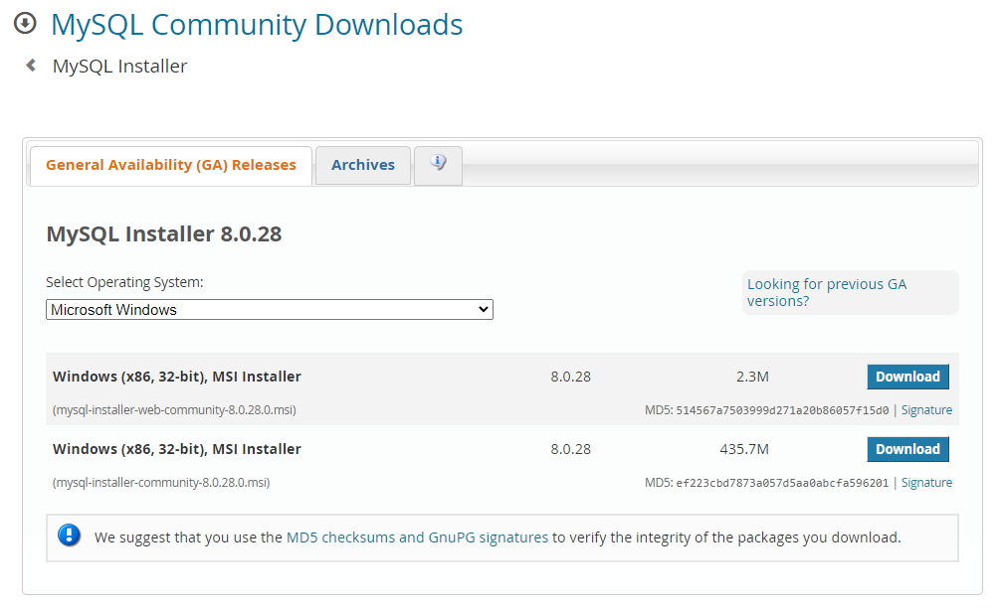

После того как вы выбрали устраивающий вас установочный пакет и нажали кнопку «**Download**» вас автоматически переадресует на страницу загрузки.

Если у вас нет зарегистрированного аккаунта в системе Oracle, вы можете нажать кнопку «**No thanks, just start my download**», после чего в указанную вами папку начнется скачивание файла.

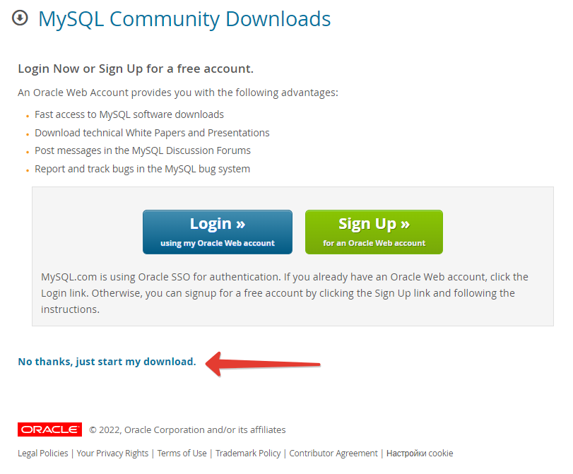

## Установка

После завершения загрузки вам необходимо открыть установочный файл `mysql-installer-community-8.0.28.0.msi` (на примере полной версии).

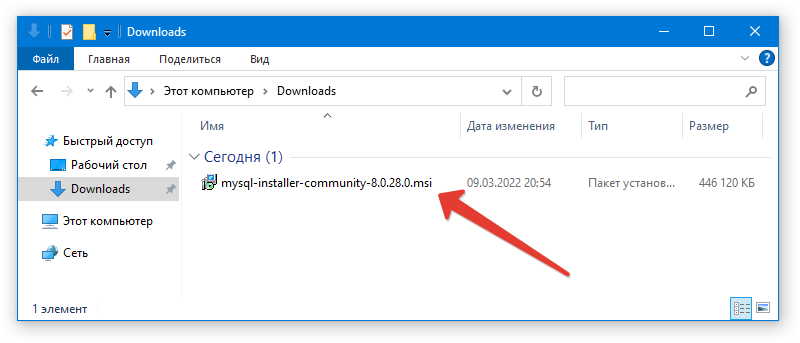

После открытия установочного файла программа установки спросит у вас какой тип установки вы хотите выбрать. Вам необходимо выбрать тип установки «**Custom**».

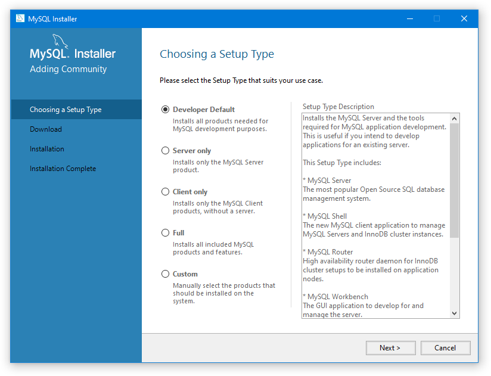

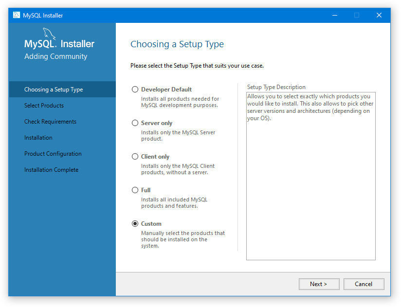

На следующем шаге окно разделено на две области, в левой части находится вложенный список с доступными для установки компонентами, а в правой части — те компоненты что буду установлены. Если в правой части есть какие-то компоненты выбранные по-умолчанию, уберите их нажав на двойную зеленую стрелочку, указывающую влево(посередине между списками).

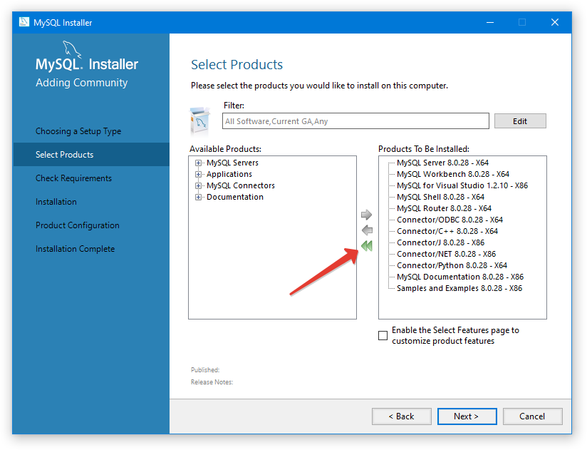

Далее из доступных компонентов в левой части найдите и выберите следующие:

- Обязательно:
    - `MySQL Server 8.0.28` — Серверная часть СУБД, именно она отвечает за хранение данных и все операции с ними.
    - `MySQL Workbench 8.0.28` — Клиентская часть СУБД, позволяет отправлять запросы к серверной части, обрабатывать ответы а также работать с данными через оконные интерфейсы.
- Опционально:
    - `MySQL Shell 8.0.28` — Расширение командной строки для отправки прямых запросов к серверной части СУБД через терминал.
    - `MySQL Documentation 8.0.28` — Официальная документация для выбранной версии СУБД.

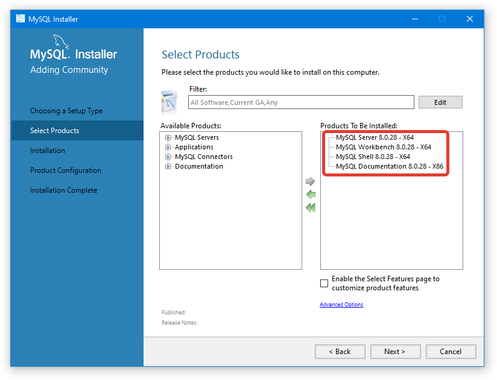

После чего нажмите «**Next**».

Если на данном этапе вы увидите окно с установкой Microsoft Visual C++ Redistributables, установите и его.

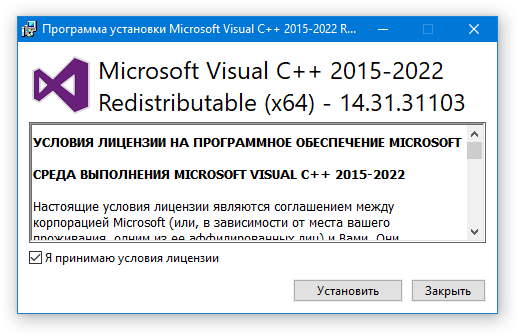

Если вдруг окно не появляется но установка дальше не проходит из-за отсутствия данных компонентов, можете попробовать скачать их:

- С официального сайта:
[https://docs.microsoft.com/en-us/cpp/windows/latest-supported-vc-redist ↗](https://docs.microsoft.com/en-us/cpp/windows/latest-supported-vc-redist)

Если выбран минимальный установщик, то для начала покажется окно скачивания недостающих компонентов, а для полного установщика сразу пройдет следующий шаг со списком компонентов для установки, который должен выглядеть следующим образом:

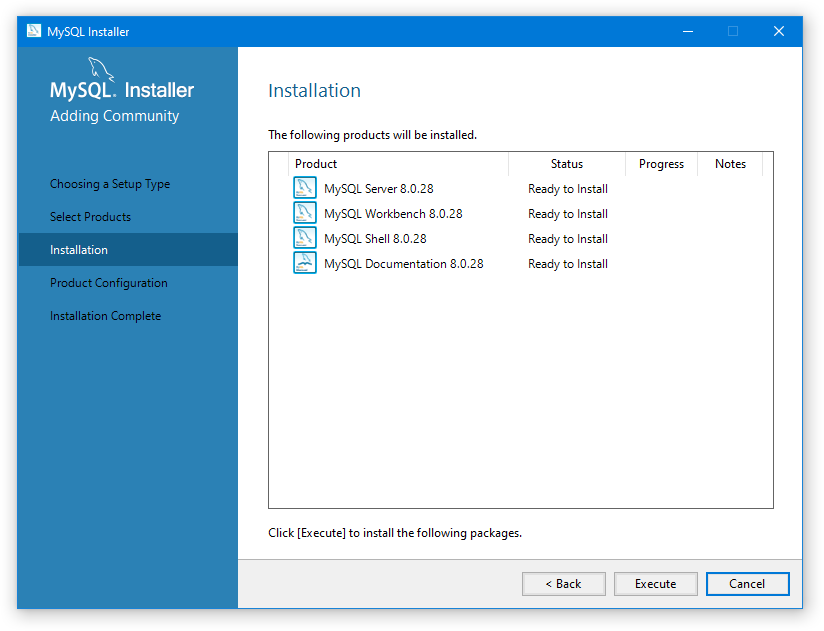

нажмите кнопку «**Execute**».

После успешной установки всех компонентов окно должно выглядеть так:

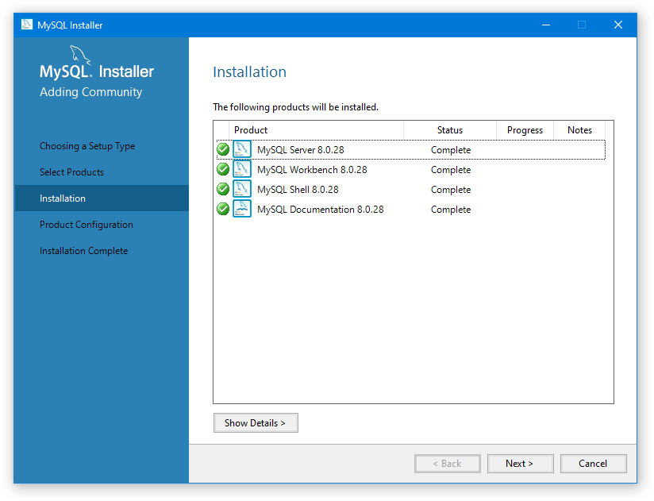

нажмите кнопку «**Next**».

После всех шагов вы окажетесь в окне конфигурации компонентов. В нашем случае конфигурации требует только серверная часть СУБД.

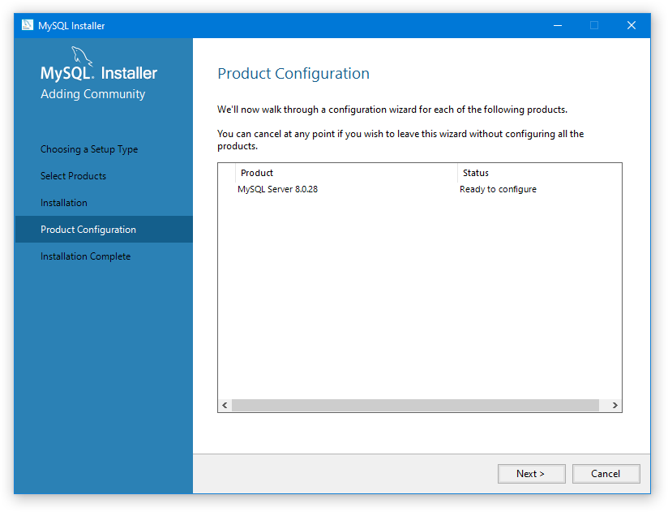

нажмите кнопку «**Next**».

## Настройка

В первом окне оставьте настройки по-умолчанию. Набор настроек должен выглядеть следующим образом:

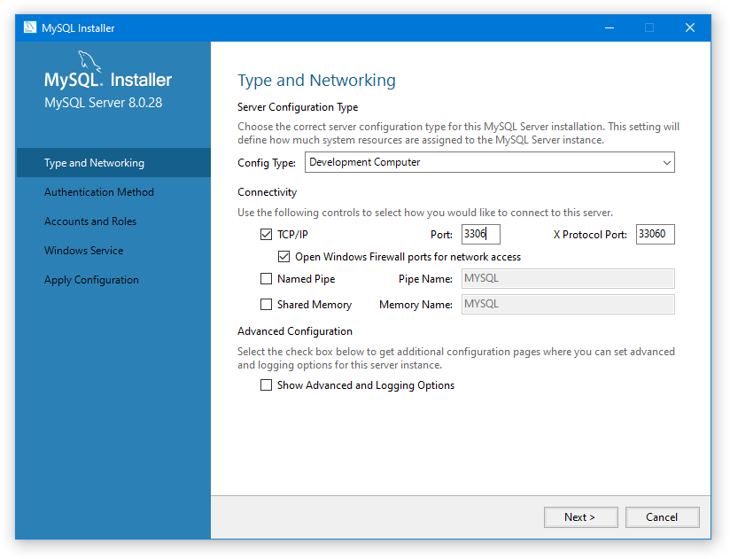

Подробнее в таблице:

| Config type     | Development computer         |
| --------------- | ---------------------------- |
| TCP/IP          | On                           |
| Port            | 3306                         |
| X Protocol port | 33060                        |
| Named Pipe      | Off (Pipe name — Disabled)   |
| Shared Memory   | Off (Memory Name — Disabled) |

нажмите кнопку «**Next**».

На текущем шаге предстоит выбрать метод аутентификации (по сути — алгоритм шифрования паролей).

Варианта всего два:

1. Новый криптостойкий алгоритм шифрования, появившийся только в 8-й версии MySQL. Рекомендуется разработчиками данной СУБД.
2. Старый алгоритм шифрования, использовавшийся в 5-й версии MySQL, он менее безопасен, но в учебных целях мы **будем использовать именно его**, т.к. данный алгоритм позволяет без лишних настроек работать с серверной частью большинству сторонних клиентов.

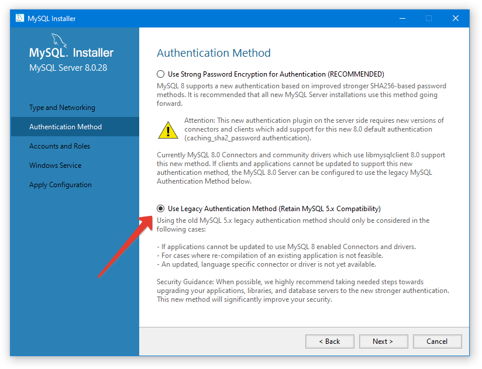

нажмите кнопку «**Next**».

На текущем шаге необходимо установить пароль для СУБД.

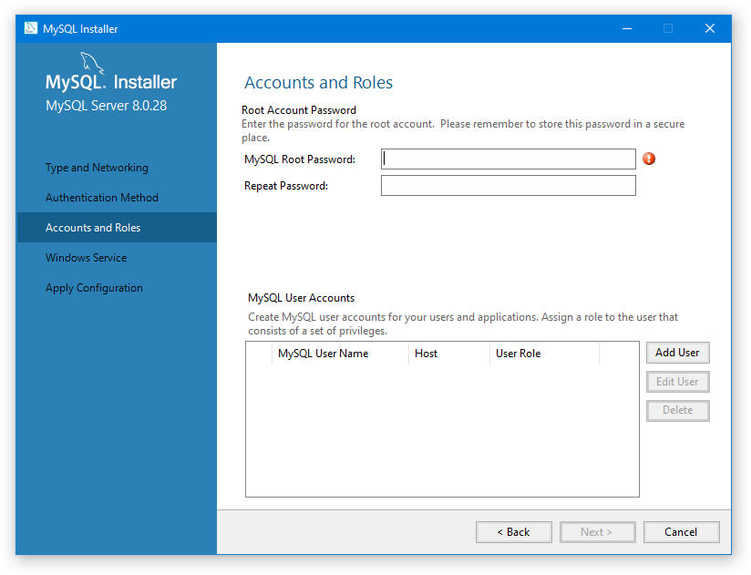

Придумайте пароль и запишите его в два верхних поля.

Для образовательных целей это может быть что-то простое вроде: `12345678`, но в реальных проектах такие простые пароли не используют из соображений безопасности.

как только введенная пара паролей совпадет, кнопка «**Next**» станет активной и вы сможете на нее нажать.

Для образовательных целей можно не обращать внимание на сообщение о том что пароль является слабым.

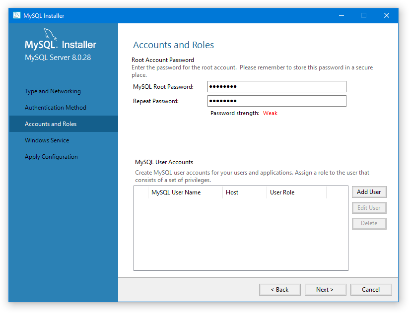

нажмите кнопку «**Next**».

На текущем экране указывается имя фонового сервиса, под которым в операционной системе будет работать СУБД, а также настраивается будет ли сервер стартовать автоматически при загрузке системы и от имени какого пользователя. Пока оставим все как есть.

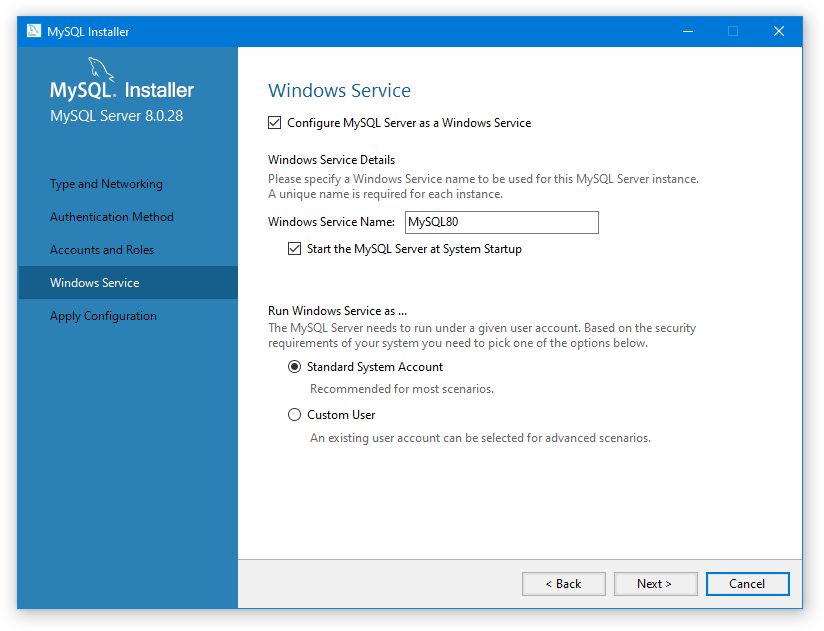

нажмите кнопку «**Next**».

Данный шаг служит для применения конфигураций ко всем компонентам СУБД.:

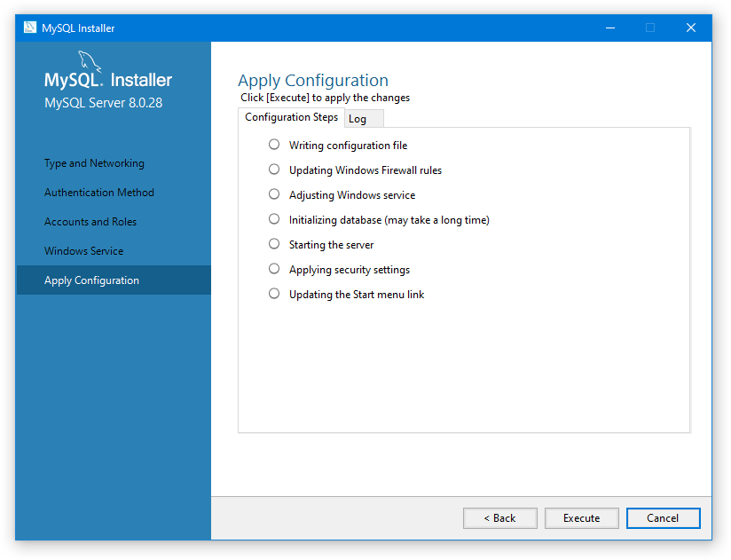

нажмите кнопку «**Execute**».

Для нашей конфигурации все должно произойти довольно быстро, и окно наконец примет следующий вид:

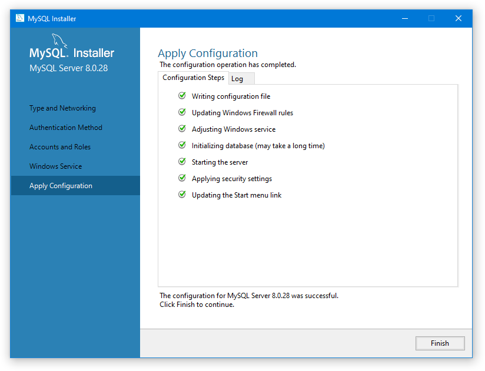

нажмите кнопку «**Finish**».

Иногда после этого шага установщик может вернуть нас на шаг настройки компонентов, однако не стоит на это обращать внимания, просто пропустить. И наконец, если никаких проблем в конфигурациях не возникло, мы наконец увидим настоящее окно завершения установки. Здесь советую убрать галочки с автоматического запуска клиентов.

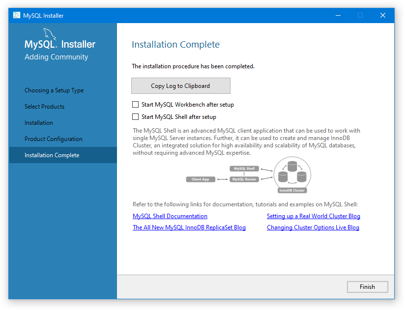

здесь в последний раз нажмите кнопку «**Finish**».

## Запуск

Теперь в меню «**Пуск**» в папке «**MySQL**» должны располагаться все установленные компоненты СУБД,

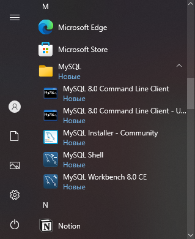

Здесь нас интересует пока только пункт MySQL Workbench 8 CE, запускаем его.

Если после первого запуска окно выглядит следующим образом:

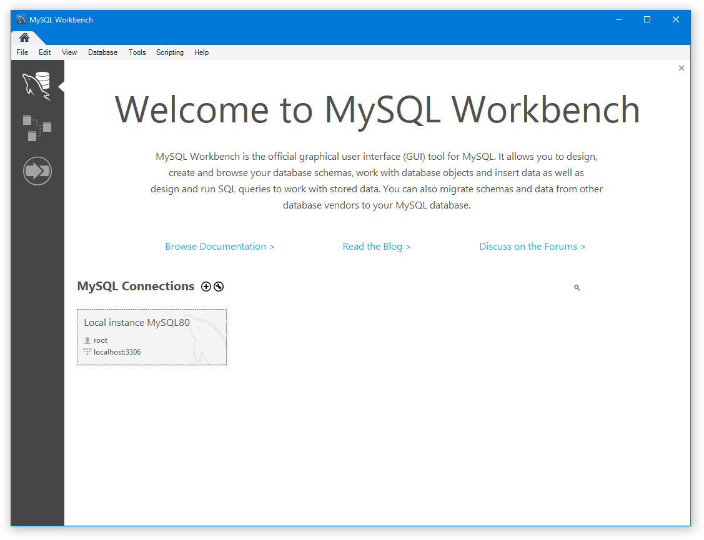

значит MySQL Workbench нашел развернутый сервер, и готов установить подключение по-умолчанию.

Если же этого не произошло, и окно выглядит подобным образом:

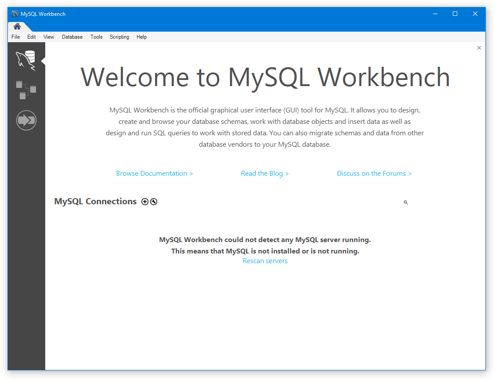

то у вас есть два варианта:

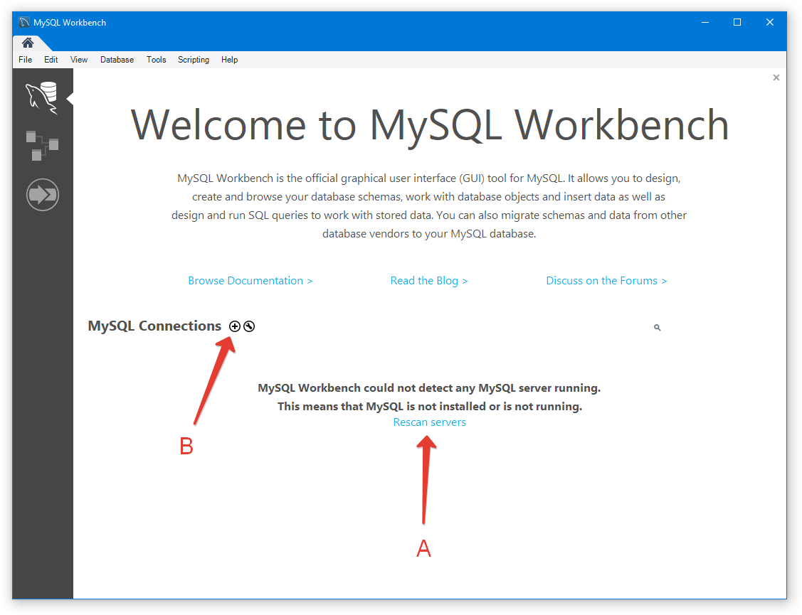

### Вариант A

Просто нажать на кнопку «**Rescan servers**» и подождать пока MySQL Workbench найдет запущенный сервер и подключится к нему с настройками по-умолчанию.

### Вариант B

Если предыдущий вариант не дал результатов, придется настроить подключение вручную, для начала нажав на «**+**», после чего вы увидите такое окно:

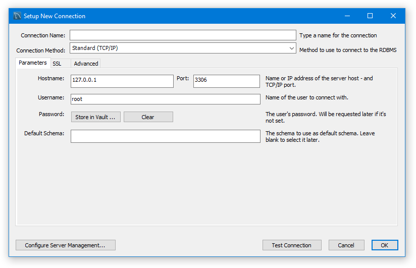

В верхнем поле напротив «**Connection name**» укажите название соединения, например «**localhost**»(не влияет ни на что, только на отображение в списке), и убедитесь что введены настройки, соответсвующие значениям из таблицы:

| Hostname | 127.0.01 |
| --- | --- |
| Port | 3306 |
| Username | root |

Затем нажмите на кнопку «**Ok**».

После этого у вас в списке подключений должен появиться новый элемент с названием «**localhost**», нажмите на него.

Во всплывающем окне напишите пароль, который вы придумали на этапе установки и настройки MySQL.

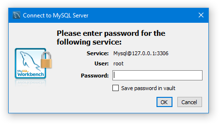

Здесь же вы можете нажать галочку «**Save password in vault**» чтобы при каждом подключении СУБД не спрашивала пароль (для учебных целей это нормально, но для реальных проектов сохранение пароля при подключении не рекомендуется).

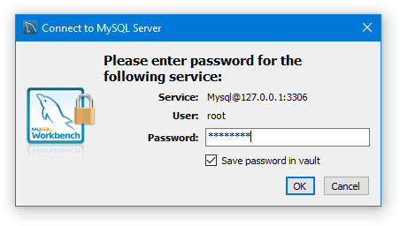

Наконец, вы увидите знакомое окно программы:

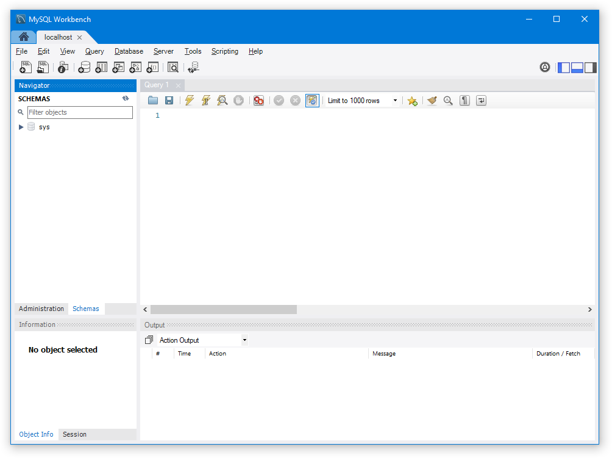

Поздравляю, теперь вы можете пользоваться программой «**MySQL Workbench 8 CE**»!

> [!NOTE]
> Если будет раздражать окошко обновления каждую полночь, вот решение вопроса: [https://stackoverflow.com/a/28068417 ↗](https://stackoverflow.com/a/28068417) (позже опишу более подробно если потребуется)

## Альтернативные способы установки MySQL

Если по каким-либо причинам не получилось установить MySQL в соответствии с инструкцией выше, можно воспользоваться альтернативными вариантами.

### Установка портативной версии MySQL из архива

Для скачивания MySQL 8 на Windows без использования стандартного установщика можно воспользоваться портативной версией MySQL. Вот инструкция по скачиванию и установке MySQL 8 в виде портативной версии:

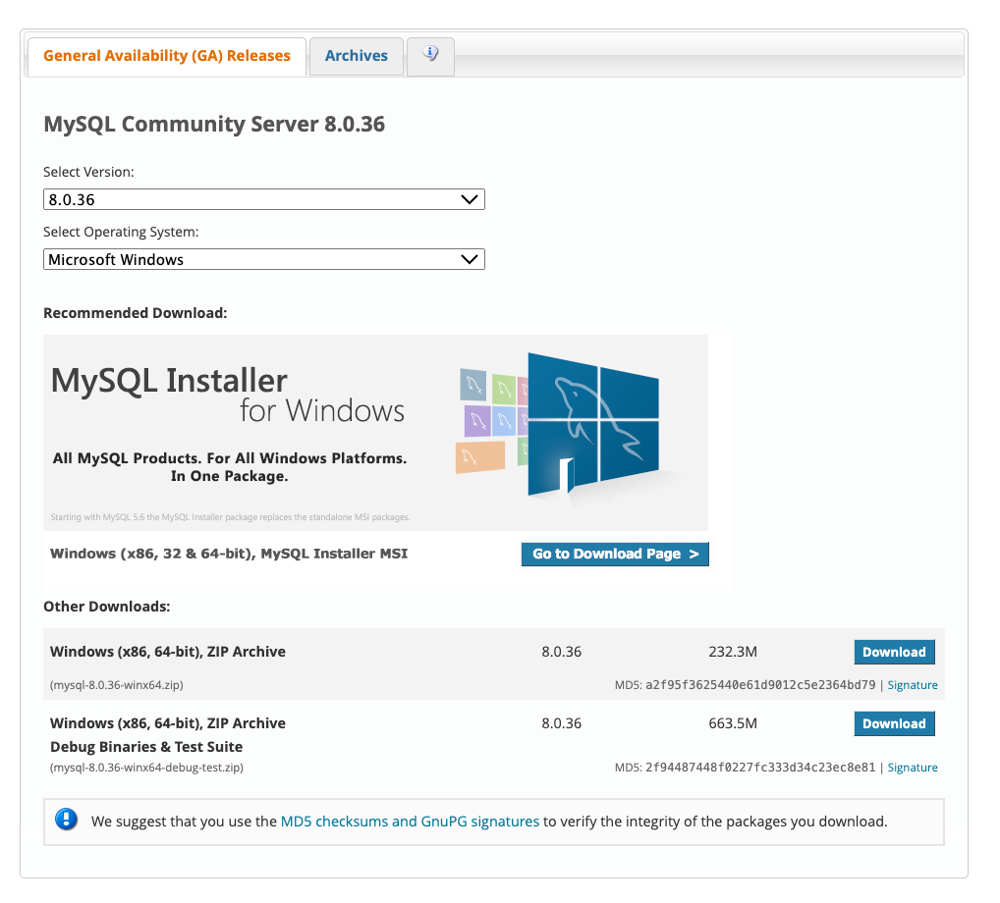

1. Перейдите на официальный сайт MySQL для [загрузки портативной версии ↗](https://dev.mysql.com/downloads/mysql/)
2. Выберите версию ветки "8.0.xx" в разделе "Select Version" для вашей ОС.
3. Прокрутите страницу до раздела "Other Downloads" и найдите ссылку для загрузки архива с портативной версией MySQL, например `Windows (x86, 64-bit), ZIP Archive`.
4. Скачайте архив с портативной версией MySQL на ваш компьютер.
5. Разархивируйте скачанный архив в удобное для вас место на диске.

После установки портативной версии MySQL 8 на ваш компьютер, вам потребуется запустить сервер MySQL и подключиться к нему с помощью командной строки или удобного графического интерфейса, например, MySQL Workbench.

Вот инструкция по использованию портативной версии MySQL 8:

1. Запуск сервера MySQL:
   - Перейдите в папку, куда вы разархивировали портативную версию MySQL.
   - Найдите файл mysqld.exe и запустите его. Это запустит сервер MySQL.

2. Подключение к серверу MySQL:
   - Для подключения к серверу MySQL через командную строку, откройте командную строку и используйте команду `mysql -u root -p` для входа под пользователем `root`.
   - Для подключения через графический интерфейс, откройте MySQL Workbench и создайте новое соединение, указав параметры подключения (хост: `localhost`, порт: `3306`, имя пользователя: `root` и пароль если есть).

3. Работа с базами данных:
   - Создайте новую базу данных с помощью SQL-запроса: `CREATE DATABASE dbname;`.
   - Используйте различные SQL-запросы для создания таблиц, добавления данных и выполнения других операций с базой данных.

Теперь вы можете использовать портативную версию MySQL 8 для разработки приложений, тестирования запросов и других целей, как если бы это была установленная версия MySQL.

### Установка при помощи Chocolatey

[Chocolatey ↗](https://community.chocolatey.org/) - это менеджер пакетов для Windows, который позволяет устанавливать и обновлять различное программное обеспечение из командной строки.

#### Шаг 1: Установка Chocolatey (если у вас его еще нет)

Для установки MySQL через Chocolatey, сначала нужно установить сам Chocolatey в соответствии с [официальной инструкцией](https://chocolatey.org/install#install-step2).

При использовании [PowerShell](https://learn.microsoft.com/ru-ru/powershell/scripting/overview) вы должны убедиться, что политика `Get-ExecutionPolicy` установлена **НЕ** `Restricted`. Авторы предлагают использовать `Bypass` для обхода политики установки или `AllSigned` для большей безопасности.

Запустите апплет `Get-ExecutionPolicy`, и если он возвращает `Restricted`, то запустите:

```powershell
Set-ExecutionPolicy AllSigned
```

**или**

```powershell
Set-ExecutionPolicy Bypass -Scope Process
```

После чего запустите команду:

```powershell
Set-ExecutionPolicy Bypass -Scope Process -Force; [System.Net.ServicePointManager]::SecurityProtocol = [System.Net.ServicePointManager]::SecurityProtocol -bor 3072; iex ((New-Object System.Net.WebClient).DownloadString('https://community.chocolatey.org/install.ps1'))
```

Если вы не видите ошибок, вы готовы использовать Chocolatey. В терминале должны быть доступны команды `choco` или `choco -?`.

#### Шаг 2: Установка MySQL через Chocolatey

После установки Chocolatey, можно установить MySQL, выполнив следующую команду:

```powershell
choco install mysql
```

Эта команда установит MySQL сервер на вашем компьютере без пароля с настройками по-умолчанию.

#### Шаг 3: Установка MySQL Workbench

MySQL Workbench - это графический инструмент для работы с базами данных MySQL. Чтобы установить MySQL Workbench через Chocolatey, выполните следующую команду:

```powershell
choco install mysql.workbench
```

После выполнения этих шагов, у вас будет установлен MySQL сервер и MySQL Workbench на вашем компьютере.

## Установка клиентов MySQL без сервера

Для выполнения домашних заданий (и получения допуска к экзамену), не обязательно устанавливать локальный сервер MySQL, достаточно установить лишь клиенты, позволяющие подключиться к удаленному серверу MySQL с вашими доступами.

### MySQL Workbench

[MySQL Workbench ↗](https://dev.mysql.com/downloads/workbench/)

### DBeaver Community

[DBeaver Community ↗](https://dbeaver.io/)

### SQLECTRON GUI

[SQLECTRON GUI](https://sqlectron.github.io/)

### Beekeeper Studio

[Beekeeper Studio](https://www.beekeeperstudio.io/)

### HeidiSQL

[HeidiSQL](https://www.heidisql.com/)
