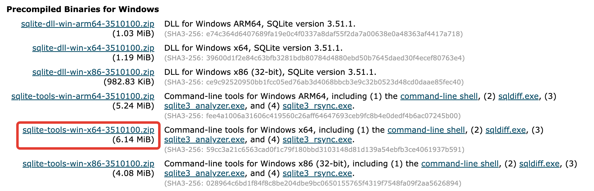
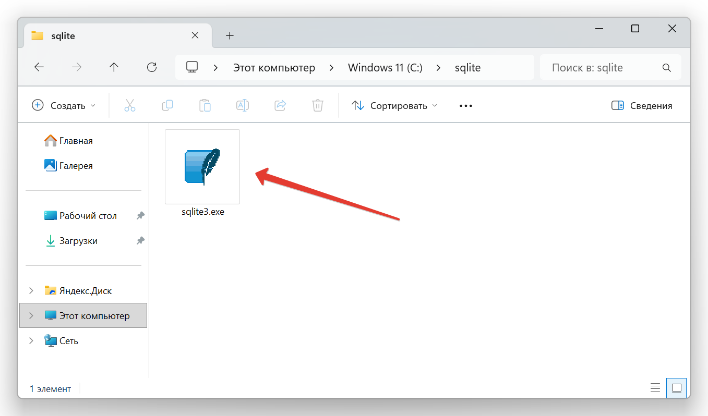

# Установка sqlite3 на Windows

::: warning

Руководство рассчитано на учебные/личные ПК без административных ограничений. На ПК с корпоративной политикой может потребоваться помощь системного администратора.

:::

## 1. Скачивание официального архива

1. Перейдите на страницу загрузки: [https://www.sqlite.org/download.html ↗](https://www.sqlite.org/download.html).
2. В блоке **Precompiled Binaries for Windows** скачайте файл `sqlite-tools-win-x64-<версия>.zip`.

## 2. Подготовка рабочей папки

1. Создайте каталог `C:\sqlite`.
2. Из скачанного архива извлеките **только** файл `sqlite3.exe` и скопируйте его в `C:\sqlite\`. Другие файлы (`sqlite_rsync.exe`, `sqldiff.exe`, `sqlite3_analyzer.exe`) не требуются для учебных задач и могут быть удалены.

## 3. Запуск

- Откройте `C:\sqlite\` и запустите `sqlite3.exe` двойным щелчком. Консоль откроется в рабочей папке, и можно сразу создавать файлы баз данных (например, `sqlite3 practice.db`).
- Для быстрого доступа создайте ярлык на рабочем столе: правый клик по `sqlite3.exe` → «Отправить» → «Рабочий стол (создать ярлык)».

