<!-- @include: ./includes/_disclaimer.md -->

# Инструкция по установке и настройке Visual Studio Code под MS Windows 10 x64

Для того, чтобы установить и настроить интегрированную среду разработки (далее ИСР), необходимо:

## Скачивание

Перейти по ссылке: [https://code.visualstudio.com/ ↗](https://code.visualstudio.com/) и нажать кнопку «**Download**».

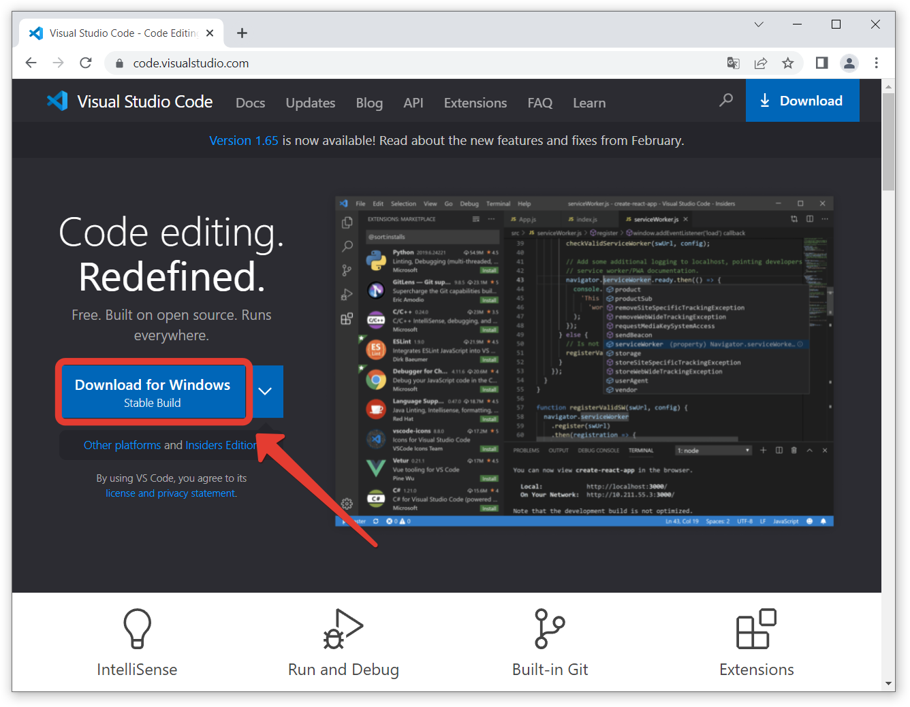

В случае недоступности ссылки выше можете скачать установщик из нашего облака:

- Актуальная на момент написания версия (75,7 МБ)
[https://disk.yandex.ru/d/b3I75zOweKKp1w ↗](https://disk.yandex.ru/d/b3I75zOweKKp1w)

## Установка

После завершения загрузки вам необходимо открыть установочный файл `VSCodeUserSetup-x64-1.65.2.exe`.

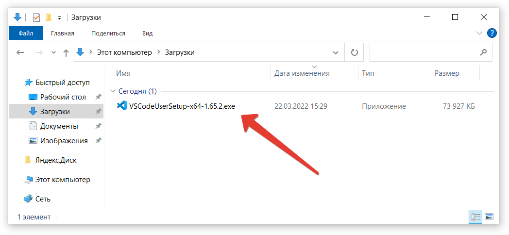

После открытия установочного файла может появиться предупреждение о том что программа будет установлена только для текущего пользователя, и не предназначена для запуска в режиме администратора. Так и задумано, поэтому просто соглашаемся нажав на «**ОК**».

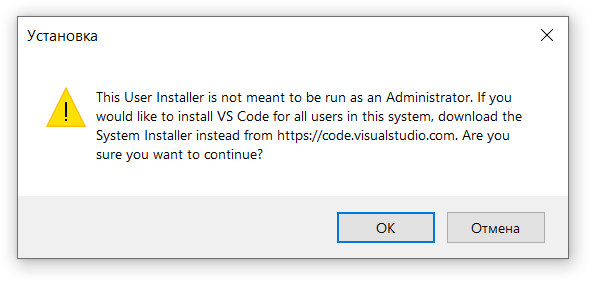

Далее установщик отобразит текст Лицензионного соглашения. Единственным вариантом пройти дальше будет только его принять, что и необходимо сделать.

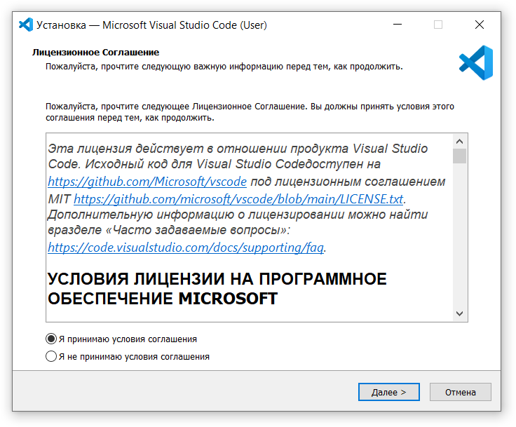

Далее потребуется указать пусть установки, но в большинстве случаев подойдет путь предложенный по-умолчанию.

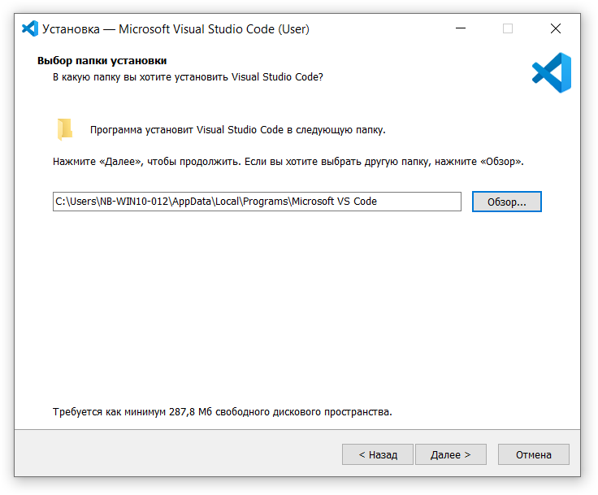

Далее покажется шаг создания папки в меню «**Пуск**».

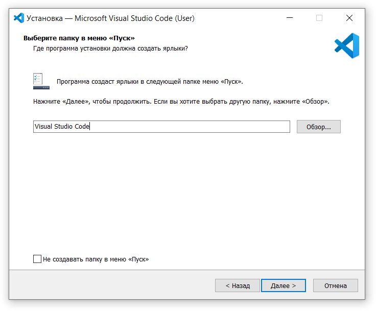

На текущем шаге возможно выбрать параметры интеграции в систему.

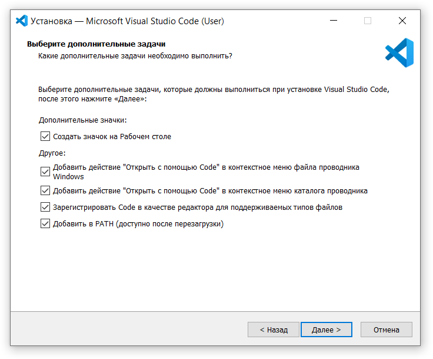

Для удобства дальнейшей работы в системе рациональнее всего будет поставить все галочки, включая добавление пунктов контекстного меню. Это потребуется позже для открытия папок проектов сразу в программе.

После этого покажется окно со всеми указанными настройками для установки.

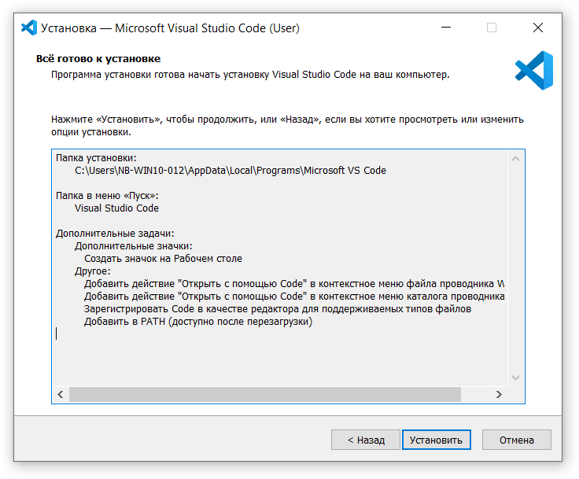

Останется только нажать на кнопку «**Установить**» и дождаться завершения процесса установки.

И наконец, покажется финальное окно завершения установки на котором можно поставить галочку для автоматического запуска. Но **лучше всего эту галочку убрать** и после установки перезагрузить компьютер, чтобы полностью применилась интеграция с операционной системой.

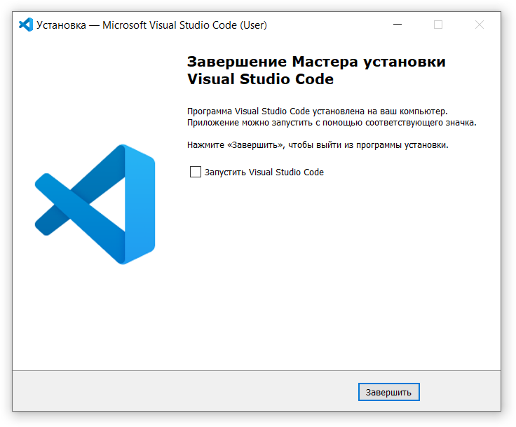

## Запуск и первичная настройка

Теперь в меню «**Пуск**» в папке «**Visual Studio Code**» а также на рабочем столе должны появиться иконки установленного приложения,

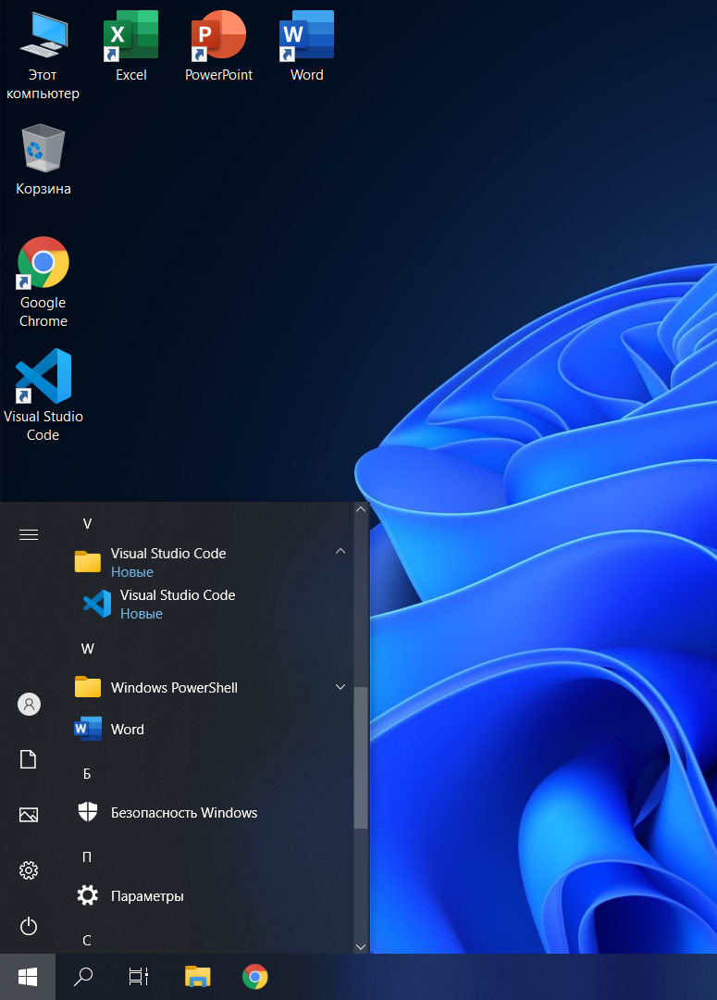

Вне зависимости от того через какую иконку вы запустите приложение, при первом запуске покажется экран приветствия и первоначальной настройки.

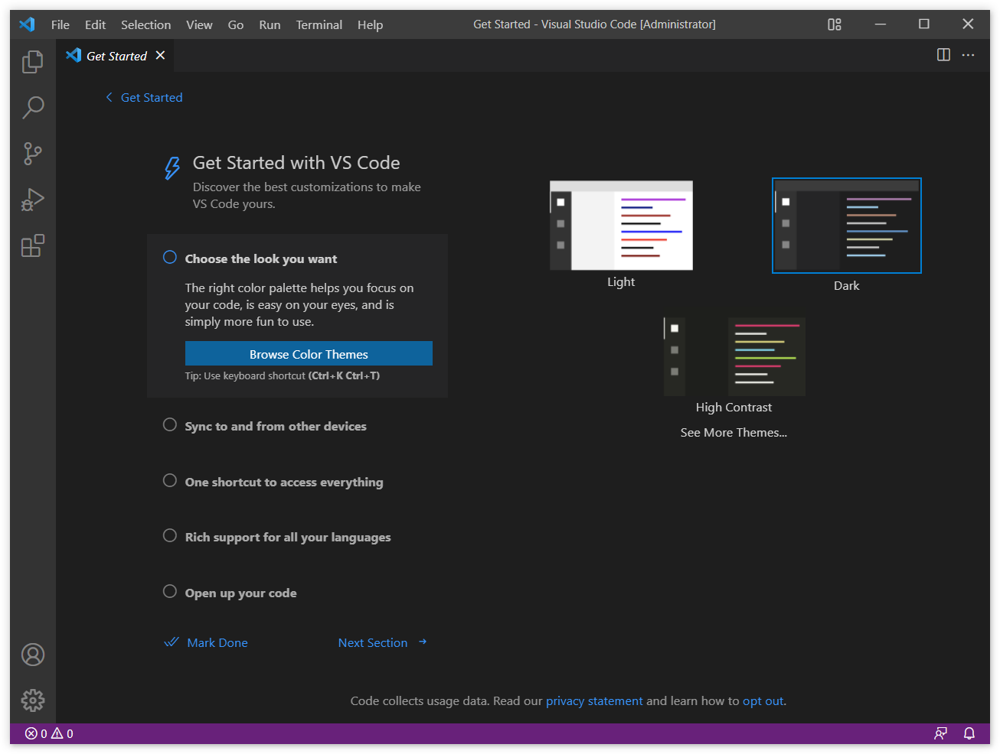

При желании можете ознакомиться с программой по предложенным шагам, выбрать цветовую схему, включить синхронизацию настроек или любую другую функцию из предлагаемых, но мы эти шаги рассматриваться не будем.

Однако, при первом запуске может появиться всплывающее окошко следующего содержания:

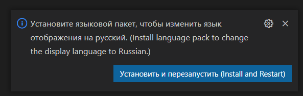

Можете при желании установить соответствующий языковой пакет, тогда большинство пунктов меню, настроек и функций будут отображаться на русском языке, однако я все же советую работать с интерфейсом в оригинале, т.к. большинство настроек VS Code хранятся и описываются в особых файлах формата json, и в оригинале они обозначаются соответствующими именами методов, поэтому можно легко запутаться в настройке какого-либо из расширений из-за несоответствия переводов.

В остальном, приветственный экран можно просто закрыть просто закрыв соответствующую вкладку на которой он находится, и окно программы перейдет в состояние пустого:

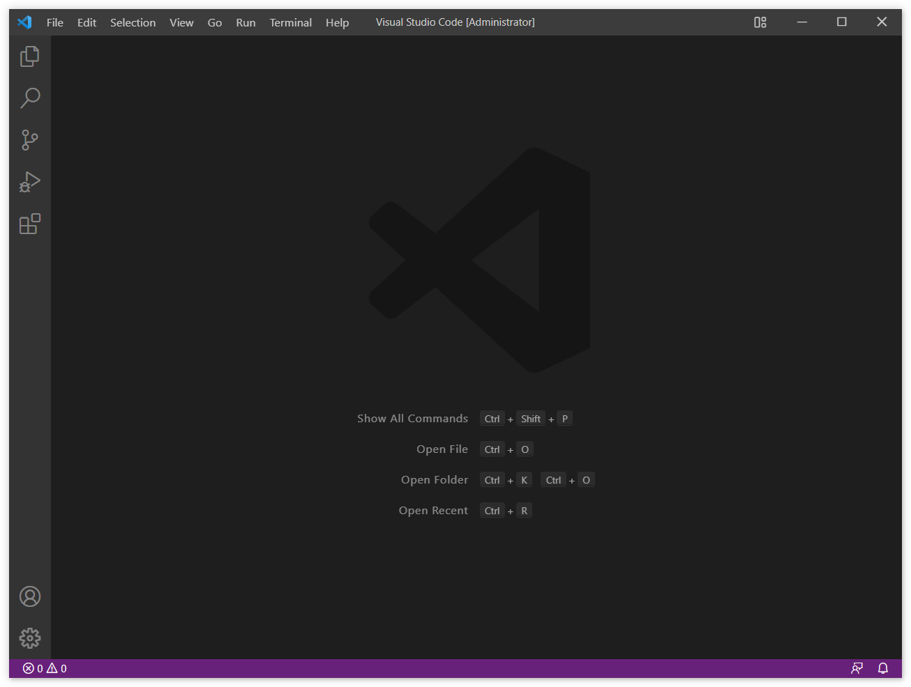

Подробно рассматривать интерфейс программы сейчас не имеет смысла, в нем огромное количество различных функций, большинство из которых в рамках данного курса практически бесполезны и для начала работы нам нужен минимум.

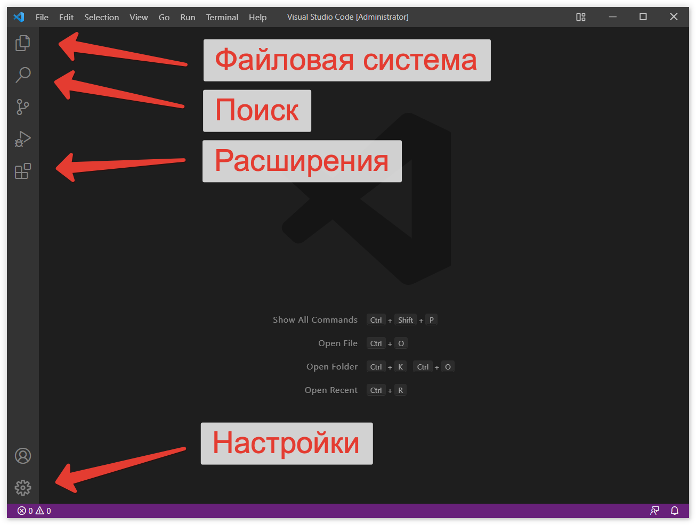

На главном экране пока нас интересуют только следующие разделы:

- Файловая система
- Поиск
- Расширения
- Настройки

В разделе **файловой системы** будет отражена структура файлов и папок внутри открытой папки проекта.

Раздел **поиска** используется для поиска нужной подстроки по всем файлам внутри папки проекта.

**Расширения** включают различные программные модули, добавляющие новые возможности и расширяющие функционал программы.

В **настройках** же собраны по категориям не только настройки функционала и внешнего вида самой программы но и всех установленных расширений.

## Установка расширений для работы

Для дальнейшей работы над домашними заданиями вследствие ограничений на исполнение модульного синтаксиса языка JavaScript при локальном запуске веб-страниц, нам потребуется специальное расширение, которое будет выполнять роль веб-сервера.

> 
> **Live Server**
> Веб-сервер, запускающийся из локальной папки
> [https://marketplace.visualstudio.com/items?itemName=ritwickdey.LiveServer ↗](https://marketplace.visualstudio.com/items?itemName=ritwickdey.LiveServer)

Перейдите в раздел установки расширений.

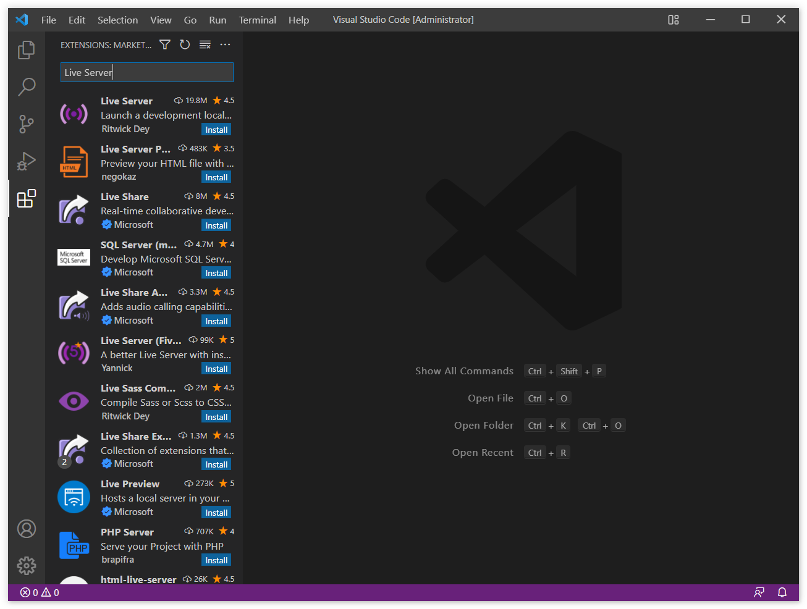

В строке поиска найдите расширение **Live Server**.

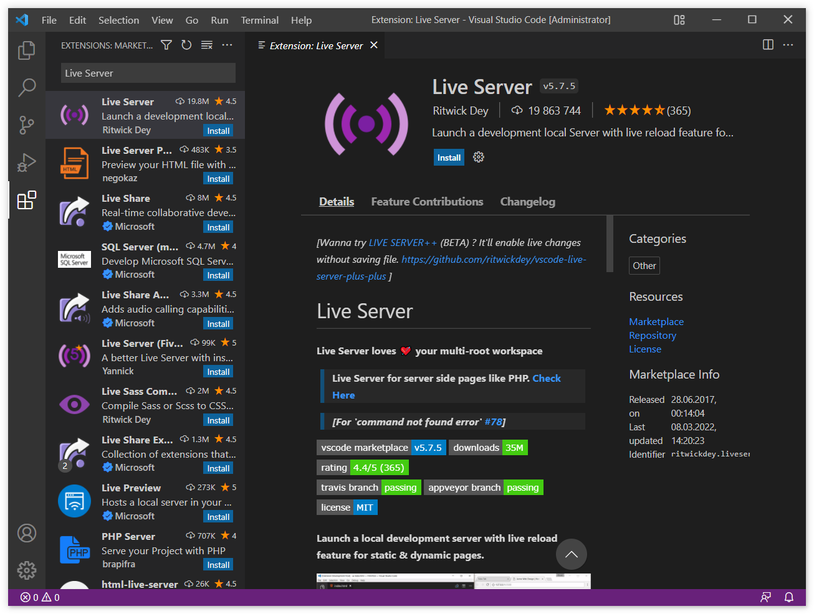

После чего нажмите на кнопку «**Install**».

Через пару минут расширение установится и станет доступна возможность запуска веб-сервера из любой открытой локальной папки, содержащей файлы `html`.

Кроме **Live Server** также советую аналогичным образом найти и установить несколько других расширений, также полезных для работы. Это не обязательно, но в ряде аспектов упростит жизнь.

Для поиска и установки достаточно использовать только название.

> 
> **indent-rainbow**
> Подсвечивание отступов разным цветом в зависимости от уровня
> [https://marketplace.visualstudio.com/items?itemName=oderwat.indent-rainbow ↗](https://marketplace.visualstudio.com/items?itemName=oderwat.indent-rainbow)

> 
> **Gremlins tracker for Visual Studio Code**
> Подсвечивание непечатных символов и в нестандартных кодировках
> [https://marketplace.visualstudio.com/items?itemName=nhoizey.gremlins ↗](https://marketplace.visualstudio.com/items?itemName=nhoizey.gremlins)

> 
> **Better Comments**
> Подсвечивание различных типов комментариев в коде
> [https://marketplace.visualstudio.com/items?itemName=aaron-bond.better-comments ↗](https://marketplace.visualstudio.com/items?itemName=aaron-bond.better-comments)

На самом деле, в библиотеке **Visual Studio Code** существует огромное количество расширений для решения практически любых задач, и как правило все они в подавляющем большинстве бесплатны, поэтому можете сами при желании попытаться найти для себя что-то полезное.

## Создание проекта

В любом месте вашей локальной файловой системы, например на «**Рабочем столе**» создайте новую папку, и назовите «**MyProject**».

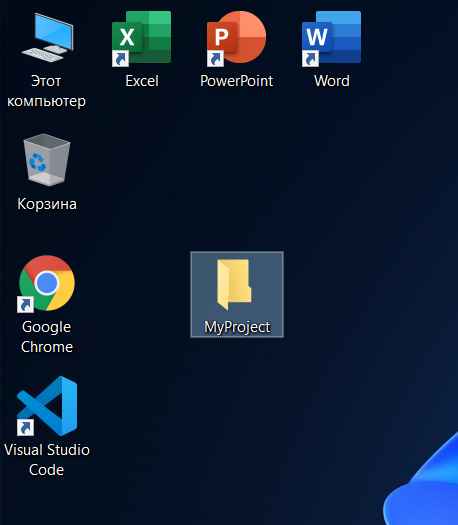

Если на этапе установки по данной инструкции вы ставили галочки напротив пунктов интеграции с проводником, то в контекстном меню созданной папки у вас должен появиться пункт «**Открыть с помощью Code**». при клике на него, **Visual Studio Code** автоматически запустится и в качестве локальной файловой системы проекта будет использовать указанную папку.

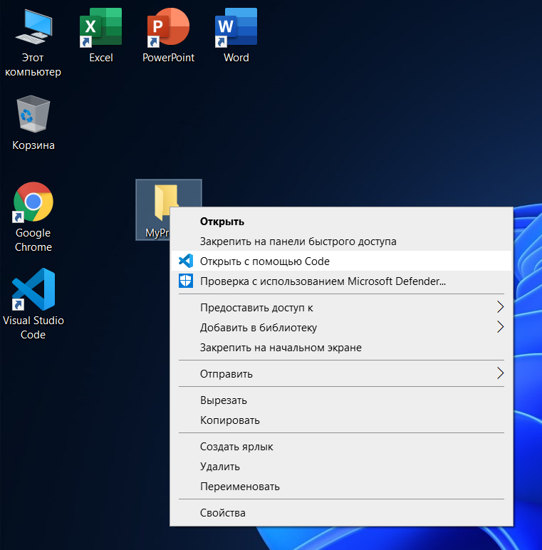

При этом, при первом открытии папки в целях безопасности будет задан вопрос доверяем ли мы открываемой папке и ее авторам. Ответ на этот вопрос означает по сути, будет ли открыт редактор в полнофункциональном или безопасном режиме с отключенными некоторыми функциями. Как правило, если вы открываете файлы или папки, скачанные на просторах интернета из непроверенных источников, велика вероятность что они могут содержать вредоносный код, в том числе нацеленный на те редакторы в которых соответствующие файлы будут запускаться.

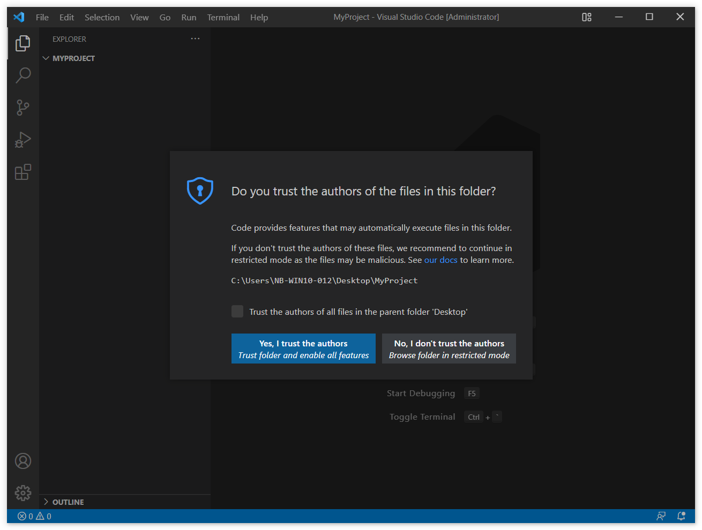

Здесь же можно при желании поставить галочку для того чтобы автоматически доверять всем папкам, находящимся на уровень выше текущей.

Подробнее про режимы открытия папок можете прочитать в официальной документации, ссылка на которую приводится во всплывающем окне: [https://code.visualstudio.com/docs/editor/workspace-trust ↗](https://code.visualstudio.com/docs/editor/workspace-trust)

Учитывая что эту папку создали мы только что и мы уверены что в ней не может быть никакого вредоносного кода, открываем ее в доверительном режиме.

Для создания папок и файлов внутри локальной файловой системы проекта можете воспользоваться соответствующими кнопками интерфейса.

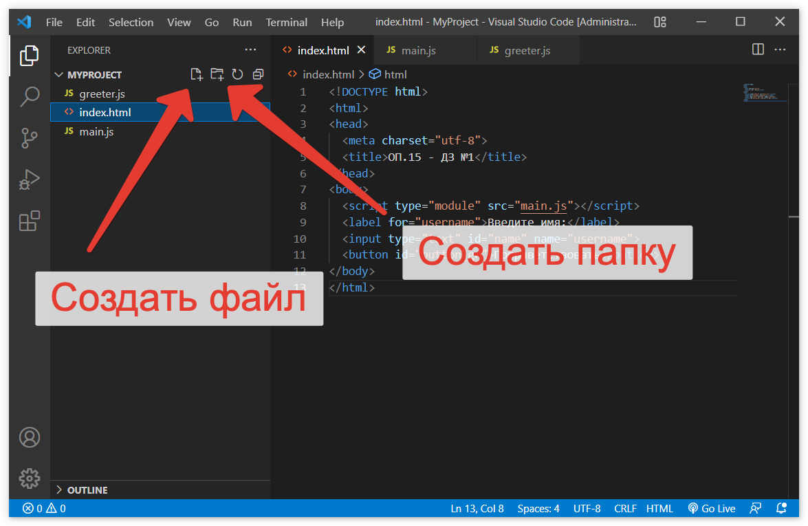

Важно что при создании нового файла необходимо явно указать его расширение через точку после имени файла.

Здесь и дальше в качестве примера взяты файлы из первого домашнего задания.

Создайте любую простую файловую структуру для проекта в которой были хотя бы по одному файлу расширений `.html` и `.js`.

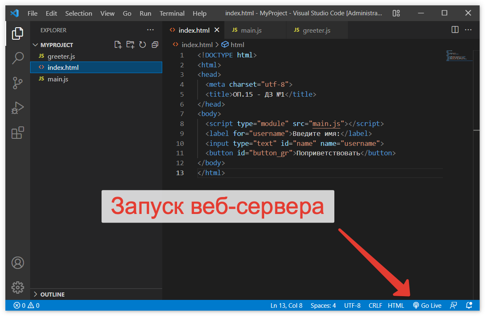

Если на одном из предыдущих шагов вы не забыли установить **Live Server**, то в правом нижнем углу должны увидеть кнопку «**Go Live**», нажав на которую будет запущен веб-сервер и открыт браузер используемый по-умолчанию в системе.

При этом при первом запуске может появиться такое окно:

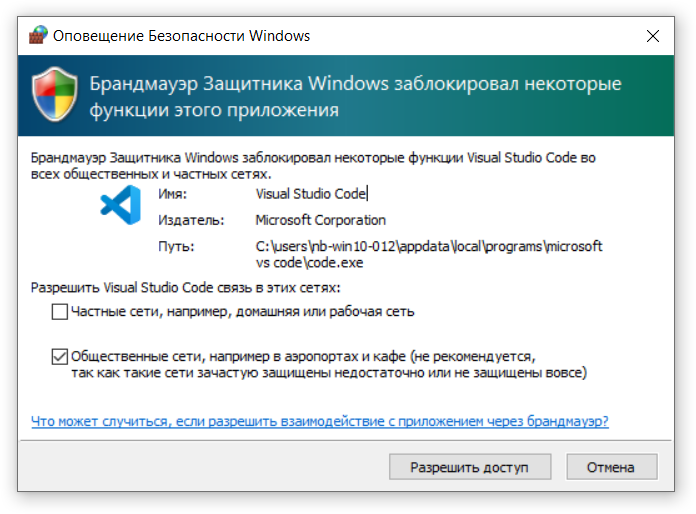

Это Брандмауэр по-умолчанию предупреждает о том что **Visual Studio Code** открывает сетевое соединение. Здесь также необходимо разрешить доступ.

После того как доступ будет разрешен, вы увидите открывшееся окно браузера с открытой веб-страницей:

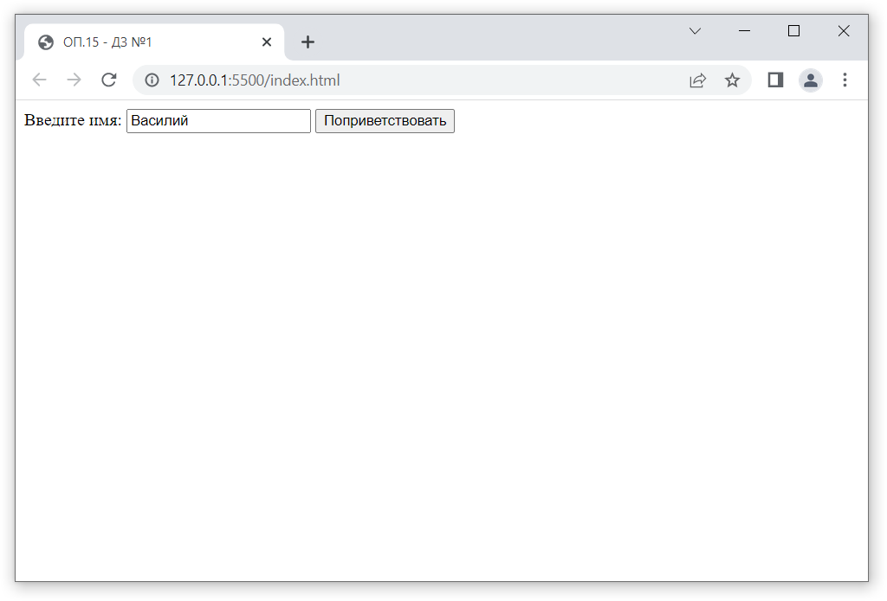

Теперь веб-страница функционирует полностью как будто она находится на самом настоящем веб-сервере в интернете, работают все функции модульного подхода в **JavaScript**, а также обрабатываются все типы HTTP-запросов. В адресной строке вместо пути к файлу в папке показана следующая строка:

`127.0.0.1:5500/index.html`

В ней:

- `127.0.0.1` — локальный IP-адрес компьютера на котором запущен веб-сервер
- `:5500` — порт, обрабатывающий соединения веб-сервера
- `/index.html` — имя файла из локальной файловой системы (из папки проекта) который в данный момент отдается веб-серверу

Параллельно с браузером, остается открытым и исходный код проекта в **Visual Studio Code**, где можно вносить изменения. При сохранении любого редактируемого файла внутри папки проекта, **Live Server** будет автоматически перезагружать страницу на которой запрашивается соответствующий файл, то есть страница в браузере всегда будет актуализироваться до тех пор пока веб-сервер не будет остановлен.

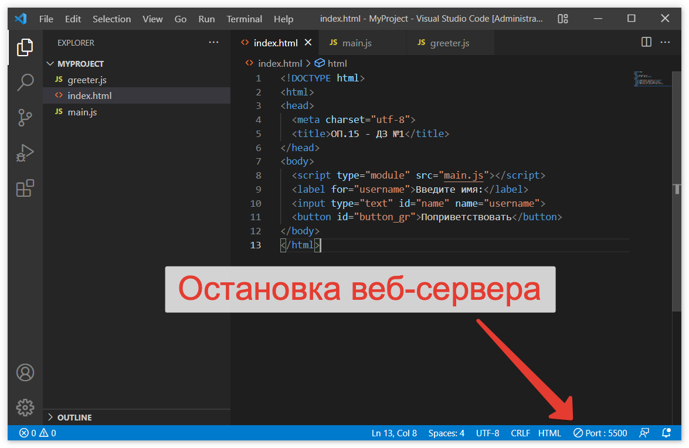

По окончанию работы с проектом, не забудьте самостоятельно отключить веб-сервер нажав в правом углу нижней панели на кнопку «🚫 **Port : 5500**».

> [!WARNING]
> В отдельных случаях даже закрытие **Visual Studio Code** не гарантирует остановку работы веб-сервера и освобождение порта, поэтому рекомендуется его отключать по окончании работы **самостоятельно**.
