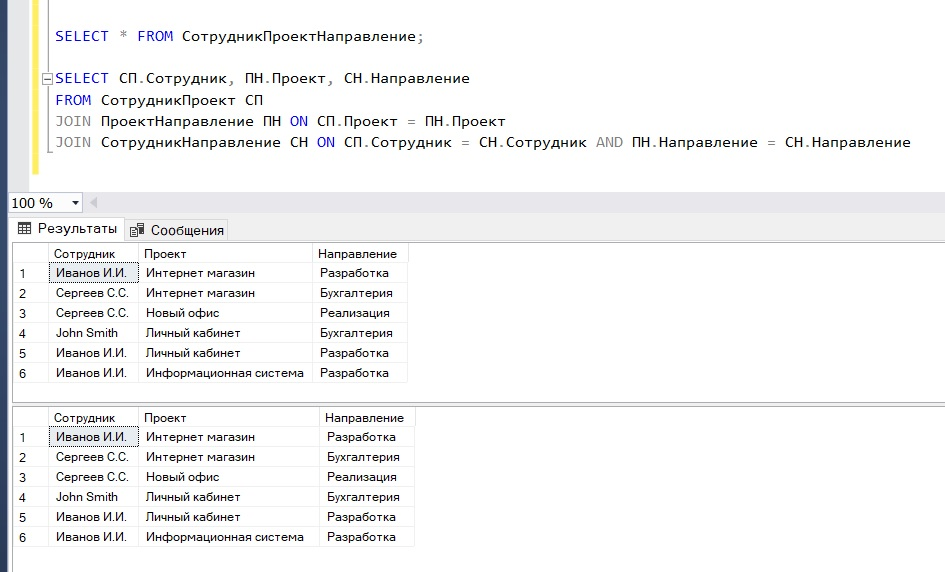

# МДК.11.01 - 09 - Пятая нормальная форма (5NF) базы данных

Сегодня мы с Вами подробно рассмотрим пятую нормальную форму базы данных (5NF), в частности Вы узнаете, какие требования предъявляются к таблицам, чтобы база данных находилась в пятой нормальной форме, и для наглядности мы как всегда рассмотрим пример.

Перед тем как переходить к процессу приведения таблиц базы данных к пятой нормальной форме, необходимо чтобы эти таблицы уже находились в четвертой нормальной форме, подробно процесс приведения таблиц базы данных до четвертой нормальной формы, а также все требования, предъявляемые к четвертой нормальной форме, мы рассматривали в предыдущей статье — четвертая нормальная форма (4NF).

После того как таблицы базы данных находятся в четвертой нормальной форме, мы можем начинать приводить базу данных к пятой нормальной форме и рассматривать соответствующие требования.

## **Требования пятой нормальной формы (5NF)**

> Переменная отношения находится в пятой нормальной форме (иначе — в проекционно-соединительной нормальной форме) тогда и только тогда, когда каждая нетривиальная зависимость соединения в ней определяется потенциальным ключом (ключами) этого отношения.

Это стандартное определение для пятой нормальной формы.

К сожалению, более простыми словами сформулировать определение для пятой нормальной формы достаточно сложно.

Однако на основе этого определения мы можем сделать следующий вывод

> Требование пятой нормальной формы (5NF) заключается в том, чтобы в таблице каждая нетривиальная зависимость соединения определялась потенциальным ключом этой таблицы.

Как видите, здесь вводится новое понятие *«Зависимость соединения»*.

До текущего момента, т.е. до 5 нормальной формы, мы осуществляли декомпозицию таблиц и не задумывались ни о какой потере данных, ведь у нас такой потери данных просто не было.

Однако существуют таблицы, которые не получится декомпозировать на две таблицы без потери данных, т.е. какие-то данные мы потеряем при соединении двух итоговых, полученных после декомпозиции, таблиц. Но, если декомпозировать такую таблицу не на две, а на три таблицы, то потери данных можно избежать.

И таблица будет находиться в пятой нормальной форме, если при соединении (JOIN) этих трех таблиц, которые были получены в результате декомпозиции, будут формироваться ровно те же самые данные, что и в исходной таблице до декомпозиции. Однако если этого происходить не будет, т.е. данные будут отличаться, например, какие-то строки были потеряны, или созданы новые, то в этом случае возникает так называемая **зависимость соединения**, т.е. часть данных одного столбца зависит от части данных другого столбца.

Таким образом, таблица будет находиться в пятой нормальной форме, если она не будет содержать зависимости соединения.

И здесь вводится еще одно новое понятие *«Декомпозиция без потерь»*.

> Декомпозиция без потерь — процесс разбиения одной таблицы на несколько, при условии, что в случае соединения таблиц, которые были получены в результате декомпозиции, будет формироваться ровно та же самая информация, что и в исходной таблице до декомпозиции.

Иными словами, чтобы выполнить требование пятой нормальной формы, необходимо осуществить декомпозицию таблицы без потери данных.

Схематично это выглядит примерно следующим образом.

Допустим, существует таблица **T (C1, C2, C3)** где C1, C2, C3 — столбцы и вместе они являются составным первичным ключом. Таблица находится в четвертой нормальной форме. В соответствии с требованиями предметной области у нас проявляется зависимость соединения:

**{C1, C2}, {C1, C3}, {C2, C3}**

Чтобы привести данную таблицу к пятой нормальной форме, необходимо декомпозировать ее на следующие три таблицы:

**T1 (C1, C2)**

**T2 (C1, C3)**

**T3 (C2, C3)**

При этом, если мы соединим (JOIN) эти три новые таблицы (T1, T2, T3) и получим исходную таблицу (T), то это будет означать, что декомпозицию мы выполнили без потерь.

## **Пример приведения таблиц базы данных к пятой нормальной форме**

Представим, что у нас есть таблица, которая хранит информацию о связи сотрудников с проектами и направлениями работы сотрудников в этих проектах.

Сразу хочется отметить, если Вас когда-то попросят определить, находится та или иная таблица в 5 нормальной форме, то Вы смело можете отвечать *«неизвестно, так как все зависит от требований предметной области»*.

В случае нашей таблицы мы также не можем сказать, находится ли она в 5NF или нет, так как нам сначала необходимо разобраться в предметной области и определить ограничения.

### *Связь сотрудников с проектами и направлениями работы в проектах*

| :key: Сотрудник | :key: Проект | :key: Направление |
| --- | --- | --- |
| Иванов И.И. | Интернет магазин | Разработка |
| Сергеев С.С. | Интернет магазин | Бухгалтерия |
| Сергеев С.С. | Новый офис | Реализация |
| John Smith | Личный кабинет | Бухгалтерия |
| Иванов И.И. | Личный кабинет | Разработка |
| Иванов И.И. | Информационная система | Разработка |

Поработав с предметной областью, мы выясняем, что:

- Иванов И.И. может работать только в направлении *«Разработка»*
- Сергеев С.С. может работать в любом направлении, за исключением *«Разработка»*
- Иванов И.И. может участвовать в большом количестве проектов
- John Smith может участвовать только в одном проекте

Если придерживаться этих требований, то в нашу таблицу можно очень легко внести некорректные данные, и у нас точно так же, как и в случае с четвертой нормальной формой, будут возникать аномалии при добавлении, изменении и удалении данных.

Наша таблица находится в четвертой нормальной форме, так как у нас отсутствует многозначная зависимость, ведь у нас нет таких атрибутов, которые зависели бы от другого атрибута.

Однако принимая во внимание наши требования, мы понимаем, что часть данных каждого из столбцов зависит от части данных другого столбца, т.е. существуют некие зависимости, и эти зависимости определяются не целым потенциальным ключом, а только его частью.

Поэтому, чтобы устранить возможность внесения некорректных данных, мы можем попытаться выполнить декомпозицию без потерь, и тем самым привести таблицу к пятой нормальной форме.

Чтобы выполнить декомпозицию без потерь, нам нужно разбить данную таблицу на три проекции

**{Сотрудник, Проект}, {Сотрудник, Направление}, {Проект, Направление}**

с условием, что в случае обратного соединения, мы получим те же самые данные, что у нас были и до декомпозиции.

Если это нам удастся сделать, то мы устраним нетривиальные зависимости соединения и нормализуем наши таблицы до пятой нормальной формы.

### *Связь сотрудников и проектов*

| :key: Сотрудник | :key: Проект |
| --- | --- |
| Иванов И.И. | Интернет магазин |
| Сергеев С.С. | Интернет магазин |
| Сергеев С.С. | Новый офис |
| John Smith | Личный кабинет |
| Иванов И.И. | Личный кабинет |
| Иванов И.И. | Информационная система |

### *Связь сотрудников и направлений*

| :key: Сотрудник | :key: Направление |
| --- | --- |
| Иванов И.И. | Разработка |
| Сергеев С.С. | Бухгалтерия |
| Сергеев С.С. | Реализация |
| John Smith | Бухгалтерия |

### *Связь проектов и направлений*

| :key: Проект | :key: Направление |
| --- | --- |
| Интернет магазин | Разработка |
| Интернет магазин | Бухгалтерия |
| Новый офис | Реализация |
| Личный кабинет | Бухгалтерия |
| Личный кабинет | Разработка |
| Информационная система | Разработка |

Таблицы созданы, теперь если мы выполним следующий запрос, который соединяет эти три таблицы, и он вернет нам точно такие же данные, что и в исходной таблице, то зависимости соединения у нас нет, и наши таблицы находятся в 5NF.

```sql
SELECT СотрудникПроект.Сотрудник, ПроектНаправление.Проект, СотрудникНаправление.Направление
   FROM СотрудникПроект
   JOIN ПроектНаправление ON СотрудникПроект.Проект = ПроектНаправление.Проект
   JOIN СотрудникНаправление ON СотрудникПроект.Сотрудник = СотрудникНаправление.Сотрудник AND ПроектНаправление.Направление = СотрудникНаправление.Направление
```

Как видим, данные точно такие же. Наши таблицы находятся в пятой нормальной форме.



Обязательно стоит отметить, что пятая нормальная форма является окончательной нормальной формой по отношению к операциям разбиения таблиц на проекции и их соединения, именно поэтому ее альтернативное название — проекционно-соединительная нормальная форма. Таким образом, если таблица находится в 5NF, то гарантируется, что она не содержит аномалий, которые могут быть исключены посредством ее разбиения на проекции.

Также стоит отметить, что таблицы, которые необходимо нормализовать до пятой нормальной формы, встречаются крайне редко, т.е. это очень частный случай. Более того, такие таблицы являются не совсем удачными с точки зрения проектирования. Кроме всего прочего, чтобы привести таблицу к пятой нормальной форме, Вы должны очень хорошо разбираться в предметной области, чтобы определить зависимости соединения, ведь это действительно очень сложно. Иными словами, если Вам удастся определить эти зависимости соединения, то только в этом случае Вы сможете привести таблицу к пятой нормальной форме.

Описание и требования доменно-ключевой нормальной формы (DKNF) мы рассмотрим в следующем материале.
