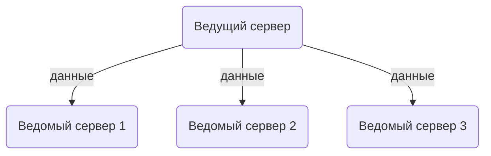
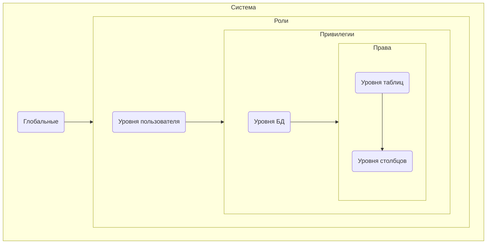

# МДК.11.01 - 23 - Система прав и привилегий

Система прав и привилегий в MySQL 8 предоставляет механизм для управления доступом пользователей к базам данных и выполнению различных операций. Она позволяет определить, какие действия могут выполнять пользователи и какие данные они могут просматривать или изменять.

> Система прав и привилегий в MySQL - это механизм, который определяет, какие действия пользователи могут выполнять в базе данных.

**Право в MySQL** - это конкретное разрешение на выполнение определенной операции, такой как `SELECT`, `INSERT`, `UPDATE` или `DELETE`. Каждое право связано с определенными объектами базы данных, такими как таблицы или представления.

**Привилегия в MySQL** - это набор прав, который может быть назначен пользователю или роли. Привилегии могут быть назначены на уровне базы данных, таблицы или даже на уровне сервера. Например, привилегия `GRANT` позволяет пользователю назначать привилегии другим пользователям.

**Роль в MySQL** - это группа привилегий, которая может быть назначена пользователю. Роли предоставляют удобный способ организации привилегий, так как можно назначить роль одному или нескольким пользователям, вместо назначения каждой привилегии отдельно.


Таким образом,права определяют конкретные действия, привилегии объединяют права в наборы, а роли облегчают управление привилегиями для групп пользователей.

В MySQL 8 существуют различные уровни прав и привилегий:

1. **Глобальные привилегии**: эти привилегии относятся к серверу MySQL в целом и могут быть назначены или отозваны только администратором базы данных. Некоторые примеры глобальных привилегий включают возможность создавать новых пользователей, изменять настройки сервера или выполнение административных задач.

2. **Привилегии на уровне базы данных**: эти привилегии позволяют пользователям выполнять операции над конкретными базами данных. Например, пользователь может иметь право на создание таблиц, изменение данных или выполнение запросов только в определенной базе данных.

3. **Привилегии на уровне таблицы**: эти привилегии позволяют пользователям выполнять операции только над конкретными таблицами в базе данных. Например, пользователь может иметь право на чтение данных из одной таблицы, но не иметь доступа к другим таблицам.

4. **Привилегии на уровне столбца**: эти привилегии позволяют пользователям выполнять операции только над определенными столбцами в таблице. Например, пользователь может иметь право на чтение или изменение только определенных столбцов в таблице.

Система прав и привилегий MySQL позволяет администраторам баз данных гибко управлять доступом пользователей к данным и определять, какие операции разрешены или запрещены для каждого пользователя. Это позволяет обеспечить безопасность данных и предотвратить несанкционированный доступ или изменение данных.

Внутри MySQL 8 система прав и привилегий основана на таблице `mysql.user`, которая содержит информацию о пользователях и их привилегиях. Когда пользователь пытается выполнить операцию, сервер MySQL проверяет его права в соответствии с записями в таблице `mysql.user`. Если у пользователя есть необходимые привилегии, операция выполняется успешно, в противном случае сервер отказывает в доступе.

В целом, система прав и привилегий в MySQL позволяет определить, какие действия могут выполнять пользователи и какие данные они могут просматривать или изменять, что является критическим аспектом в управлении базами данных.

## Группы привилегий

Для работы с базами данных в MySQL необходим пользователь, наделённый такими правами. То есть при подключении к базе данных Вы должны указывать логин пользователя и его пароль, и если доступ ему открыт, то он получит определённые права.

В MySQL существуют три группы привилегий: **данные**, **структура**, **администрирование**.

Первая группа связана с изменением записей в таблицах:

- `SELECT` - эта привилегия позволяет делать выборку записей из таблиц баз данных.
- `INSERT` - привилегия, которая необходима для добавления новых записей в таблицу.
- `UPDATE` - право, позволяющее обновлять записи в таблице.
- `DELETE` - эта привилегия позволяет удалять записи из таблицы.
- `FILE` - разрешает делать выборку записей и записывать данные в файл, а также считывать их оттуда.

Вторая группа связана с изменением структуры баз данных:

- `CREATE` - привилегия, позволяющая создавать новые базы данных, а также новые таблицы в базе данных.
- `ALTER` - привилегия, позволяющая переименовывать таблицы, вставлять новые поля в таблицу, удалять поля из таблицы, а также модифицировать их.
- `INDEX` - разрешает создавать индекс по определённому полю и удалять его. О том, что это такое и для чего нужно мы поговорим в одной из следующих статей.
- `DROP` - право, которое позволяет удалять либо таблицы, либо целые базы данных.
- `CREATE TEMPORARY TABLES` - возможность создавать временные таблицы, которые хранятся во время сессии, а после окончания сессии данная таблица автоматически удаляется.

Третья связана с администрированием администрированием баз данных:

- `GRANT` - привилегия, которая позволяет создавать новых пользователей, а также менять права у существующих. Тут есть очень важная деталь: нельзя изменять значения привилегий, которыми сам не обладаешь. То есть если человек обладает привилегией `GRANT`, но не обладает привилегией `SELECT`, то он не может новым пользователям дать привилегию `SELECT` и это вполне логично.
- `SUPER` - позволяет использовать команду `kill`, то есть убить поток. Поток - это текущее подключение другого пользователя к базе данных.
- `PROCESS` - привилегия, позволяющая выполнить команду `processlist`, которая показывает список потоков.
- `RELOAD` - позволяет открывать и закрывать файлы журналов, а также перечитывать таблицы привилегий пользователей.
- `SHUTDOWN` - привилегия, позволяющая выполнить команду `shutdown`, отключающая работу сервера.
- `SHOW DATABASES` - разрешает просматривать все существующие базы данных.
- `REFERENCES` - данная привилегия ещё не доступна, а только зарезервирована для использования в будущем.
- `LOCK TABLES` - позволяет блокировать таблицы от указанных потоков.
- `EXECUTE` - позволяет запускать хранимые процедуры.
- `REPLICATION SLAVE` - позволяет пользователю подключаться к серверу базы данных в качестве ведомого сервера репликации. Ведомый (`Slave`) - это сервер, который получает данные от Ведущего (`Master`) и воспроизводит их в своей базе данных. При наличии привилегии `REPLICATION SLAVE` пользователь может настроить сервер в качестве ведомого и начать процесс репликации.
- `REPLICATION CLIENT` - позволяет пользователю подключаться к серверу базы данных в качестве клиента репликации. Эта привилегия не дает права на выполнение изменений в базе данных, но позволяет пользователю просматривать журналы репликации и получать информацию о состоянии репликации.



Также существуют особые привилегии, не относящиеся явно ни к одной из перечисленных групп, связанные с ограничением на доступные ресурсы:

- `MAX QUERIES PER HOUR` - максимальное количество запросов в час, которое может отправить пользователь.
- `MAX UPDATES PER HOUR` - максимальное количество команд в час, которые каким-либо образом изменяют либо таблицу, либо базу данных.
- `MAX CONNECTIONS PER HOUR` - максимальное количество подключений в час, которое может сделать пользователь.

Если значение вышеназванных пределов равны `0`, то ресурсы для пользователя не ограничены.

## Просмотр пользователей и их привилегий

В MySQL имя пользователя состоит из 2-х частей: **имени пользователя** (обязательно) и **хоста** (может быть опущена, тогда по-умолчанию будет подставляться знак `%` означающий любую строку, в том числе и пустую):

`'user'@'host'` по сути это похоже на то как обозначаются email-адреса

Этому правилу следуют все пользователи, включая т.н. **корневого** (его также называют суперпользователем или `root` как в операционных системах основанных на `Unix`).

::: note

Термин `root` в контексте операционных систем Unix и Linux происходит от корневого каталога файловой системы, который обозначается символом `/`. Корневой каталог является самым верхним уровнем иерархии файловой системы, от которого ветвятся все остальные каталоги и файлы.

Пользователь `root` в Unix и Linux обладает полными привилегиями и может выполнять любые операции в системе. Он имеет полный доступ к всем файлам и каталогам, а также может изменять настройки системы, устанавливать программное обеспечение и выполнять другие административные задачи.

Термин `root` был заимствован из Unix и Linux и использован в других системах, таких как MySQL, чтобы обозначить основного пользователя с полными привилегиями и полным доступом к базе данных.

Название `root` для основного пользователя MySQL стало общепринятым с течением времени и является стандартным названием, хотя вы можете создать и использовать другие имена пользователей с административными привилегиями в MySQL.

:::

В хостовой части могут использоваться DNS-имена, IP-адреса и символ подстановки `%`, обозначающий любой (любые) символы.

Примеры записи хоста:

```txt
domain.com
subdomain.domain.com
localhost
127.0.0.1
::1
192.168.123.%
192.168.123.0/255.255.255.0
%
```

Давайте проверим, какие пользователи есть в нашей БД. Выведем полную информацию о пользователях:

```sql
SELECT * FROM mysql.user;
```

::: tip

Если вы выполняете запросы напрямую на сервере через терминал (без графического клиента), может возникнуть ситуация когда из-за большого количества столбцов в таблице вывод может казаться "сломанным". Чтобы изменить формат вывода, можно использовать в запросе модификатор `\G`, например сравните вывод между: `SELECT * FROM mysql.user;` и `SELECT * FROM mysql.user \G;`

Когда вы выполняете запрос `SELECT * FROM mysql.user;`, результаты будут отображаться в виде таблицы, где каждая строка представляет собой запись из таблицы `mysql.user`.

Однако, когда вы выполняете запрос `SELECT * FROM mysql.user \G;`, результаты будут отображаться в вертикальном формате, где каждая строка представляет собой отдельное поле с именем поля и его значением.

Таким образом, использование `\G` позволяет лучше просматривать результаты запроса, особенно при работе с большим количеством столбцов.

:::

Если список получается большим, мы можем выводить только интересующие нас столбцы а также использовать условия, например `WHERE`:

```sql
SELECT host, user, password_last_changed FROM mysql.user WHERE user LIKE 'root%';
```

## Просмотр привилегий разных уровней

Привилегии каждого уровня хранятся в каждой соответствующей таблице в БД.



Глобальные привилегии:

```sql
SELECT * FROM information_schema.user_privileges;
```

Информация о пользователях, включая привилегии:

```sql
SELECT * FROM mysql.user;
```

Привилегии на базы данных:

```sql
SELECT * FROM mysql.db;
```

Права, назначенные на таблицы:

```sql
SELECT * FROM mysql.tables_priv;
```

И на столбцы:

```sql
SELECT * FROM mysql.columns_priv;
```
