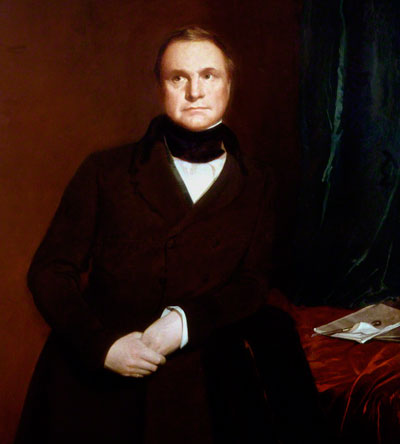
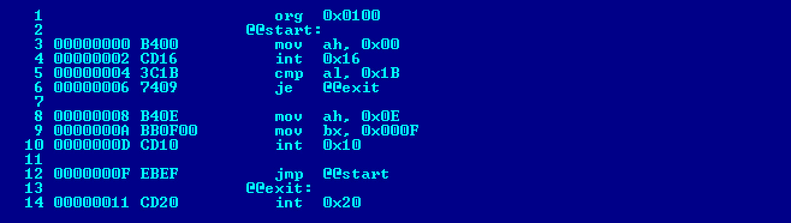

<!-- @include: ./includes/_disclaimer.md -->

# ОП.04 - 01 - Введение. Алгоритмы и программы

Ни для кого не секрет что за всю свою историю человек пытался всячески упростить себе жизнь, изобретая для этого все более и более сложные механизмы. Однако, ни одно изобретение от первой "палки-копалки" до ультрасовременного суперкомпьютера было бы невозможно без соответствующего образа мысли, вовремя пришедшей в светлую голову. Причем мало чтобы нужная мысль пришла — ее необходимо грамотно воплотить в жизнь. Многие изобретения и открытия не просто опередили свое время — они предвосхитили целые эпохи и дали платформу для новых воплощений силы человеческой мысли.

С древнейших времен развитие человечества напрямую связано с удивительной способностью преобразовывать мир вокруг себя не только "здесь и сейчас" но и существенно дальше собственной жизни, накапливая и передавая из поколения в поколение нечто более важное чем результаты собственного физического труда. И это "нечто" — информация.

Задолго до возникновения письменности у предков современного человека была возможность передать информацию лишь крайне ограниченным набором доступных средств, но и этого хватало чтобы сообщить, мол, тут — опасность, а вот это — съедобно. Параллельно с развитием человека как вида, развивались и совершенствовались и способы передачи информации как в синхронном (от человека к человеку) так и в диахронном (из поколения в поколение) виде.

Появившаяся письменность не только существенно ускорила все виды передачи информации, но также существенно изменила образ мышления человека, позволив преобразовывать накапливаемую за жизнь информацию в некоторую более абстрактную форму, **кодируя** ее определенным образом.

С тех пор произошла уже не одна научная революция, и ушедший уже XX век подарил нам компьютеры, в первую очередь как очередное изобретение автоматизации, призванное упростить жизнь путем автоматизации процессов работы с информацией.

Человеческие языки позволяют комбинировать слова великим множеством способов, так, что мы можем сказать очень много разных вещей. Компьютерные языки устроены примерно так же, хотя и менее гибки грамматически.

Иными словами, компьютер не может "понимать" наш язык, ему требуется транслировать определенный набор команд при помощи языков программирования. Для того чтобы компьютер мог решить поставленную задачу, она должна быть не просто закодирована определенным языком, но и представлена в определенном виде — алгоритмически.

*Абу Абдуллах аль-Хорезми*

Отсюда вытекает понятие **алгоритм** (лат. algorithmi — от имени персидского математика Аль-Хорезми, жившего в VIII-IX вв.) — конечная совокупность точно заданных правил решения некоторого класса задач или набор инструкций, описывающих порядок действий исполнителя для решения определённой задачи. В старой трактовке вместо слова «порядок» использовалось слово «последовательность», но по мере развития параллельности в работе компьютеров слово «последовательность» стали заменять более общим словом «порядок». Независимые инструкции могут выполняться в произвольном порядке, параллельно, если это позволяют используемые исполнители.

Примечательно что изначально слово алгоритм означало искусство счёта с помощью цифр и по одной из версий было получено при переводе трудов Аль-Хорезми с арабского на латынь о решении уравнений.

В средние века многие купцы при ведении расчетов использовали счетную доску **абак** — праобраз современных счет. А искусство управляться с абаком, а вернее последовательность действий, выполняемая при работе с ним как раз называли алгоритмом, а в Западной Европе учителей арифметики вплоть до XVII века продолжали называть «магистрами абака»

*Абак*

В XVII веке Готфрид Лейбниц впервые использовал слово «алгоритм» (Algorithmo) в ещё более широком смысле: как систематический способ решения проблем дифференциального исчисления.

Пользовался словом алгоритм и Леонард Эйлер, одна из работ которого так и называется — «Использование нового алгоритма для решения проблемы Пелля», что отражает понимание Эйлером алгоритма как синонима способа решения задачи, что уже близко к современному.

Несмотря на то что понятие алгоритма относится к первоначальным, основным, базисным понятиям математики, вычислительные процессы алгоритмического характера (арифметические действия над целыми числами, нахождение наибольшего общего делителя двух чисел и т. д.) известны человечеству с глубокой древности, в явном виде понятие алгоритма сформировалось лишь в на рубеже XIX-XX вв.

### Что такое программирование?

Программирование — это написание компьютерного кода для создания программы и решения поставленной задачи. Программы созданы для реализации алгоритмов. Алгоритмы могут быть представлены в виде псевдокода или блок-схемы, а программирование - это их перевод в компьютерную программу.

Чтобы компьютер что-то сделал, необходимо написать программу, которая точно укажет ему, что и как делать. Если алгоритм был разработан, компьютерная программа будет следовать этому алгоритму, шаг за шагом, что точно скажет компьютеру, что он должен делать.

*Ада Лавлейс*

Примечательно что первым программистом была женщина, баронесса Ада Лавлейс в XIX в. написала алгоритм для вычисления чисел Бернулли на разностной машине Бэббиджа, за что её считают первым программистом в истории.

*Чарльз Бэббидж*

Было признано, что это первая программа, специально реализованная для воспроизведения на компьютере, и по этой причине Ада Лавлейс считается первым программистом, несмотря на то, что машина Бэббиджа так и не была построена при жизни Ады.

*Вычислительная машина Бэббиджа*

Более того, в своих записях она предрекала, что, подобно тому, как Жаккардов ткацкий станок может ткать цветы и листья, аналитическая машина способна создавать алгебраические формулы, а в перспективе — писать музыку, писать картины — и укажет «науке такие пути, какие нам и не снились».

### Что такое язык программирования?

Язык программирования - это искусственный язык, понятный компьютеру. Язык состоит из серии утверждений, которые формируют инструкции. Эти инструкции говорят компьютеру, что делать.

Существует много разных языков программирования, существенно отличающихся друг от друга. Среди самых популярных языков:

- 
  Python
- 
  C++
- 
  C#
- 
  Ruby
- 
  Java
- 
  JavaScript

Языки программирования разработаны таким образом, чтобы человеку было легко понять и писать на них. Однако компьютер не может напрямую запускать программы, написанные на этих языках. Большинство языков программирования необходимо преобразовать в машинный код, прежде чем компьютер сможет выполнить описанные инструкции.

### Что же такое машинный код?

Машинный код — система команд (набор кодов операций) конкретной вычислительной машины, которая интерпретируется непосредственно процессором или микропрограммами этой вычислительной машины.

*Пример машинного кода*

Компьютерная программа, записанная на машинном языке, состоит из машинных инструкций, каждая из которых представлена в машинном коде в виде т. н. опкода — двоичного кода отдельной операции из системы команд машины. Для удобства программирования вместо числовых опкодов, которые только и понимает процессор, обычно используют их условные буквенные мнемоники. Набор таких мнемоник, вместе с некоторыми дополнительными возможностями (например, некоторыми макрокомандами, директивами), называется языком ассемблера.

Очевидно что писать программы в машинном коде довольно сложно, и с развитием языков программирования необходимости в подавляющем большинстве случаев в этом нет, однако понимание как компьютер видит и понимает программы помогает программистам составлять более эффективные алгоритмы (в данном контексте, выполняющие соответствующие задачи используя наименьшее необходимое количество ресурсов памяти и/или вычислительной мощности).
