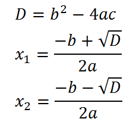
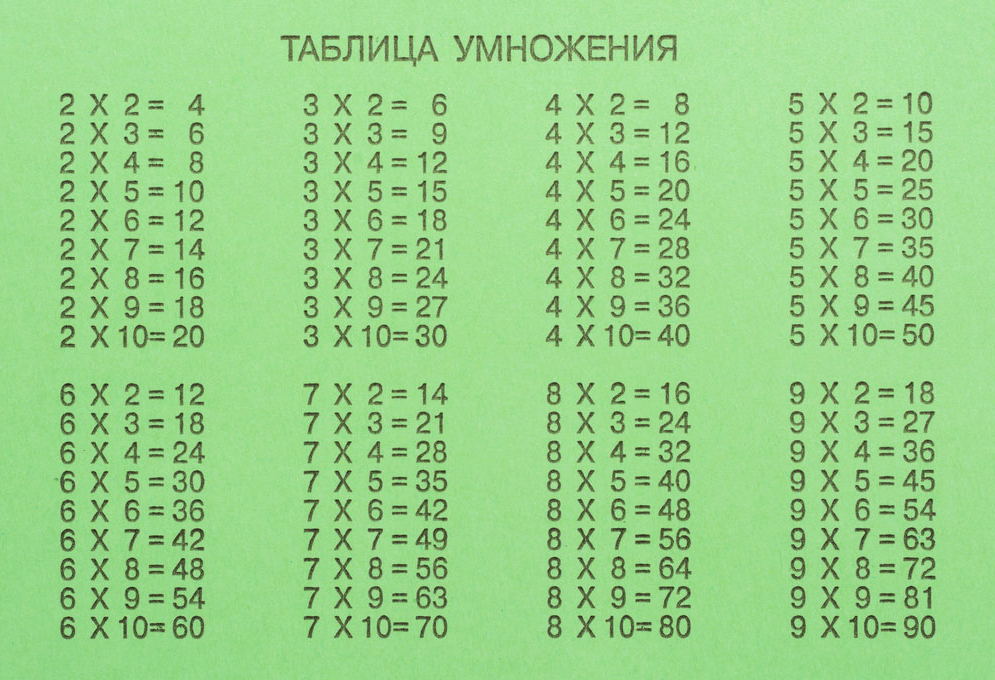
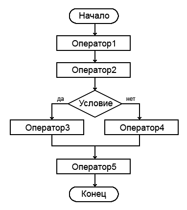
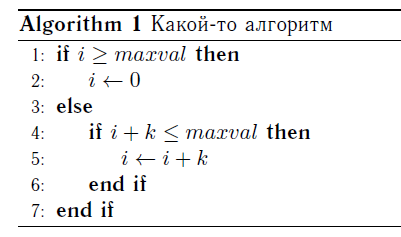
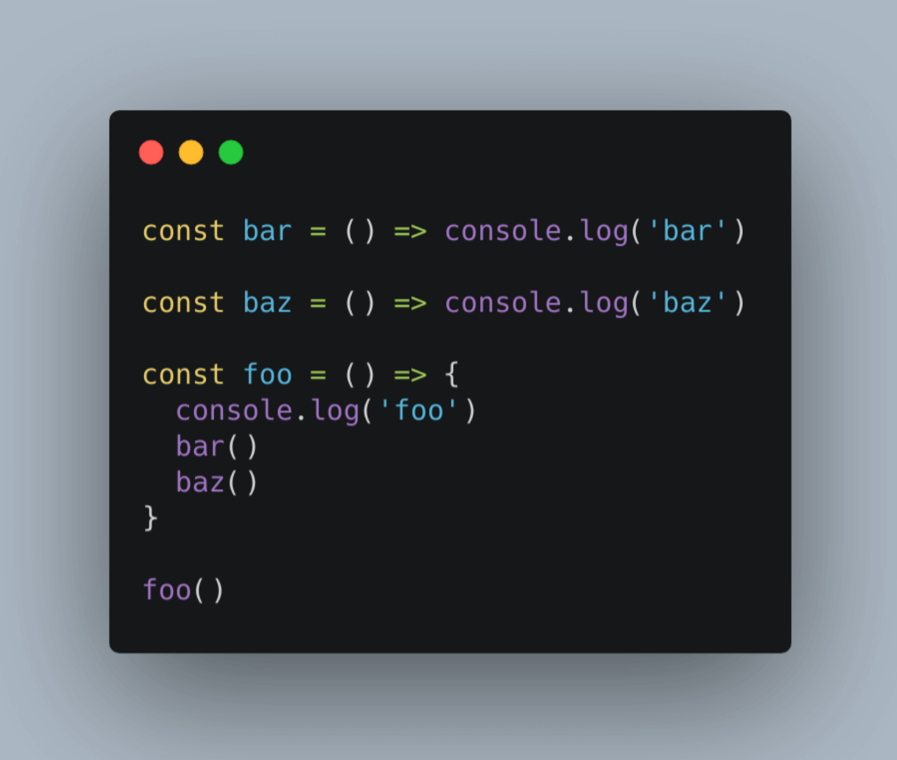

<!-- @include: ./includes/_disclaimer.md -->

# ОП.04 - 02 - Свойства и виды алгоритмов. Алгоритмически неразрешимые задачи

## Определение алгоритма

> Алгоритмом (algorithm) называют чёткое описание последовательности действий, направленных на решение конкретной задачи.

## Свойства алгоритмов

Различные определения алгоритма в явной или неявной форме содержат следующий ряд общих требований:

1. **Дискретность** — алгоритм должен представлять процесс решения задачи как упорядоченное выполнение некоторых простых шагов. При этом для выполнения каждого шага алгоритма требуется конечный отрезок времени, то есть преобразование исходных данных в результат осуществляется во времени дискретно.
2. **Детерминированность** (определённость). В каждый момент времени следующий шаг работы однозначно определяется состоянием системы. Таким образом, алгоритм выдаёт один и тот же результат (ответ) для одних и тех же исходных данных.
3. **Понятность** — алгоритм должен включать только те команды, которые доступны исполнителю и входят в его систему команд.
4. **Завершаемость** (конечность) — в более узком понимании алгоритма как математической функции, при правильно заданных начальных данных алгоритм должен завершать работу и выдавать результат за определённое число шагов.
5. **Универсальность** (массовость). Алгоритм должен быть применим к разным наборам начальных данных.
6. **Результативность** — завершение алгоритма определёнными результатами.

## Виды алгоритмов

### По уровню детерминированности

- **Механические** алгоритмы, или иначе детерминированные, жесткие (например, алгоритм работы машины, двигателя и т.п.) — задают определённые действия, обозначая их в единственной и достоверной последовательности, обеспечивая тем самым однозначный требуемый или искомый результат, если выполняются те условия процесса, задачи, для которых разработан алгоритм.
- **Гибкие алгоритмы**, например, вероятностные (стохастические) и эвристические.
  - **Вероятностный (стохастический) алгоритм** даёт программу решения задачи несколькими путями или способами, приводящими к вероятному достижению результата.
  - **Эвристический алгоритм** (от греческого слова «эврика», букв. «нашёл!») — алгоритм, использующий различные разумные соображения без строгих обоснований.

### По потоку выполнения

- **Линейный алгоритм** — набор команд (указаний), выполняемых последовательно во времени друг за другом.
- **Разветвляющийся алгоритм** — алгоритм, содержащий хотя бы одно условие, в результате проверки которого может осуществляться разделение на несколько альтернативных ветвей алгоритма.
- **Циклический алгоритм** — алгоритм, предусматривающий многократное повторение одного и того же действия (одних и тех же операций). К циклическим алгоритмам сводится большинство методов вычислений, перебора вариантов. Цикл программы — последовательность команд (серия, тело цикла), которая может выполняться многократно.

Также отдельно выделяют **Вспомогательный** (подчинённый) алгоритм (процедура) — алгоритм, ранее разработанный и целиком используемый при алгоритмизации конкретной задачи. В некоторых случаях при наличии одинаковых последовательностей указаний (команд) для различных данных с целью сокращения записи также выделяют вспомогательный алгоритм. На всех этапах подготовки к алгоритмизации задачи широко используется структурное представление алгоритма.

## Способы представления алгоритмов

### Словесный способ

Словесное описание алгоритма предполагает наличие некого словесного перечня действий.

Можно представить ситуацию туристического посещения незнакомого города. Когда вы спрашиваете, как пройти в интересующее место, вам объясняют, что надо через 100 метров повернуть направо, потом пройти прямо, пока не увидите перед собой здание кинотеатра, далее потребуется перейти дорогу, повернуть налево и не сворачивая идти до нужного объекта.

*Вы не подскажете как пройти в библиотеку?*

Все эти примеры можно назвать словесным способом представления. У такого способа есть недостаток: отсутствие наглядности выполнения процесса и чёткой формализации объектов алгоритма.

### Формульно-словесный способ

При использовании формульно-словесного способа инструкции задаются более чётко. Этот тот случай, когда словесные пояснения сопровождаются перечнем конкретных действий, плюс эти пояснения характеризуются наличием формальных символов и выражений (формул).

Примером можно считать алгоритм решения квадратного уравнения.

Это более компактный и лаконичный метод, он нагляднее, но всё же строго формальным не является.

### Табличный способ

В случае применения табличного метода алгоритм задаётся в виде входных данных: расчётных форм и таблиц. Способ широко применяется в экономических расчетах. Исходные данные, как и результаты, заносятся в заголовки столбцов используемой таблицы.

Простейший пример такого способа представления — та же таблица умножения

### Графический способ

Этот метод ещё называют способом блок-схем. В данной ситуации каждый этап прохождения алгоритма представляется в виде геометрических фигур — так называемых «блоков», причём конкретная форма фигур зависит от выполняемой операции. Существует стандарт, регламентирующий размеры используемых графических блоков, а также их отображение, функции, формы и взаимное расположение. Направление работы алгоритма показывают линии соединения блоков.

Другое название способа — визуальное представление. При проектировании алгоритмов, представленных графически, придерживаются ряда правил:
• в начале алгоритма располагаются блоки ввода значений (входные данные);
• после ввода значений располагаются блоки обработки и блоки условия;
• алгоритм завершается блоками вывода значений, полученных в результате работы алгоритма (выходные данные);
• должен быть лишь один блок начала и один — окончания;
• межблочная связь указывается линиями (направленными либо ненаправленными);
• вычислительные формулы, данные и логические выражения размещаются внутри соответствующих блоков;
• возможно наличие комментариев в виде выносок.

Графический способ представления имеет практическое значение и используется не только в случае программирования. Его применяют при составлении информационных и структурных схем, инфографики и в иных ситуациях, когда нужно обеспечить чёткую визуализацию данных и графически отобразить последовательность расположения объектов алгоритма.

Создание блок-схемы алгоритма — важный и нужный этап решения поставленной задачи. Но при некоторых обстоятельствах этот этап можно считать промежуточным, так как в таком виде описанный алгоритм невозможно выполнить средствами ЭВМ. Зато графический способ представления значительно облегчает процесс дальнейшего создания компьютерной программы.

### Программный способ (псевдокод и код)

Программа представляет собой алгоритм, который записан как последовательность команд. Речь идёт о командах, понятных компьютеру, для чего используются различные языки программирования, представляющие собой системы кодирования предписаний с правилами их применения. Языки программирования характеризуются строго определённым синтаксисом, то есть свободное толкование конструкций не допускается.

В случае программного способа представления алгоритмическая последовательность записывается в виде компьютерной программы с высокой степенью формализации. В результате появляется возможность решать прикладные задачи.

> Псевдокод — язык описания алгоритмов, использующий ключевые слова языков программирования, но опускающий подробности и специфический синтаксис.

Псевдокод предназначен для представления алгоритма человеку, а не для компьютерной трансляции и последующего исполнения программы.

> Программный код (или исходный код) — текст компьютерной программы на каком-либо языке программирования, который может быть прочтён человеком, но служит для непосредственной трансляции для выполнения компьютером.

Исходный код транслируется в исполняемый код целиком до запуска программы при помощи компилятора или может исполняться сразу при помощи интерпретатора.

## О взаимодополнении способов представления

Способы, представленные выше, нередко являются взаимодополняемыми:

- на этапе обсуждения используются словесные и словесно-формульные способы;
- на этапе проектирования рекомендуется использовать графические алгоритмы (графическое представление);
- на этапе проверки возможно табличное описание;
- на этапе непосредственного применения и решения прикладных задач используют текстовую запись, представленную в виде компьютерной программы.

## Все ли задачи разрешимы с помощью алгоритмов?

Формализация понятия алгоритма позволила исследовать существование задач, для которых не существует алгоритмов поиска решений. Впоследствии была доказана невозможность алгоритмического вычисления решений ряда задач, что делает невозможным их решение на любом вычислительном устройстве.

Алгоритмическая неразрешимость — это свойство некоторых классов корректно поставленных задач, допускающих применение алгоритмов, которое состоит в том, что задачи каждого из этих классов в принципе не имеют какого-либо общего, универсального алгоритма решения, объединяющего этот класс.

Алгоритмически неразрешимые задачи — это проблемы, для которых не существует универсального алгоритма, способного дать ответ в общем случае. К таким задачам относятся:

1) **проблема остановки** — невозможность определить, завершит ли произвольно выбранная программа (включая не только компьютерные, но и алгоритмы, выполняемые человеком) свою работу или войдёт в бесконечный цикл;
2) **проблема эквивалентности программ** — отсутствие общего алгоритма для установления эквивалентности двух программ по их поведению или результату;
3) **проблема тождества математических выражений** — невозможность разработать универсальный метод для определения, являются ли два выражения тождественными;
4) **проблема сборки автомата** — отсутствие алгоритма, который бы позволял определить, можно ли из заданного набора автоматов собрать требуемый;
5) **другие задачи** — множество проблем в топологии, теории групп и других областях математики, для которых также не существует универсальных алгоритмов решения.
Эти задачи представляют фундаментальные ограничения в теории алгоритмов и имеют важное значение для понимания природы вычислений и математических моделей.

Алгоритмическая неразрешимость как невозможность обобщённой системы точных предписаний по решению задач одного и того же типа имеет принципиальное значение для психологии мышления, теории познания и обучения. В частности, из неё следует, что основные компоненты деятельности человека (планирование, выполнение, контроль результатов, коррекция) не могут быть построены на алгоритмической основе, хотя и могут включать в качестве вспомогательных те или иные алгоритмические процедуры. Решение задачи, относящейся к типу алгоритмически неразрешимых, с неизбежностью включает неалгоритмизуемые компоненты и требует творчества: способ её решения не выводится из более общего известного типового метода, а изобретается. Полный успех здесь не может быть гарантирован никакими методами (в отличие от ситуации с алгоритмически разрешимыми задачами).

Таким образом, алгоритмическая неразрешимость как объективная невозможность универсальных точных предписаний, однозначно приводящих к заданному результату, означает свободу выбора и объективную необходимость творческого поиска.

## Что почитать по теме

- [Статья на Википедии - Алгоритм](https://ru.wikipedia.org/wiki/%D0%90%D0%BB%D0%B3%D0%BE%D1%80%D0%B8%D1%82%D0%BC)
