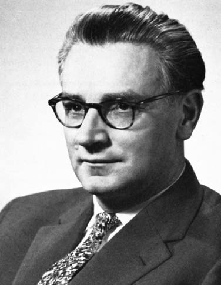

<!-- @include: ./includes/_disclaimer.md -->

# ОП.04 - 04 - История развития языков программирования

Можно сказать, что первые языки программирования возникали ещё до появления современных электронных вычислительных машин: уже в XIX веке были изобретены устройства, которые можно с долей условности назвать программируемыми — к примеру, музыкальная шкатулка (и позднее механическое пианино) посредством металлического цилиндра и Жаккардовый ткацкий станок (1804) посредством картонных карт. Для управления ими использовались наборы инструкций, которые в рамках современной классификации можно считать прототипами предметно-ориентированных языков программирования. Значимым можно считать «язык», на котором леди Ада Августа (графиня Лавлейс) в 1842 году написала программу для вычисления чисел Бернулли для аналитической машины Чарльза Бэббиджа, ставшей бы, в случае реализации, первым компьютером в мире, хотя и механическим — с паровым двигателем.

В 1930—1940 годах А. Чёрч, А. Тьюринг, А. Марков разработали математические абстракции (лямбда-исчисление, машину Тьюринга, нормальные алгоритмы соответственно) — для формализации алгоритмов.

В это же время, в 1940-е годы, появились электрические цифровые компьютеры и был разработан язык, который можно считать первым высокоуровневым языком программирования для ЭВМ — «Plankalkül», созданный немецким инженером К. Цузе в период с 1943 по 1945 годы.

*Конрад Цузе*

Программисты ЭВМ начала 1950-х годов, в особенности таких, как UNIVAC и IBM 701, при создании программ пользовались непосредственно машинным кодом, запись программы на котором состояла из единиц и нулей и который принято считать языком программирования первого поколения (при этом разные машины разных производителей использовали различные коды, что требовало переписывать программу при переходе на другую ЭВМ).

Первым практически реализованным языком стал в 1949 году так называемый «Краткий код», в котором операции и переменные кодировались двухсимвольными сочетаниями. Он был разработан в компании Eckert-Mauchly Computer Corporation, выпускавшей UNIVAC-и, созданной одним из сотрудников Тьюринга, Джоном Мокли. Мокли поручил своим сотрудникам разработать транслятор математических формул, однако для 1940-х годов эта цель была слишком амбициозна. Краткий код был реализован с помощью интерпретатора.

Вскоре на смену такому методу программирования пришло применение языков второго поколения, также ограниченных спецификациями конкретных машин, но более простых для использования человеком за счёт использования мнемоник (символьных обозначений машинных команд) и возможности сопоставления имён адресам в машинной памяти. Они традиционно известны под наименованием языков ассемблера и автокодов. Однако при использовании ассемблера становился необходимым процесс перевода программы на язык машинных кодов перед её выполнением, для чего были разработаны специальные программы, также получившие название ассемблеров. Сохранялись и проблемы с переносимостью программы с ЭВМ одной архитектуры на другую, и необходимость для программиста при решении задачи мыслить терминами «низкого уровня» — ячейка, адрес, команда. Позднее языки второго поколения были усовершенствованы: в них появилась поддержка макрокоманд.

С середины 1950-х начали появляться языки третьего поколения, такие как Фортран, Лисп и Кобол. Языки программирования этого типа более абстрактны (их ещё называют «языками высокого уровня») и универсальны, не имеют жёсткой зависимости от конкретной аппаратной платформы и используемых на ней машинных команд. Программа на языке высокого уровня может исполняться (по крайней мере, в теории, на практике обычно имеется ряд специфических версий или диалектов реализации языка) на любой ЭВМ, на которой для этого языка имеется транслятор (инструмент, переводящий программу на язык машины, после чего она может быть выполнена процессором).

Обновлённые версии перечисленных языков до сих пор имеют хождение в разработке программного обеспечения, и каждый из них оказал определённое влияние на последующее развитие языков программирования. Тогда же, в конце 1950-х годов, появился Алгол, также послуживший основой для ряда дальнейших разработок в этой сфере. Необходимо заметить, что на формат и применение ранних языков программирования в значительной степени влияли интерфейсные ограничения.

В период 1960-х — 1970-х годов были разработаны основные парадигмы языков программирования, используемые в настоящее время, хотя во многих аспектах этот процесс представлял собой лишь улучшение идей и концепций, заложенных ещё в первых языках третьего поколения.

- Язык APL оказал влияние на функциональное программирование и стал первым языком, поддерживавшим обработку массивов.
- Язык ПЛ/1 (NPL) был разработан в 1960-х годах как объединение лучших черт Фортрана и Кобола.
- Язык Snobol, разработанный и совершенствуемый в течение 1960-х годов, ориентированный на обработку текстов, ввёл в число базовых операций языков программирования сопоставление с образцом.
- Язык Симула, появившийся примерно в это же время, впервые включал поддержку объектно-ориентированного программирования. В середине 1970-х группа специалистов представила язык Smalltalk, который был уже всецело объектно-ориентированным.
- В период с 1969 по 1973 годы велась разработка языка Си, популярного и по сей день и ставшего основой для множества последующих языков, например, столь популярных, как C++ и Java.
- В 1972 году был создан Пролог — наиболее известный (хотя и не первый, и далеко не единственный) язык логического программирования.
- В 1973 году в языке ML была реализована расширенная система полиморфной типизации, положившая начало типизированным языкам функционального программирования.

Каждый из этих языков породил по семейству потомков, и большинство современных языков программирования в конечном счёте основано на одном из них.

*Языки программирования*

Кроме того, в 1960—1970-х годах активно велись споры о необходимости поддержки структурного программирования в тех или иных языках. В частности, голландский специалист Э. Дейкстра выступал в печати с предложениями о полном отказе от использования инструкций GOTO во всех высокоуровневых языках. Развивались также приёмы, направленные на сокращение объёма программ и повышение продуктивности работы программиста и пользователя.

В 1980-е годы наступил период, который можно условно назвать временем консолидации. Язык C++ объединил в себе черты объектно-ориентированного и системного программирования, правительство США стандартизировало язык Ада, производный от Паскаля и предназначенный для использования в бортовых системах управления военными объектами, в Японии и других странах мира осуществлялись значительные инвестиции в изучение перспектив так называемых языков пятого поколения, которые включали бы в себя конструкции логического программирования. Сообщество функциональных языков приняло в качестве стандарта ML и Лисп. В целом этот период характеризовался скорее опорой на заложенный в предыдущем десятилетии фундамент, нежели разработкой новых парадигм.

Важной тенденцией, которая наблюдалась в разработке языков программирования для крупномасштабных систем, было сосредоточение на применении модулей — объёмных единиц организации кода. Хотя некоторые языки, такие, как ПЛ/1, уже поддерживали соответствующую функциональность, модульная система нашла своё отражение и применение также и в языках Модула-2, Оберон, Ада и ML. Часто модульные системы объединялись с конструкциями обобщённого программирования.

Важным направлением работ становятся визуальные (графические) языки программирования, в которых процесс «написания» программы как текста заменяется на процесс «рисования» (конструирования программы в виде диаграммы) на экране ЭВМ. Визуальные языки обеспечивают наглядность и лучшее восприятие логики программы человеком.

В 1990-х годах в связи с активным развитием Интернета распространение получили языки, позволяющие создавать сценарии для веб-страниц — главным образом Perl, развившийся из скриптового инструмента для Unix-систем, и Java. Возрастала также и популярность технологий виртуализации. Эти изменения, однако, также не представляли собой фундаментальных новаций, являясь скорее совершенствованием уже существовавших парадигм и языков (в последнем случае — главным образом семейства Си).

В настоящее время развитие языков программирования идёт в направлении повышения безопасности и надёжности, создания новых форм модульной организации кода и интеграции с базами данных.

## Поколения языков программирования

Языки программирования исторически принято делить на поколения.

### Первое поколение

К первому поколению (англ. first-generation programming language, 1GL) относят машинные языки — языки программирования на уровне команд процессора конкретной машины. Для программирования не использовался транслятор, команды программы вводились непосредственно в машинном коде переключателями на передней панели машины. Такие языки были хороши для детального понимания функционирования конкретной машины, но сложны для изучения и решения прикладных задач.

Термины «первое поколение» и «второе поколение» были введены одновременно с термином «третье поколение». Фактически, эти термины в то время не использовались. С появлением языков высокого уровня, языки ассемблера стали относить к первому поколению языков.

### Второе поколение

Языки второго поколения (2GL) создавались для того, чтобы облегчить тяжёлую работу по программированию, перейдя в выражениях языка от низкоуровневых машинных понятий ближе к тому, как обычно мыслит программист. Эти языки появились в 1950-е годы, в частности, такие языки как Фортран и Алгол. Наиболее важной проблемой, с которыми столкнулись разработчики языков второго поколения, стала задача убедить клиентов в том, что созданный компилятором код выполняется достаточно хорошо, чтобы оправдать отказ от программирования на ассемблере. Скептицизм по поводу возможности создания эффективных программ с помощью автоматических компиляторов был довольно распространён, поэтому разработчикам таких систем должны были продемонстрировать, что они действительно могут генерировать почти такой же эффективный код, как и при ручном кодировании, причём практически для любой исходной задачи.

### Третье поколение

Под третьим поколением (3GL) первоначально понимались все языки более высокого уровня, чем ассемблер. Главной отличительной чертой языков третьего поколения стала независимость от аппаратного обеспечения, то есть выражение алгоритма в форме, не зависящей от конкретных характеристик машины, на которой он будет исполняться. Код, написанный на языке третьего поколения, перед исполнением транслируется либо непосредственно в машинные команды, либо в код на ассемблере и затем уже ассемблируется. При компиляции, в отличие от предыдущих поколений, уже нет соответствия один-к-одному между инструкциями программы и генерируемым кодом.

Стала широко использоваться интерпретация программ — при этом инструкции программы не преобразуются в машинный код, а исполняются непосредственно одна за другой. Независимость от «железа» достигается за счёт использования интерпретатора, скомпилированного под конкретную аппаратную платформу.

### Четвёртое поколение

Термин языки программирования четвёртого поколения (4GL) лучше представлять как среды разработки четвёртого поколения. Они относятся к временному периоду с 1970-х по начало 1990-х.

Языки этого поколения предназначены для реализации крупных проектов, повышают их надежность и скорость создания, ориентированы на специализированные области применения, и используют не универсальные, а объектно-ориентированные языки, оперирующие конкретными понятиями узкой предметной области. В эти языки встраиваются мощные операторы, позволяющие одной строкой описать такую функциональность, для реализации которой на языках младших поколений потребовались бы тысячи строк исходного кода.

### Пятое поколение

Рождение языков пятого поколения произошло в середине 90-х годов. К ним относятся также системы автоматического создания прикладных программ с помощью визуальных средств разработки, без знания программирования. Основная идея была заключена в возможности автоматического формирования результирующего текста на универсальных языках программирования (который необходимо откомпилировать). Инструкции же вводятся в компьютер в максимально наглядном виде с помощью методов, наиболее удобных для человека, не знакомого с программированием.

### Шестое поколение

С недавнего времени, буквально последние 5 лет, многие источники также стали выделять шестое поколение языков программирования. Язык программирования шестого поколения (6GL) — это любой язык программирования, основанный на визуальной разработке. Общий термин для них — «NoCode» или «Visual Development». Также к этому поколению причисляют различные так или иначе связанные с разработкой нейросетей.

## Что почитать по теме

- [Статья на Википедии - История языков программирования](https://ru.wikipedia.org/wiki/%D0%98%D1%81%D1%82%D0%BE%D1%80%D0%B8%D1%8F_%D1%8F%D0%B7%D1%8B%D0%BA%D0%BE%D0%B2_%D0%BF%D1%80%D0%BE%D0%B3%D1%80%D0%B0%D0%BC%D0%BC%D0%B8%D1%80%D0%BE%D0%B2%D0%B0%D0%BD%D0%B8%D1%8F)
