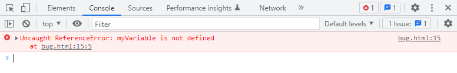

<!-- @include: ./includes/_disclaimer.md -->

# ОП.04 - 08 - Структура кода. Переменные и константы. Ввод и вывод данных

## Структура кода, инструкции и комментарии

Как правило, код программы, написанный на большинстве языков программирования, состоит из набора инструкций.

> Инструкции — это синтаксические конструкции и команды, которые выполняют действия.

В зависимости от того, является ли язык итерпретируемым или компилируемым, соответствующие инструкции выполняет интерпретатор или компилятор. Как правило, инструкции выполняются последовательно (в рамках данного курса возможности параллельного и асинхронного выполнения мы умышленно не рассматриваем).

В большинстве случаев, в коде программы может быть сколь угодно много инструкций. Важно чтобы одна инструкция была четко отделена от другой подобно каждому шагу алгоритма. В зависимости от языка программирования, способы разделения инструкций могут несколько отличаться.

В рамках прошлой лекции мы уже видели инструкцию `alert('Привет, мир!')`, которая отображает сообщение __«Привет, мир!»__ во всплывающем окне.

Попробуем несколько модифицировать эту инструкцию, чтобы понять на примере как разделяются инструкции.

[Код примера для практической работы](./includes/_html_example.md)

### Примеры инструкций

<!-- tabs:start -->

#### **Пример №1**

Например, здесь мы разделили сообщение «Привет Мир» на два вызова alert в одной строке.

**`script.js`**

```js
alert('Привет'); alert('Мир');
```

#### **Пример №2**

А здесь разбили эти инструкции на разные строки. Обычно каждую инструкцию пишут на новой строке, чтобы код было легче читать.

**`script.js`**

```js
alert('Привет');
alert('Мир');
```

#### **Пример №3**

В большинстве случаев точку с запятой можно не ставить, если есть переход на новую строку. Так тоже будет работать:

**`script.js`**

```js
alert('Привет')
alert('Мир')
```

В этом случае JavaScript интерпретирует перенос строки как «неявную» точку с запятой. Однако это правило работает не всегда, и если перенос будет совершен внутри скобок `( )` или кавычек `' '` / `" "`, никакого «конца инструкции» там не будет. Поэтому на данном этапе лучше принять за правило что отдельные инструкции мы будем всегда разделять при помощи `;`, во всяком случае в рамках данного курса.

<!-- tabs:end -->

### Комментарии в коде

Со временем программы становятся всё сложнее и сложнее. Возникает необходимость добавлять комментарии, которые бы описывали, что делает код и почему. Комментарии могут находиться в любом месте программы. Они не влияют на ее выполнение, поскольку интерпретатор просто игнорирует их.

Комментарии бывают однострочными и многострочными.

### Примеры комментариев в коде

<!-- tabs:start -->

#### **Пример №4**

Однострочные комментарии начинаются с двойной косой черты `//`. Часть строки после `//` считается комментарием. Такой комментарий может как занимать строку целиком, так и находиться после инструкции.

**`script.js`**

```js
// Этот комментарий занимает всю строку
alert('Привет');

alert('Мир'); // Этот комментарий следует за инструкцией
```

#### **Пример №5**

Многострочные комментарии начинаются косой чертой со звёздочкой `/*` и заканчиваются звёздочкой с косой чертой `*/`.

**`script.js`**

```js
/* Пример с двумя сообщениями.
Это - многострочный комментарий.
*/
alert('Привет');
alert('Мир');
```

#### **Пример №6**

Содержимое комментария игнорируется, поэтому, если мы поместим код внутри `/* … */`, он не будет исполняться. Это бывает удобно для временного отключения участка кода.

**`script.js`**

```js
/* Закомментировали код
alert('Привет');
*/
alert('Мир');
```

<!-- tabs:end -->

> [!TIP]
> В большинстве редакторов строку кода можно закомментировать и раскомментировать, нажав комбинацию клавиш <kbd>Ctrl + /</kbd> на __Windows__ или <kbd>Cmd + /</kbd> на __macOS__.

### Как инспектировать код при помощи консоли разработчика

Довольно часто в процессе написания и исполнения кода могут встречаться различные ошибки. Вообще, людям свойственно ошибаться и программисты сталкиваются с ошибками постоянно и ежедневно, порой десятки раз за рабочий день. Несмотря на та что более подробно тему ошибок мы рассмотрим дальше в рамках данного курса, понимать как и где они могут появиться мы должны уже сейчас.

> [!INFO]
> Программисты часто используют профессиональные сленговые слова, и вместо привычного слова ошибка часто можно встретить такое слово как _баг_.
>
> **Баг — некорректная работа программы, вызванная ошибкой в программном коде.**
>
> По одной из версий, термин «баг» произошёл от английского bug, что переводится как «мелкая букашка» или «жук». Существует легенда, что в 1945 году учёные Гарвардского университета испытывали один из вычислительных приборов, но почему-то устройство не могло корректно работать. Когда учёные начали выяснять, в чём причина неисправности прибора, то обнаружили застрявшую между проводами бабочку, извлекли её из аппарата, а в дневнике работы описали событие. С тех пор слово «баг» стало означать «ошибку».

Большинство ошибок языка JavaScript в браузере по-умолчанию не видны. То есть, если что-то пойдёт не так, мы не увидим, что именно сломалось, и не сможем это починить. Для решения задач такого рода в браузер встроены так называемые «Инструменты разработки» (Developer tools или сокращённо — devtools).

Подобные средства разработки встроены во многие браузеры, но мы в рамках курса будем использовать **Google Chrome**.

Для начала давайте попробуем создать страницу, в которой содержится явная ошибка:

**`bug.html`**

```html
<!DOCTYPE html>
<html>
<head>
  <meta charset="utf-8">
  <title>Эта страница содержит явную ошибку в коде JavaScript</title>
</head>
<body>
  <h1>Эта страница содержит явную ошибку в коде JavaScript</h1>

  <p>
    Но чтобы увидеть эту ошибку, для начала нужно включить консоль разработчика при помощи клавиши <kbd>F12</kbd> на клавиатуре.
  </p>

  <script>
    myVariable
  </script>

</body>
</html>
```

В её JavaScript-коде закралась ошибка. Она не видна обычному посетителю, поэтому давайте найдём её при помощи инструментов разработки. Нажмите <kbd>F12</kbd> на __Windows__ или <kbd>fn + F12</kbd> на __macOS__.

По умолчанию в инструментах разработчика откроется вкладка Console (консоль). Она выглядит приблизительно следующим образом:



Точный внешний вид инструментов разработки зависит от используемой версии Chrome. Время от времени некоторые детали изменяются, но в целом внешний вид остаётся примерно похожим.

- В консоли мы можем увидеть сообщение об ошибке, выделенное красным цветом.
- В нашем случае скрипт содержит неизвестную команду «myVariable».

Справа присутствует ссылка на исходный код `bug.html:12` с номером строки кода, в которой эта ошибка и произошла.
Под сообщением об ошибке находится синий символ `>`. Он обозначает командную строку, в ней мы можем редактировать и запускать JavaScript-команды. Для их запуска после ввода команды можно нажать <kbd>Enter</kbd>.

Теперь мы явно видим ошибки, для начала этого вполне достаточно. Мы ещё вернёмся к инструментам разработчика позже и более подробно рассмотрим отладку кода в рамках данного курса.

## Переменные и константы

> Переменная — это «именованное хранилище» для данных.

Мы можем использовать переменные для хранения практически любых данных.

Для создания переменной в JavaScript используйте ключевое слово `let`.

Приведённая ниже инструкция создаёт (другими словами: объявляет или определяет) переменную с именем `message`:

```js
let message;
```

Теперь можно поместить в неё данные, используя оператор присваивания `=`:

```js
let message;

message = 'Привет!'; // сохранить строку 'Привет!' в переменной с именем message
```

Строка сохраняется в области памяти, связанной с переменной. Мы можем получить к ней доступ, используя имя переменной:

```js
let message;
message = 'Привет!';

alert(message); // показывает содержимое переменной
```

Для краткости можно совместить объявление переменной и запись данных в одну строку:

```js
let message = 'Привет!'; // определяем переменную и присваиваем ей значение

alert(message); // Привет!
```

> [!INFO]
> Не все языки позволяют просто так присваивать значение переменной в момент определения, да еще и без явного указания типа данных которые мы хотим туда положить. Например, на языке **C** (Си) мы сначала должны явно объявить в программе переменную, задать её тип, а в отдельных случаях (если задали какой-то сложный тип) то даже четко определить область памяти в которую впоследствии планируем положить значение этой переменной, и если на момент когда компилятор будет пытаться собрать программу, все эти условия не буду соблюдены, он просто откажется такую программу компилировать.

Если представить доступную нам память в виде достаточно большого шкафа, то переменная — это полка в которую мы можем что-то положить.

В JavaScript есть ограничения, касающиеся имён переменных:

1. Имя переменной должно содержать только буквы, цифры или символы `$` и `_`.
2. Первый символ не должен быть цифрой.
3. Имя переменной не должно само являться [зарезервированным словом](https://developer.mozilla.org/en-US/docs/Web/JavaScript/Reference/Lexical_grammar#keywords) означающим встроенную команду языка.

Примеры **допустимых** имён:

```js
let userName;
let user_name;
let $user;
let _user;
let user123;
```

Примеры **недопустимых** имён:

```js
let 1a; // не может начинаться с цифры
let my-name; // дефис '-' не разрешён в имени
let let; // нельзя назвать переменную "let"
let return; // также, это зарезервированное слово
```

Примечательно, что знак доллара `$` и подчёркивание `_` также можно использовать в названиях. Это обычные символы, как и буквы, без какого-либо особого значения.

Эти имена являются допустимыми:

```js
let $ = 1; // объявили переменную с именем "$"
let _ = 2; // а теперь переменную с именем "_"

alert($ + _); // 3
```

> [!WARNING]
> **Регистр имеет значение!**
>
> Переменные с именами `apple` и `APPLE` — это две разные переменные.

Значение переменной может меняться в коде программы сколько угодно раз:

```js
let message = "Я изначальное значение сообщения";
alert(message); // Я изначальное значение сообщения
message = "А я — уже измененное в процессе выполнения";
alert(message); // А я — уже измененное в процессе выполнения
```

Обратите внимание, что для изменения значения не нужно повторно объявлять переменную ключевым словом `let`. Подобное «повторное объявление» как правило, вызовет ошибку.

Но бывают случаи, когда возможность изменить значение переменной нужно принципиально запретить, для этого существуют «константы».

> Константа — это такой вид переменной, изменение которой программой не предполагается или запрещается.

Чтобы объявить константную, то есть, неизменяемую переменную, используйте `const` вместо `let`:

```js
const myName = "Павел";
alert(myName); // Павел
myName = "Петр";
alert(myName); // ошибка, константу нельзя перезаписать!
```

Если программист уверен, что переменная никогда не будет меняться, он может гарантировать это и наглядно донести до каждого, объявив её через `const`. Как правило, константы используют для различных фиксированных значений, изменение которых явно не предполагается в процессе выполнения программы, например какие-либо математические, физические константные величины и т.п.

Широко распространена практика использования констант в качестве псевдонимов для трудно запоминаемых значений, которые известны до начала исполнения скрипта.

Названия таких констант пишутся с использованием заглавных букв и подчёркивания.

Например в виде константы вполне можно хранить **IP-адрес** сервера с которого предполагается запуск соответствующего скрипта:

```js
const SERVER_IP = '192.168.0.1';
```

### Правильное именование переменных

В разговоре о переменных необходимо упомянуть, что есть ещё одна чрезвычайно важная вещь. Название переменной должно иметь ясный и понятный смысл, говорить о том, какие данные в ней хранятся.

Именование переменных — это один из самых важных и сложных навыков в программировании. Быстрый взгляд на имена переменных может показать, какой код был написан новичком, а какой — опытным разработчиком.

В реальной рабочей практике большая часть времени тратится на изменение и расширение существующей кодовой базы, а не на написание чего-то совершенно нового с нуля. Когда мы возвращаемся к коду после какого-то промежутка времени, гораздо легче найти информацию, которая хорошо размечена. Или, другими словами, когда переменные имеют хорошие имена.

Вот несколько хороших правил:

- Используйте легко читаемые имена, такие как `userName` или `shoppingCart`.
- Избегайте использования аббревиатур или коротких имён, таких как `a`, `b`, `c`, за исключением тех случаев, когда вы точно знаете, что так нужно.
- Делайте имена максимально описательными и лаконичными. Примеры плохих имён: `data` и `value`. Такие имена ничего не говорят. Их можно использовать только в том случае, если из контекста кода очевидно, какие данные хранит переменная.
- Договоритесь с вашей командой об используемых терминах. Если посетитель сайта называется __«user»__, тогда мы должны называть связанные с ним переменные `currentUser` или `newUser`, а не, к примеру, `currentVisitor` или `newGuy`.

__Звучит просто?__ Действительно, это так, но на практике для создания описательных и кратких имён переменных зачастую требуется подумать.

> [!INFO]
> Кроме осмысленного выбора имен, также разработчики должны придерживаться и общего стиля именования переменных, который часто называют "нотацией". В языке JavaScript для именования переменных как правило используют т.н. `camelCase`, и несколько реже -- `snake_case`.
> Подробнее про разные виды нотаций для именования переменных можно почитать [по ссылке](https://www.freecodecamp.org/news/programming-naming-conventions-explained/).

## Ввод и вывод данных

Для ввода и вывода данных в программу, различные языки программирования использую различный набор средств. Язык JavaScript, исполняемый в браузере без каких-либо сторонних расширений, может реализовывать следующие виды ввода и вывода данных:

- Ввод
  - Из тела программы (из переменных и констант)
  - Из связанной HTML-страницы (отдельные блоки и элементы страницы, значения полей и элементов интерфейса)
  - Из вызываемого окна взаимодействия с пользователем (например `prompt`)
  - Из внешнего источника, с другого сервера посредством т.н. API (программных методов взаимодействия)
  - Из доступных интерфейсов браузера (при условии что пользователь разрешил действие, например геопозиция, вебкамера, микрофон)
  - Из файловой системы (по-умолчанию ограничено областью т.н. "песочницы")

- Вывод
  - В консоль разработчика (например методом `console.log`)
  - В связанную HTML-страницу (отдельные блоки и элементы страницы, значения полей и элементов интерфейса)
  - В вызываемое окно взаимодействия с пользователем (например `alert`, `confirm`)
  - Во внешний источник, например на другой сервер посредством API
  - В доступные интерфейсы браузера (также при условии что пользователь одобрил)
  - В файловую систему, т.н. `cookies` или `local storage`

Из всего перечня, с некоторыми возможностями ввода/вывода мы уже знакомы, однако большинство из них останутся за рамками данного курса, исключения составят только несколько наиболее популярных, которые мы будем использовать в том числе и для подготовки домашних заданий.

### Примеры некоторых возможностей ввода и вывода данных

<!-- tabs:start -->

#### **Вывод через `alert`**

С этой функцией мы уже знакомы. Она показывает сообщение и ждёт, пока пользователь нажмёт кнопку «ОК». Например:

**`script.js`**

```js
alert("Привет, я alert!");
```

Это небольшое окно с сообщением называется модальным окном. Понятие модальное означает, что пользователь не может взаимодействовать с интерфейсом остальной части страницы, нажимать на другие кнопки и т.д. до тех пор, пока взаимодействует с окном. В данном случае — пока не будет нажата кнопка «OK».

#### **Ввод через `prompt`**

Функция `prompt` отобразит модальное окно с текстом, полем для ввода текста и кнопками OK/Отмена. Например:

**`script.js`**

```js
let age = prompt('Сколько тебе лет?');
alert('Тебе ' + age);
```

Значение, введенное пользователем автоматически будет передано соответствующей переменной. На самом деле, у данной функции есть еще ряд особенностей, например возможность задать значение по-умолчанию, но в рамках данного курса мы это использовать не будем.

#### **Ввод через `confirm`**

Функция `confirm` отображает модальное окно с текстом вопроса и двумя кнопками: OK и Отмена. Например:

**`script.js`**

```js
let isConfirmed = confirm("Видишь ли ты перед собой модальное окно confirm?");
alert( isConfirmed );
```

Если была нажата кнопка OK, то результат будет считаться истинным. Во всех других случаях — ложным. Смысл этих значений мы затронем далее в рамках курса, когда будем проходить логические операторы.

#### **Вывод в `console`**

Уже после нескольких вызовов примера вывода через `alert` возможно вам этот способ показался раздражающим, в том числе своей особенностью блокировать отображение страницы до тех пор пока окно не будет закрыто. Как правило, программисты на JavaScript предпочитают использовать более удобный формат вывода, а именно т.н. консоль разработчика с которой мы знакомились ранее в рамках данной лекции. Все сообщение и данные, которые мы хотим передать в консоль, относятся к особому объекту `console`, при обращении к которому через символ точки `.` принято указывать метод (пока это понятие нам не знакомо, считаем его пока просто некоторым __особым действием__ объекта), при помощи которого хотим вызвать сообщение.

**`script.js`**

```js
console.log("Привет, я сообщение в консоли типа log, самое обычное");
console.info("Привет, я сообщение в консоли типа info, подсвечиваю что-то интересное");
console.warn("Привет, я сообщение в консоли типа warn, обращаю на что-то внимание");
console.error("Привет, я сообщение в консоли типа error, сообщаю об ошибке");
```

В большинстве случаев в рамках данного курса нам достаточно использовать только `console.log()`.

<!-- tabs:end -->

Все эти методы кроме вывода в консоль являются модальными: останавливают выполнение скриптов и не позволяют пользователю взаимодействовать с остальной частью страницы до тех пор, пока окно не будет закрыто.

На все указанные «оконные» методы распространяются два ограничения:

- Расположение окон определяется браузером. Обычно окна находятся в центре.
- Визуальное отображение окон зависит от браузера, и мы не можем изменить их вид.

Такова цена простоты. Есть другие способы показать более приятные глазу окна с богатой функциональностью для взаимодействия с пользователем, но если «навороты» не имеют значения, то данные методы работают отлично.

## Что почитать по теме

- [Современный учебник JavaScript - Структура кода](https://learn.javascript.ru/structure)
- [Современный учебник JavaScript - Консоль разработчика](https://learn.javascript.ru/devtools)
- [Современный учебник JavaScript - Переменные](https://learn.javascript.ru/variables)
- [Современный учебник JavaScript - Взаимодействие: alert, prompt, confirm](https://learn.javascript.ru/alert-prompt-confirm)
- [W3Schools - JavaScript Output](https://www.w3schools.com/js/js_output.asp)
- [W3Schools - JavaScript Statements](https://www.w3schools.com/js/js_statements.asp)
- [W3Schools - JavaScript Syntax](https://www.w3schools.com/js/js_syntax.asp)
- [W3Schools - JavaScript Comments](https://www.w3schools.com/js/js_comments.asp)
- [W3Schools - JavaScript Variables](https://www.w3schools.com/js/js_variables.asp)
- [W3Schools - JavaScript Let](https://www.w3schools.com/js/js_let.asp)
- [W3Schools - JavaScript Const](https://www.w3schools.com/js/js_const.asp)
