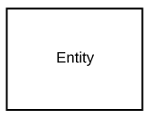
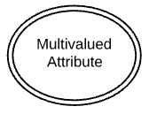
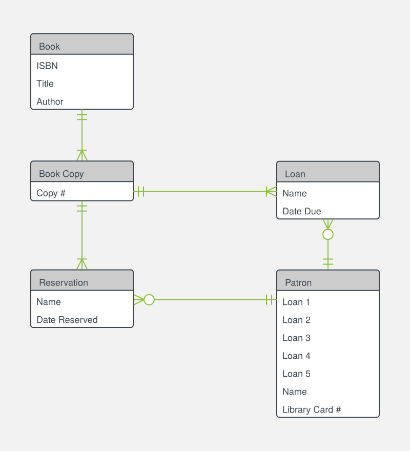

<!-- @include: ./includes/_disclaimer.md -->

# ОП.08 - 10 - Модели БД и способы их представления. ER-диаграммы

## Понятие модели БД

**Модель базы данных** — это структура, которая определяет, как данные будут храниться, организовываться и обрабатываться в базе данных. Она состоит из таблиц, полей, связей между таблицами и ограничений целостности данных.

Мы знаем, что MySQL — это система управления реляционными базами данных (СУБД), которая использует модель БД реляционной системы. В MySQL модель БД представлена в виде набора таблиц, каждая из которых имеет свое имя и набор столбцов с определенными типами данных.

Модели БД в MySQL нужны для:

1. Определения структуры базы данных: модели помогают определить таблицы, поля, типы данных, индексы и другие параметры, необходимые для создания базы данных.

2. Управления данными: модели позволяют установить связи между таблицами, что обеспечивает целостность данных и предотвращает ошибки при вводе и обработке информации.

3. Оптимизации производительности: модели помогают оптимизировать запросы к базе данных, что повышает скорость выполнения операций и улучшает производительность.

4. Разработки приложений: модели БД помогают разработчикам создавать приложения, которые могут работать с базой данных, используя стандартные языки запросов (SQL).

Таким образом, модели БД в MySQL играют важную роль в проектировании, управлении и оптимизации баз данных, а также в разработке приложений, которые используют эти данные.

Но при этом стоит помнить, что модель базы данных — это не сама база данных, а лишь её проект. Модели можно описывать различными способами и используя различные инструменты, но основным способом их описания является *ER-модель* выраженная через *ER-диаграмму*.

## Что такое ER-модель и ER-диаграмма?

**ER-модель** (от англ. Entity-Relationship model, модель «сущность — связь») — модель данных, позволяющая описывать концептуальные схемы предметной области.

ER-модель представляет собой формальную конструкцию, которая сама по себе не предписывает никаких графических средств её визуализации. В качестве стандартной графической нотации, с помощью которой можно визуализировать ER-модель, была предложена диаграмма «сущность-связь» (англ. Entity-Relationship diagram, ERD, ER-диаграмма).

**ER-диаграмма** — это разновидность блок-схемы, где показано, как разные «сущности» (люди, объекты, концепции и так далее) связаны между собой внутри системы. ER-диаграммы чаще всего применяются для проектирования и отладки реляционных баз данных и информационных систем для бизнеса. ER-диаграммы (или ER-модели) полагаются на стандартный набор символов, включая прямоугольники, ромбы, овалы и соединительные линии, для отображения сущностей, их атрибутов и связей. Эти диаграммы устроены по тому же принципу, что и грамматические структуры: сущности выполняют роль существительных, а связи — глаголов.

Понятия «ER-модель» и «ER-диаграмма» часто не различают, хотя для визуализации ER-моделей могут быть использованы и другие графические нотации, либо визуализация может вообще не применяться (например, использоваться текстовое описание).

### Уровни детализации

В ER-моделях и моделях данных обычно выделяют до трех уровней детализации:

**Концептуальная модель данных** — схема наивысшего уровня с минимальным количеством подробностей. Достоинство этого подхода заключается в возможности отобразить общую структуру модели и всю архитектуру системы. Менее масштабные системы могут обойтись и без этой модели. В этом случае можно сразу переходить к логической модели.

**Логическая модель данных** — содержит более подробную информацию, нежели концептуальная модель. На этом уровне определяются более подробные операционные и транзакционные сущности. Логическая модель не зависит от технологии, в которой она будет применяться.

**Физическая модель данных** — на основе каждой логической модели данных можно составить одну или две физических модели. В последних должно присутствовать достаточно технических подробностей для составления и внедрения самой базы данных.

Похожие уровни масштаба и детализации встречаются и в других видах схем (например, в диаграммах DFD), однако данная классификация отличается от подхода в разработке ПО, где деление информации осуществляется по несколько иному принципу. Правда, иногда разработчики применяют ER-диаграммы с дополнительными иерархиями, если дизайн базы данных требует больше информационных уровней. К примеру, разработчик может добавить новые группы по принципу расширения вверх (суперклассы) и вниз (подклассы).

### Формальные требования при составлении ERD

При составлении ERD следует учитывать некоторые формальные требования:

**Только реляционные данные** — Следует четко понимать, что цель ER-диаграмм — показать связи и отношения между элементами, поэтому они отображают только реляционную структуру.

**Только для структурированных данных** — Данные должны быть четко разбиты на поля, столбцы и строки, иначе пользы от ER-диаграммы будет мало. Это касается и частично структурированных данных, так как только некоторые из них будут пригодны для работы.

**Сложность интеграции с существующей базой данных** — Применение ER-моделей для интеграции с существующей базой данных — непростая задача по причине различия в архитектурах.

### Области применения диаграмм «сущность-связь»

- **Проектирование баз данных**

  ER-диаграммы применяются для моделирования и проектирования реляционных баз данных, причем как в плане логических и бизнес-правил (логические модели данных), так и в плане внедрения конкретных технологий (физические модели данных). В сфере разработки программного обеспечения ER-диаграмма, как правило, служит первым шагом в определении требований проекта по созданию информационных систем. На дальнейших этапах работы ER-диаграммы также применяются для моделирования конкретных баз данных. Реляционная база данных сопровождается соответствующей реляционной таблицей и при необходимости может быть представлена в этом формате.

- **Отладка баз данных**

  ER-диаграммы применяются для анализа уже имеющихся баз данных с целью выявить и устранить ошибки в логике или развертывании. Диаграмма позволяет выявить, где именно закрались ошибки.

- **Информационные системы для бизнеса**

  ER-схемы используются для проектирования и анализа реляционных баз данных, применяемых в бизнес-процессах. Реляционные базы данных могут пригодиться в любом бизнес-процессе, где задействованы данные, разбитые на поля, включая сущности, действия и взаимосвязи. Базы данных помогают оптимизировать процессы, извлекать данные и повышать качество результатов.

- **Реорганизация бизнес-процессов (BPR)**

  ER-диаграммы помогают анализировать базы данных, применяемые при реорганизации бизнес-процессов и моделировании новых баз данных.

- **Образование**

  Базы данных — широко распространенный в наши дни способ хранения реляционной информации, применяемой в целях образования и для последующего извлечения данных, поэтому ER-диаграммы играют не последнюю роль в планировании подобных структур данных.

- **Исследовательская деятельность**

  Поскольку исследовательская работа во многом опирается на четко структурированные данные, ER-диаграммы играют ключевую роль в построении оптимальных баз данных для анализа информации.

## Символы и способы нотации ERD

Диаграммы «сущность-связь» (или ERD) — неотъемлемая составляющая процесса моделирования любых систем, включая простые и сложные базы данных, однако применяемые в них фигуры и способы нотации могут ввести в заблуждение. Концептуальные модели данных дают общее представление о том, что должно входить в состав модели. Концептуальные ER-диаграммы можно брать за основу логических моделей данных. Их также можно использовать для создания отношений общности между разными ER-моделями, положив их в основу интеграции.

### Концептуальная ERD

*Шаблон ER-диаграммы заказа на покупку*

На этой ER-диаграмме показано, какие сущности, связи и атрибуты задействованы в документе заказа на покупку. Схема позволяет наглядно представить задействованную информацию, чтобы ее было проще понять и объяснить.

#### Символы ERD-сущностей

Под понятием «сущности» подразумеваются объекты или понятия, несущие важную информацию. С точки зрения грамматики, они, как правило, обозначаются существительными, например, «товар», «клиент», «заведение» или «промоакция». Ниже представлены три наиболее распространенных типа сущностей, используемых в ER-диаграммах.

*Независимая (сильная) сущность*

Не зависит от других сущностей и часто называется «родительской», так как у нее в подчинении обычно находятся слабые сущности. Независимые сущности сопровождаются первичным ключом, который позволяет идентифицировать каждый экземпляр сущности.

*Зависимая (слабая) сущность*

Сущность, которая зависит от сущности другого типа. Не сопровождается первичным ключом и не имеет значения в схеме без своей родительской сущности.

*Ассоциативная сущность*

Соединяет экземпляры сущностей разных типов. Также содержит атрибуты, характерные для связей между этими сущностями.

#### Символы ERD-связей

Связи используются в схемах «сущность-связь» для обозначения взаимодействия между двумя сущностями. Грамматически связи, как правило, выражаются глаголами, например, «назначить», «закрепить», «отследить», и несут полезную информацию, которую невозможно получить, опираясь только на типы сущностей.

*Связь*

Отношение между сущностями.

*Слабая связь*

Связь между зависимой сущностью и ее «хозяином».

#### Символы ERD-атрибутов

ERD-атрибуты характеризуют сущности, позволяя пользователям лучше разобраться в устройстве базы данных. Атрибуты содержат информацию о сущностях, выделенных в концептуальной ER-диаграмме.

*Атрибут*

Характеризует сущность, а также отношения между двумя или более элементами.

*Многозначный атрибут*

Атрибут, которому может быть присвоено несколько значений.

*Производный атрибут*

Атрибут, чье значение можно вычислить, опираясь на значения связанных с ним атрибутов.

### Физическая ERD

Физическая модель данных — самый детальный уровень ER-схем, где представлен процесс добавления информации в базу данных. Физические модели «сущность-связь» отображают всю структуру таблицы, включая названия столбцов, типы данных, ограничения столбцов, первичные и внешние ключи, а также отношения между таблицами.

*Шаблон ER-диаграммы для библиотеки*

Данный шаблон иллюстрирует обмен данными, который происходит, когда читатель берет книгу из библиотеки. Взглянув на эту диаграмму, любой участник проекта сможет с легкостью понять движение потока задействованных данных и эффективно с ним работать.

Как показано ниже, таблицы представляют собой еще один способ отображения сущностей. Вот ключевые составляющие таблиц «сущность-связь»:

#### Поля

Поля — это участки таблицы, где задаются атрибуты сущностей. Под атрибутами обычно подразумеваются столбцы базы данных, которая моделируется по принципу «сущность-связь».

В примере ниже InterestRate («процентная ставка») и LoanAmount («сумма займа») оба являются атрибутами сущности и оба находятся внутри полей.

*Поля*

#### Ключи

Ключи — один из способов категоризации атрибутов. Напоминаем, что ER-диаграммы помогают пользователям моделировать базы данных посредством таблиц, которые обеспечивают им упорядоченность, эффективность и высокую скорость работы. Ну а ключи применяются с целью максимально эффективно связать между собой разные таблицы в базе данных.

- **Первичные ключи**

  Первичный ключ — это атрибут или сочетание атрибутов, идентифицирующих один конкретный экземпляр сущности.

- **Внешние ключи**

  Внешний ключ создается каждый раз, когда атрибут привязывается к сущности посредством единичной или множественной связи.

К примеру, займ на каждый отдельный автомобиль может быть выдан только одним банком, поэтому в качестве внешнего ключа FinancedBy («кем выдан займ») в таблице Car (автомобиль») использован основной ключ BankId («идентификатор банка»).При этом идентификатор BankId может служить внешним ключом сразу для нескольких автомобилей.

*Ключи*

#### Типы

Под типом подразумевается тип данных в соответствующем поле таблицы. Однако это также может быть и тип сущности, то есть описание ее составляющих. Например, у сущности «книга» будут следующие типы: «автор», «название» и «дата публикации».

*Типы*

## Нотация ER-диаграмм

Существует несколько способов описания взаимосвязей между сущностями, например нотации Бахмана, OMT, IDEF или UML, но наиболее популярной и простой считается нотация Crow's Foot («вороньи лапки»).

*нотация Crow's Foot («вороньи лапки»)*

---

### Абстрактные типы данных в ER-диаграммах

Во многих нотациях ER-диаграмм, особенно независимых от конкретной СУБД, используют **упрощённые (абстрактные) типы данных**. Это делается для того, чтобы сфокусироваться на **логической структуре данных**, а не на деталях реализации в той или иной СУБД (например, MySQL, PostgreSQL и др.).

Такая абстракция особенно характерна для инструментов визуализации, таких как **Mermaid**, **dbdiagram.io**, **Lucidchart** и других.

---

### Таблица соответствия: абстрактные типы и аналоги в MySQL

| Абстрактный тип | Назначение | Примеры MySQL-типов |
|-----------------|------------|---------------------|
| `string`        | Текстовые данные | `VARCHAR(n)`, `CHAR(n)`, `TEXT`, `ENUM`, `SET` |
| `int`           | Целые числа | `INT`, `INTEGER`, `TINYINT`, `SMALLINT`, `BIGINT` |
| `float`         | Числа с плавающей точкой | `FLOAT`, `DOUBLE`, `DECIMAL(p,s)` |
| `boolean`       | Логическое значение | `BOOLEAN`, `BOOL`, `TINYINT(1)` |
| `date`          | Только дата | `DATE` |
| `time`          | Только время | `TIME` |
| `datetime`      | Дата и время | `DATETIME`, `TIMESTAMP` |

> [!INFO]
> Использование абстрактных типов позволяет **разделить уровни логической и физической модели**. На этапе проектирования ER-диаграмм часто нет необходимости указывать точные типы данных и размеры полей — это делается позже при адаптации под конкретную СУБД.

### Пример схемы с абстрактными типами и комментариями

---

## Создание ERD при помощи MySQL Workbench

Для создания модели БД в MySQL Workbench необходимо выполнить следующие шаги:

1. Запустить MySQL Workbench и выбрать пункт меню `"File"` -> `"New Model"`.

2. Добавить таблицы в модель, используя инструменты на панели инструментов. Для добавления таблицы необходимо перетащить элемент `"Table"` из панели инструментов на рабочую область модели.

3. Определить поля таблицы, выбрав таблицу и нажав на кнопку `"Add Column"` на панели инструментов. Для каждого поля необходимо указать имя, тип данных, длину и другие параметры.

4. Установить связи между таблицами, выбрав таблицу и нажав на кнопку `"Add Relationship"` на панели инструментов. Для каждой связи необходимо указать родительскую таблицу, дочернюю таблицу и поля, по которым они связаны.

5. Определить индексы таблицы, выбрав таблицу и нажав на кнопку `"Add Index"` на панели инструментов. Для каждого индекса необходимо указать поля, по которым он будет создан. (в рамках данного курса индексы мы рассмотрим позднее)

6. Сохранить модель в файле формата `.mwb`, используя пункт меню `"File" -> "Save Model"`.

7. Создать базу данных на основе модели, используя пункт меню `"Database"` -> `"Forward Engineer..."`. В окне настройки процесса необходимо указать параметры подключения к серверу MySQL и нажать кнопку `"Next"`. Затем нужно выбрать модель и нажать кнопку `"Next"` еще раз. В окне настройки базы данных необходимо указать имя базы данных и другие параметры, а затем нажать кнопку `"Next"`. Наконец, нужно нажать кнопку `"Execute"` для создания базы данных на основе модели.

Таким образом, создание модели БД в MySQL Workbench не является сложной задачей, если следовать указанным выше шагам. Это позволяет создавать эффективные и удобные базы данных для различных приложений и проектов.
