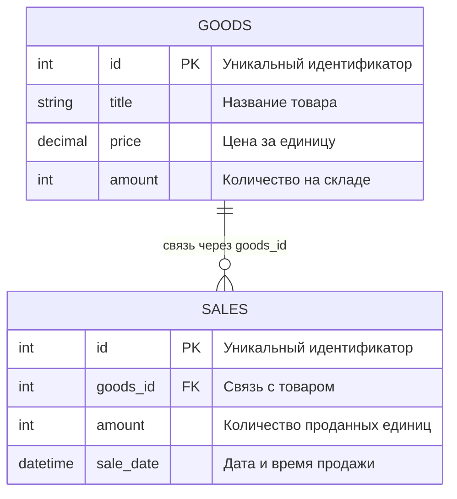
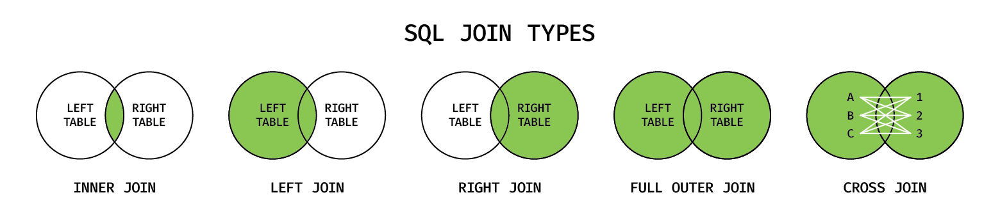
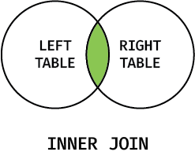
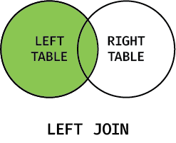
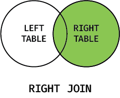
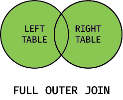
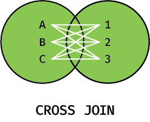

<!-- @include: ./includes/_disclaimer.md -->

# ОП.08 - 11 - Создание связанных таблиц. Операция `JOIN`

## Создание связанных таблиц

Для создания связанных таблиц в SQL необходимо определить отношение между ними. В данном случае, мы будем создавать таблицы `goods` (Товары) и `sales` (Продажи), которые будут связаны между собой через поле `id` товара.



Таблица "Товары":

```sql
CREATE TABLE goods (
  id INT UNSIGNED NOT NULL AUTO_INCREMENT,
  title VARCHAR(255),
  price DECIMAL(10,2),
  amount INT,
  PRIMARY KEY (id)
);
```

В данной таблице мы определяем поля:

- `id` — уникальный идентификатор товара, являющийся первичным ключом
- `title` — Название товара
- `price` — Цена за единицу товара
- `amount` — Количество товаров на складе

Таблица "Продажи":

```sql
CREATE TABLE sales (
  id INT UNSIGNED NOT NULL AUTO_INCREMENT,
  goods_id INT UNSIGNED,
  amount INT,
  sale_date DATETIME,
  PRIMARY KEY (id),
  FOREIGN KEY (goods_id) REFERENCES goods(id)
);
```

В данной таблице мы определяем поля:

- `id` — уникальный идентификатор продажи, являющийся первичным ключом
- `goods_id` — внешний ключ, который ссылается на поле `id` таблицы `goods` (Товары), что позволяет установить связь между двумя таблицами
- `amount` — количество единиц товара в рамках конкретной продажи
- `sale_date` — дата и время совершения продажи

> [!WARNING]
> Важно, что внешний ключ и первичный ключ на которой он ссылается должны быть одного и того же типа!
>
> - `INT` и `INT` ✔️
> - `BIGINT` и `BIGINT` ✔️
> - `INT UNSIGNED` и `INT UNSIGNED` ✔️
> - `BIGINT` и `INT` ✘
> - `INT` и `INT UNSIGNED` ✘

Пример заполнения таблиц:

```sql
INSERT INTO goods (id, title, price, amount)
VALUES (1, 'Книга', 500.00, 10),
       (2, 'Ручка', 50.00, 50),
       (3, 'Тетрадь', 100.00, 20),
       (4, 'Фломастер', 150.00, 30),
       (5, 'Карандаш', 80.00, 40);

INSERT INTO sales (id, goods_id, amount, sale_date)
VALUES (1, 1, 3, '2023-04-05 10:37:22'),
       (2, 2, 10, '2023-04-05 11:22:30'),
       (3, 1, 5, '2023-04-06 13:45:00'),
       (4, 3, 8, '2023-04-07 15:20:10'),
       (5, 2, 5, '2023-04-08 09:10:45'),
       (6, 1, 2, '2023-04-08 14:30:00'),
       (7, 4, 15, '2023-04-10 11:55:22'),
       (8, 5, 20, '2023-04-10 16:40:15'),
       (9, 3, 10, '2023-04-11 12:20:30'),
       (10, 2, 8, '2023-04-12 09:00:00'),
       (11, 1, 7, '2023-04-12 14:15:45'),
       (12, 5, 15, '2023-04-13 10:30:00');
```

В данном примере мы добавляем несколько товаров в таблицу "Товары" и несколько продаж в таблицу "Продажи". Обратите внимание на то, что в таблице "Продажи" мы указываем значение поля `goods_id`, которое соответствует существующему `id` в таблице "Товары". Это позволяет установить связь между двумя таблицами и правильно отображать данные.

## Операция `JOIN`

`JOIN` — это операция объединения таблиц в SQL. `JOIN` используется для объединения информации из разных таблиц по определенному условию. Это позволяет получить более полную информацию о данных и сделать более точные выводы. Например, можно объединить таблицу продаж с таблицей товаров, чтобы узнать, какой товар был продан в каком количестве и за какую цену.

В MySQL существует несколько типов `JOIN`.



### `INNER JOIN`



`INNER JOIN` — возвращает только те строки, которые имеют совпадающие значения в обеих таблицах.

Пример:

```sql
SELECT *
FROM sales
INNER JOIN goods ON sales.goods_id = goods.id;
```

### `LEFT JOIN`



`LEFT JOIN` — возвращает все строки из левой таблицы и только те строки из правой таблицы, которые имеют совпадающие значения.

Пример:

```sql
SELECT *
FROM goods
LEFT JOIN sales ON goods.id = sales.goods_id;
```

### `RIGHT JOIN`



`RIGHT JOIN` — возвращает все строки из правой таблицы и только те строки из левой таблицы, которые имеют совпадающие значения.

Пример:

```sql
SELECT *
FROM goods
RIGHT JOIN sales ON sales.goods_id = goods.id;
```

### `FULL OUTER JOIN`



> [!ATTENTION]
> На уровне стандарта SQL существует `FULL OUTER JOIN`. К сожалению, синтаксис `FULL OUTER JOIN` в MySQL работать не будет.

`FULL OUTER JOIN` — возвращает все строки из обеих таблиц, даже если они не имеют совпадающих значений.

Пример:

```sql
SELECT *
FROM sales
FULL OUTER JOIN goods ON sales.goods_id = goods.id;
```

### `CROSS JOIN`



> [!WARNING]
> Этот тип `JOIN`-а возвращает огромное количество данных!

`CROSS JOIN` — возвращает результат сопоставления всех строк первой таблицы со всеми строками второй таблицы. При этом, по какому принципу эти данные связаны указывать не нужно.

Пример:

```sql
SELECT *
FROM sales
CROSS JOIN goods;
```

> [!TIP]
> Если указан просто `JOIN` без уточнения типа (`INNER`, `LEFT`, `RIGHT` или `CROSS`), то в MySQL по умолчанию используется `INNER JOIN`.

### Примеры использования `JOIN`

> [!NOTE]
> Корректные примеры использования `LEFT`, `RIGHT` и `CROSS JOIN`-ов будут позднее в рамках данного курса, для текущего набора данных все примеры будут использовать `JOIN` (он же `INNER JOIN`).

Примеры использования запроса `JOIN` для данных таблиц "Товары" и "Продажи":

1. Вывести все продажи с указанием названия товара и отсортировать их по дате продажи в порядке возрастания.

```sql
SELECT goods.title, sales.amount, sales.sale_date
FROM sales
JOIN goods ON sales.goods_id = goods.id
ORDER BY sales.sale_date;
```

2. Найти общее количество проданных ручек:

```sql
SELECT SUM(sales.amount) AS "Всего продали ручек"
FROM sales
JOIN goods ON sales.goods_id = goods.id
WHERE goods.title = 'Ручка';
```

3. Вывести общее количество продаж каждого товара:

```sql
SELECT goods.title, SUM(sales.amount) AS "Всего продали товаров"
FROM sales
JOIN goods ON sales.goods_id = goods.id
GROUP BY goods.title;
```

4. Вывести на какую сумму денег всего продали книг:

```sql
SELECT SUM(sales.amount * goods.price) AS "Доход со всех продаж книг"
FROM sales
JOIN goods ON sales.goods_id = goods.id
WHERE goods.title = 'Книга';
```
