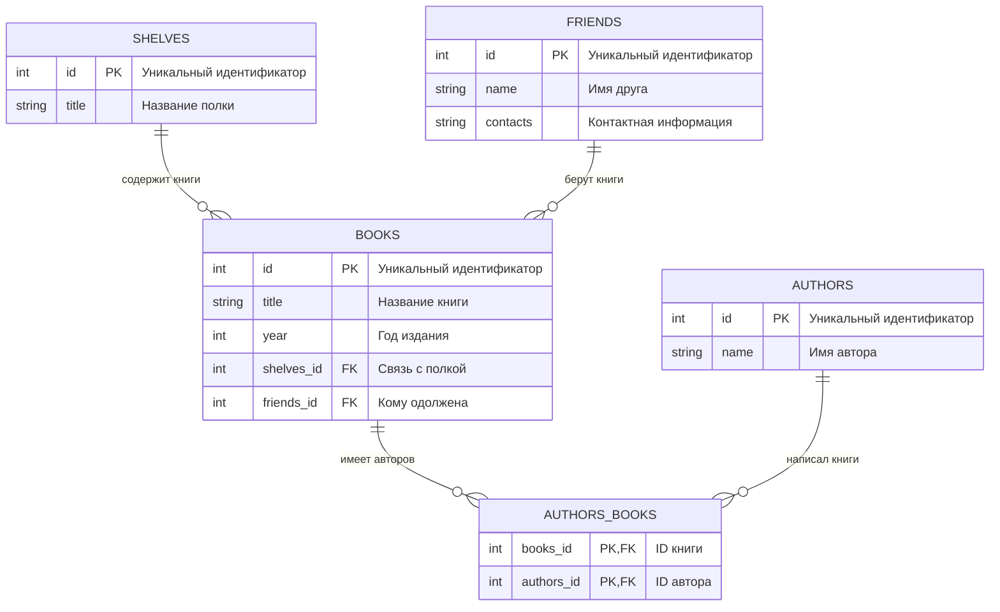

<!-- @include: ./includes/_disclaimer.md -->

# ОП.08 - 12 - Решение практических задач в рамках БД с несколькими таблицами

Примеры данной темы используют учебную БД:



Описание связей в структуре БД:

- `SHELVES` к `BOOKS` — одна полка может содержать много книг
- `FRIENDS` к `BOOKS` — один друг может одолжить много книг
- `BOOKS` к `AUTHORS_BOOKS` — одна книга может иметь нескольких авторов
- `AUTHORS` к `AUTHORS_BOOKS` — один автор может написать несколько книг

<details>
<summary><b>bookshelf.sql</b></summary>

[bookshelf.sql](./includes/bookshelf.sql)

</details>

## Задания

---

### Задание 1

Вывести все книги на полках (отобразить в виде: название книги, автор, полка на которой находится книга)

<details>
<summary><b>ОТВЕТ</b></summary>

```sql
SELECT
    books.title AS 'Название книги',
    authors.name AS 'Автор',
    shelves.title AS 'Полка'
FROM books
JOIN authors_books ON books.id = authors_books.books_id
JOIN authors ON authors_books.authors_id = authors.id
JOIN shelves ON books.shelves_id = shelves.id;
```

</details>

---

### Задание 2

Вывести название полок, на которых есть книги, написанные автором 'Джейн Остин'

<details>
<summary><b>ОТВЕТ</b></summary>

```sql
SELECT DISTINCT shelves.title AS 'Полка'
FROM books
JOIN shelves ON books.shelves_id = shelves.id
JOIN authors_books ON books.id = authors_books.books_id
JOIN authors ON authors_books.authors_id = authors.id
WHERE authors.name = 'Джейн Остин';
```

</details>

---

### Задание 3

Вывести название книг и имена авторов для книг, которые находятся на верхней полке в гостиной

<details>
<summary><b>ОТВЕТ</b></summary>

```sql
SELECT
  books.title AS 'Название книги',
  authors.name AS 'Автор'
FROM books
JOIN shelves ON books.shelves_id = shelves.id
JOIN authors_books ON books.id = authors_books.books_id
JOIN authors ON authors_books.authors_id = authors.id
WHERE shelves.title = 'Верхняя полка в гостиной';
```

</details>

---

### Задание 4

Вывести имена друзей и названия книг, которые они взяли

<details>
<summary><b>ОТВЕТ</b></summary>

```sql
SELECT
  friends.name AS 'Друг',
  books.title AS 'Книга'
FROM books
JOIN friends ON books.friends_id = friends.id;
```

</details>

---

### Задание 5

Вывести название книг, имена авторов и год издания для книг, которые были написаны после 1981 года

<details>
<summary><b>ОТВЕТ</b></summary>

```sql
SELECT
  books.title AS 'Название книги',
  authors.name AS 'Автор',
  books.year AS 'Год издания'
FROM books
JOIN authors_books ON books.id = authors_books.books_id
JOIN authors ON authors_books.authors_id = authors.id
WHERE books.year > 1981;
```

</details>

---

### Задание 6

Вывести название книг, имя автора и год издания для книг, которые находятся на нижней полке в гостиной и были написаны до 1990 года. Результат отсортировать по году издания, чтобы самые новые книги шли первыми.

<details>
<summary><b>ОТВЕТ</b></summary>

```sql
SELECT
  books.title AS 'Название книги',
  authors.name AS 'Автор',
  books.year AS 'Год издания'
FROM books
JOIN shelves ON books.shelves_id = shelves.id
JOIN authors_books ON books.id = authors_books.books_id
JOIN authors ON authors_books.authors_id = authors.id
WHERE
  shelves.title = 'Нижняя полка в гостиной'
    AND
  books.year < 1990
ORDER BY books.year DESC;
```

</details>

---

### Задание 7

Вывести название книг и имя автора для книг, которые были написаны авторами, чьи имена начинаются на букву "С"

<details>
<summary><b>ОТВЕТ</b></summary>

```sql
SELECT books.title AS 'Название книги', authors.name AS 'Автор'
FROM books
JOIN authors_books ON books.id = authors_books.books_id
JOIN authors ON authors_books.authors_id = authors.id
WHERE authors.name LIKE 'С%';
```

</details>

---

### Задание 8

Вывести на какой полке находится больше всего книг (отобразить в виде: название полки, количество книг)

<details>
<summary><b>ОТВЕТ</b></summary>

```sql
SELECT
  shelves.title AS 'Полка',
  COUNT(books.id) AS 'Количество книг'
FROM shelves
JOIN books ON shelves.id = books.shelves_id
GROUP BY shelves.id
ORDER BY COUNT(books.id) DESC
LIMIT 1;
```

</details>

---

### Задание 9

Вывести название книг, имена авторов и год издания для книг, которые были написаны до 1990 года и находятся на полке в кабинете

<details>
<summary><b>ОТВЕТ</b></summary>

```sql
SELECT
  books.title AS 'Название книги',
  authors.name AS 'Автор',
  books.year AS 'Год издания'
FROM books
JOIN shelves ON books.shelves_id = shelves.id
JOIN authors_books ON books.id = authors_books.books_id
JOIN authors ON authors_books.authors_id = authors.id
WHERE
  shelves.title = 'Полка в кабинете'
    AND
  books.year < 1990;
```

</details>

---

### Задание 10

Вывести названия книг без указания года издания, а также имена их авторов и полки, на которых они находятся

<details>
<summary><b>ОТВЕТ</b></summary>

```sql
SELECT
  books.title AS 'Название книги',
  authors.name AS 'Автор',
  shelves.title AS 'Полка'
FROM books
JOIN authors_books ON books.id = authors_books.books_id
JOIN authors ON authors_books.authors_id = authors.id
JOIN shelves ON books.shelves_id = shelves.id
WHERE books.year IS NULL;
```

</details>
