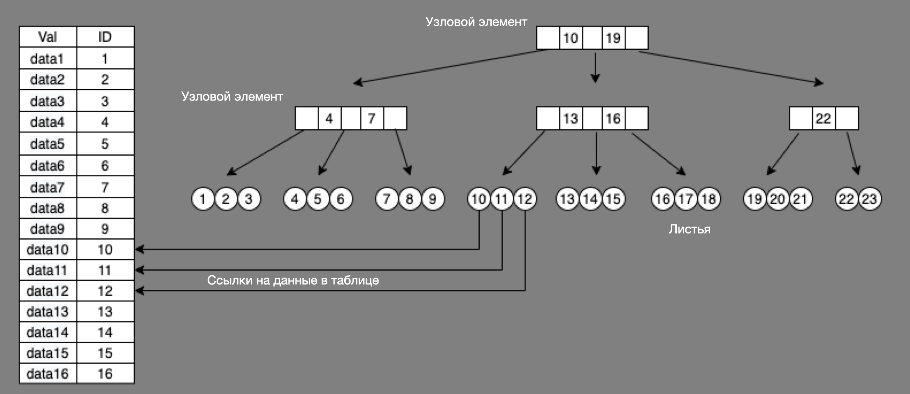
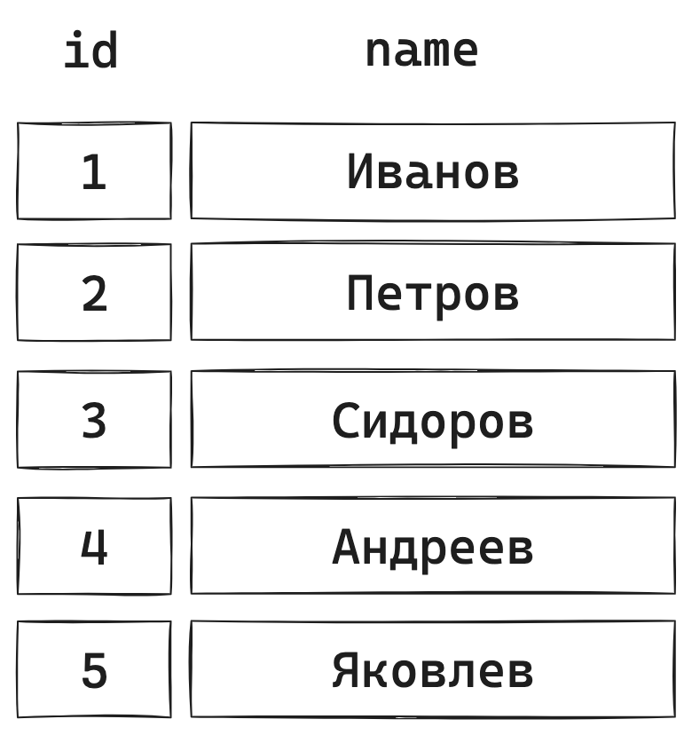
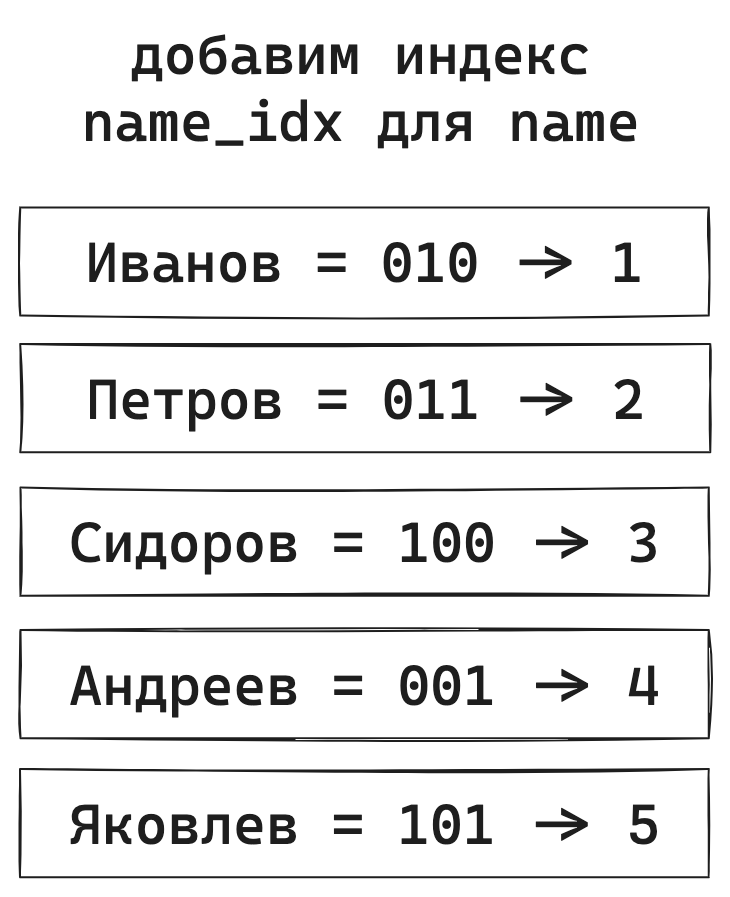
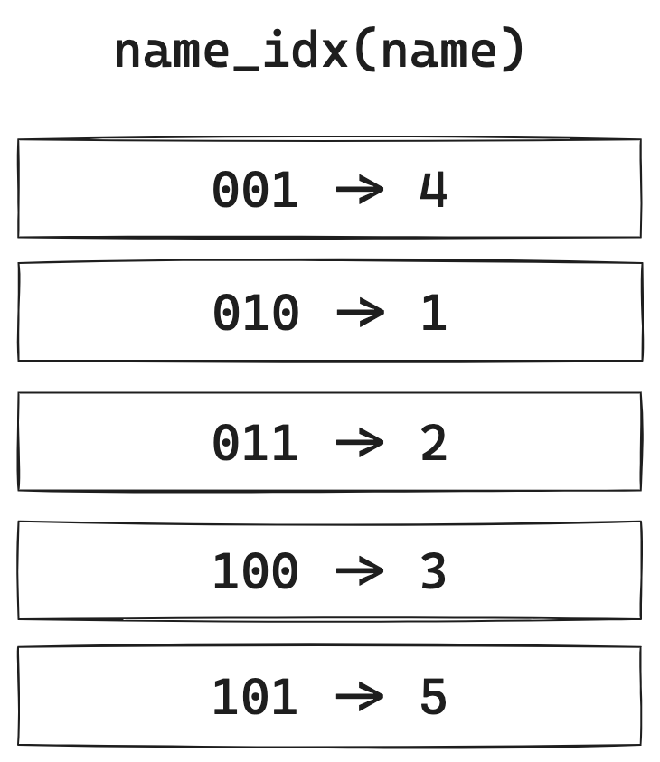
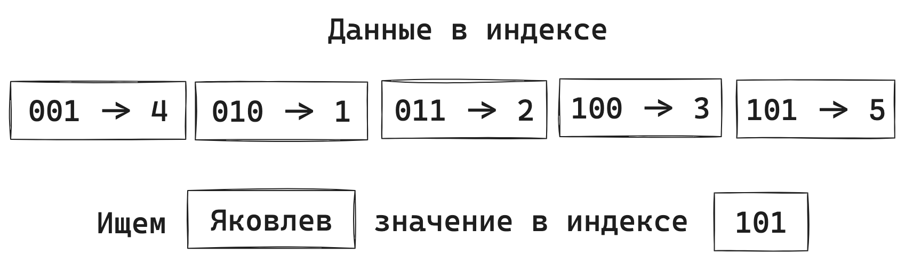
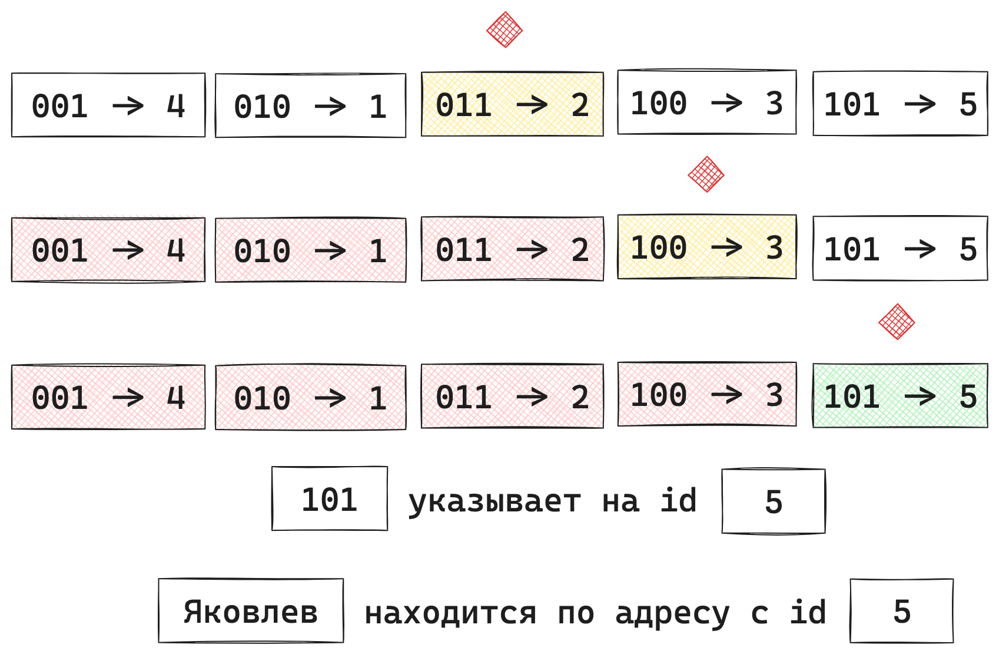

<!-- @include: ./includes/_disclaimer.md -->

# ОП.08 - 14 - Индексы и ограничения. Добавление и удаление индексов и ограничений

Примеры данной темы используют учебную БД:

<details>
<summary><b>users_01.sql</b></summary>

[users_01.sql](./includes/users_01.sql ':include')

</details>

## Индексы

Индекс — это структура данных, которая ускоряет поиск и сортировку данных в таблице. Он создается на одном или нескольких столбцах таблицы и может быть уникальным или неуникальным. Уникальный индекс гарантирует, что значения в столбце уникальны, а неуникальный индекс позволяет хранить несколько строк с одинаковыми значениями в столбце.

Индексы применяются для быстрого поиска строк с указанным значением одного столбца. Без индекса чтение таблицы осуществляется по всей таблице начиная с первой записи, пока не будут найдены соответствующие строки. Чем больше таблица, тем больше накладные расходы. Если же таблица содержит индекс по рассматриваемым столбцам, то MySQL может быстро определить позицию для поиска в середине файла данных без просмотра всех данных. Для таблицы, содержащей **1000** строк, это будет как минимум в **100** раз быстрее по сравнению с последовательным перебором всех записей. Однако в случае, когда необходим доступ почти ко всем **1000** строкам, быстрее будет последовательное чтение, так как при этом не требуется операций поиска по диску.



Такое устройство индекса позволяет обеспечить логарифмическую скорость поиска. Это очень быстро. Вот таблица где для наглядности посчитал сколько сравнений нужно сделать для поиска записи в таблице с разным количеством данных.

<table>
  <tbody>
    <tr>
      <td><strong><em>Количество элементов в таблице</em></strong></td>
      <td><strong><em>Количество сравнений</em></strong></td>
    </tr>
    <tr>
      <td>10</td>
      <td>3,3</td>
    </tr>
    <tr>
      <td>100</td>
      <td>6,6</td>
    </tr>
    <tr>
      <td>1 000</td>
      <td>9,9</td>
    </tr>
    <tr>
      <td>10 000</td>
      <td>13,2</td>
    </tr>
    <tr>
      <td>100 000</td>
      <td>16,6</td>
    </tr>
    <tr>
      <td>1 000 000</td>
      <td>19,9</td>
    </tr>
  </tbody>
</table>

Получается для поиска по миллиону значений нужно всего около 20 сравнений. Очень быстро. Одна небольшая ремарка - эти вычисления конечно же правдивы только для индексов с уникальными значениями. Построив индекс по значению, которое почти во всех строках одинаково, эффекта не будет так как все равно придется перебирать все эти строки с одинаковыми значениями.

Пример уникального индекса:

- Индекс на столбец `email`, чтобы гарантировать, что каждый пользователь имеет уникальный адрес электронной почты.

Пример неуникального индекса:

- Индекс на столбце `country`, чтобы быстро найти все записи, относящиеся к определенному городу.

Разница между уникальным и неуникальным индексом заключается в том, что уникальный индекс гарантирует уникальность значений в столбце или комбинации столбцов, тогда как неуникальный индекс позволяет хранить несколько строк с одинаковыми значениями в столбце или комбинации столбцов.

> [!INFO]
> Как правило, все внешние ключи в большинстве клиентов СУБД при создании автоматически сопровождаются неуникальными индексами.

### Наглядный пример индексов











### Добавление неуникального индекса

Для добавления индекса в MySQL используется оператор `ALTER TABLE` с ключевым словом `ADD INDEX`.

Например, чтобы добавить индекс на столбец `first_name` в таблице `users`, нужно выполнить следующий запрос:

```sql
ALTER TABLE users ADD INDEX idx_name (first_name);
```

Этот запрос создаст неуникальный индекс с именем `idx_name` на столбце `username`, чтобы поиск по данному полю происходил намного быстрее.

### Добавление уникального индекса

Пример добавления уникального индекса на столбец `guid` в таблице `users`:

```sql
ALTER TABLE users ADD UNIQUE INDEX unique_guid (guid);
```

Эта команда добавляет уникальный индекс с именем `unique_guid` на столбец `guid` в таблице `users`. Теперь каждый пользователь должен иметь уникальный идентификатор **GUID**. Если попытаться добавить запись с уже существующим идентификаторов, то MySQL выдаст ошибку.

#### Посмотреть существующие индексы

Посмотреть какие индексы существуют в таблице можно при помощи команды:

```sql
SHOW INDEX FROM users;
```

#### Удаление индекса

Чтобы удалить индекс из таблицы, нужно использовать оператор `ALTER TABLE` с ключевым словом `DROP INDEX`.

Например, чтобы удалить индекс `idx_name` из таблицы `users`, нужно выполнить следующий запрос:

```sql
ALTER TABLE users DROP INDEX idx_name;
```

Этот запрос удалит индекс `idx_name` из таблицы `users`.

<!-- TODO: Разделить на две разные статьи с нормальными примерами! -->

## Ограничения

Ограничения в MySQL - это правила, которые гарантируют целостность данных в базе данных, предотвращая некорректные или несогласованные данные. Некоторые из основных ограничений в MySQL:

1. `PRIMARY KEY`: Уникальный идентификатор записи в таблице.
2. `FOREIGN KEY`: Связь между таблицами, обеспечивающая согласованность данных.
3. `NOT NULL`: Значение в столбце не может быть NULL.
4. `UNIQUE`: Значение в столбце должно быть уникальным для каждой записи.
5. `CHECK`: Проверка значения в столбце по заданному условию.
6. `DEFAULT`: Значение по умолчанию для столбца.

<!-- TODO: добавить примеры для CHECK -->

Эти ограничения помогают поддерживать целостность данных, предотвращая ошибки и обеспечивая корректное хранение и обработку информации в базе данных MySQL.

Кроме того, в MySQL есть несколько вариантов ограничений при удалении или обновлении связанной записи:

1. `ON DELETE CASCADE` - при удалении записи из таблицы-родителя, все связанные записи в таблице-потомке также будут удалены.

2. `ON DELETE SET NULL` - при удалении записи из таблицы-родителя, все связанные записи в таблице-потомке будут обновлены, устанавливая значение поля, которое ссылается на таблицу-родителя, в `NULL`.

3. `ON DELETE RESTRICT` - при попытке удалить запись из таблицы-родителя, если есть связанные записи в таблице-потомке, то удаление будет запрещено.

4. `ON DELETE NO ACTION` - это похоже на `ON DELETE RESTRICT`, но с одним отличием: если есть связанные записи в таблице-потомке, то удаление будет запрещено только в том случае, если явно не указано другое поведение.

5. `ON UPDATE CASCADE` - при обновлении значения поля в таблице-родителе, все связанные записи в таблице-потомке также будут обновлены.

6. `ON UPDATE SET NULL` - при обновлении значения поля в таблице-родителе, все связанные записи в таблице-потомке будут обновлены, устанавливая значение поля, которое ссылается на таблицу-родителя, в `NULL`.

7. `ON UPDATE RESTRICT` - при попытке обновить значение поля в таблице-родителе, если есть связанные записи в таблице-потомке, то обновление будет запрещено.

8. `ON UPDATE NO ACTION` - это похоже на `ON UPDATE RESTRICT`, но с одним отличием: если есть связанные записи в таблице-потомке, то обновление будет запрещено только в том случае, если явно не указано другое поведение.

Пример ограничения с `ON DELETE` и `ON UPDATE` для таблицы `clients`:

```sql
CREATE TABLE countries (
  id INT PRIMARY KEY AUTO_INCREMENT NOT NULL,
  name VARCHAR(50)
);

CREATE TABLE clients (
  id INT PRIMARY KEY AUTO_INCREMENT NOT NULL,
  name VARCHAR(50),
  country_id INT,
  CONSTRAINT fk_country_id
    FOREIGN KEY (country_id) REFERENCES countries(id)
    ON DELETE SET NULL
    ON UPDATE CASCADE
);
```

<!-- TODO: Добавить реальные данные для примера -->

Первая таблица `countries` содержит два столбца: `id`, который является первичным ключом и автоинкрементируемым (`AUTO_INCREMENT`), и `name`, который хранит названия стран.

Вторая таблица `clients` также содержит три столбца: `id`, который является первичным ключом и автоинкрементируемым (`AUTO_INCREMENT`), `name`, который хранит имена клиентов, и `country_id`, который является внешним ключом, ссылается на столбец `id` таблицы `countries`.

Команда `CONSTRAINT` в SQL используется для добавления ограничений к таблице, таких как первичные ключи, уникальные ключи, внешние ключи и т.д.

В данном случае, `CONSTRAINT fk_country_id` создает внешний ключ с именем `fk_country_id` для столбца `country_id` в таблице `clients`. Внешний ключ указывает на столбец `id` таблицы countries, что означает, что значения в столбце `country_id` должны существовать в столбце `id` таблицы `countries`. Таким образом, устанавливается связь между таблицами `countries` и `clients`. Когда запись в таблице `countries` удаляется (`ON DELETE SET NULL`), соответствующее значение в столбце `country_id` таблицы `clients` будет заменено на `NULL`. При обновлении значения в столбце `id` таблицы `countries` (`ON UPDATE CASCADE`), соответствующее значение в столбце `country_id` таблицы `clients` также будет обновлено.

### Добавление и удаление ограничений целостности `FOREIGN KEY`

Для добавления ограничения в существующие таблицы в MySQL используется оператор `ALTER TABLE` с ключевым словом `ADD CONSTRAINT`.

Пример добавления ограничения:

```sql
ALTER TABLE clients
ADD CONSTRAINT fk_country_id
  FOREIGN KEY (country_id) REFERENCES countries(id)
  ON DELETE SET NULL
  ON UPDATE CASCADE;
```

Мы помним, что команда `ALTER TABLE` в SQL используется для изменения структуры существующей таблицы. В данном случае, мы изменяем таблицу `clients`.

Команда `ADD CONSTRAINT fk_country_id` добавляет внешний ключ с именем `fk_country_id` для столбца `country_id` в таблице `clients`. Внешний ключ указывает на столбец `id` таблицы `countries`, что означает, что значения в столбце `country_id` должны существовать в столбце `id` таблицы `countries`.

Далее, указывается действие, которое будет выполнено при удалении записи из родительской таблицы (`countries`). Опция `ON DELETE SET NULL` означает, что при удалении записи из таблицы `countries`, значение столбца `country_id` в таблице `clients` будет установлено в `NULL`.

Также указывается действие, которое будет выполнено при обновлении значения столбца `id` в родительской таблице (`countries`). Опция `ON UPDATE CASCADE` означает, что при обновлении значения столбца `id` в таблице `countries`, все соответствующие записи в таблице `clients` будут также обновлены. Эти опции позволяют автоматически поддерживать целостность данных между таблицами при удалении или обновлении связанных записей.

Чтобы удалить ограничение из таблицы, нужно использовать оператор `ALTER TABLE` с ключевым словом `DROP CONSTRAINT`.

Пример удаления ограничения:

```sql
ALTER TABLE clients DROP CONSTRAINT fk_country_id;
```

Этот запрос удаляет ограничение `FOREIGN KEY` с именем `fk_country_id` из таблицы `clients`.

### Добавление и удаление ограничения `NOT NULL`

Чтобы добавить `NOT NULL` ограничение на столбец `name` в таблице `clients`, нужно выполнить следующий запрос:

```sql
ALTER TABLE clients MODIFY name VARCHAR(50) NOT NULL;
```

Этот запрос добавит `NOT NULL` ограничение на столбец `name` в таблице `clients`.

Например, чтобы удалить `NOT NULL` ограничение на столбце `name` в таблице `clients`, нужно выполнить следующий запрос:

```sql
ALTER TABLE clients MODIFY name VARCHAR(50) NULL;
```

Этот запрос удалит `NOT NULL` ограничение на столбце `name` в таблице `clients`.
