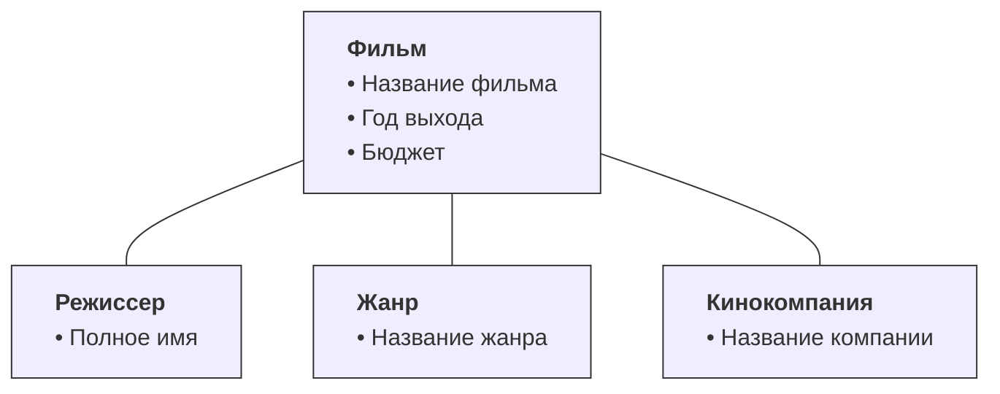

<!-- @include: ./includes/_disclaimer.md -->

# Домашнее задание №4 по дисциплине ОП.08 - Основы проектирования баз данных

В рамках задания необходимо разработать Базу Данных отражающую коллекцию фильмов, в которой должны быть отражены следующие сущности:

1. Сущность «Фильм»
   - Атрибут «Название фильма»
   - Атрибут «Год выхода»
   - Атрибут «Бюджет»
2. Сущность «Режиссер»
   - Атрибут «Полное имя режиссера»
3. Сущность «Жанр»
   - Атрибут «Название жанра»
4. Сущность «Кинокомпания»
   - Атрибут «Название компании»

При этом, учесть, что:

- У фильма может быть только один режиссер и только одна кинокомпания
- У фильма может быть только один жанр
- У режиссера может быть несколько фильмов
- Одна кинокомпания могла снять несколько фильмов с разными режиссерами
- У разных фильмов может быть одна кинокомпания и режиссер

Необходимо четко указывать названия таблиц и полей, в которые будет занесена информация:

- `movies`
  - `title`
  - `year`
  - `budget`
- `directors`
  - `full_name`
- `genres`
  - `title`
- `companies`
  - `title`

Данные для заполнения БД, полученной в соответствии со схемой:

<b>movies.sql</b>

[movies.sql](./includes/movies.sql)

## Задание

Необходимо разнести данные из временной таблицы `tmp` в каждую из вновь созданных в соответствии со структурой таблиц БД, при этом сохранив все связи, после чего таблицу `tmp` **необходимо удалить** из БД.

Необходимо написать SQL-запросы чтобы выполнить каждую из задач:

1. Вывести сколько фильмов сняла кинокомпания _Universal Pictures_
2. Вывести сколько всего фильмов было снято режиссером _Фрэнсисом Фордом Копполой_
3. Вывести количество снятых фильмов за последние 20 лет
4. Вывести все жанры фильмов в которых снимал _Стивен Спилберг_ в течении всей своей карьеры
5. Вывести названия, жанры и режиссеров 5 самых дорогих фильмов
6. Вывести имя режиссера с самым большим количеством фильмов
7. Вывести названия и жанры фильмов, снятые самой большой кинокомпанией (по сумме всех бюджетов фильмов)
8. Вывести средний бюджет фильмов, снятых кинокомпанией _Warner Bros._
9. Вывести количество фильмов каждого жанра и средний бюджет по жанру
10. Найти и удалить комедию "Дикие истории" 2014-го года

## Требования к оформлению

Результат выполнения задания должен быть оформлен в виде файлов:

- Файл дампа итоговой БД (после выполнения всех задач) в формате SQL, должен называться: `movies_dump.sql`, при этом при подготовке дампа необходимо учесть что в него должны попасть структура и данные только тех таблиц, которые относятся к данной домашней работе (таблицы `tmp` в нем быть не должно!)
- Файл последовательных SQL-запросов для каждого из пунктов задания, должен называться: `movies_tasks.sql`, при этом **ОБЯЗАТЕЛЬНО** учитывать пример формата, описанный ниже.

[Пример формата для файла задания](op08_hw_format.md)

[Общие требования и рекомендации](op08_hw_req.md)
