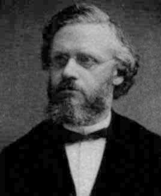

# 01 - Вычислительная сложность

> Когда-то давно жил один король, который захотел наградить мудреца. Мудрец попросил в качестве награды только пшеницы, которая бы заполнила всю шахматную доску, но с определенным условием: в первой клетке должно быть 1 зернышко пшеницы, затем 2 зернышка на второй клетке, затем 4 на следующей … и так далее на каждой клетке шахматной доски должно быть вдвое больше количество зерен, чем на предыдущей. Наивный король согласился без колебаний, думая, что это слишком простое условие…

Так сколько зерна пшеницы должен отдать король мудрецу?

Мы знаем, что шахматная доска имеет ${8 \times 8}$ квадратов, что в сумме составляет $64$ клетки, поэтому в итоговой клетке должно быть $2^{64}$ зерна пшеницы. Если вы проведете самостоятельный расчет, вы получите $1,8446744 \times 10^{19}$. Предполагая, что каждое зерно пшеницы весит $0,01$ грамма, это дает нам $184\ 467\ 440\ 737$ тонн пшеницы. А $184$ миллиарда тонн — это довольно много.

Числа могут расти довольно быстро. Та же логика относится и к компьютерным алгоритмам. Если требуемые усилия для выполнения задачи растут экспоненциально по отношению к размеру входных данных, алгоритм довольно быстро может стать чрезвычайно затратным. Для определения того насколько алгоритмы отличаются друг от друга в количественных показателях принято использовать понятие вычислительной сложности алгоритма.

**Вычислительная сложность** — понятие в информатике и теории алгоритмов, обозначающее функцию зависимости объёма работы, которая выполняется некоторым алгоритмом, от размера входных данных. Раздел информатики, изучающий вычислительную сложность, называется теорией сложности вычислений. Объём работы обычно измеряется абстрактными понятиями времени и пространства, называемыми вычислительными ресурсами. Время определяется количеством элементарных шагов, необходимых для решения задачи, тогда как пространство определяется объёмом памяти или места на носителе данных. Таким образом, в этой области предпринимается попытка ответить на центральный вопрос разработки алгоритмов: «как изменится время исполнения и объём занятой памяти в зависимости от размера входных данных?».

Теория сложности вычислений возникла из потребности сравнивать быстродействие алгоритмов, чётко описывать их поведение (время исполнения и объём необходимой памяти) в зависимости от размера входа.

> Сложность алгоритмов обычно оценивают по времени выполнения или по используемой памяти. В обоих случаях сложность зависит от размеров входных данных: массив из 100 элементов будет обработан быстрее, чем аналогичный из 1000. При этом точное время мало кого интересует: оно зависит от процессора, типа данных, языка программирования и множества других параметров. Важна лишь асимптотическая сложность, т. е. сложность при стремлении размера входных данных к бесконечности.

## На бытовом примере

- **«почистить ковёр пылесосом»** требует время, линейно зависящее от его площади, то есть на ковёр, площадь которого больше в два раза, уйдет в два раза больше времени. Соответственно, при увеличении площади ковра в сто тысяч раз объём работы увеличивается строго пропорционально в сто тысяч раз, и т.п.
- **«найти имя в телефонной книге»** требует всего лишь времени, логарифмически зависящего от количества записей, так как, открыв книгу примерно в середине, мы уменьшаем размер «оставшейся проблемы» вдвое (за счет сортировки имен по алфавиту). Таким образом, в книге объёмом в 1000 страниц любое имя находится не больше, чем за примерно 10 раз (открытия книги). При увеличении объёма страниц до ста тысяч проблема все ещё решается за примерно 17 заходов.

## Наглядно

Время выполнения абстрактного алгоритма с определённой сложностью в зависимости от размера входных данных при скорости $10^6$ операций в секунду:

|            | $n = 10$       | $n = 20$          | $n = 30$            | $n = 40$             | $n = 50$                      |
| ---------- | -------------- | ----------------- | ------------------- | -------------------- | ----------------------------- |
| $f({n})$   | $0,00001$ сек. | $0,00002$ сек.    | $0,00003$ сек.      | $0,00004$ сек.       | $0,00005$ сек.                |
| $f({n^2})$ | $0,0001$ сек.  | $0,0004$ сек.     | $0,0009$ сек.       | $0,0016$ сек.        | $0,0025$ сек.                 |
| $f({n^3})$ | $0,001$ сек.   | $0,008$ сек.      | $0,027$ сек.        | $0,064$ сек.         | $0,125$ сек.                  |
| $f({2^n})$ | $0,0001$ сек.  | $1$ сек.          | $\approx 17,9$ мин. | $\approx 304,5$ ч.   | $\approx 3570$ лет            |
| $f({3^n})$ | $0,059$ сек.   | $\approx 58$ мин. | $\approx 6,5$ лет   | $\approx 3855$ веков | $\approx 2 \times 10^8$ веков |

Количество элементарных операций, затраченных алгоритмом для решения конкретного экземпляра задачи, зависит не только от размера входных данных, но и от самих данных. Например, количество операций алгоритма сортировки вставками значительно меньше в случае, если входные данные уже отсортированы. Чтобы избежать подобных трудностей, рассматривают понятие временной сложности алгоритма *в худшем случае*.

*Временная сложность алгоритма* (в худшем случае) — это функция от размера входных данных, равная максимальному количеству элементарных операций, проделываемых алгоритмом для решения экземпляра задачи указанного размера.

Аналогично понятию *временной сложности в худшем случае* определяется понятие *временная сложность алгоритма в наилучшем случае*. Также рассматривают понятие *среднее время работы алгоритма*, то есть математическое ожидание времени работы алгоритма. Иногда говорят просто: «*Временная сложность алгоритма*» или «*Время работы алгоритма*», имея в виду временную сложность алгоритма в худшем, наилучшем или среднем случае (в зависимости от контекста).

По аналогии с временной сложностью, определяют *пространственную сложность алгоритма*, только здесь говорят не о количестве элементарных операций, а об объёме используемой памяти.

Несмотря на то, что функция временной сложности алгоритма в некоторых случаях может быть определена точно, в большинстве случаев искать точное её значение бессмысленно. Дело в том, что во-первых, точное значение временной сложности зависит от определения *элементарных операций* (например, сложность можно измерять в количестве арифметических операций, битовых операций или операций на машине Тьюринга), а во-вторых, при увеличении размера входных данных вклад постоянных множителей и слагаемых низших порядков, фигурирующих в выражении для точного времени работы, становится крайне незначительным.

Рассмотрение входных данных большого размера и оценка порядка роста времени работы алгоритма приводят к понятию **асимптотической сложности** алгоритма. При этом алгоритм с меньшей асимптотической сложностью является более эффективным для всех входных данных, за исключением лишь, возможно, данных малого размера.

Наиболее популярной нотацией для описания вычислительной сложности алгоритмов является **«О большое» (Big O Notation или просто Big O).**

> «Нотация **О большое** — это математическая нотация, которая описывает ограничивающее поведение функции, когда аргумент стремится к определенному значению или бесконечности. **О большое** является членом семейства нотаций, изобретенных **Паулем Бахманом**, **Эдмундом Ландау** и рядом других ученых, которые в совокупности называются нотациями **Бахмана-Ландау** или асимптотическими нотациями»

*Paul Gustav Heinrich Bachmann*

*Edmund Georg Hermann (Yehezkel) Landau*

В рамках теории вычислительной сложности кроме нотации «О большое» существуют и другие: «о малое», «Омега» и «Тета»

- **О большое** ( $O(n)$ ) описывает верхнюю границу сложности, то есть наихудший случай.

- **о малое** ( $o(n)$ ) описывает верхнюю границу, исключая точную оценку, то есть только порядок наихудшего случая.

- **Омега** ( $Ω(n)$ ) описывает нижнюю границу сложности, то есть наилучший случай.

- **Тета** ( $Θ(n)$ ) описывает точную оценку сложности, то есть оценку сложности с учетом особенностей входных данных.

Наиболее часто используемая нотация **О большое** описывает **сложность** алгоритма с использованием математических терминов, иными словами — как возрастает предположительное время работы алгоритма по мере увеличения размера решаемой задачи.

В реальности существует бесконечное число различных алгоритмов бесконечно отличающихся друг от друга своей вычислительной сложностью, однако в большинстве случаев для понимания ключевых различий между ними выделяют некоторые наиболее популярные группы образующие т.н. «классы сложности» алгоритмов, описанные с использованием нотации **О большое**.

Следующая таблица обобщает наиболее часто встречающиеся классы сложности.

| Название                          | Время работы   | Примеры алгоритмов                                                             |
| --------------------------------- | -------------- | ------------------------------------------------------------------------------ |
| **константное время**             | ${O(1)}$       | Определение чётности целого числа (представленного в двоичном виде)            |
| **логарифмическое время**         | ${O(\log n)}$  | Двоичный поиск                                                                 |
| **линейное время**                | ${O(n)}$       | Поиск наименьшего или наибольшего элемента в неотсортированном массиве         |
| **линейно-логарифмическое время** | ${O(n\log n)}$ | Самый быстрый вариант сортировки сравнением, сортировка слиянием               |
| **квадратичное время**            | ${O(n^{2})}$   | Сортировка пузырьком, сортировка вставками                                     |
| **кубическое время**              | ${O(n^{3})}$   | Обычное умножение двух ${n \times n}$ матриц. Вычисление частичной корреляции. |
| **полиномиальное время**          | ${O(n^k)}$   | Алгоритм Кармаркара для линейного программирования, АКС-тест простоты          |
| **экспоненциальное время**        | ${O(k^n)}$   | Решение задачи о порядке перемножения матриц с помощью полного перебора        |
| **факториальное время**           | ${O(n!)}$      | Решение задачи коммивояжёра полным перебором                                   |

Также можно привести графики функций, обычно используемых в анализе алгоритмов, показывающие количество операций N по сравнению с размером входных данных n для каждой функции:

Бывают и другие оценки по сложности, но все они основаны на том же принципе. Аналогично проводят оценку и по памяти, когда это важно. Однако одни алгоритмы могут использовать значительно больше памяти при увеличении размера входных данных, чем другие, но зато работать быстрее. И наоборот. Это помогает выбирать оптимальные пути решения задач исходя из текущих условий и требований.

## Виды сложностей с примерами

- ${O(1)}$ — константная сложность.
  Ситуация когда время работы алгоритма вообще не зависит от размера входных данных. Например, для определения значения третьего элемента массива не нужно ни запоминать элементы, ни проходить по ним сколько-то раз. Всегда нужно просто дождаться в потоке входных данных третий элемент и это будет результатом, на вычисление которого для любого количества данных нужно одно и то же время. Или определение честности любого целого числа, представленного в бинарном виде (нам достаточно только прочитать только последний бит числа, и если это $0$ то число четное а если $1$ то нечетное). На реальном примере когда мы зачерпываем ложкой суп, вне зависимости от размера тарелки в ложке оказывается ровно такое количество супа которое влезает в тарелку.

- ${O(\log n)}$ — логарифмическая сложность.
  Ситуация когда нам необходимо найти телефон определенного человека в бумажном телефонном справочнике (по сути большом массиве данных, отсортированном по определенному признаку, в нашем случае — по алфавиту), когда каждый раз для поиска мы открываем его примерно посередине и в зависимости от того попали мы или промахнулись, каждый раз выбор сужается ровно в половину, и в худшем случае нам придется для справочника из тысячи страниц открыть книгу всего десять раз.

- ${O(n)}$ — линейная сложность.
  Такой сложностью обладает, например, алгоритм поиска наибольшего элемента в не отсортированном массиве. Нам придётся пройтись по всем элементам массива, чтобы понять, какой из них максимальный. Например, при измерении роста пациентов, заходящих по одному в кабинет. Либо при покраске пола определенной площади — чем больше площадь, тем пропорционально больше потребуется времени (и ресурсов, например, краски).

- ${O(n\log n)}$ — линейно-логарифмическая сложность.
  Такая сложность чаще всего характерна для алгоритмов, которые получены путем оптимизации задач квадратичной сложности, например алгоритм QuickSort, разработанный английским информатиком Тони Хоаром время своей работы в МГУ в 1960 году. Является существенно улучшенным вариантом алгоритма сортировки с помощью прямого обмена

- ${O(n^{2})}$ — квадратичная сложность.
  Означает, что удвоение размера входных данных увеличивает время выполнения в 4 раза. Например, при увеличении данных в 10 раз, количество операций (и время выполнения) увеличится примерно в 100 раз. Если алгоритм имеет квадратичную сложность, то это повод пересмотреть необходимость использования данного алгоритма. Но иногда этого не избежать. Такие алгоритмы легко узнать по вложенным циклам.

- ${O(n^{3})}$ — кубическая сложность.
  Кубическая сложность часто возникает в задачах, переводящих вычисления квадратичной сложности на плоскости в третье измерение, и во многом означает что увеличение входных данных в 10 раз приведет к увеличению времени обработки в 1000 раз. Например сюда попадают алгоритмы в которых внутри вложенных циклов существуют свои вложенные циклы.

- ${O(n^k)}$ — полиномиальная сложность.
  Полиномиальная сложность наблюдается во многих алгоритмах, сводящихся к перебору возможных вариантов для которых не происходит экспоненциального роста при добавлении каждого нового элемента в набор данных. В частности, к ним относятся задачи, в которых не требуется построения всех подмножеств заданного множества или всех поддеревья заданного графа. Часто задачи полиномиальной сложности получаются путем оптимизации алгоритмов экспоненциальной сложности.

- ${O(k^n)}$ — экспоненциальная сложность.
  Экспоненциальную временную сложность мы можем наблюдать в алгоритмах, где количество вычислений показывает экспоненциальный рост при добавлении каждого нового элемента в набор данных. Так происходит, например, во многих задачах перебора возможных вариантов с использованием рекурсии. На маленьких наборах данных все работает отлично, но с увеличением числа элементов в наборе время выполнения может выйти из-под контроля. В частности, к ним относятся задачи, в которых требуется построить все подмножества заданного множества или все поддеревья заданного графа.

- ${O(n!)}$ — факториальная сложность.
  Факториальная временная сложность — это когда количество вычислений в алгоритме прирастает факториально в зависимости от размера набора данных. Это, пожалуй, наихудший тип временной сложности, потому что количество операций возрастает до астрономических пределов даже при небольшом увеличении набора данных. Примером алгоритма с факториальной временной сложностью может послужить простая рекурсивная функция. Эта функция принимает число в качестве входных данных и умножает его на факториал числа, меньшего на единицу. Часто задачи полного перебора всех возможных вариантов для больших графов сводятся к факториальной сложности, равно как и задачи, основанные на перемножении всех всех возможных значений.

## Зачем изучать вычислительную сложность

- Концепцию оценки вычислительной сложности необходимо понимать, чтобы уметь видеть и исправлять неоптимальный код.
- Ни один серьёзный проект, как ни одно серьёзное собеседование, не могут обойтись без вопросов о вычислительной сложности, и чаще всего в разрезе нотации **«О большое».**
- Непонимание основных принципов вычислительной сложности алгоритмов ведёт к серьёзной потере производительности ваших алгоритмов.

## Что почитать по теме

- Временная сложность алгоритма. Материал из Википедии — свободной энциклопедии [Электронный ресурс] / Википедия — свободная энциклопедия — 2021, Режим доступа: [https://ru.wikipedia.org/wiki/Временная_сложность_алгоритма](https://ru.wikipedia.org/wiki/%D0%92%D1%80%D0%B5%D0%BC%D0%B5%D0%BD%D0%BD%D0%B0%D1%8F_%D1%81%D0%BB%D0%BE%D0%B6%D0%BD%D0%BE%D1%81%D1%82%D1%8C_%D0%B0%D0%BB%D0%B3%D0%BE%D1%80%D0%B8%D1%82%D0%BC%D0%B0), свободный.
- Вычислительная сложность. Материал из Википедии — свободной энциклопедии [Электронный ресурс] / Википедия — свободная энциклопедия — 2021, Режим доступа: [https://ru.wikipedia.org/wiki/Вычислительная_сложность](https://ru.wikipedia.org/wiki/%D0%92%D1%8B%D1%87%D0%B8%D1%81%D0%BB%D0%B8%D1%82%D0%B5%D0%BB%D1%8C%D0%BD%D0%B0%D1%8F_%D1%81%D0%BB%D0%BE%D0%B6%D0%BD%D0%BE%D1%81%D1%82%D1%8C), свободный.
- Rowell E. Know Thy Complexities! Big-O Cheat Sheet / E. Rowell — Big-O Cheat Sheet, 2021, Available at: [https://www.bigocheatsheet.com/](https://www.bigocheatsheet.com/), free access.
