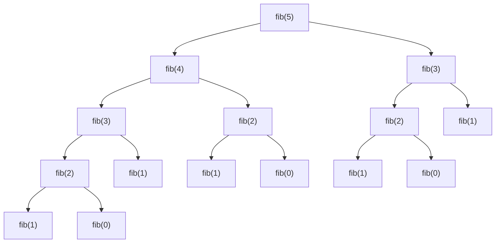
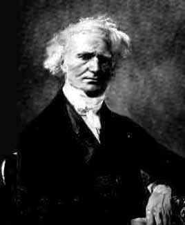

# 02 - Алгоритмы для вычисления ряда Фибоначчи

Вычисление ряда Фибоначчи — это классическая алгоритмическая задача, которую нередко дают на собеседованиях, когда хотят проверить что кандидат имеет некоторые представления о «классических» алгоритмах.

**Числа Фибоначчи** — элементы числовой последовательности в которой первые два числа равны $0$ и $1$, а каждое последующее число равно сумме двух предыдущих чисел.

Названы в честь средневекового математика Леонардо Пизанского (известного по прозвищу Фибоначчи).

Пример первых двенадцати чисел последовательности:

$0, 1, 1, 2, 3, 5, 8, 13, 21, 34, 55, 89, 144 ...$

Последовательность имеет код A000045 в Онлайн-энциклопедии целочисленных последовательностей **OEIS** ([https://oeis.org/A000045](https://oeis.org/A000045)).


*Leonardo Pisano (Fibonacci)*

Математически, последовательность чисел Фибоначчи ${F_{n}}$ задаётся линейным рекуррентным соотношением:

$F_0 = 0$,
$F_1 = 1$,
$F_n = F_{n-1} + F_{n-2}$,

где $n ≥ 2$, при этом $n$ — целое число

Принято считать, что своим рождением числовой ряд обязан варианту решения задачи о размножении кроликов за авторством Фибоначчи.

В общем виде задача звучит так:

> В место, огороженное со всех сторон стеной, поместили пару кроликов, природа которых такова, что любая пара кроликов производит на свет другую пару каждый месяц, начиная со второго месяца своего существования. Сколько пар кроликов будет через год?

Для поиска ответа Фибоначчи воспользовался последовательным вычислением числа кроликов для каждого месяца:

```txt
1: В первый месяц кролики не размножаются по условию задачи
2: 1 + 1 = 2
3:     1 + 2 = 3
4:         2 + 3 = 5
5:             3 + 5 = 8
6:                 5 + 8 = 13
7:                     8 + 13 = 21
8:                         13 + 21 = 34
9:                              21 + 34 = 55
10:                                  34 + 55 = 89
11:                                       55 + 89 = 144
12:                                            89 + 144 = 233
```

В результате нехитрых вычислений, ответом задачи стало число $233$, то есть именно столько кроликов будет в загоне через год.

Изучив получившуюся последовательность пришло понимание что она представляет собой числовой ряд отражающий рекуррентное соотношение, позволяющее вычислить любой член последовательности зная два предыдущих. Таким образом в числовой ряд были включены числа $0$ и $1$, а саму числовую последовательность назвали «числами Фибоначчи» в честь создателя.

Позже, числа Фибоначчи нашли своё применение во многих областях математики, информатики и других науках.

Для вычисления $n$-го члена числовой последовательности Фибоначчи существует множество алгоритмов, каждый из которых обладает различной вычислительной сложностью и имеет свои особенности в реализации.

## Наиболее популярные алгоритмы

### Наивный рекурсивный алгоритм

Алгоритм, который «лежит на поверхности» и приходит первым на ум обычно принято называть «наивным алгоритмом». В случае с задачей вычисления $n$-го числа Фибоначчи наивный алгоритм следует уже из самого определения рекуррентного соотношения числового ряда — так очевидно что для вычисления $F_6$ нам нужно вычислить $F_5$ (то есть $F_{(6-1)}$) и $F_4$ (то есть $F_{(6-2)}$), а для того чтобы вычислить $F_5$ и $F_4$ тем же способом необходимо вычислить $F_3$ и $F_2$ и так далее пока не дойдем до $F_1$ и $F_0$ которые известны и для вычисления которых уже нет возможности идти дальше по причине отсутствия слагаемых. В программировании для решения подобных задач существуют рекурсия.

Рекурсивная функция — это такая функция, которая вызывает саму себя.

Пара вариантов реализации наивного рекурсивного алгоритма для вычисления $n$-го числа Фибоначчи:

#### Javascript

```js
function fib(n) {
  if (n <= 1) {
    return n;
  } else {
    return fib(n - 1) + fib(n - 2);
  }
}
```

#### Python

```python
# Автор кода — Шапошникова Светлана Вячеславовна aka plustilino (https://vk.com/plustilino)
# Источник: https://younglinux.info/algorithm/fibonacci

def fibonacci(n):
    if n in (1, 2):
        return 1
    return fibonacci(n - 1) + fibonacci(n - 2)

print(fibonacci(10))
```

По сути это очень простая реализация, повторяющая математическое определение, однако же время выполнения данного алгоритма растет крайне стремительно с увеличением значения $n$ и на большинстве обычных компьютеров можно просто не дождаться выполнения функции даже для $n = 100$.

**Примерная производительность рекурсивного алгоритма для разных $n$**

| Значение $n$ | 10          | 20          | 30          | 40          | 50            |
| ------------ | ----------- | ----------- | ----------- | ----------- | ------------- |
| Число        | 55          | 6765        | 832040      | 102334155   | 12586269025   |
| Время, сек.  | 0.000038872 | 0.001371527 | 0.013435722 | 1.462777301 | 203.634117606 |

Вычислительная сложность такого алгоритма в нотации «О большое» сводится примерно к ${O(k^n)}$, то есть функция имеет экспоненциальное время выполнения.

### Классический итеративный алгоритм

Одним из наиболее часто используемых на практике можно считать итеративный алгоритм, основанной на идее о том что для вычисления $n$-го числа Фибоначчи нам все равно придется вычислять весь числовой ряд, так почему бы не сделать это с самого начала с первых известных нам чисел и до нужного нам $n$-го при помощи цикла с $n$ итерациями.

Пара вариантов реализации классического итеративного алгоритма для вычисления $n$-го числа Фибоначчи:

#### Javascript

```js
function fib(n) {
  let prev = 0, next = 1;
  for (let i = 0; i < n; i++) {
    let temp = next;
    next = prev + next;
    prev = temp;
  }
  return prev;
}
```

#### Python

```python
# Автор кода — Шапошникова Светлана Вячеславовна aka plustilino (https://vk.com/plustilino)
# Источник: https://younglinux.info/algorithm/fibonacci

fib1 = fib2 = 1

n = input("Номер элемента ряда Фибоначчи: ")
n = int(n) - 2

while n > 0:
    fib1, fib2 = fib2, fib1 + fib2
    n -= 1

print("Значение этого элемента:", fib2)
```

Так, нам известны первые два числа Фибоначчи, и в цикле от $0$ до $n$ мы каждый раз вычисляем следующее число `next` как сумму его текущего значения и предыдущего числа `prev`, а в качестве «буфера» используем локальную переменную `temp`. Таким образом на каждой итерации цикла мы рассчитываем только одно целое число и переназначаем всего пару переменных, что несравнимо быстрее и проще рекурсивного вызова всей функции. Примечательно, что данное решение не только быстрее по времени выполнения но и оптимальнее по использованию памяти, т.к. нет необходимости хранить в памяти весь стек рекурсивных вызовов функции.

Примечательно, что данный вариант решения по сути соответствует парадигме **динамического программирования**, т.к. основная идея динамического программирования заключается в том что решение любой сложной задачи сводится к решению совокупности простых подзадач из которых она состоит. В нашем случае нет необходимости вычисления всего числового ряда, а соответственно в памяти мы храним только последнюю пару вычисленных значений с которыми и производим все операции.

**Примерная производительность итеративного алгоритма для разных $n$**

| Значение $n$ | 10          | 20          | 30          | 40          | 50          |
| ------------ | ----------- | ----------- | ----------- | ----------- | ----------- |
| Число        | 55          | 6765        | 832040      | 102334155   | 12586269025 |
| Время, сек.  | 0.000031816 | 0.000038767 | 0.000041716 | 0.000050041 | 0.000054341 |

Вычислительная сложность такого алгоритма в нотации «О большое» сводится примерно к ${O(n)}$, то есть функция имеет линейное время выполнения.

### Оптимизированный рекурсивный алгоритм с кэшированием (мемоизацией)

Главная проблема наивного рекурсивного алгоритма заключается в том что рекурсивные вызовы происходят для повторного вычисления значений которые уже были вычислены в рамках других вызовов.



Для исключения этой проблемы довольно популярным решением является т.н. «мемоизация», то есть процесс запоминания вычисленных значений.

**Мемоизация** (англ. *memoization* от англ. *memory* + *optimization*) — в программировании сохранение результатов выполнения функций для предотвращения повторных вычислений. Это один из способов оптимизации, применяемый для увеличения скорости выполнения компьютерных программ. Перед вызовом функции проверяется, вызывалась ли функция ранее и если не вызывалась, то функция вызывается, и результат её выполнения сохраняется, иначе — используется сохранённый результат.

Иными словами, в процессе вычисления мы формируем т.н. кэш из вычисленных значений и сначала в любом случае обращаемся к нему для поиска вычисленного значения по уникальному индексу, и вычисляем значения только в том случае если в кэше не было найдено соответствующей записи. В большинстве подобных реализаций наиболее удобный формат представления кэша для мемоизации — это массив, т.к. операции чтения из массива значения по индексу, равно как и операции добавления элемента массива в конец происходят за константное время, поэтому основная асимптотическая сложность алгоритма сводится только к вычислению значений для записи в кэш.

Пара вариантов реализации рекурсивного алгоритма с кэшированием для вычисления $n$-го числа Фибоначчи:

#### Javascript

```js
function fib_array(n) {
  let cache = [0, 1];
  function fib(n) {
    let result = cache[n];
    if (typeof result !== 'number') {
      result = fib(n - 1) + fib(n - 2);
      cache[n] = result;
    }
    return result;
    };
  return fib(n);
}
```

#### Python

```python
# Автор кода — Вячеслав Голованов aka SLY (https://habr.com/ru/users/SLY_G/)
# Источник: https://habr.com/ru/post/261159/

M = {0: 0, 1: 1}

def fib(n):
    if n in M:
        return M[n]
    M[n] = fib(n - 1) + fib(n - 2)
    return M[n]
```

Из очевидных минусов данного решения — то что при достаточной простоте и хорошей скорости выполнения, данный алгоритм использует достаточно много памяти на хранение кэшированных значений и для достаточно больших $n$ приходится создавать и хранить массивы вместимости `array[n]`.

Данная версия алгоритма существенно улучшает наивный алгоритм и делает рекурсию уместной, однако на деле скорость работы данного алгоритма уступает классическому итеративному, т.к. вне зависимости от реализации, в любом случае требуется некоторое константное время на каждое действие с массивом.

**Примерная производительность рекурсивного алгоритма с мемоизацией для разных $n$**

| Значение $n$ | 10          | 20          | 30          | 40          | 50          |
| ------------ | ----------- | ----------- | ----------- | ----------- | ----------- |
| Число        | 55          | 6765        | 832040      | 102334155   | 12586269025 |
| Время, сек.  | 0.000083431 | 0.000336982 | 0.000078996 | 0.000082452 | 0.000559299 |

Вычислительная сложность такого алгоритма в нотации «О большое» сводится примерно к ${O(n)}$, то есть функция имеет линейное время выполнения.

### Алгоритм по формуле Бине

Числовой ряд Фибоначчи и задачи, связанные с его вычислением, будоражили умы математиков задолго до появления первых ЭВМ.

Одной из задач которая стояла перед учеными было упрощение вычисления определенного числа Фибоначчи без необходимости высчитывать всю последовательность по известному рекуррентному соотношению.

Одним из первых, кто смог установить связь между рекуррентными последовательностями и разностными уравнениями считают английского математика Абрахам де Муавра.


*Abraham de Moivre*

Тем не менее, применил формулу на практике для вычисления $n$-го числа Фибоначчи французский математик Жак Филипп Мари Бине, в итоге формула известная больше чем за полвека до него еще Муавру, вошла в историю как формула Бине.


*Jacques Philippe Marie Binet*

**Формула Бине** выражает в явном виде значение ${F_{n}}$ как функцию от $n$:

$$
F_{n}={\frac {\left({\frac {1+{\sqrt {5}}}{2}}\right)^{n}-\left({\frac {1-{\sqrt {5}}}{2}}\right)^{n}}{\sqrt {5}}}, \text{ или }
$$

$$
F_{n}={\frac {\varphi ^{n}-(-\varphi )^{-n}}{\varphi -(-\varphi )^{-1}}}={\frac {\varphi ^{n}-(-\varphi )^{-n}}{2\varphi -1}}
$$

где $\varphi ={\frac {1+{\sqrt {5}}}{2}}$ — это т.н. «золотое сечение» и ${\displaystyle \varphi }$ и ${\displaystyle (-\varphi )^{-1}=1-\varphi }$ являются корнями характеристического уравнения ${\displaystyle x^{2}-x-1=0}$.

Вообще, аналогичная формула существует для любой линейной рекуррентной последовательности, частным случаем которой как раз является последовательность Фибоначчи.

Один из вариантов реализации для вычисления $n$-го числа Фибоначчи по формуле Бине на языке JavaScript:

```js
function fib(n) {
  const a = (1 + 5 ** 0.5) / 2;
  const b = (1 - 5 ** 0.5) / 2;
  return (a ** n - b ** n) / 5 ** 0.5;
}
```

К сожалению уже на $n = 10$ данная реализация даст ощутимую погрешность в вычислениях, так вместо ожидаемого `fib(10)` ⇒ `55` мы получим например `55.000000000000014`. Кроме того, можно заметить, что по исходной формуле второе слагаемое всегда по модулю меньше $1$, и более того, очень быстро убывает (экспоненциально). Отсюда следует, что значение первого слагаемого даёт «почти» нужное значение. Это можно записать в строгом виде:

$$
F_{n}= \left[\frac{(\frac{1 + \sqrt5}{2})^n}{\sqrt 5}\right],
$$

где квадратные скобки обозначают округление до ближайшего целого.

Попробуем совершить второй подход:

```js
function fib(n) {
  const a = (1 + 5 ** 0.5) / 2;
  return Math.round(a ** n / 5 ** 0.5);
}
```

Для малых значений $n$ все будет не только вычисляться практически за константное время но и сохранит точность вычислений, но каждый раз с увеличением значения $n$, будет «убегать» и точность вычислений. Потому что проблема ограниченной точности дробных чисел никуда не делась, мы просто немного «отодвинули» ее появление.

Так например при вычислении $64$-го числа Фибоначчи $10\ 610\ 209\ 857\ 723$ классическому итеративному алгоритму нужно `0.000052155` секунды а по нашей оптимизированной формуле Бине с округлением всего `0.000034166` секунды, важно что эти числа еще совпадают, но уже для $75$-го числа Фибоначчи хоть разница в производительности и остается на стороне формулы Бине, в результате мы получаем разные числа:

| Алгоритмы                     | Значение $n$ | Число              | Время выполнения    |
| ----------------------------- | ------------ | ------------------ | ------------------- |
| **Рекурсивный**               | 75           | 2111485077978050   | ~ 237.32638896 час. |
| **Итеративный**               | 75           | 2111485077978050   | 0.000038515 сек.    |
| **Рекурсивный с мемоизацией** | 75           | 2111485077978050   | 0.000212993 сек.    |
| **Формула Бине, изначальная** | 75           | 2111485077978055.2 | 0.000033353 сек.    |
| **Формула Бине, приведенная** | 75           | 2111485077978055   | 0.00003283 сек.     |

Примечательно что к $1000$-му числу Фибоначчи, вычисления по формуле Бине в приведенном виде по скорости работы выполняются примерно за то же время, но даже самому лучшему из наших алгоритмов на это требуется уже в $2$ раза больше времени: `0.000033159` против `0.000062059` секунд; однако сами числа при этом отличаются уже довольно сильно: `4.3466557686938915e+208` (неверное) против `4.346655768693743e+208` (верное). Очевидно что дальше расхождения только усиливаются.

Несмотря на то что формула Бине точна математически, современные компьютеры оперируют дробями конечной точности, и при действиях над ними может накопиться ошибка, поэтому несмотря на блестящее время выполнения (даже на огромных числах), для точных вычислений на компьютерах сегодняшнего дня, этот метод, увы, не подходит.

**Примерная производительность алгоритма по формуле Бине (приведенной) для разных $n$**

| Значение $n$ | 10          | 20          | 30          | 40          | 50          |
| ------------ | ----------- | ----------- | ----------- | ----------- | ----------- |
| Число        | 55          | 6765        | 832040      | 102334155   | 12586269025 |
| Время, сек.  | 0.000034032 | 0.000033522 | 0.000033578 | 0.000033496 | 0.000033618 |

Вычислительная сложность такого алгоритма в нотации «О большое» сводится примерно к ${O(1)}$, то есть функция имеет константное время выполнения.

### Матричный алгоритм

Одним из наиболее производительных и в то же время интересных алгоритмов для вычисления n-го числа Фибоначчи можно считать алгоритм, который приводил Дональд Кнут в первом томе «Искусства программирования», а именно — матричное тождество следующего вида:

$$
{\begin{pmatrix}F_{n+1}&F_{n}\\F_{n}&F_{n-1}\end{pmatrix}} =  {\begin{pmatrix}1&1\\1&0\end{pmatrix}}^{n}
$$

Тождество доказывается по индукции, и при вычислении определителей обеих частей, сводится к тождеству Кеплера-Кассини:

$$
F_{n+1}F_{n-1} - F_n^{2} = {(-1)^n}
$$

Из данной формулы следует что числа $F_n$ и $F_{n+1}$ являются взаимно простыми, так как любой их общий делитель должен быть также делителем $(-1)^n$.

В общем случае по индукции получаем что $F_{n+m} = F_{m}F_{n+1}+F_{m-1}F_{n}$ для любого положительного целого $m$. Кроме того, если в рамках данной формулы взять число $m$, кратное $n$, то будет справедливо утверждение что $F_{nk}$ кратно $F_{n}$, следовательно каждое третье число последовательности Фибоначчи является четным, каждое $5$-е кратно $5$ и т.д.

На самом деле, существует множество интересных примеров и тождеств, но для решения поставленной задачи нам достаточно первого из упомянутых Кнутом.

Логика алгоритма сводится к особенностям матричного умножения и быстрого возведении в степень. Чтобы понять логику такого алгоритма, необходимо сначала вспомнить алгоритмы быстрого возведения в степень. Например, сколько нужно выполнить элементарных умножений, чтобы вычислить, скажем, $2^{8}$?

Большинство, подумав, скажут что, что семь:

$$
2^{8} = 2 \times 2 \times 2 \times 2 \times 2 \times 2 \times 2 \times 2 = 256,
$$

А вот математик или программист знакомый с быстрым возведением в степень могут ответить что достаточно всего трех:

$$
2^{8} = 2^2 \times 2^2 \times 2^2 \times 2^2 = 256,
$$

Алгоритмы быстрого возведения в степень основаны на том, что для возведения числа ${\displaystyle x}$ в степень ${\displaystyle n}$ не обязательно перемножать число ${\displaystyle x}$ на само себя ${\displaystyle n}$ раз, а можно перемножать уже вычисленные степени. В частности, если ${\displaystyle n=2^{k}}$ степень двойки, то для возведения в степень ${\displaystyle n}$ достаточно число возвести в квадрат ${\displaystyle k}$ раз, затратив при этом ${\displaystyle k}$ умножений вместо ${\displaystyle 2^{k}}$. Например, чтобы возвести число ${\displaystyle x}$ в восьмую степень, вместо выполнения семи умножений ${\displaystyle x\times x\times x\times x\times x\times x\times x\times x}$ можно возвести число в квадрат ${\displaystyle x^{2}=x\times x}$, потом результат возвести ещё раз в квадрат и получить четвёртую степень ${\displaystyle x^{4}=x^{2}\times x^{2}}$, и наконец результат ещё раз возвести в квадрат и получить ответ ${\displaystyle x^{8}=x^{4}\times x^{4}}$. Кроме того, некоторые алгоритмы для дальнейшей оптимизации используют тот факт, что операция возведения в квадрат быстрее операции умножения за счёт того, что при возведении в квадрат цифры в сомножителе повторяются.

Таким же образом быстрое возведение в степень применимо и к матрицам, что позволяет уменьшить асимптотическую временную сложность функции с $O(n)$ до ${O(\log n)}$. И с точки зрения вычислительной сложности это имеет колоссальное значение.

Возвращаясь к тождеству Кнута, стоит упомянуть что матрицу вида ${\begin{pmatrix}1&1\\1&0\end{pmatrix}}$часто называют $Q$-матрицей, и используют для упрощения записи. Перепишем тождество, используя $Q$-матрицу:

$$
{\begin{pmatrix}F_{n+1}&F_{n}\\F_{n}&F_{n-1}\end{pmatrix}} =  {Q}^{n}
$$

Путем нехитрых математических перестановок преобразуем данное тождество для вычисления $n$-го числа Фибоначчи следующим образом:

$$
F_n = Q^{n-1}(1,1)
$$

Иными словами, для вычисления $F_n$ нам нужно вычислить $Q^{n-1}$ и взять первый элемент первой строки. Таким образом, вычисление $F_n$ в итоге свелось к возведению матрицы в степень, а при этом возможно использовать алгоритм быстрого возведение в степень.

Однако, алгоритмы быстрого возведения в степень, которые мы упоминали ранее, приводились для $n$ в степени $2$. Но откуда мы можем знать будет ли $n$ всегда степенью двойки? На самом деле этого и не нужно знать. Нам достаточно того что $n$ всегда будет натуральным числом, а любое натуральное число можно разложить на сумму чисел, являющихся степенью двойки(чем мы занимались когда переводили числа из двоичной системы счисления в десятичную).

По сути, степени двойки, из которых складывается число отражаются позициями единиц в его двоичном представлении. Например, десятичное число $21$ в двоичной системе счисления выглядит как $10101$, а порядок действий для определения его следующий:

$$
(10101)_{2} = (1 \times 2^4) + (0 \times 2^3) + (1 \times 2^2) + (0 \times 2^1) + (1 \times 2^0) = (21)_{10}
$$

Единицы в позициях $0$, $2$, $4$ (нумерация идёт справа налево, начинается с $0$):

$$
\overleftarrow{10101}
$$

Таким образом, если $n$ у нас будет $21$, представить мы это можем как:

$$
21 = (1 \times 2^4) + (1 \times 2^2) + (1 \times 2^0) = 16 + 4 + 1
$$

Все что нам осталось — вспомнить правила перемножения матриц:

$$
{\begin{pmatrix} a & b \\ c & d \end{pmatrix}} \times {\begin{pmatrix} e & f \\ g & h \end{pmatrix}} = {\begin{pmatrix} {a \times e + b \times g} & {a \times f + b \times h} \\ {c \times e + d \times g} & {c \times f + d \times h} \end{pmatrix}}
$$

Кроме того для упрощения нашей задачи можно заметить что обе матрицы диагонально симметричны по своим значениям, то есть диагональ матрицы из выражения Кнута содержит $F_{n}$ во втором элементе первой строки и в первом элементе второй строки, а $Q$-матрица, в свою очередь на соответствующих местах содержит по единице. Иными словами, это свойство позволяет нам записать упрощенный вариант перемножения таким образом:

$$
{\begin{pmatrix} a & b \\ b & c \end{pmatrix}} \times {\begin{pmatrix} d & e \\ e & f \end{pmatrix}} = {\begin{pmatrix} {a \times d + b \times e} & {a \times e + b \times f} \\ {b \times d + c \times e} & {b \times e + c \times f} \end{pmatrix}}
$$

В такой записи очевидно что мы перемножаем две матрицы с диагональной симметрией. Но будет ли результат иметь диагональную симметрию? Иными словами, всегда ли ${a \times e + b \times f}$ будет равно ${b \times d + c \times e}$?

Ответить на этот вопрос нам поможет та же формула Кнута, из которой следует что результатом будет степень $Q$-матрицы ${\begin{pmatrix}1&1\\1&0\end{pmatrix}}$, которая имеет ту самую диагональную симметрию, а значит что всегда будут выполняться равенства ${a = b + c}$ и ${d = e + f}$. Следовательно:

$$
{\begin{pmatrix} a & b \\ b & c \end{pmatrix}} \times {\begin{pmatrix} d & e \\ e & f \end{pmatrix}} = {\begin{pmatrix} {a \times d + b \times e} & \color{red}{a \times e + b \times f} \\ \color{red}{a \times e + b \times f} & {b \times e + c \times f} \end{pmatrix}}
$$

Для нас ценно что теперь для вычисления нам достаточно взять всего по три элемента каждой матрицы для перемножения вместо четырех, а значит дополнительно сэкономить действия.

Теперь соберем все части алгоритма воедино, и получим пару вариантов реализации матричного алгоритма для вычисления $n$-го числа Фибоначчи:

#### Javascript

```js
// Автор кода — Вадим Шевяков aka Sirion (https://habr.com/ru/users/Sirion/)
// Источник: https://habr.com/ru/post/449616/

//здесь я использую таинства деструктуризации, чтобы записать матричное умножение почти как в учебнике алгебры
const mul = (
  [
    [a1, a2],
    [a3, a4]
  ],
  [
    [b1, b2],
    [b3, b4]
  ]) =>
  [
    [a1 * b1 + a2 * b3, a1 * b2 + a2 * b4],
    [a3 * b1 + a4 * b3, a3 * b2 + a4 * b4]
  ];

const matrix = [
  [0, 1],
  [1, 1]
];

//единичная матрица, не айдишник
const id = [
  [1, 0],
  [0, 1]
]

const fib = n => {
  let result = id;
  const bits = n.toString(2);
  //да простят мне такой колхоз любители битовой магии
  for(const bit of bits){
    result = mul(result, result);
    if(bit == "1"){
      result = mul(result, matrix);
    }
  }
  return result[1][0];
}
```

#### Python

```python
# Автор кода — Иван Юрченко aka ivanyu (https://ivanyu.me/)
# Источник: https://gist.github.com/ivanyu/5768245

class MatrixFibonacci:
    Q = [[1, 1],
         [1, 0]]

    def __init__(self):
        self.__memo = {}

    def __multiply_matrices(self, M1, M2):
        # Умножение матриц
        # (ожидаются матрицы в виде списка списков размером 2x2).
        a11 = M1[0][0]*M2[0][0] + M1[0][1]*M2[1][0]
        a12 = M1[0][0]*M2[0][1] + M1[0][1]*M2[1][1]
        a21 = M1[1][0]*M2[0][0] + M1[1][1]*M2[1][0]
        a22 = M1[1][0]*M2[0][1] + M1[1][1]*M2[1][1]
        r = [[a11, a12], [a21, a22]]
        return r

    def __get_matrix_power(self, M, p):
        # Возведение матрицы в степень (ожидается p равная степени двойки).
        if p == 1:
            return M
        if p in self.__memo:
            return self.__memo[p]
        K = self.__get_matrix_power(M, int(p/2))
        R = self.__multiply_matrices(K, K)
        self.__memo[p] = R
        return R

    def get_number(self, n):
        # Получение n-го числа Фибоначчи
        # (в качестве n ожидается неотрицательное целое число).
        if n == 0:
            return 0
        if n == 1:
            return 1
        # Разложение переданной степени на степени, равные степени двойки,
        # т.е. 62 = 2^5 + 2^4 + 2^3 + 2^2 + 2^0 = 32 + 16 + 8 + 4 + 1.
        powers = [int(pow(2, b))
                  for (b, d) in enumerate(reversed(bin(n-1)[2:])) if d == '1']
        # http://pastebin.com/h8cKDkHX

        matrices = [self.__get_matrix_power(MatrixFibonacci.Q, p)
                    for p in powers]
        while len(matrices) > 1:
            M1 = matrices.pop()
            M2 = matrices.pop()
            R = self.__multiply_matrices(M1, M2)
            matrices.append(R)
        return matrices[0][0][0]

mfib = MatrixFibonacci()

for n in range(0, 128):
    num = mfib.get_number(n)
    print(num)
```

Вычислительная сложность такого алгоритма в нотации «О большое» сводится примерно к ${O(\log n)}$, то есть функция имеет логарифмическое время выполнения.

## Что почитать по теме

- Фибоначчи. Материал из Википедии — свободной энциклопедии [Электронный ресурс] / Википедия — свободная энциклопедия — 2021, Режим доступа: [https://ru.wikipedia.org/wiki/Фибоначчи](https://ru.wikipedia.org/wiki/%D0%A4%D0%B8%D0%B1%D0%BE%D0%BD%D0%B0%D1%87%D1%87%D0%B8), свободный.
- Числа Фибоначчи. Материал из Википедии — свободной энциклопедии [Электронный ресурс] / Википедия — свободная энциклопедия — 2021, Режим доступа: [https://ru.wikipedia.org/wiki/Числа_Фибоначчи](https://ru.wikipedia.org/wiki/%D0%A7%D0%B8%D1%81%D0%BB%D0%B0_%D0%A4%D0%B8%D0%B1%D0%BE%D0%BD%D0%B0%D1%87%D1%87%D0%B8), свободный.
- An ES6 function to compute the nth Fibonacci number / Reginald Braithwaite — RAGANWALD.COM — 2015,
[https://raganwald.com/2015/12/20/an-es6-program-to-compute-fibonacci.html](https://raganwald.com/2015/12/20/an-es6-program-to-compute-fibonacci.html)
- A Python Guide to the Fibonacci Sequence / Mandy Wong — RealPython — 2022, [https://realpython.com/fibonacci-sequence-python/](https://realpython.com/fibonacci-sequence-python/)
