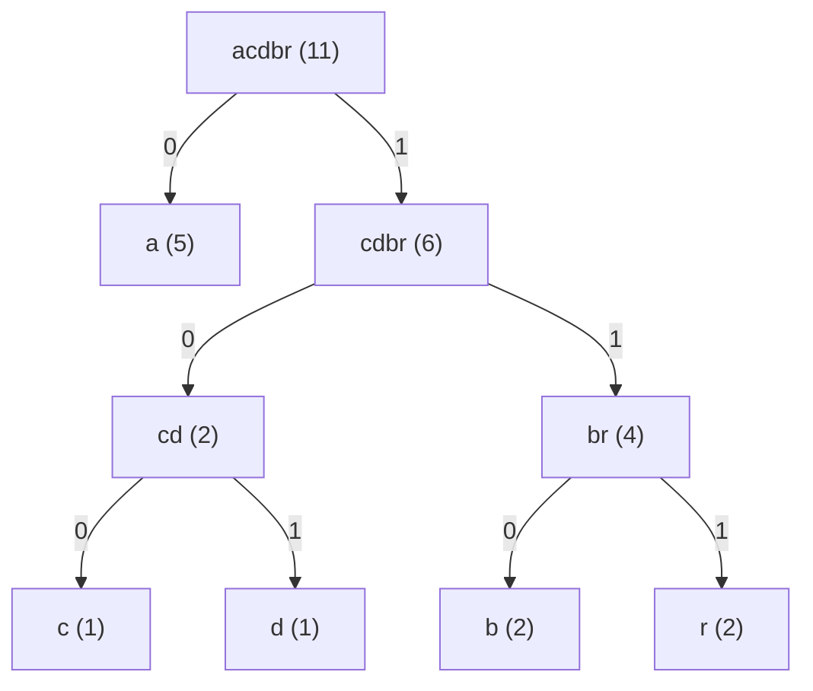

# 03 - Алгоритмы Хаффмана для кодирования и декодирования данных

**Алгоритм Хаффмана** (англ. *Huffman's algorithm*) — алгоритм оптимального префиксного кодирования некоторого алфавита с минимальной избыточностью.

Был разработан в 1952 году аспирантом Массачусетского технологического института Дэвидом Альбертом Хаффманом при написании им курсовой работы[^1].

Используется во многих программах сжатия данных.

Предложенный Хаффманом метод кодирования состоит из двух основных этапов:

1. Построение оптимального кодового дерева.
2. Построение «словаря» код-символ на основе построенного дерева.


David Albert Huffman

Основная идея алгоритма состоит в следующем: зная вероятности появления символов в сообщении, можно описать процедуру построения кодов переменной длины, состоящих из целого количества битов. Символам с большей вероятностью ставятся в соответствие более короткие коды. Коды Хаффмана обладают свойством префиксности (то есть ни одно кодовое слово не является префиксом другого), что позволяет однозначно их декодировать. Часто благодаря особому свойству префиксности данные коды называют **беспрефиксными.**

### Математическое определение

> Пусть $A=\{ {a_1,a_2,{…},a_n}\}$ — алфавит из $n$ различных символов, $W=\{ {w_1,w_2,…,w_n}\}$ — соответствующий ему набор положительных целых весов. Тогда набор бинарных кодов $C=\{ {c_1,c_2,…,c_n}\}$, где $c_i$ является кодом для символа $a_i$, такой, что:
>
> - $c_i$ не является префиксом для $c_j$, при ${i}\ne{j}$,
> - сумма $\displaystyle\sum_{ {i}∈[1,n]} {w_i}⋅|c_i|$ минимальна ($|c_i|$ — длина кода $c_i$),
> называется **кодом Хаффмана**.

### Алгоритм построения бинарного кода Хаффмана

Построение кода Хаффмана сводится к построению соответствующего бинарного дерева по следующему алгоритму: [^2]

1. Составим список кодируемых символов, при этом будем рассматривать один символ как дерево, состоящее из одного элемента c весом, равным частоте появления символа в строке.
2. Из списка выберем два узла с наименьшим весом по следующему правилу:
   - Всегда выбираются два узла с наименьшими весами.
   - Если веса равны, предпочтение отдается узлу, который был создан раньше (это важно для воспроизводимости результатов).
3. Сформируем новый узел с весом, равным сумме весов выбранных узлов, и присоединим к нему два выбранных узла в качестве детей.
4. Добавим к списку только что сформированный узел вместо двух объединенных узлов.
5. Если в списке больше одного узла, то повторим пункты со второго по пятый.

### **Пример построения дерева Хаффмана**

Закодируем слово $abracadabra$. Тогда алфавит будет $A=\{ {a,b,r,c,d}\}$, а набор весов (частота появления символов алфавита в кодируемом слове) $W=\{ {5,2,2,1,1}\}$.

В дереве Хаффмана будет $5$ узлов:

| Узел | $a$ | $b$ | $r$ | $c$ | $d$ |
| ---- | --- | --- | --- | --- | --- |
| Вес  | 5   | 2   | 2   | 1   | 1   |

По алгоритму возьмем два символа с наименьшей частотой — это $c$ и $d$. Сформируем из них новый узел $cd$ весом $2$ (сумма весов каждого из узлов) и добавим его к списку узлов:

| Узел | $a$ | $b$ | $r$ | $cd$ |
| ---- | --- | --- | --- | ---- |
| Вес  | 5   | 2   | 2   | 2    |

Затем опять объединим в один узел два минимальных по весу узла — $b$ и $r$:

| Узел | $a$ | $cd$ | $br$ |
| ---- | --- | ---- | ---- |
| Вес  | 5   | 2    | 4    |

Еще раз повторим эту же операцию, но для узлов $cd$ и $br$:

| Узел | $a$ | $cdbr$ |
| ---- | --- | ----- |
| Вес  | 5   | 6     |

На последнем шаге объединим два узла — $a$ и $cdbr$:

| Узел | $acdbr$ |
| ---- | ------ |
| Вес  | 11     |

Остался один узел, значит, мы пришли к корню дерева Хаффмана.



Теперь для каждого символа определим его код — бинарную последовательность, обозначающую путь по дереву к этому символу от корня:

| Символ | $a$ | $b$  | $r$  | $c$  | $d$  |
| ------ | --- | ---- | ---- | ---- | ---- |
| Код    | 0   | 110  | 111  | 100  | 101  |

Таким образом, закодированное слово $abracadabra$ будет выглядеть как $0111010100001010111010$. Длина закодированного слова — $23$ бита. Стоит заметить, что если бы мы использовали алгоритм кодирования с одинаковой длиной всех кодовых слов, то закодированное слово заняло бы $33$ бита, что существенно больше.

### **Реализация алгоритма Хаффмана на языке Fortran 77**

Ниже приводится реализация алгоритма Хаффмана на языке программирования **Fortran 77**. Основой для программы послужил подход, описанный в книге *Numerical Recipes in FORTRAN 77: Volume 1, The Art of Scientific Computing*[^3]. Однако реализация была адаптирована и упрощена для студентов, чтобы она была представлена как единая программа, понятная для изучения.

@[code fortran](./includes/huffman.f)

Программа реализует алгоритм Хаффмана для сжатия текста.

#### Основные особенности программы

1. **Ввод строки и подсчёт частот символов:**
   - Пользователь вводит строку.
   - Программа автоматически подсчитывает частоту появления каждого символа, используя ASCII-коды. Это позволяет избежать ручного ввода частот.

2. **Построение дерева Хаффмана:**
   - На основе частот создаётся бинарное дерево.
   - Два узла с наименьшими частотами объединяются в новый узел, пока не останется один корневой узел.

3. **Генерация кодов:**
   - Для каждого символа определяется уникальный код Хаффмана.
   - Код строится путём обхода дерева от символа к корню (левый поворот = 0, правый поворот = 1).

4. **Вывод результатов:**
   - Для каждого символа отображается его уникальный код.
   - Кодированная строка создаётся путём замены символов на их коды.

5. **Использование простых структур данных:**
   - Программа работает с массивами для хранения частот, связей дерева и узлов, что упрощает реализацию и обеспечивает совместимость со стандартом Fortran-77.

#### Как запустить программу

1. **Сохранение кода**:
   - Скопируйте программу в текстовый файл и сохраните его с расширением `.f`, например, `huffman.f`.

2. **Установка компилятора Fortran**:
   - Убедитесь, что на вашем компьютере установлен компилятор Fortran (например, **gfortran**). Если компилятор не установлен, его можно установить:
     - **Linux**: `sudo apt install gfortran`
     - **MacOS**: `brew install gfortran`
     - **Windows**: используйте [MinGW](http://www.mingw.org/) или WSL (Windows Subsystem for Linux).

3. **Компиляция программы**:
   - Откройте терминал, перейдите в директорию с файлом программы и выполните:

     ```bash
     gfortran -ffixed-form -o huffman huffman.f
     ```

   - В результате будет создан исполняемый файл `huffman`.

4. **Запуск программы**:
   - Выполните команду:

     ```bash
     ./huffman
     ```

     На Windows вместо `./huffman` используйте `huffman.exe`.

5. **Проверка на фразе "abracadabra"**:
   - После запуска программа запросит ввод строки. Введите `abracadabra` и нажмите Enter.
   - Программа подсчитает частоты символов, построит дерево Хаффмана и выведет коды для каждого символа.

#### Пример работы программы

**Ввод**:

```txt
Enter a phrase:
abracadabra
```

**Вывод**:

```txt
Huffman Codes:
a -> 0
b -> 110
r -> 111
c -> 100
d -> 101
```

Программа демонстрирует базовые принципы алгоритма Хаффмана и позволяет студентам изучить его реализацию в классическом процедурном стиле благодаря использованию языка **Fortran 77**, который широко применялся в 1970-1980-х годах для научных и инженерных вычислений, студенты также получают возможность познакомиться с историческим подходом к программированию.

### **Время работы**

Если сортировать элементы после каждого суммирования или использовать приоритетную очередь, то алгоритм будет работать за время ${O(n\log n)}$.

Такую асимптотику теоретически возможно улучшить до ${O(n)}$, используя обычные массивы.

## Список источников

[^1]: [Huffman, D. (1952). "A Method for the Construction of Minimum-Redundancy Codes" (PDF). Proceedings of the IRE. 40 (9): 1098—1101.](https://disk.yandex.ru/i/Sf4RBezF6VA2Dg)

[^2]: [Van Leeuwen, Jan (1976). "On the construction of Huffman trees" (PDF). ICALP: 382-410.](https://disk.yandex.ru/i/YfsdeWzVe783Tw)

[^3]: [Press, W. H., Teukolsky, S. A., Vetterling, W. T., & Flannery, B. P. (1992). Numerical Recipes in FORTRAN 77: The Art of Scientific Computing (Vol. 1, 2nd ed., p. 896). Cambridge University Press.](https://disk.yandex.ru/d/G9Twy2Nw58YiFQ)

### Что ещё почитать по теме

- [Кодирование Хаффмана, журнал Монитор, номер 7-8, 1993 год](https://disk.yandex.ru/i/ajd01z0zo3q6yg)
