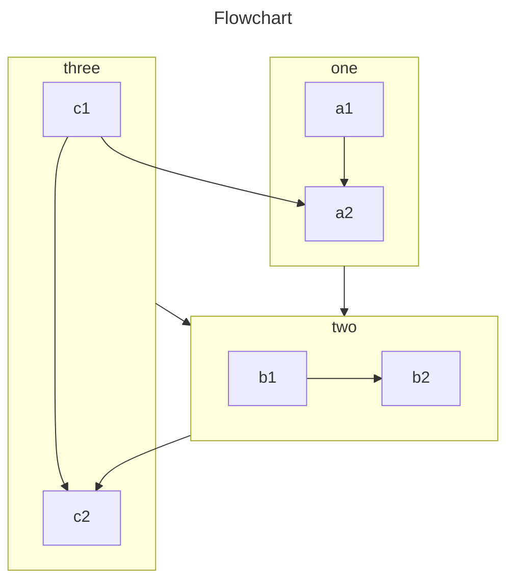

# Страница тестирования возможностей

## Контейнеры

::: tip
Текст совета
:::

::: warning
Текст примечания
:::

::: danger
Текст предупреждения
:::

::: info
Текст инфо
:::

::: important
Текст важно
:::

::: note
Текст заметки
:::

::: details
Текст подробнее
:::

::: danger Произвольный заголовок 1
Текст произвольного заголовка 1
:::

::: details Произвольный заголовок 2

```ts
console.log('Hello, VuePress!')
```

:::

## Табы для кода

::: code-tabs

@tab JavaScript

```js
const name = 'VuePress'

console.log(`Hello, ${name}!`)
```

@tab TypeScript

```ts
const name: string = 'VuePress'

console.log(`Hello, ${name}!`)
```

:::

## Табы с контентом

::: tabs

@tab Таб 1

Контент первого таба.

```js
console.log('Hello, VuePress!')
```

@tab Таб 2

Контент второго таба.

- Пункт списка 1
- Пункт списка 2
- Пункт списка 3

:::

## Математические формулы

### Инлайновые

Euler's identity $e^{i\pi}+1=0$ is a beautiful formula in $\mathbb{R}^2$.

### Мультистрочные

$$
\frac {\partial^r} {\partial \omega^r} \left(\frac {y^{\omega}} {\omega}\right)
= \left(\frac {y^{\omega}} {\omega}\right) \left\{(\log y)^r + \sum_{i=1}^r \frac {(-1)^ Ir \cdots (r-i+1) (\log y)^{ri}} {\omega^i} \right\}
$$

## Химические выражения

### Инлайновые

$\ce{CO2 + C -> 2 CO}$

### Мультистрочные

$$
\ce{Zn^2+  <=>[+ 2OH-][+ 2H+]  $\underset{\text{amphoteres Hydroxid}}{\ce{Zn(OH)2 v}}$  <=>[+ 2OH-][+ 2H+]  $\underset{\text{Hydroxozikat}}{\ce{[Zn(OH)4]^2-}}$}
$$

## Диаграммы Mermaid

### Flowchart



### Sequence Diagram

```sequence Greetings
Alice ->> Bob: Hello Bob, how are you?
Bob-->>John: How about you John?
Bob--x Alice: I am good thanks!
Bob-x John: I am good thanks!
Note right of John: Bob thinks a long<br/>long time, so long<br/>that the text does<br/>not fit on a row.

Bob-->Alice: Checking with John...
Alice->John: Yes... John, how are you?
```

### Class Diagram

```class Animal Example
note "From Duck till Zebra"
Animal <|-- Duck
note for Duck "can fly\ncan swim\ncan dive\ncan help in debugging"
Animal <|-- Fish
Animal <|-- Zebra
Animal : +int age
Animal : +String gender
Animal: +isMammal()
Animal: +mate()
class Duck{
  +String beakColor
  +swim()
  +quack()
}
class Fish{
  -int sizeInFeet
  -canEat()
}
class Zebra{
  +bool is_wild
  +run()
}
```

### State Diagram

```state Check if n is negative

state if_state <<choice>>
[*] --> IsPositive
IsPositive --> if_state
if_state --> False: if n < 0
if_state --> True : if n >= 0
```

### Entity Relationship Diagrams

```er Er Example
CAR ||--o{ NAMED-DRIVER : allows
CAR {
    string registrationNumber
    string make
    string model
}
PERSON ||--o{ NAMED-DRIVER : is
PERSON {
    string firstName
    string lastName
    int age
}
```

### User Journey Diagram

```journey
title My working day
section Go to work
  Make tea: 5: Me
  Go upstairs: 3: Me
  Do work: 1: Me, Cat
section Go home
  Go downstairs: 5: Me
  Sit down: 5: Me
```

### Gantt Diagrams

```gantt
dateFormat  YYYY-MM-DD
title       Adding GANTT diagram functionality to mermaid
excludes    weekends
%% (`excludes` accepts specific dates in YYYY-MM-DD format, days of the week ("sunday") or "weekends", but not the word "weekdays".)

section A section
Completed task            :done,    des1, 2014-01-06,2014-01-08
Active task               :active,  des2, 2014-01-09, 3d
Future task               :         des3, after des2, 5d
Future task2              :         des4, after des3, 5d

section Critical tasks
Completed task in the critical line :crit, done, 2014-01-06,24h
Implement parser                    :crit, done, after des1, 2d
Create tests for parser             :crit, active, 3d
Future task in critical line        :crit, 5d
Create tests for renderer           :2d
Add to mermaid                      :1d

section Documentation
Describe gantt syntax               :active, a1, after des1, 3d
Add gantt diagram to demo page      :after a1  , 20h
Add another diagram to demo page    :doc1, after a1  , 48h

section Last section
Describe gantt syntax               :after doc1, 3d
Add gantt diagram to demo page      :20h
Add another diagram to demo page    :48h
```

### Pie Chart Diagrams

```pie
title What Voldemort doesn't have?
  "FRIENDS" : 2
  "FAMILY" : 3
  "NOSE" : 45
```

### Git Graph Diagrams

```git-graph
commit
branch hotfix
checkout hotfix
commit
branch develop
checkout develop
commit id:"ash" tag:"abc"
branch featureB
checkout featureB
commit type:HIGHLIGHT
checkout main
checkout hotfix
commit type:NORMAL
checkout develop
commit type:REVERSE
checkout featureB
commit
checkout main
merge hotfix
checkout featureB
commit
checkout develop
branch featureA
commit
checkout develop
merge hotfix
checkout featureA
commit
checkout featureB
commit
checkout develop
merge featureA
branch release
checkout release
commit
checkout main
commit
checkout release
merge main
checkout develop
merge release
```

### Timeline

```timeline
title Timeline of Industrial Revolution
section 17th-20th century
    Industry 1.0 : Machinery, Water power, Steam <br>power
    Industry 2.0 : Electricity, Internal combustion engine, Mass production
    Industry 3.0 : Electronics, Computers, Automation
section 21st century
    Industry 4.0 : Internet, Robotics, Internet of Things
    Industry 5.0 : Artificial intelligence, Big data,3D printing
```

### Quadrant Chart

```quadrant
title Reach and engagement of campaigns
x-axis Low Reach --> High Reach
y-axis Low Engagement --> High Engagement
quadrant-1 We should expand
quadrant-2 Need to promote
quadrant-3 Re-evaluate
quadrant-4 May be improved
Campaign A: [0.3, 0.6]
Campaign B: [0.45, 0.23]
Campaign C: [0.57, 0.69]
Campaign D: [0.78, 0.34]
Campaign E: [0.40, 0.34]
Campaign F: [0.35, 0.78]
```

### XY Chart

```xy
title "Sales Revenue"
x-axis [jan, feb, mar, apr, may, jun, jul, aug, sep, oct, nov, dec]
y-axis "Revenue (in $)" 4000 --> 11000
bar [5000, 6000, 7500, 8200, 9500, 10500, 11000, 10200, 9200, 8500, 7000, 6000]
line [5000, 6000, 7500, 8200, 9500, 10500, 11000, 10200, 9200, 8500, 7000, 6000]
```

### Packet Chart

```packet
title UDP Packet
0-15: "Source Port"
16-31: "Destination Port"
32-47: "Length"
48-63: "Checksum"
64-95: "Data (variable length)"
```

### Radar Chart

```radar
---
config:
  radar:
    axisScaleFactor: 0.25
    curveTension: 0.1
  theme: base
  themeVariables:
    cScale0: "#FF0000"
    cScale1: "#00FF00"
    cScale2: "#0000FF"
    radar:
      curveOpacity: 0
---

axis A, B, C, D, E
curve c1{1,2,3,4,5}
curve c2{5,4,3,2,1}
curve c3{3,3,3,3,3}
```

## Сноски

Контент с первой сноской[^first].

Контент со второй сноской[^second].

Сноска внутри^[Описание сноски] текстового блока.

Ещё одна вторая сноска[^second].

[^first]: Описание **первой сноски**

    и даже многострочное.

[^second]: Описание второй сноски.

## Чеклисты

- [ ] Пункт А
- [x] Пункт Б

## Отключение интерполяции в блоке

::: v-pre

{{ abc }}

:::
