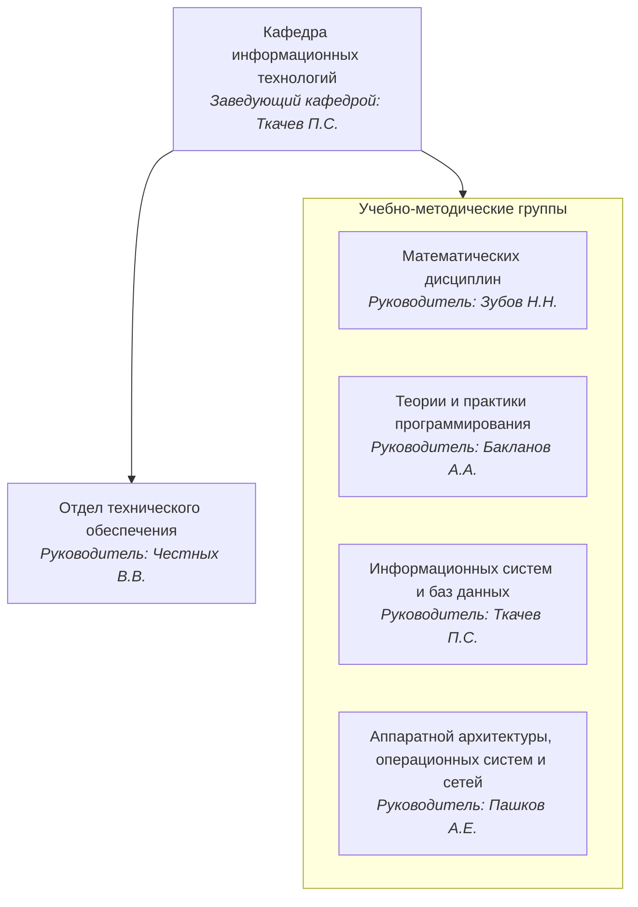
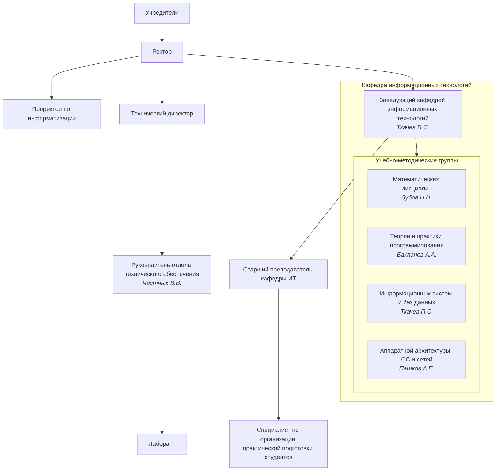

# Страница тестирования возможностей

## Контейнеры

::: tip
Текст совета
:::

::: warning
Текст примечания
:::

::: danger
Текст предупреждения
:::

::: info
Текст инфо
:::

::: important
Текст важно
:::

::: note
Текст заметки
:::

::: details
Текст подробнее
:::

::: danger Произвольный заголовок 1
Текст произвольного заголовка 1
:::

::: details Произвольный заголовок 2

```ts
console.log('Hello, VuePress!')
```

:::

## Табы для кода

::: code-tabs

@tab JavaScript

```js
const name = 'VuePress'

console.log(`Hello, ${name}!`)
```

@tab TypeScript

```ts
const name: string = 'VuePress'

console.log(`Hello, ${name}!`)
```

:::

## Табы с контентом

::: tabs

@tab Таб 1

Контент первого таба.

```js
console.log('Hello, VuePress!')
```

@tab Таб 2

Контент второго таба.

- Пункт списка 1
- Пункт списка 2
- Пункт списка 3

:::

## Математические формулы

### Инлайновые

Euler's identity $e^{i\pi}+1=0$ is a beautiful formula in $\mathbb{R}^2$.

### Мультистрочные

$$
\frac {\partial^r} {\partial \omega^r} \left(\frac {y^{\omega}} {\omega}\right)
= \left(\frac {y^{\omega}} {\omega}\right) \left\{(\log y)^r + \sum_{i=1}^r \frac {(-1)^ Ir \cdots (r-i+1) (\log y)^{ri}} {\omega^i} \right\}
$$

## Химические выражения

### Инлайновые

$\ce{CO2 + C -> 2 CO}$

### Мультистрочные

$$
\ce{Zn^2+  <=>[+ 2OH-][+ 2H+]  $\underset{\text{amphoteres Hydroxid}}{\ce{Zn(OH)2 v}}$  <=>[+ 2OH-][+ 2H+]  $\underset{\text{Hydroxozikat}}{\ce{[Zn(OH)4]^2-}}$}
$$

## Диаграммы Mermaid

### Структура кафедры



### Структура ВШП


