# Страница тестирования возможностей

## Railroad-диаграммы

::: preview Посмотреть код

```railroad
Diagram(
  Sequence(
    Terminal("SELECT"),
    Optional(Choice(0, Terminal("ALL"), Terminal("DISTINCT"))),
    Choice(0,
      Terminal("*"),
      OneOrMore(NonTerminal("select_item"), Terminal(","))
    ),
    Optional(
      Sequence(
        Terminal("FROM"),
        OneOrMore(NonTerminal("table_ref"), Terminal(","))
      )
    ),
    Optional(Sequence(Terminal("WHERE"), NonTerminal("condition"))),
    Optional(
      Sequence(
        Terminal("GROUP BY"),
        OneOrMore(NonTerminal("expr"), Terminal(","))
      )
    ),
    Optional(Sequence(Terminal("HAVING"), NonTerminal("condition"))),
    Optional(
      Sequence(
        Terminal("ORDER BY"),
        OneOrMore(NonTerminal("order_item"), Terminal(","))
      )
    ),
    Optional(Sequence(Terminal("LIMIT"), NonTerminal("count"))),
    Optional(Sequence(Terminal("OFFSET"), NonTerminal("start")))
  )
)
```

:::

## Проверка превью блоков кода

### Импорт блоков кода

::: preview Посмотреть код

@[code{6-13} js{6}:no-line-numbers](./scripts/license-update.js)

:::

### Несколько блоков подряд

::: preview HTML / CSS / JS

```html
<div class="card">Hello</div>
```

```css
.card { color: #333; }
```

```js
console.log('hi')
```

:::

### Один конкретный блок кода

::: preview JS

```js
console.log('hi')
```

:::

## Контейнеры

::: preview Посмотреть код
  ::: tip
  Текст совета
  :::
:::

::: preview Посмотреть код
  ::: warning
  Текст примечания
  :::
:::

::: preview Посмотреть код
  ::: danger
  Текст предупреждения
  :::
:::

::: preview Посмотреть код
  ::: info
  Текст инфо
  :::
:::

::: preview Посмотреть код
  ::: important
  Текст важно
  :::
:::

::: preview Посмотреть код
  ::: note
  Текст заметки
  :::
:::

::: preview Посмотреть код
  ::: details
  Текст подробнее
  :::
:::

::: preview Посмотреть код
  ::: danger Произвольный заголовок 1
  Текст произвольного заголовка 1
  :::
:::

::: preview Посмотреть код
  ::: details Произвольный заголовок 2

  ```ts
  console.log('Hello, VuePress!')
  ```

  :::
:::

## Подсветка синтаксиса Prism

### Обычный блок кода JS

::: preview Посмотреть код

```js
import { defaultTheme } from '@vuepress/theme-default'
import { defineUserConfig } from 'vuepress'

export default defineUserConfig({
  title: 'Hello, VuePress',

  theme: defaultTheme({
    logo: 'https://vuepress.vuejs.org/images/hero.png',
  }),
})
```

:::

### Блок кода JS без номеров строк

::: preview Посмотреть код

```js :no-line-numbers
import { defaultTheme } from '@vuepress/theme-default'
import { defineUserConfig } from 'vuepress'

export default defineUserConfig({
  title: 'Hello, VuePress',

  theme: defaultTheme({
    logo: 'https://vuepress.vuejs.org/images/hero.png',
  }),
})
```

:::

### Выделение конкретных строк (2,7-9)

::: preview Посмотреть код

```js {2,7-9}
import { defaultTheme } from '@vuepress/theme-default'
import { defineUserConfig } from 'vuepress'

export default defineUserConfig({
  title: 'Hello, VuePress',

  theme: defaultTheme({
    logo: 'https://vuepress.vuejs.org/images/hero.png',
  }),
})
```

:::

### Сворачивание кода после N строки (3)

::: preview Посмотреть код

```js :collapsed-lines=3
import { defaultTheme } from '@vuepress/theme-default'
import { defineUserConfig } from 'vuepress'

export default defineUserConfig({
  title: 'Hello, VuePress',

  theme: defaultTheme({
    logo: 'https://vuepress.vuejs.org/images/hero.png',
  }),
})
```

:::

### Блок кода с произвольным заголовком

::: preview Посмотреть код

```js title=".vuepress/config.js"
import { defaultTheme } from '@vuepress/theme-default'
import { defineUserConfig } from 'vuepress'

export default defineUserConfig({
  title: 'Hello, VuePress',

  theme: defaultTheme({
    logo: 'https://vuepress.vuejs.org/images/hero.png',
  }),
})
```

:::

### Выделение отдельных слов в кода

Чувствительно к регистру! Используются регулярные выражения.

::: preview Посмотреть код

```js /Hello World/ /msg/
const msg = 'Hello World'
console.log(msg) // prints Hello World
```

:::

## Расширенные возможности Prism

### Отображение добавленных и удаленных строк кода

Лучше всего отключать номера строк при помощи `:no-line-numbers`!

<VPPreview title="Посмотреть код">
<template #code>

````md
```js :no-line-numbers
// Обычный комментарий в коде
console.log('hi') // [\!code --]
console.log('hello') // [\!code ++]
console.log('goodbye')
```
````

</template>
<template #content>

```js :no-line-numbers
// Обычный комментарий в коде
console.log('hi') // [!code --]
console.log('hello') // [!code ++]
console.log('goodbye')
```

</template>
</VPPreview>

### Отображение фокуса и выделения на строках кода

Лучше всего отключать номера строк при помощи `:no-line-numbers`!

<VPPreview title="Посмотреть код">
<template #code>

````md
```js :no-line-numbers
// Обычный комментарий в коде
console.log('Not focused')
console.log('Focused') // [\!code focus]
console.log('Not focused')
```
````

</template>
<template #content>

```js :no-line-numbers
// Обычный комментарий в коде
console.log('Not focused')
console.log('Focused') // [!code focus]
console.log('Not focused')
```

</template>
</VPPreview>

<VPPreview title="Посмотреть код">
<template #code>

````md
```js :no-line-numbers
// Обычный комментарий в коде
console.log('Not highlighted')
console.log('Highlighted') // [\!code highlight]
console.log('Not highlighted')
```
````

</template>
<template #content>

```js :no-line-numbers
// Обычный комментарий в коде
console.log('Not highlighted')
console.log('Highlighted') // [!code highlight]
console.log('Not highlighted')
```

</template>
</VPPreview>

### Отображение уровней ошибок в коде

Лучше всего отключать номера строк при помощи `:no-line-numbers`!

<VPPreview title="Посмотреть код">
<template #code>

````md
```js :no-line-numbers
// Обычный комментарий в коде
console.log('No errors or warnings')
console.warn('Warning') // [\!code warning]
console.error('Error') // [\!code error]
```
````

</template>
<template #content>

```js :no-line-numbers
// Обычный комментарий в коде
console.log('No errors or warnings')
console.warn('Warning') // [!code warning]
console.error('Error') // [!code error]
```

</template>
</VPPreview>

## Табы для кода

::: preview Посмотреть код
  ::: code-tabs

  @tab JavaScript

  ```js
  const name = 'VuePress'

  console.log(`Hello, ${name}!`)
  ```

  @tab TypeScript

  ```ts
  const name: string = 'VuePress'

  console.log(`Hello, ${name}!`)
  ```

  :::
:::

## Табы с контентом

::: preview Посмотреть код
  ::: tabs

  @tab Таб 1

  Контент первого таба.

  ```js
  console.log('Hello, VuePress!')
  ```

  @tab Таб 2

  Контент второго таба.

  <!-- markdownlint-disable ul-indent -->
  - Пункт списка 1
  - Пункт списка 2
  - Пункт списка 3
  <!-- markdownlint-disable ul-indent -->

  :::
:::

## Математические формулы

### Инлайновые

::: preview Посмотреть код

Euler's identity $e^{i\pi}+1=0$ is a beautiful formula in $\mathbb{R}^2$.

:::

### Мультистрочные

::: preview Посмотреть код

$$
\frac {\partial^r} {\partial \omega^r} \left(\frac {y^{\omega}} {\omega}\right)
= \left(\frac {y^{\omega}} {\omega}\right) \left\{(\log y)^r + \sum_{i=1}^r \frac {(-1)^ Ir \cdots (r-i+1) (\log y)^{ri}} {\omega^i} \right\}
$$

:::

## Химические выражения

### Инлайновые

::: preview Посмотреть код

$\ce{CO2 + C -> 2 CO}$

:::

### Мультистрочные

::: preview Посмотреть код

$$
\ce{Zn^2+  <=>[+ 2OH-][+ 2H+]  $\underset{\text{amphoteres Hydroxid}}{\ce{Zn(OH)2 v}}$  <=>[+ 2OH-][+ 2H+]  $\underset{\text{Hydroxozikat}}{\ce{[Zn(OH)4]^2-}}$}
$$

:::

## Диаграммы Mermaid

### Flowchart

::: preview Посмотреть код


:::

### Sequence Diagram

::: preview Посмотреть код

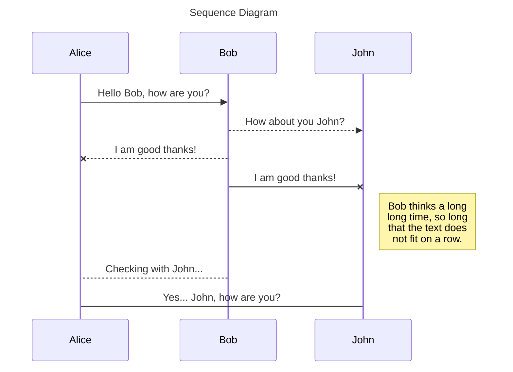

:::

### Class Diagram

::: preview Посмотреть код

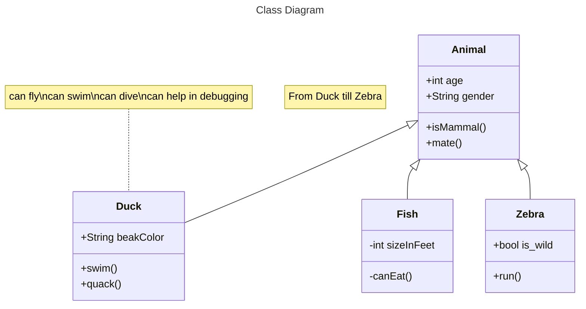

:::

### State Diagram

::: preview Посмотреть код

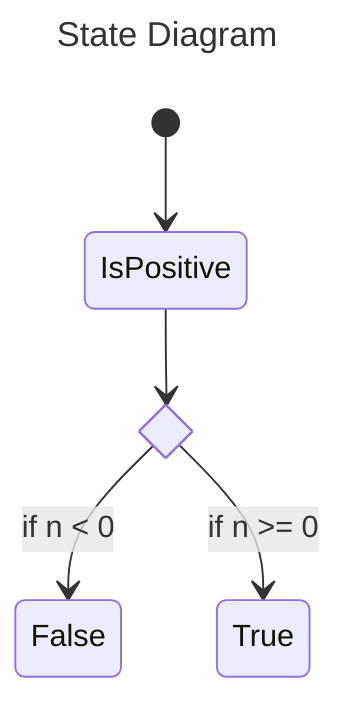

:::

### Entity Relationship Diagram

::: preview Посмотреть код

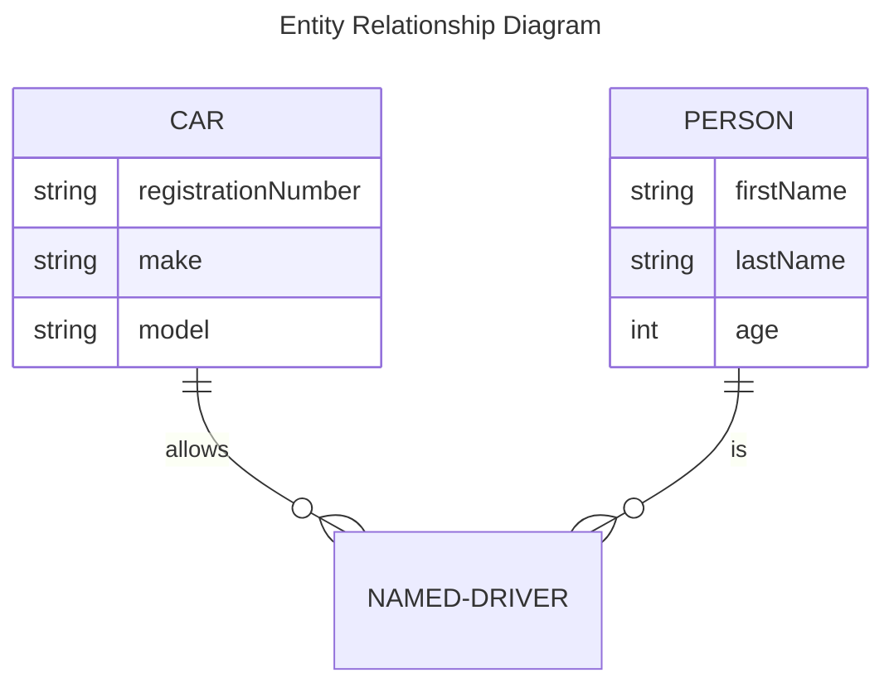

:::

### User Journey Diagram

::: preview Посмотреть код

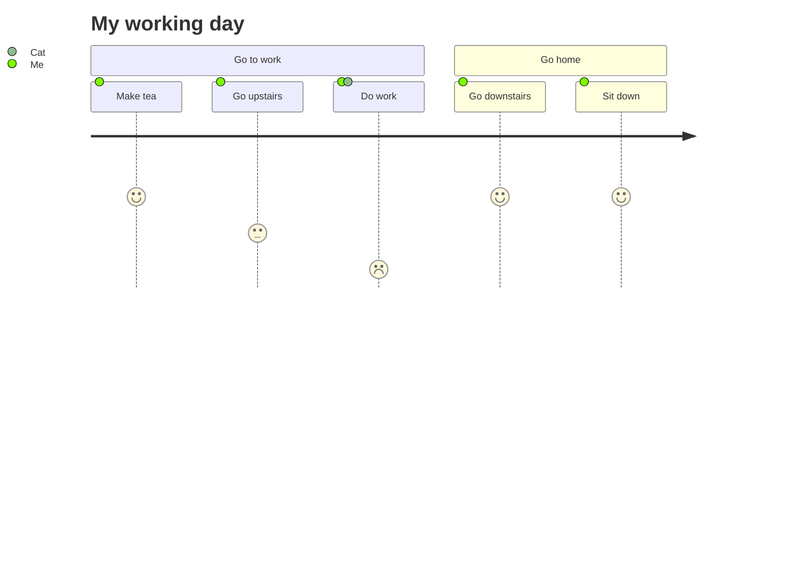

:::

### Gantt Diagram

::: preview Посмотреть код

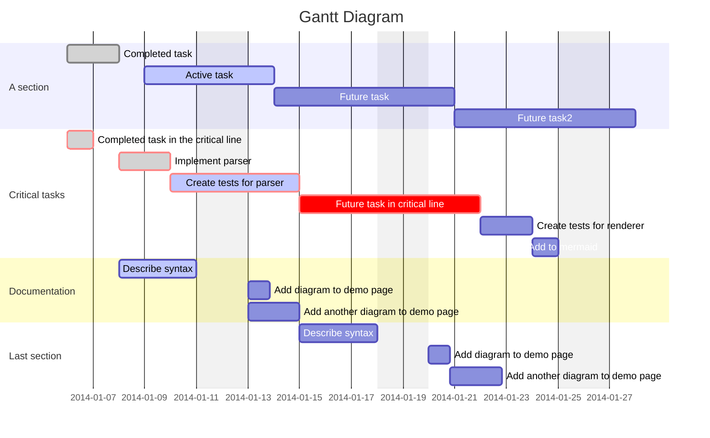

:::

### Pie Chart Diagram

::: preview Посмотреть код

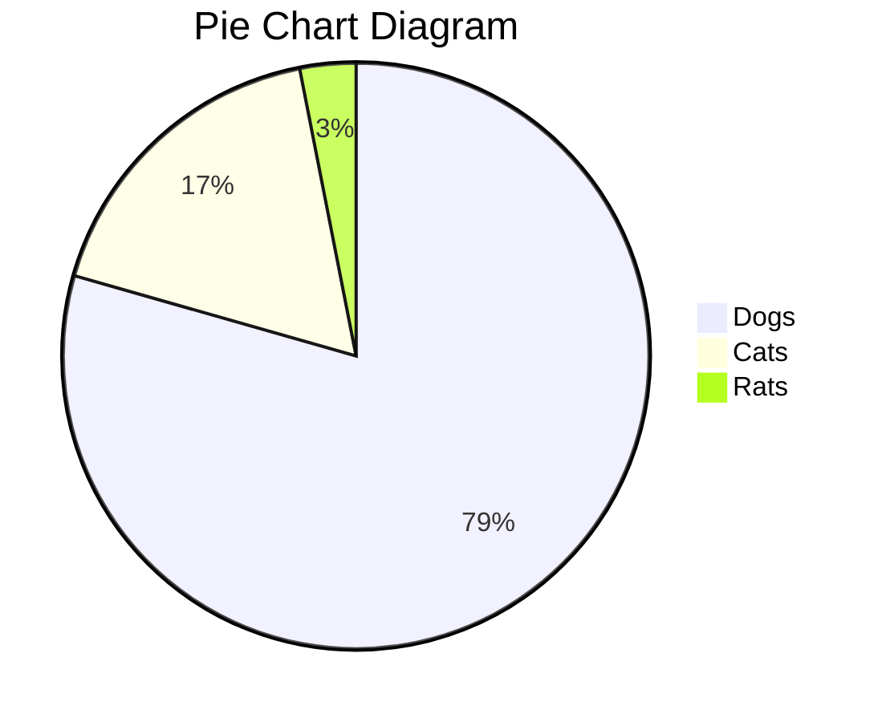

:::

### Quadrant Chart

::: preview Посмотреть код

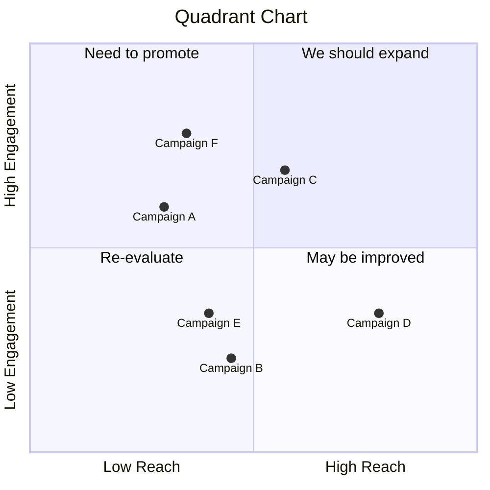

:::

### Requirement Diagram

::: preview Посмотреть код

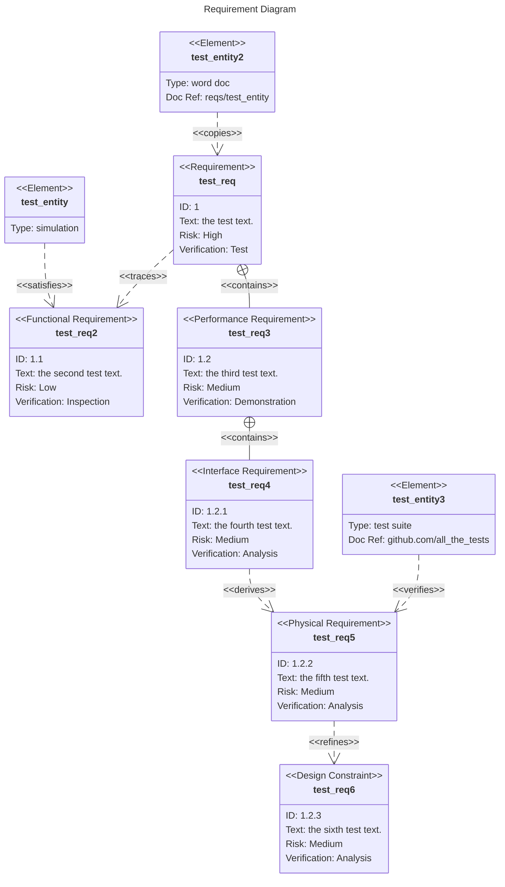

:::

### Git Graph Diagram

::: preview Посмотреть код

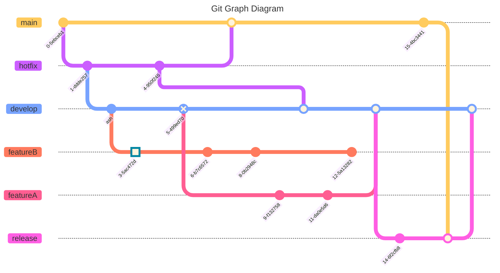

:::

### Timeline Diagram

::: preview Посмотреть код

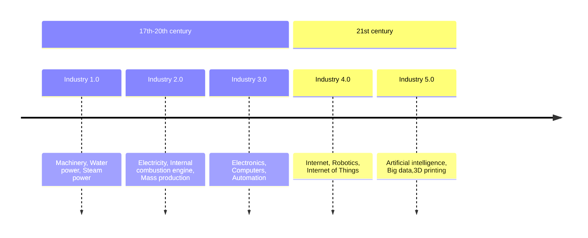

:::

### Sankey diagram

Кириллица пока не поддерживается!

::: preview Посмотреть код

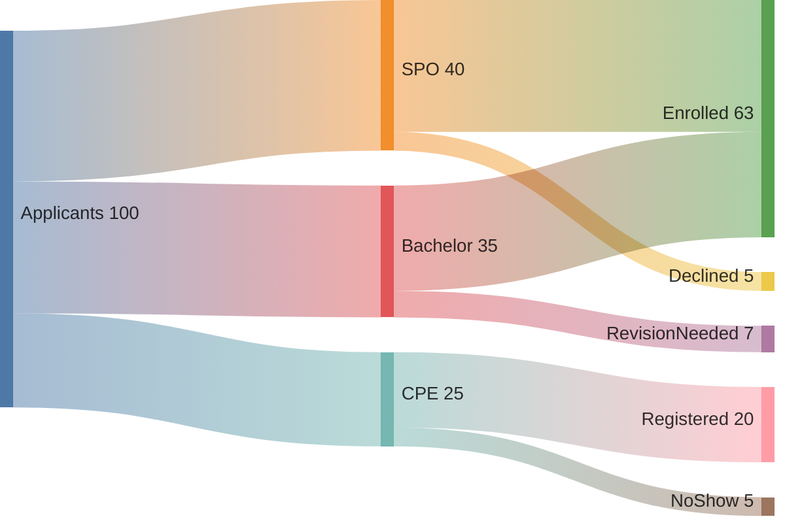

:::

### XY Chart

::: preview Посмотреть код

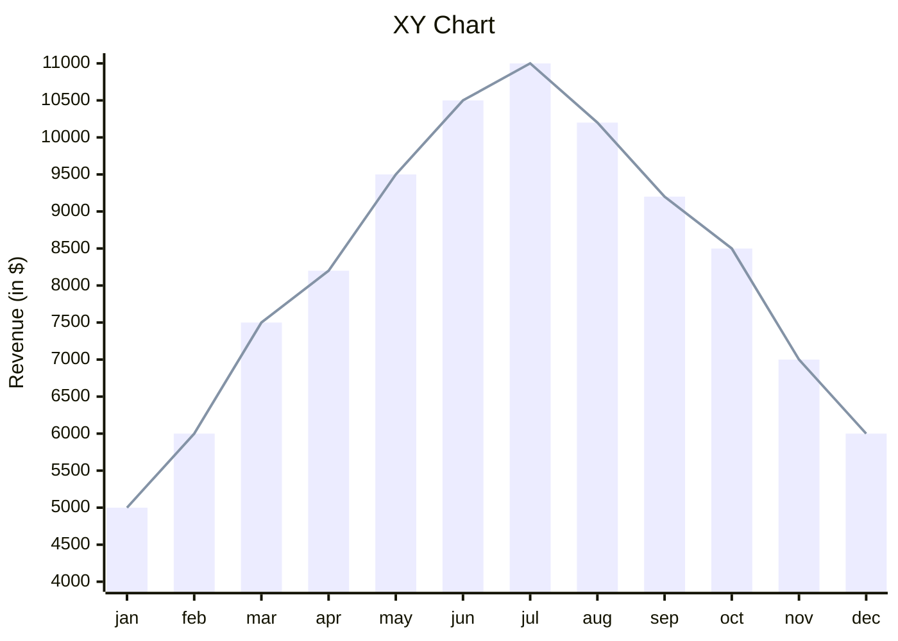

:::

### Packet Diagram

::: preview Посмотреть код

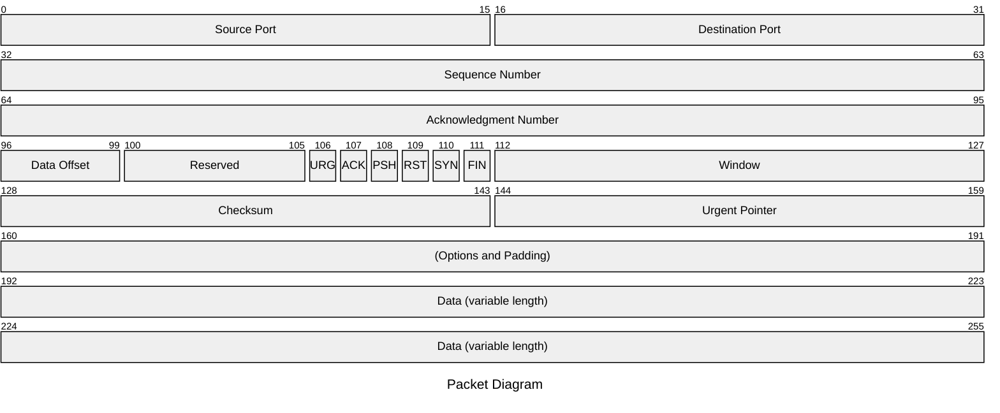

:::

## Сноски

::: preview Посмотреть код

Контент с первой сноской[^first].

Контент со второй сноской[^second].

Сноска внутри^[Описание сноски] текстового блока.

Ещё одна вторая сноска[^second].

[^first]: Описание **первой сноски**
  и даже многострочное.

[^second]: Описание второй сноски.

:::

## Чеклисты

::: preview Посмотреть код

- [ ] Пункт А
- [x] Пункт Б

:::

## Отключение интерполяции в блоке

::: preview Посмотреть код
  ::: v-pre

  {{ abc }}

  :::
:::
