# Диаграммы Mermaid

https://ecosystem.vuejs.press/plugins/markdown/markdown-chart/
https://ecosystem.vuejs.press/plugins/markdown/markdown-chart/mermaid.html

## Size-test

### small

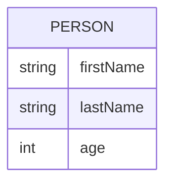
```mermaid
erDiagram
  PERSON {
      string firstName
      string lastName
      int age
  }
```

### medium

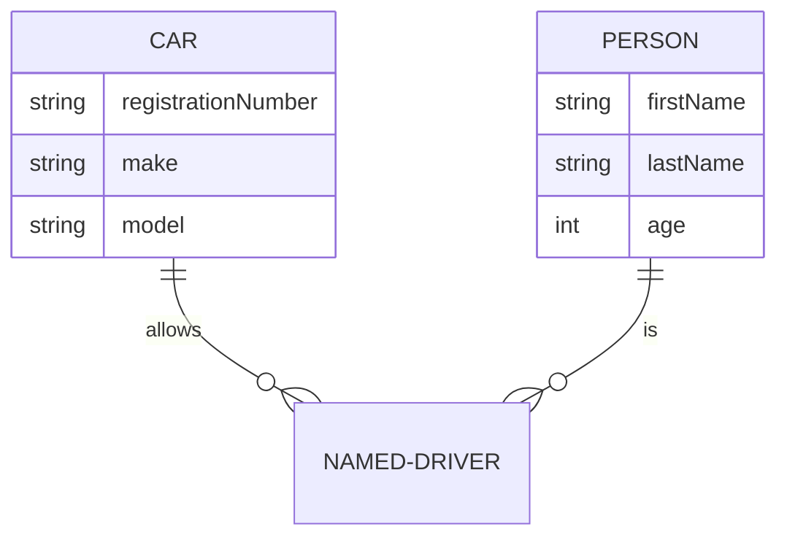
```mermaid
erDiagram
  CAR ||--o{ NAMED-DRIVER : allows
  CAR {
      string registrationNumber
      string make
      string model
  }
  PERSON ||--o{ NAMED-DRIVER : is
  PERSON {
      string firstName
      string lastName
      int age
  }
```

### large

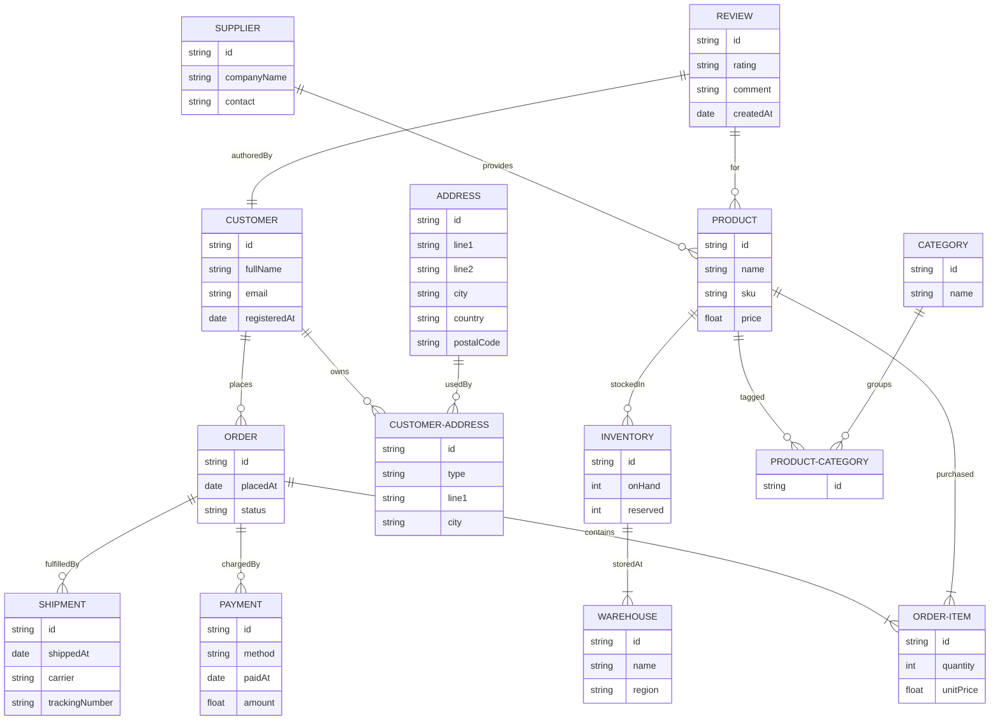
```mermaid
erDiagram
  CUSTOMER ||--o{ ORDER : places
  CUSTOMER ||--o{ CUSTOMER-ADDRESS : owns
  CUSTOMER {
      string id
      string fullName
      string email
      date registeredAt
  }
  CUSTOMER-ADDRESS {
      string id
      string type
      string line1
      string city
  }
  ADDRESS ||--o{ CUSTOMER-ADDRESS : usedBy
  ADDRESS {
      string id
      string line1
      string line2
      string city
      string country
      string postalCode
  }
  ORDER ||--|{ ORDER-ITEM : contains
  ORDER ||--o{ PAYMENT : chargedBy
  ORDER ||--o{ SHIPMENT : fulfilledBy
  ORDER {
      string id
      date placedAt
      string status
  }
  ORDER-ITEM {
      string id
      int quantity
      float unitPrice
  }
  PRODUCT ||--|{ ORDER-ITEM : purchased
  PRODUCT ||--o{ INVENTORY : stockedIn
  PRODUCT ||--o{ PRODUCT-CATEGORY : tagged
  PRODUCT {
      string id
      string name
      string sku
      float price
  }
  CATEGORY ||--o{ PRODUCT-CATEGORY : groups
  CATEGORY {
      string id
      string name
  }
  PRODUCT-CATEGORY {
      string id
  }
  SUPPLIER ||--o{ PRODUCT : provides
  SUPPLIER {
      string id
      string companyName
      string contact
  }
  INVENTORY ||--|{ WAREHOUSE : storedAt
  INVENTORY {
      string id
      int onHand
      int reserved
  }
  WAREHOUSE {
      string id
      string name
      string region
  }
  PAYMENT {
      string id
      string method
      date paidAt
      float amount
  }
  SHIPMENT {
      string id
      date shippedAt
      string carrier
      string trackingNumber
  }
  REVIEW ||--o{ PRODUCT : for
  REVIEW ||--|| CUSTOMER : authoredBy
  REVIEW {
      string id
      string rating
      string comment
      date createdAt
  }
```

## Flowchart

::: preview Посмотреть код

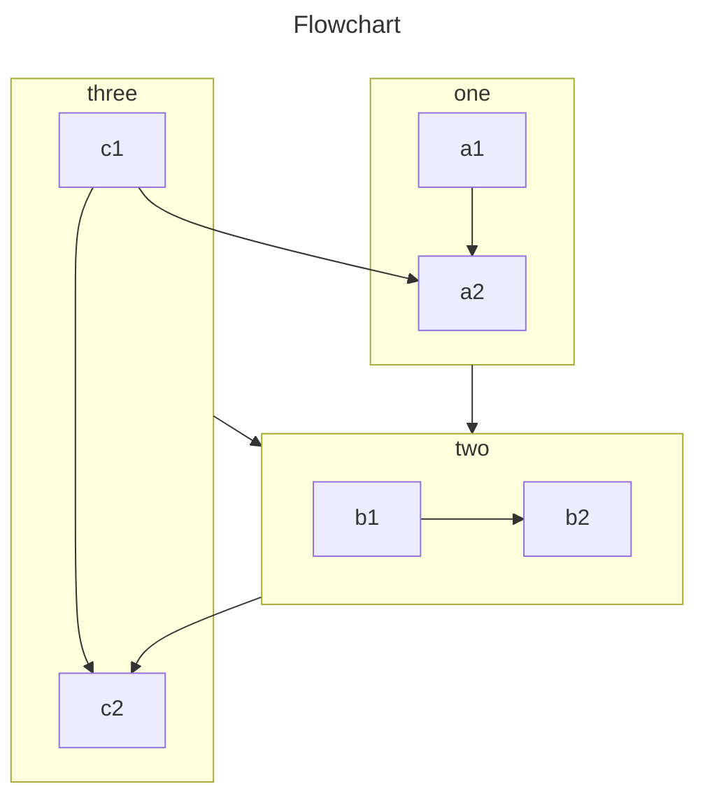
```mermaid
---
title: Flowchart
---

flowchart TB
    c1-->a2
    subgraph one
    a1-->a2
    end
    subgraph two
    b1-->b2
    end
    subgraph three
    c1-->c2
    end
    one --> two
    three --> two
    two --> c2
```

:::

## Sequence Diagram

::: preview Посмотреть код

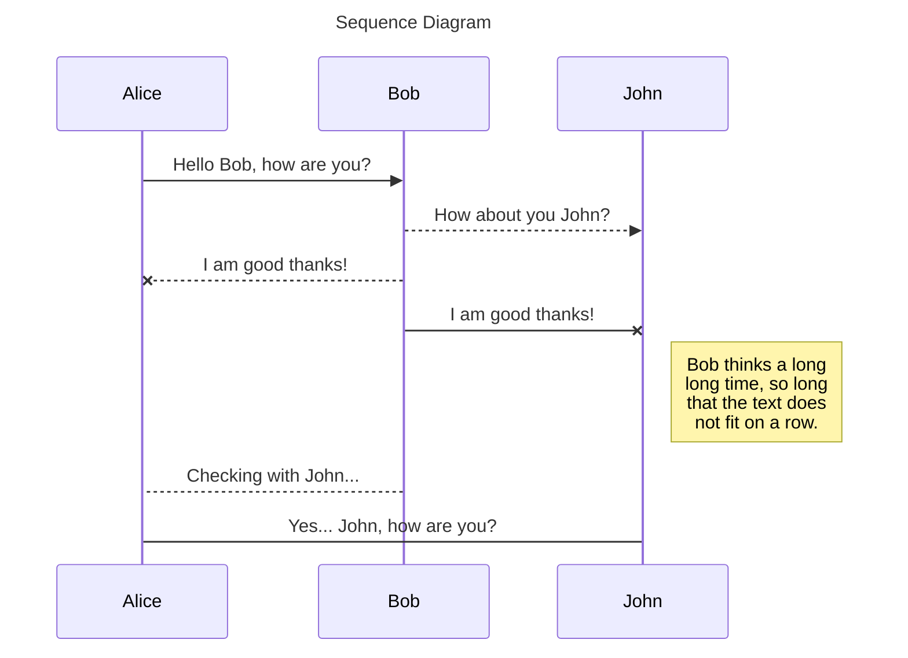
```mermaid
---
title: Sequence Diagram
---

sequenceDiagram
  Alice ->> Bob: Hello Bob, how are you?
  Bob-->>John: How about you John?
  Bob--x Alice: I am good thanks!
  Bob-x John: I am good thanks!
  Note right of John: Bob thinks a long<br/>long time, so long<br/>that the text does<br/>not fit on a row.

  Bob-->Alice: Checking with John...
  Alice->John: Yes... John, how are you?
```

:::

## Class Diagram

::: preview Посмотреть код

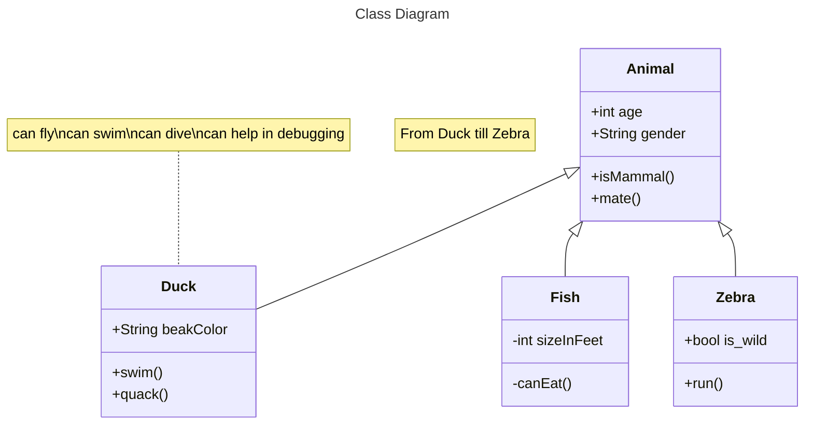
```mermaid
---
title: Class Diagram
---

classDiagram
  note "From Duck till Zebra"
  Animal <|-- Duck
  note for Duck "can fly\ncan swim\ncan dive\ncan help in debugging"
  Animal <|-- Fish
  Animal <|-- Zebra
  Animal : +int age
  Animal : +String gender
  Animal: +isMammal()
  Animal: +mate()
  class Duck{
    +String beakColor
    +swim()
    +quack()
  }
  class Fish{
    -int sizeInFeet
    -canEat()
  }
  class Zebra{
    +bool is_wild
    +run()
  }
```

:::

## State Diagram

::: preview Посмотреть код

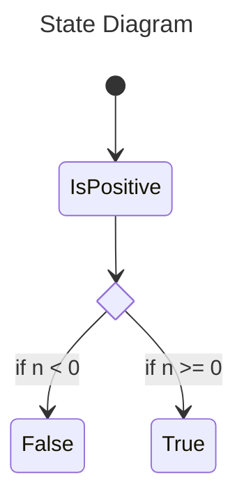
```mermaid
---
title: State Diagram
---

stateDiagram
  state if_state <<choice>>
  [*] --> IsPositive
  IsPositive --> if_state
  if_state --> False: if n < 0
  if_state --> True : if n >= 0
```

:::

## Entity Relationship Diagram

::: preview Посмотреть код

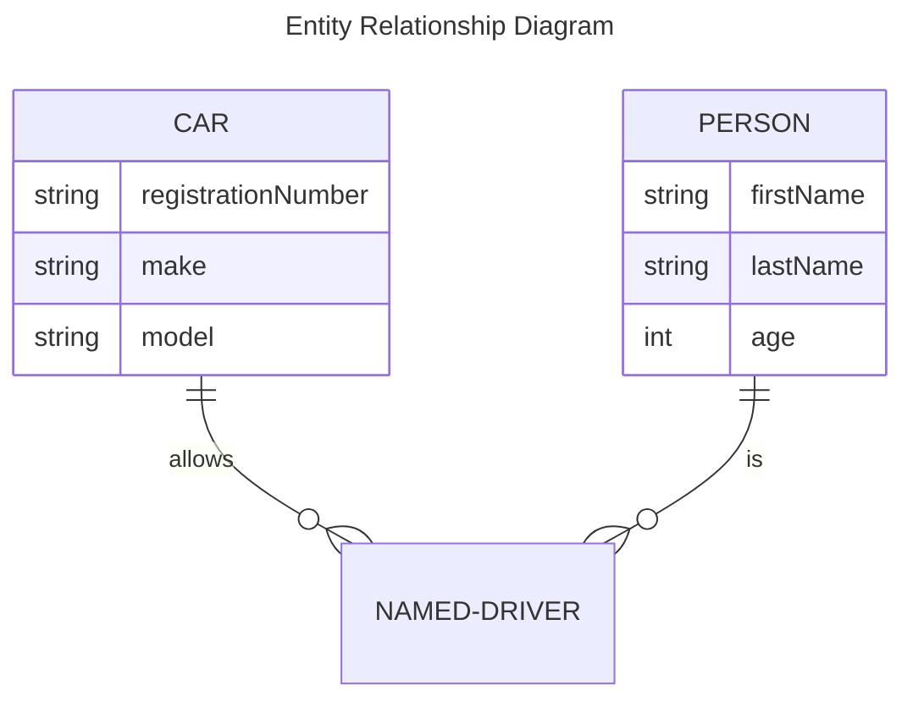
```mermaid
---
title: Entity Relationship Diagram
---

erDiagram
  CAR ||--o{ NAMED-DRIVER : allows
  CAR {
      string registrationNumber
      string make
      string model
  }
  PERSON ||--o{ NAMED-DRIVER : is
  PERSON {
      string firstName
      string lastName
      int age
  }
```

:::

## User Journey Diagram

::: preview Посмотреть код

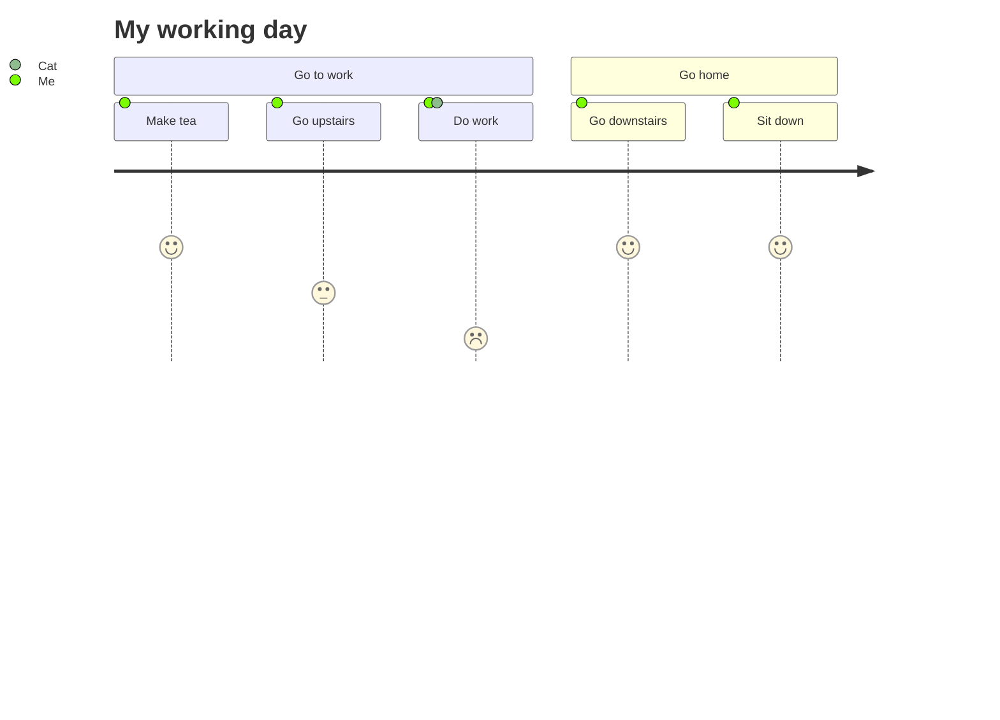
```mermaid
---
title: User Journey Diagram
---

journey
  title My working day
  section Go to work
    Make tea: 5: Me
    Go upstairs: 3: Me
    Do work: 1: Me, Cat
  section Go home
    Go downstairs: 5: Me
    Sit down: 5: Me
```

:::

## Gantt Diagram

::: preview Посмотреть код

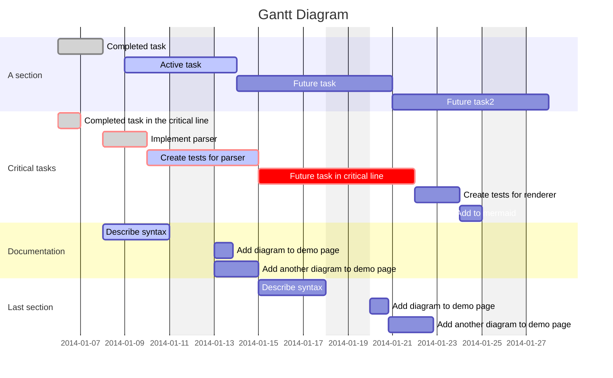
```mermaid
---
title: Gantt Diagram
---

gantt
  dateFormat  YYYY-MM-DD
  excludes    weekends
  %% (`excludes` accepts specific dates in YYYY-MM-DD format, days of the week ("sunday") or "weekends", but not the word "weekdays".)

  section A section
  Completed task            :done,    des1, 2014-01-06,2014-01-08
  Active task               :active,  des2, 2014-01-09, 3d
  Future task               :         des3, after des2, 5d
  Future task2              :         des4, after des3, 5d

  section Critical tasks
  Completed task in the critical line :crit, done, 2014-01-06,24h
  Implement parser                    :crit, done, after des1, 2d
  Create tests for parser             :crit, active, 3d
  Future task in critical line        :crit, 5d
  Create tests for renderer           :2d
  Add to mermaid                      :1d

  section Documentation
  Describe syntax               :active, a1, after des1, 3d
  Add diagram to demo page      :after a1  , 20h
  Add another diagram to demo page    :doc1, after a1  , 48h

  section Last section
  Describe syntax               :after doc1, 3d
  Add diagram to demo page      :20h
  Add another diagram to demo page    :48h
```

:::

## Pie Chart Diagram

::: preview Посмотреть код

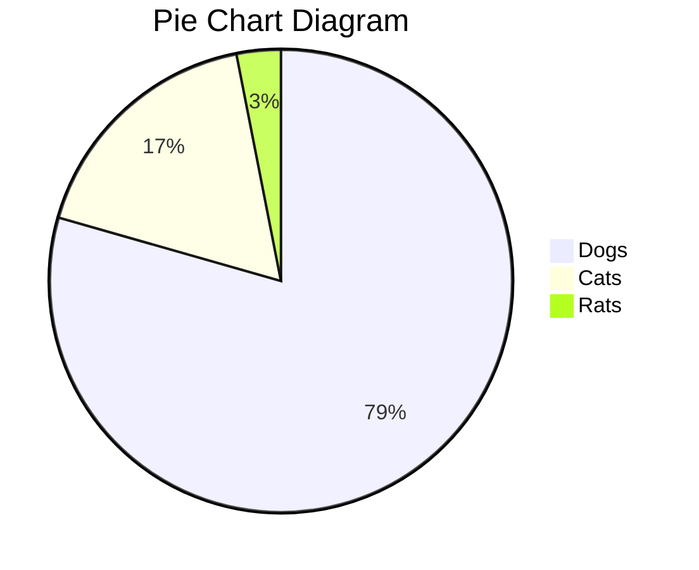
```mermaid
---
title: Pie Chart Diagram
---

pie
  "Dogs" : 386
  "Cats" : 85
  "Rats" : 15
```

:::

## Quadrant Chart

::: preview Посмотреть код

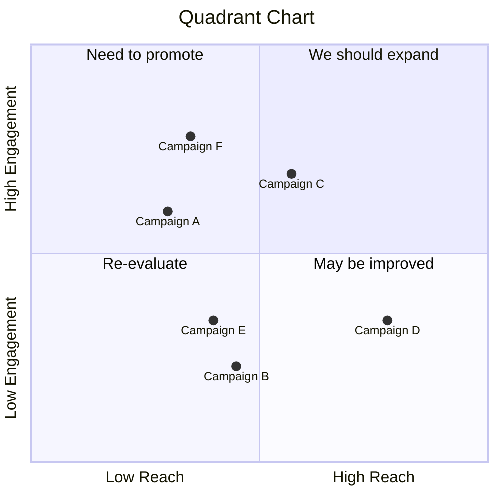
```mermaid
---
title: Quadrant Chart
---

quadrantChart
  x-axis Low Reach --> High Reach
  y-axis Low Engagement --> High Engagement
  quadrant-1 We should expand
  quadrant-2 Need to promote
  quadrant-3 Re-evaluate
  quadrant-4 May be improved
  Campaign A: [0.3, 0.6]
  Campaign B: [0.45, 0.23]
  Campaign C: [0.57, 0.69]
  Campaign D: [0.78, 0.34]
  Campaign E: [0.40, 0.34]
  Campaign F: [0.35, 0.78]
```

:::

## Requirement Diagram

::: preview Посмотреть код

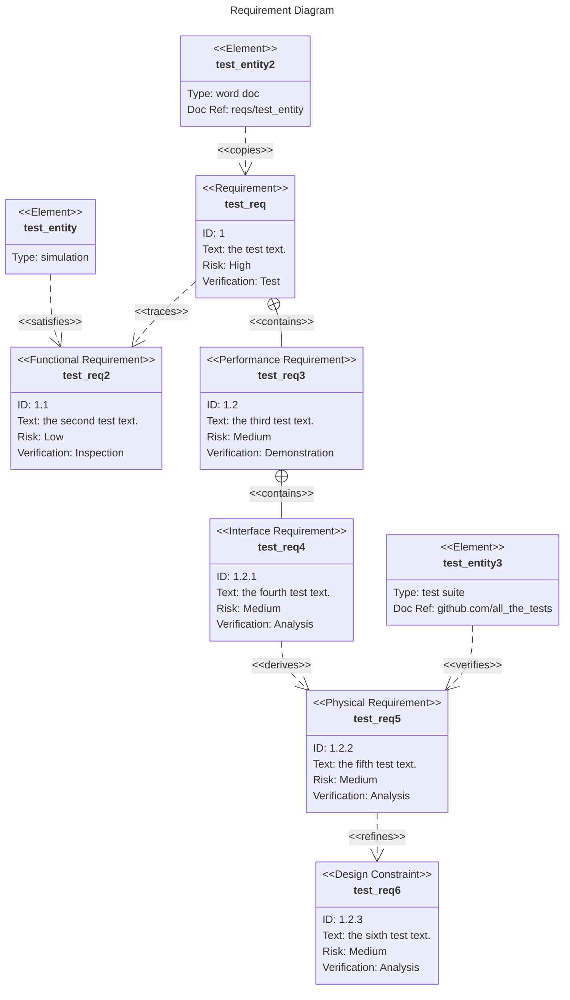
```mermaid
---
title: Requirement Diagram
---

requirementDiagram

  requirement test_req {
  id: 1
  text: the test text.
  risk: high
  verifymethod: test
  }

  functionalRequirement test_req2 {
  id: 1.1
  text: the second test text.
  risk: low
  verifymethod: inspection
  }

  performanceRequirement test_req3 {
  id: 1.2
  text: the third test text.
  risk: medium
  verifymethod: demonstration
  }

  interfaceRequirement test_req4 {
  id: 1.2.1
  text: the fourth test text.
  risk: medium
  verifymethod: analysis
  }

  physicalRequirement test_req5 {
  id: 1.2.2
  text: the fifth test text.
  risk: medium
  verifymethod: analysis
  }

  designConstraint test_req6 {
  id: 1.2.3
  text: the sixth test text.
  risk: medium
  verifymethod: analysis
  }

  element test_entity {
  type: simulation
  }

  element test_entity2 {
  type: word doc
  docRef: reqs/test_entity
  }

  element test_entity3 {
  type: "test suite"
  docRef: github.com/all_the_tests
  }


  test_entity - satisfies -> test_req2
  test_req - traces -> test_req2
  test_req - contains -> test_req3
  test_req3 - contains -> test_req4
  test_req4 - derives -> test_req5
  test_req5 - refines -> test_req6
  test_entity3 - verifies -> test_req5
  test_req <- copies - test_entity2
```

:::

## Git Graph Diagram

::: preview Посмотреть код

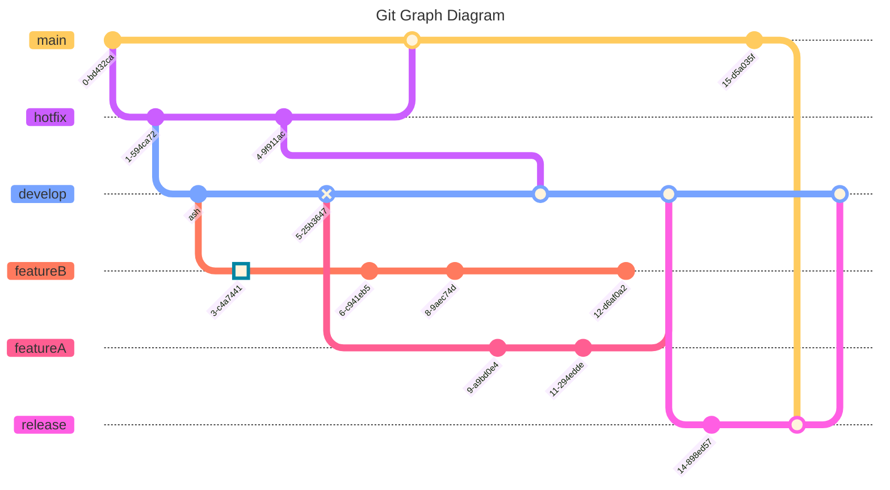
```mermaid
---
title: Git Graph Diagram
config:
  logLevel: 'debug'
  theme: 'base'
---
gitGraph
  commit
  branch hotfix
  checkout hotfix
  commit
  branch develop
  checkout develop
  commit id:"ash"
  branch featureB
  checkout featureB
  commit type:HIGHLIGHT
  checkout main
  checkout hotfix
  commit type:NORMAL
  checkout develop
  commit type:REVERSE
  checkout featureB
  commit
  checkout main
  merge hotfix
  checkout featureB
  commit
  checkout develop
  branch featureA
  commit
  checkout develop
  merge hotfix
  checkout featureA
  commit
  checkout featureB
  commit
  checkout develop
  merge featureA
  branch release
  checkout release
  commit
  checkout main
  commit
  checkout release
  merge main
  checkout develop
  merge release
```

:::

## Timeline Diagram

::: preview Посмотреть код

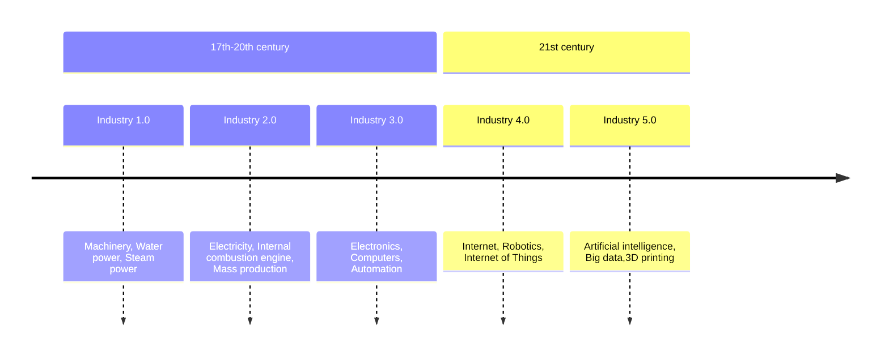
```mermaid
---
title: Timeline Diagram
---

timeline
  section 17th-20th century
    Industry 1.0 : Machinery, Water power, Steam <br>power
    Industry 2.0 : Electricity, Internal combustion engine, Mass production
    Industry 3.0 : Electronics, Computers, Automation
  section 21st century
    Industry 4.0 : Internet, Robotics, Internet of Things
    Industry 5.0 : Artificial intelligence, Big data,3D printing
```

:::

## Sankey diagram

Кириллица пока не поддерживается!

::: preview Посмотреть код

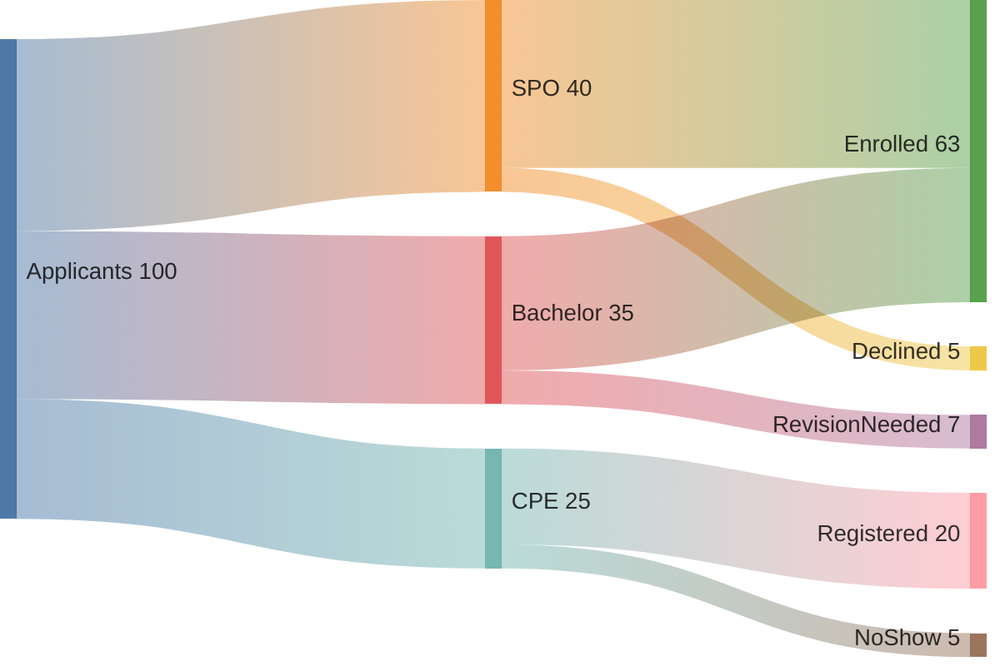
```mermaid
---
title: Sankey diagram
---

sankey
Applicants,SPO,40
Applicants,Bachelor,35
Applicants,CPE,25
SPO,Enrolled,35
SPO,Declined,5
Bachelor,Enrolled,28
Bachelor,RevisionNeeded,7
CPE,Registered,20
CPE,NoShow,5
```

:::

## XY Chart

::: preview Посмотреть код

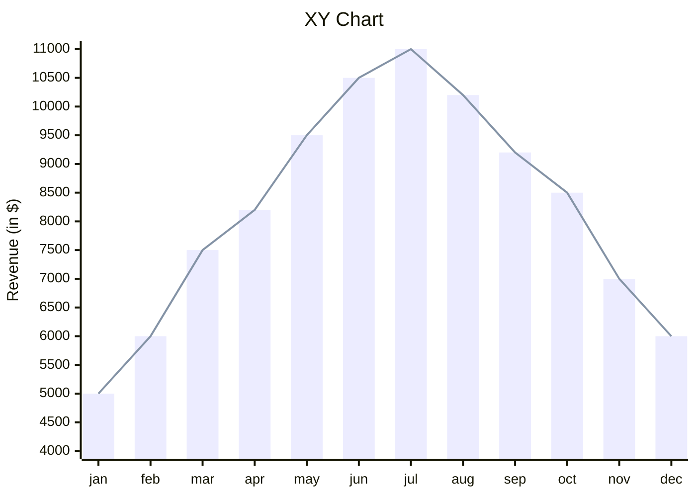
```mermaid
---
title: XY Chart
---

xychart
x-axis [jan, feb, mar, apr, may, jun, jul, aug, sep, oct, nov, dec]
y-axis "Revenue (in $)" 4000 --> 11000
bar [5000, 6000, 7500, 8200, 9500, 10500, 11000, 10200, 9200, 8500, 7000, 6000]
line [5000, 6000, 7500, 8200, 9500, 10500, 11000, 10200, 9200, 8500, 7000, 6000]
```

:::

## Packet Diagram

::: preview Посмотреть код

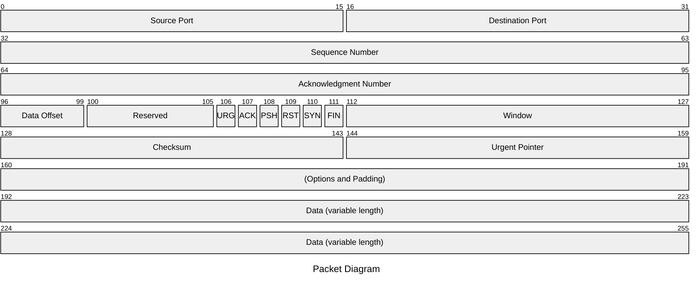
```mermaid
---
title: Packet Diagram
---

packet
0-15: "Source Port"
16-31: "Destination Port"
32-63: "Sequence Number"
64-95: "Acknowledgment Number"
96-99: "Data Offset"
100-105: "Reserved"
106: "URG"
107: "ACK"
108: "PSH"
109: "RST"
110: "SYN"
111: "FIN"
112-127: "Window"
128-143: "Checksum"
144-159: "Urgent Pointer"
160-191: "(Options and Padding)"
192-255: "Data (variable length)"
```

:::
